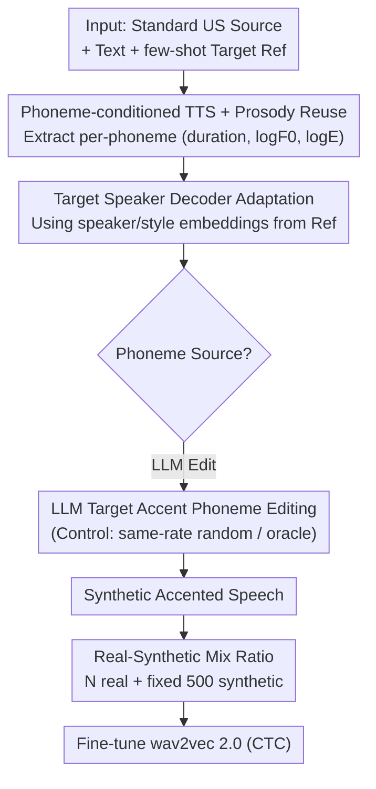

# Few-Shot Synthetic Accented Speech for ASR Fine-Tuning: What Helps and When?

**Conference**: ICML2026  
**arXiv**: [2604.27273](https://arxiv.org/abs/2604.27273)  
**Code**: To be confirmed  
**Area**: Speech Recognition / Synthetic Data / Data Augmentation  
**Keywords**: Accented ASR, Synthetic Speech, Phoneme Perturbation, few-shot TTS, Real-Synthetic Mix  

## TL;DR
Fine-tuning ASR with accented speech synthesized via few-shot TTS, the authors decompose the question of "why it works." They find that the gains primarily stem from **phoneme-level perturbation augmentation**—random phoneme replacement captures most of the benefits, while LLM-generated "target accent phoneme editing" or even oracle ground-truth phonemes/prosody offer only marginal improvements. Furthermore, while synthetic data significantly reduces training variance when real data is scarce, a fixed quota of synthetic data eventually dilutes real data; the real-to-synthetic ratio itself is the critical factor.

## Background & Motivation
**Background**: ASR performance systematically degrades on accented speech, a gap well-documented by numerous benchmarks and bias analyses. Solutions generally fall into two categories: model-side (accent embeddings, adversarial objectives, meta-learning for adaptor adaptation) and data-side (augmenting training sets using Voice Conversion or TTS-synthesized accented speech).

**Limitations of Prior Work**: Both approaches often require minutes to hours of real accented recordings, whereas in reality, only a few sporadic sentences might be available for a specific accent. Consequently, few-shot synthesis becomes a necessity. However, few-shot accent synthesis is difficult, as accents span segmental pronunciation, prosody, and speaker-dependent acoustics, making manual rules or multi-corpus approaches insufficient.

**Key Challenge**: It is commonly assumed that "synthetic accented speech helps ASR because it provides the recognizer with the pronunciation patterns of the target accent." However, this causal explanation has never been rigorously tested—perhaps the recognizer benefits not from "resembling the target accent" but merely from "phoneme sequence perturbation," acting as a form of noise augmentation in the phoneme space.

**Goal**: This paper decomposes the question of why synthetic accented data is effective into two falsifiable hypotheses for controlled experiments: (i) target accent phoneme editing improves ASR by exposing accent-specific pronunciations; (ii) random phoneme perturbation improves ASR by acting as noise augmentation in the phoneme space, enhancing robustness to pronunciation variations. The study also addresses the quota problem: given a real data budget, how much synthetic data is useful, when does training stabilize, and when does it start to dilute real samples.

**Key Insight**: Using an LLM as a "structured edit generator"—it can propose target accent pronunciation changes for new sentences based on general phonetic knowledge and a few examples, eliminating the need for ground-truth accent transcriptions for every sentence. By using **random replacement with the same edit rate** as a perturbation control and **ground-truth accent phonemes/prosody** as an oracle upper bound, the contributions of "accent structure" versus "pure perturbation" can be isolated.

**Core Idea**: Treat the gains from synthetic accented data as a "controlled variable" experiment—fixing the TTS and adaptation modules while varying only the phoneme source (LLM edited / Randomly replaced / Ground-truth) to see which downstream ASR performs better and by how much.

## Method

### Overall Architecture
The system consists of a **few-shot accented speech synthesis → ASR fine-tuning** pipeline. The input is a standard American English source speech + its text + a small amount of target accent reference speech (default $K=10$ sentences, ~36s). The output is a batch of "accented-sounding" synthetic speech used to fine-tune wav2vec 2.0. The backbone is a **phoneme-conditioned TTS acoustic model** that explicitly exposes prosodic control for each phoneme, allowing the system to "change only the phoneme symbols while preserving source prosody." This decouples accent injection into two stages: **target speaker decoder adaptation** to shift acoustic rendering toward the target speaker/accent, followed by **LLM phoneme sequence editing** to inject target accent pronunciation changes. The scientific value lies in making the "phoneme source" in the second stage a replaceable control variable—leading to the three paths: LLM editing, random replacement, and ground-truth phonemes.

### Key Designs

**1. Phoneme-conditioned TTS + Prosody Reuse: Enabling "Symbol Modification without Prosody Change"**

This is the physical prerequisite for the controlled experiments. Based on the phoneme-conditioned TTS acoustic model by Zaïdi et al. (2022), the authors represent pronunciation using the ARPAbet phoneme set. Each phoneme $i$ is associated with a set of prosodic controls $(d_i, p_i, e_i)$, representing duration in frames (22.05 kHz, 256 sample hop, ~11.6 ms/frame), average $\log F_0$ over voiced frames, and average $\log$ energy. Crucially, these controls are **extracted from the source speech via text alignment and fed externally to the decoder**, rather than being predicted internally. This has two benefits: first, reusing real source phoneme-level prosody preserves natural prosodic diversity; second, phoneme sequence and prosody are decoupled, allowing pure symbolic edits (e.g., changing "W IH1 L" to "V IH1 L") to proceed independently while prosody is copied directly. To force the decoder to follow external controls, an additional reconstruction loss for frame-level pitch/energy contours is added during pre-training.

**2. Target Speaker Decoder Adaptation: Shifting Acoustics before Symbolic Editing**

Symbolic edits alone are insufficient to sound like the target accent due to speaker-dependent acoustic details. The first stage adapts the TTS decoder using the target speaker's reference speech while conditioning on speaker/style embeddings. This shifts the acoustic renderer toward the target speaker and accent—even with the same "phoneme + prosody" input, the rendered output resembles the target speaker’s characteristic voice. In experiments, "Adapt-only" (adaptation without symbolic edits) increased AccSim from 0.27 to 0.69 (Indian English) and 0.32 to 0.61 (Korean English), suggesting that most of the "accented sound" comes from acoustic adaptation rather than phoneme editing.

**3. Replaceable Phoneme Sources: LLM Edit vs. Random vs. Ground-Truth (The Core Experiment)**

This isolates "accent structure" from "pure perturbation." The second stage edits the source phoneme sequence (insertions, deletions, splits, merges), adjusting prosody only to maintain alignment. When sequence length is unchanged, prosody is copied. The "editor" is a replaceable variable:
- **Adapt+LLM**: LLM proposes pronunciation changes based on phonetic knowledge and few-shot examples.
- **Adapt+Random**: Replaces phonemes at uniformly sampled positions with random ARPAbet phonemes, with the **edit rate strictly aligned with the LLM** (19% for Indian, 35% for Korean). The only difference from the LLM is the linguistic validity of the edits.
- **Adapt+GT-phoneme / +prosody**: Uses perceptual phoneme labels (PPL) from L2-ARCTIC as ground-truth (preserving aligned source prosody), or adds ground-truth prosody extracted from real accented audio as an oracle upper bound.

Comparing these paths determines where the ASR gains originate.

**4. Real-Synthetic Mix Ratio: Synthetic Data as a Variance Reduction Tool with a "Dilution Point"**

To address the quota problem, "Real+Synth" fine-tunes with $N$ real sentences + 500 fixed LLM-synthetic sentences. The design motivation is that when real data is extremely scarce, performance depends heavily on the specific samples drawn (high variance). Synthetic data stabilizes this by smoothing out sampling dependency. However, since the synthetic pool is fixed at 500, once real data increases and provides stronger signals, the large volume of fixed synthetic data dilutes the real samples. A **cross-over point** exists where pure real fine-tuning outperforms the mix; this point varies by accent.

### Loss & Training
TTS pre-training is conducted on LJSpeech + ESD English subset (Standard American English) with auxiliary pitch/energy reconstruction losses. Decoder adaptation is fine-tuned on target speaker references. Downstream ASR uses wav2vec 2.0 Base + CTC, with $N \in [1, 500]$ fine-tuning sentences. All results are averaged over 7 runs using real speech from three speakers per accent (1500 sentences total).

## Key Experimental Results

### Main Results
Data: TTS backbone pre-trained on LJSpeech+ESD; accented speech from L2-ARCTIC; source sentences from CMU Arctic (CLB speaker). Metrics: Whisper-small WER (intelligibility proxy), UTMOS (naturalness), SpeechBrain accent embedding cosine similarity (AccSim).

Acoustic Quality of Synthetic Speech (Table 1, combined speakers):

| Accent | Condition | WER(%)↓ | UTMOS↑ | AccSim↑ |
|------|------|---------|--------|---------|
| Indian | American TTS | 6.4 | 3.78 | 0.27 |
| Indian | Adapt-only | 11.7 | 2.70 | 0.69 |
| Indian | Adapt+LLM | 14.8 | 2.63 | 0.72 |
| Indian | Adapt+Random | 47.2 | 2.31 | 0.68 |
| Indian | Adapt+GT-phon.+pros. | 20.5 | 2.58 | 0.77 |
| Indian | Real accent | 8.6 | 3.89 | 0.86 |
| Korean | American TTS | 7.3 | 3.72 | 0.32 |
| Korean | Adapt-only | 11.9 | 2.63 | 0.61 |
| Korean | Adapt+LLM | 33.8 | 2.51 | 0.61 |
| Korean | Adapt+Random | 93.4 | 2.12 | 0.58 |
| Korean | Adapt+GT-phon.+pros. | 21.6 | 2.65 | 0.62 |
| Korean | Real accent | 14.1 | 3.81 | 0.72 |

Acoustically, adaptation drives the AccSim increase. Random replacement is acoustically unreliable (Korean WER at 93.4%). However, **downstream ASR shows a different story**: Adapt+Random nearly matches Adapt+LLM on Indian English and is only slightly worse on Korean, suggesting ASR gains come primarily from phoneme perturbation rather than faithful accent rendering. Oracle analysis confirms this: GT-phoneme is often <1 WER point better than random; even GT-phoneme+prosody is only ~2 points better at maximum budget.

### Ablation Study

| Configuration / Analysis | Key Result | Description |
|------|---------|------|
| Adapt+Random vs Adapt+LLM (ASR) | Near equal (Indian), slightly worse (Korean) | Most gains from phoneme perturbation augmentation |
| GT-phoneme vs Random (Oracle) | Difference <1 WER point | Accent structure matters at small budgets; random catches up at larger $N$ |
| GT-phoneme+prosody vs Random | ~+2 WER points at max budget | Real prosody adds very little extra gain |
| Variance Reduction ($N=3$) | Indian std 3.11→0.49; Korean 2.71→0.09 | Synthetic data stabilizes training when real data is scarce |
| Real+Synth Gain Window | Indian $N \approx 8$ crossover; Korean $N \approx 25$ crossover | Fixed synthetic quota dilutes real data at later stages |
| Sample Efficiency $K$ | $K=3$ is sufficient | AccSim and UTMOS plateau after 3 sentences; LLM editing is stable from $K=0$ |

### Key Findings
- **Perturbation > Structure**: In this few-shot ASR fine-tuning setup, phoneme perturbation explains most of the gains; faithful accent editing adds marginal value. This challenges the common assumption that synthetic accents must be highly realistic to be useful.
- **Stability over Ceiling**: The primary value of synthetic data is variance reduction; it significantly stabilizes training when real samples are scarce but does not necessarily raise the performance ceiling.
- **High Sample Efficiency**: Only 3 reference sentences are needed for adaptation. LLM-based editing works even with zero examples by relying on pre-trained knowledge.
- **Cross-Speaker Generalization**: ASR trained on a single synthetic speaker generalizes to other speakers of the same accent, indicating that synthesis captures accent-related variations rather than just speaker-specific traits.

## Highlights & Insights
- **Diagnostic Experimental Design**: By using same-rate random replacement and oracle ground-truth controls, the study cleanly separates the contributions of "accent structure" from "pure perturbation."
- **Divergence of Acoustic and Downstream Metrics**: Random replacement has terrible acoustic WER (93.4%) but performs well in downstream ASR training, warning against using synthetic speech "naturalness" or "intelligibility" as predictors of training value.
- **Prosody Decoupling**: Explicitly extracting per-phoneme prosody and using reconstruction loss to force decoder adherence provides a controllable way to ablate pronunciation vs. prosody.
- **LLM as Few-Shot Editor**: Shows the utility of using LLMs for low-resource phonetic editing, avoiding the need for sentence-by-sentence ground-truth transcriptions.

## Limitations & Future Work
- **Accent Coverage**: Only Indian and Korean English were tested; results might vary for accents with different linguistic distances.
- **Architecture Coupling**: Results are based on wav2vec 2.0 and CTC; whether these findings hold for larger models or different architectures (e.g., Transducers) remains to be verified.
- **Dilution Modeling**: The real-to-synthetic ratio was observed but not optimized or dynamically adjusted.
- **Ethical Risks**: Simplified synthetic representations may miss intra-group diversity; deployment requires careful cross-speaker evaluation to avoid amplifying biases.

## Related Work & Insights
- **vs. Model-side Adaptation**: Unlike adaptation methods that modify the recognizer, this data-side approach is model-agnostic. However, its mechanism is revealed to be more about augmentation than explicit accent modeling.
- **vs. Traditional TTS/VC Augmentation**: While previous methods require minutes/hours of data, this reduces requirements to 3 sentences ($K=3$), achieving true few-shot capability while questioning the necessity of "sounding real."
- **vs. Data Valuation**: This study provides a reusable diagnostic paradigm for evaluating the value of synthetic data through controlled symbol/acoustic manipulation.

## Rating
- Novelty: ⭐⭐⭐⭐ (Decomposing the "why" via controlled experiments is insightful)
- Experimental Thoroughness: ⭐⭐⭐⭐ (Multiple accents, variance analysis, and oracle controls)
- Writing Quality: ⭐⭐⭐⭐ (Clear hypothesis-driven narrative)
- Value: ⭐⭐⭐⭐ (Practical insights on variance reduction and the "perturbation" effect)

<!-- RELATED:START -->

## Related Papers

- [\[CVPR 2026\] TAPE: Task-Adaptive Prototype Evolution in Audio-Language Models for Fully Few-shot Class-incremental Audio Classification](../../CVPR2026/audio_speech/tape_task-adaptive_prototype_evolution_in_audio-language_models_for_fully_few-sh.md)
- [\[ICLR 2026\] Knowing When to Quit: Probabilistic Early Exits for Speech Separation](../../ICLR2026/audio_speech/knowing_when_to_quit_probabilistic_early_exits_for_speech_separation.md)
- [\[ACL 2026\] Mind the Pause: Disfluency-Aware Objective Tuning for Multilingual Speech Correction with LLMs](../../ACL2026/audio_speech/mind_the_pause_disfluency-aware_objective_tuning_for_multilingual_speech_correct.md)
- [\[AAAI 2026\] MF-Speech: Achieving Fine-Grained and Compositional Control in Speech Generation via Factor Disentanglement](../../AAAI2026/audio_speech/mf-speech_achieving_fine-grained_and_compositional_control_in_speech_generation_.md)
- [\[ACL 2026\] Towards Fine-Grained and Multi-Granular Contrastive Language-Speech Pre-training](../../ACL2026/audio_speech/towards_fine-grained_and_multi-granular_contrastive_language-speech_pre-training.md)

<!-- RELATED:END -->
