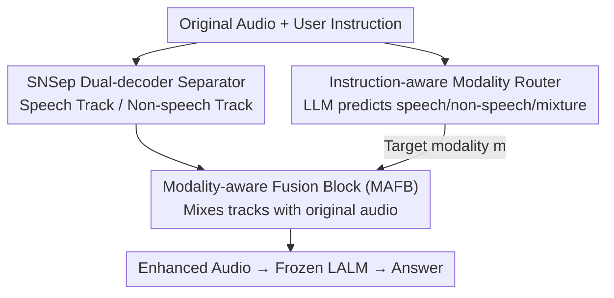

# Focus Then Listen: An Empirical Study of Plug-and-Play Audio Enhancer for Noise-Robust Large Audio Language Models

**Conference**: ICML 2026  
**arXiv**: [2603.04862](https://arxiv.org/abs/2603.04862)  
**Code**: [Project Page](https://sites.google.com/view/ftl-lalm)  
**Area**: Audio & Speech / Large Audio Language Models / Noise Robustness  
**Keywords**: LALM, Plug-and-Play Enhancer, Speech/Non-speech Separation, Instruction-aware, Noise Robustness

## TL;DR
This paper proposes Focus-Then-Listen (FTL), a plug-and-play audio enhancer that **does not update LALM parameters**. It decomposes the input waveform into speech and non-speech tracks, utilizes an LLM router to determine "which category to listen to" based on user instructions, and finally employs a modality-aware fusion block to generate task-adaptive enhanced audio for the Large Audio Language Model (LALM), thereby improving perception and reasoning performance under various noise conditions.

## Background & Motivation
**Background**: Large Audio Language Models (LALMs, e.g., Audio Flamingo 3, Qwen3-Omni, Fun-Audio-Chat) represent a new paradigm in audio understanding by connecting audio perception to LLMs to unify tasks such as speech recognition, acoustic scene analysis, and audio question answering.

**Limitations of Prior Work**: Audio in real-world environments is rarely clean; speech and non-speech sounds often overlap. Here, "noise" is **task-dependent**: background sound is noise during speech recognition, whereas speech becomes interference during environmental sound analysis. LALMs suffer significant performance drops under these "interfering component" conditions, potentially misjudging user intent, which is particularly dangerous in safety-critical scenarios.

**Key Challenge**: Existing remedies have specific drawbacks. ① Noise-aware fine-tuning requires task-specific noisy data and expensive training; furthermore, real-world noise is infinite and cannot be fully covered, and fine-tuning may lead to catastrophic forgetting or damage performance on clean data. ② SSEU-Bench uses CoT prompting to decompose tasks, but improvements are mainly in audio tagging and require per-task prompt design. ③ Embedding-based methods like SEE **assume noise is pre-defined** (e.g., Gaussian noise) and require pure noise recordings during training—this fundamentally conflicts with the setting of this paper, where noise is not pre-definable but task-dependent.

**Goal**: To provide a universal, plug-and-play front-end that makes any LALM more robust under noisy conditions **without any fine-tuning of the LALM itself**, where the definition of noise dynamically changes with user intent.

**Key Insight**: Mimic the human auditory process—when faced with mixed sounds, humans **first selectively focus** on relevant components based on intent before performing understanding.

**Core Idea**: Implement "focus then listen" as a pre-enhancer—inferring task-relevant audio modalities from user instructions to produce filtered, modality-aligned signals for the LALM, thereby amplifying task-relevant information and suppressing irrelevant components.

## Method

### Overall Architecture
FTL is a three-stage serial front-end: the original audio $S_{ra}$ is first processed by an **Audio Separator** to split it into a speech track $S_{sp}$ and a non-speech track $S_{ns}$. Then, a **Modality Router** (an LLM) reads the user instruction and outputs the target modality $m \in \{\text{speech}, \text{non-speech}, \text{mixture}\}$. Finally, the **Modality-aware Fusion Block (MAFB)** mixes the corresponding separated tracks with the original audio based on $m$ to generate task-adaptive enhanced audio $S_{en}$, which is fed into the downstream LALM. The LALM parameters remain completely unchanged, making it "plug-and-play."

### Key Designs

**1. Instruction-aware Modality Router: Defining "What is Noise" Dynamically**

The fundamental observation of this paper is that noise is not pre-definable but task-dependent; thus, one must know "which category of sound to focus on this time" before enhancement. FTL uses an LLM (Qwen3-8B or ChatGPT5.2) as a router: it reads the user instruction and outputs "speech" if the task only requires speech information, "non-speech" if only non-speech content is needed, and "mixture" for complex tasks requiring both. Routing performance is measured by Correct Rate (CR), the proportion of samples where the target modality is correctly predicted. This step explicates the "human-like focus by intent" and serves as the prerequisite for targeted enhancement.

**2. SNSep Dual-decoder Speech/Non-speech Separator: Customized for the "Speech vs. Non-speech" Partition**

Existing models are unsuitable for this specific separation: SE-Mamba (SEM) is trained for **speech enhancement** (estimating speech from a mixture, then subtracting to get non-speech), while SAM-Audio (SAM) is generative and might create components not present in the original audio, misleading downstream understanding. Thus, the authors developed **SNSep**: it performs separation via **masking** in the Short-Time Fourier Transform (STFT) domain. The backbone is based on AudioSep but uses a **dual-decoder** structure—one decoder reconstructs the speech track, while a parallel decoder independently extracts the non-speech track. Training data consists of 50 hours each of speech and non-speech, mixed at random SNRs from $-10$ to $10$ dB and resampled to 16 kHz. Separation is denoted as:

$$S_{sp},\,S_{ns} = \mathrm{Sep}(S_{ra}).$$

**3. Modality-aware Fusion Block (MAFB): Weighting Between "Enhancement Intensity" and "Signal Fidelity"**

Feeding purely separated tracks into the LALM is risky—imperfect separation introduces artifacts that can mislead understanding. MAFB therefore does not "use only separated tracks" but instead performs a convex combination of the separated tracks and the original audio based on the routing result:

$$S_{en}=\begin{cases}\alpha_{sp}S_{sp}+(1-\alpha_{sp})S_{ra}, & m=\text{speech}\\[2pt]\alpha_{ns}S_{ns}+(1-\alpha_{ns})S_{ra}, & m=\text{non-speech}\\[2pt]S_{ra}, & m=\text{mixture}\end{cases}$$

Coefficients $\alpha_{sp}=0.5$ and $\alpha_{ns}=0.9$ are determined empirically. Mixing in the original audio preserves natural acoustics and avoids dominance by separation artifacts, while the "mixture" case reverts to the original audio to prevent degradation. Speech tasks use a lower $\alpha_{sp}=0.5$ (prioritizing fidelity), while non-speech tasks use a higher $\alpha_{ns}=0.9$ (more aggressively suppressing speech interference), reflecting balanced weighting for different task requirements.

### Loss & Training
Only SNSep requires training, following the configuration of AudioSep. Both the Modality Router and the LALM are off-the-shelf models requiring zero training. FTL does not involve backpropagation through the LALM, performing purely front-end inference.

## Key Experimental Results

### Main Results
Perception tasks used SSEU-Bench: ASR (WER%, lower is better) and Audio Tagging (AT, mAP%, higher is better) evaluated at different SNRs. Reasoning tasks used the self-constructed MMAU-Pro-Ctrl (QA-ACC%). Downstream LALMs included AF3, FAC, and Q3O, with Qwen3-8B as the router.

| Task/Metric | LALM | Without FTL | With FTL | Condition |
|------|------|------|------|------|
| ASR WER% | AF3 | 27.45 | 25.39 | SNR-Speech $-10$ dB |
| ASR WER% | FAC | 31.67 | 28.41 | SNR-Speech $-10$ dB |
| ASR WER% | Q3O | 20.42 | 18.61 | SNR-Speech $-10$ dB |
| AT mAP% | AF3 | 27.36 | 31.56 | SNR-Non-Speech $-10$ dB |
| AT mAP% | FAC | 16.34 | 20.75 | SNR-Non-Speech $-10$ dB |
| AT mAP% | Q3O | 31.33 | 37.27 | SNR-Non-Speech $-10$ dB |

FTL shows the most significant gains at low SNR (strongest interference) across all three LALMs; performance remains largely the same under clean conditions ($+\infty$), indicating no degradation.

### Ablation Study
Separator choice (on AF3, Table 4):

| Separator | ASR WER% @$-10$dB | AT mAP% @$-10$dB | Description |
|------|------|------|------|
| Without FTL | 27.45 | 27.36 | Baseline |
| SAM | 28.72 | 31.98 | Generative; ASR degrades (false components) |
| SEM | 23.83 | 33.67 | Speech enhancement target; best ASR at low SNR |
| SNSep | 25.39 | 31.56 | Ours; balanced for both speech/non-speech |

Router quality (MMAU-Pro-Ctrl, Table 3):

| Router | Speech CR% | Non-speech CR% | Remarks |
|------|------|------|------|
| Qwen3-8B | 23.8 | 0.0 | Non-speech always predicted as "mixture"; no gain |
| ChatGPT5.2 | 88.5 | 47.7 | Accurate routing; maximum reasoning gain |
| GroundTruth | 100.0 | 100.0 | Upper bound |

### Key Findings
- **Gains are largest at low SNR**: The stronger the interference, the more FTL helps; clean audio is not penalized, showing the front-end only "acts when necessary."
- **Routing is the bottleneck**: Qwen3-8B has CR=0% for non-speech reasoning (always guessing "mixture"), which negates all gains; replacing it with ChatGPT5.2 (CR 88.5%/47.7%) improves reasoning, validating the importance of Design 1.
- **Better routing does not always lead to better reasoning**: GroundTruth routing (100% accurate) is sometimes slightly inferior to ChatGPT5.2, suggesting that high-level semantic reasoning's dependence on enhancement is more subtle than low-level perception.
- **Separators have different strengths**: SEM outperforms SNSep on low SNR ASR but is biased toward speech enhancement; SNSep provides better overall balance across both task types and avoids generating false components like SAM.

## Highlights & Insights
- **Redefining "noise" as a task-relative quantity**: Instead of presetting noise types, the system dynamically decides which category to focus on based on user instructions. This perspective allows the method to naturally adapt to the reality that "non-speech is noise for speech tasks and vice-versa," a key breakthrough compared to "noise-predefined" methods like SEE.
- **The convex combination for fidelity is practical**: MAFB does not blindly trust separation results. Mixing in the original audio offsets artifacts, and the differentiated values for $\alpha_{sp}/\alpha_{ns}$ (0.5 vs 0.9) reflect the fine-tuning of requirements for different tasks, which can be directly migrated to other "separate-then-use" front-ends.
- **Completely training-free for LALMs**: Only a small separator is trained, while routers and LALMs are off-the-shelf. This means any new LALM can be integrated immediately, which is highly engineering-friendly.

## Limitations & Future Work
- **Strong dependence on router quality**: The router is a single point of failure; a weak LLM (like Qwen3-8B failing on non-speech) renders the entire method ineffective. Making smaller models reliable for routing is a critical challenge.
- **Empirical fixed fusion coefficients**: $\alpha_{sp}=0.5$ and $\alpha_{ns}=0.9$ are globally fixed based on ablations and are not adaptive to SNR or specific tasks, which may be suboptimal.
- **Limited to binary speech/non-speech division**: Real-world audio may contain multiple overlapping sources; a coarse "speech vs. non-speech" split cannot handle fine-grained target sound extraction.
- **Unexplored "better routing vs. better reasoning" phenomenon**: The observation that GroundTruth is sometimes inferior to ChatGPT5.2 was not explained mechanically, leaving an interesting open question.

## Related Work & Insights
- **vs. Noise-aware fine-tuning (Hu 2024 / Ding 2025)**: These use massive noisy data to fine-tune LALMs, which is costly, incomplete, and prone to forgetting. FTL achieves robustness via front-end enhancement without touching the LALM.
- **vs. SSEU-Bench CoT Prompting**: CoT decomposes tasks but gains are concentrated in audio tagging and require per-task prompt engineering. FTL uses unified instruction-aware enhancement covering both perception and reasoning.
- **vs. SEE (Zhang 2026)**: SEE assumes noise is pre-defined and requires pure noise for training; FTL treats noise as task-relative and requires no pre-definition, offering broader applicability.

## Rating
- Novelty: ⭐⭐⭐⭐ First plug-and-play enhancer for LALMs using instruction-aware speech/non-speech interference mitigation.
- Experimental Thoroughness: ⭐⭐⭐⭐ Covers 3 LALMs, perception + reasoning, multiple SNRs, and thorough ablations, though task categories are narrow.
- Writing Quality: ⭐⭐⭐⭐ Motivation aligns well with human intuition; structure is clear with sufficient equations and tables.
- Value: ⭐⭐⭐⭐ Training-free and base-model agnostic, offering practical engineering value for noise-robust audio understanding.

<!-- RELATED:START -->

## Related Papers

- [\[AAAI 2026\] DiffA: Large Language Diffusion Models Can Listen and Understand](../../AAAI2026/audio_speech/diffa_large_language_diffusion_models_can_listen_and_understand.md)
- [\[ICLR 2026\] StableToken: A Noise-Robust Semantic Speech Tokenizer for Resilient SpeechLLMs](../../ICLR2026/audio_speech/stabletoken_a_noise-robust_semantic_speech_tokenizer_for_resilient_speechllms.md)
- [\[ICML 2026\] Do Audio LLMs Listen or Read? Analyzing and Mitigating Paralinguistic Failures with VoxParadox](do_audio_llms_listen_or_read_analyzing_and_mitigating_paralinguistic_failures_wi.md)
- [\[ICML 2026\] Evaluating and Rewarding LALMs for Expressive Role-Play TTS via Mean Continuation Log-Probability](evaluating_and_rewarding_lalms_for_expressive_role-play_tts_via_mean_continuatio.md)
- [\[ACL 2025\] Benchmarking Open-ended Audio Dialogue Understanding for Large Audio-Language Models](../../ACL2025/audio_speech/audio_dialogue_benchmark.md)

<!-- RELATED:END -->
