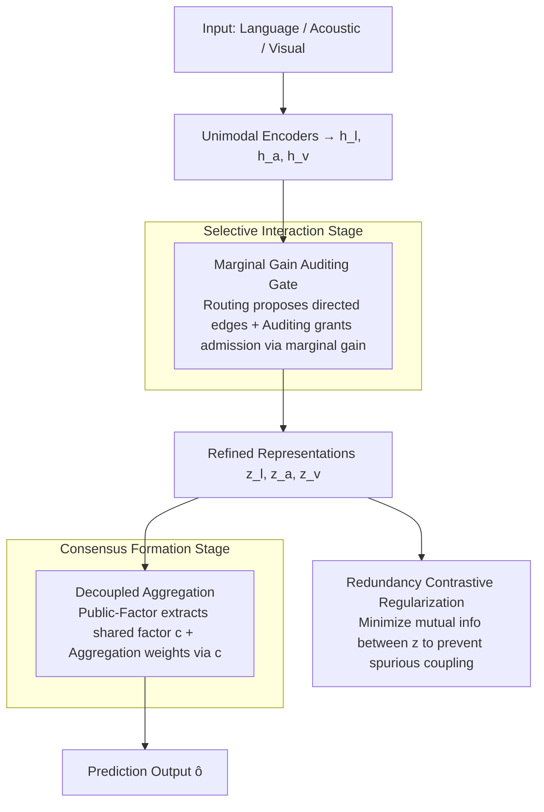

# Group Cognition Learning: Making Everything Better Through Governed Two-Stage Agents Collaboration

**Conference**: ICML 2026  
**arXiv**: [2605.00370](https://arxiv.org/abs/2605.00370)  
**Code**: None  
**Area**: Multimodal Sentiment Analysis / Intent Recognition  
**Keywords**: Multimodal Fusion, Modality Dominance, Spurious Coupling, Marginal Gain Gating, Routing Auditing

## TL;DR
To address the chronic issues of "modality dominance" and "spurious modality coupling" in centralized multimodal fusion, GCL reformulates multimodal learning as a **governed two-stage four-agent collaborative protocol**. The first stage uses Routing/Auditing agents to decide which cross-modal communications are permitted per sample based on marginal prediction gain. The second stage uses Public-Factor/Aggregation agents to decouple shared semantics from private specializations before aggregation. This approach achieves SOTA on MOSI, MOSEI, and MIntRec.

## Background & Motivation
**Background**: The current mainstream of multimodal learning (Language + Acoustic + Visual) relies on **centralized fusion**, such as tensor products in TFN/LMF, cross-modal attention in MulT, or end-to-end fine-tuning based on BERT. Representative advancement paths include structural representation (shared/private decomposition used by MISA, FDMER, and ConFede) and optimization intervention (gradient rebalancing used by CGGM and MCIS).

**Limitations of Prior Work**: All these methods implicitly assume that optimal interaction patterns will naturally emerge as long as the task loss is backpropagated end-to-end. In practice: (1) Gradients tend to concentrate along the "easiest modality path to reduce loss," leaving weak modalities undertrained and the model extremely fragile to noise. (2) End-to-end fusion rewards any cross-modal correlation, including accidental ones, tightly coupling modalities that should not be linked and leading to a sharp decline in out-of-distribution performance.

**Key Challenge**: Interaction learning and representation learning are coupled within the same loss, without any **explicit signal** to distinguish whether "this interaction is useful" or "this interaction is redundant." While Routing/MoE-style works introduce adaptability, they still lack an auditing layer to question "how much marginal gain this edge actually brings."

**Goal**: (1) Transform the topology of cross-modal information flow into an observable and supervisable object. (2) Use an explicit redundancy control term to eliminate spurious coupling. (3) Ensure the aggregation stage is no longer "winner-takes-all" for a strong modality but instead relies on sample-wise shared semantics for weighting.

**Key Insight**: The authors adopt the "division of labor + governance" metaphor from LLM agents. Rather than allowing a black-box network to freely couple three modalities, the fusion process is decomposed into four distinct roles: "proposal routing → auditing admission → public factor extraction → weighted aggregation," where each agent is supervised by its own auxiliary loss.

**Core Idea**: Use "marginal prediction gain" as a hard metric for interaction admission, combined with a redundancy contrastive penalty to transform end-to-end fusion into a two-stage auditable protocol.

## Method

### Overall Architecture
GCL addresses the long-standing problem in end-to-end fusion where "interaction learning" and "representation learning" are squeezed into the same loss. It decomposes fusion into a governed two-stage protocol. After encoders produce $h_m$ for each modality $m\in\{l,a,v\}$, the system enters the "Selective Interaction" stage, where Routing and Auditing agents decide which cross-modal messages are allowed to flow, resulting in refined representations $z_n$. It then enters the "Consensus Formation" stage, where Public-Factor and Aggregation agents distill shared semantics and perform weighted aggregation based on that consensus to produce the prediction $\hat o$. The four agents are supervised by auxiliary objectives, and the entire system is jointly trained using five indices: task, local, public, gain alignment, and redundancy.

### Key Designs

**1. Marginal Gain Auditing Gate: Opening edges based on "worth" rather than "desire"**

Addressing the limitation where router/MoE methods only ask "which path to activate" without checking utility, GCL implements admission as supervisable auditing. During training, a teacher gain is defined as $\Delta_{m\to n}=\ell_\tau(q_n^\tau(h_n),y)-\ell_\tau(q_n^\tau(\tilde h_n^m),y)$, where $\tilde h_n^m=h_n+\phi_{m\to n}(h_n,u_{m\to n})$ is the temporal state after fusing message $u_{m\to n}$. This directly measures the task loss reduction after adding the edge. Since labels are unavailable during inference, a student gain predictor $\hat\Delta_{m\to n}=g_g^{m\to n}(h_n,u_{m\to n})$ is trained as a replacement. The final gate multiplies the "desire to communicate" with the "worth of communication": $\alpha_{m\to n}=\text{softmax}_{j}(\rho_{j\to n})_{j=m}\cdot\sigma_\kappa(\tilde\Delta_{m\to n})$, where $\rho_{m\to n}$ is the logit from the Routing Agent. The gated information is injected via a residual: $z_n=h_n+\sum_{m\neq n}\alpha_{m\to n}\cdot\phi_{m\to n}(h_n,u_{m\to n})$.

This is effective because the gain alignment loss $\mathcal L_{\text{gain}}=-\sum_n\sum_{m\neq n}\alpha_{m\to n}\,\text{stopgrad}(\Delta_{m\to n})$ encourages positive-gain edges to open and negative ones to close, while `stopgrad` prevents the teacher gain from being contaminated. This provides ground-truth supervision during training while maintaining inference efficiency.

**2. Decoupled Aggregation: Extracting consensus before supplementing with private info**

Traditional fusion operators (like direct concatenation) entangle shared semantics and private features, often allowing strong modalities to dominate. GCL uses a permutation-invariant operator $c=g_p(z_l,z_a,z_v)$ to explicitly extract cross-modal shared semantics as a public factor, supervised by $\mathcal L_{\text{pub}}=\mathbb E\,\ell_\tau(g_\tau^c(c),y)$. The Aggregation Agent then uses $c$ as context for each modality to generate a proposal $r_m=\eta_m(z_m,c)$ and an unnormalized score $s_m=g_a^m(z_m,c)$, producing sample-wise weights $\pi_m=\text{softmax}(\{s_m\}_m)$. The final output is $\hat o=g_\tau(\sum_m\pi_m r_m,c)$.

By explicitly isolating $c$ and using it to modulate $\pi_m$, the model first establishes "what is already known in the consensus" and then asks "what additional contribution can this modality's private information make." This avoids multiple counting of shared information and prevents incremental info of weak modalities from being overshadowed.

**3. Redundancy Contrastive Regularization: Maintaining modality uniqueness after flow**

While the gate $\alpha$ controls information "volume," it does not prevent modalities from converging to the same representation. $\mathcal L_{\text{red}}$ acts as an opposing force: using a symmetric InfoNCE-style alignment score $\mathcal L_{\text{red}}=\sum_{m<n}D(z_m,z_n)$, its minimization ensures low mutual information and orthogonality between refined representations. Ablation shows that removing this term increases MOSI MAE from $0.685$ to $0.703$ and worsens coupling diagnostics like HSIC/CKA.

### Loss & Training
The total objective is $\mathcal L_{\text{total}} = \mathcal L_{\text{task}} + \lambda_{\text{loc}}\mathcal L_{\text{loc}} + \lambda_{\text{pub}}\mathcal L_{\text{pub}} + \lambda_{\text{gain}}\mathcal L_{\text{gain}} + \lambda_{\text{red}}\mathcal L_{\text{red}}$. Here, $\mathcal L_{\text{loc}}=\sum_m\mathbb E\,\ell_\tau(q_m^\tau(h_m),y)$ supervises each unimodal head to ensure reliable teacher gain estimation. Optimization uses Adam with a batch size of 128, weight decay of $1\text{e-}4$, and a patience of 6 on a single A100.

## Key Experimental Results

### Main Results

| Dataset | Metric | Ours (GCL) | Prev. SOTA (TSDA) | Gain |
|--------|------|------|----------|------|
| CMU-MOSI | MAE↓ | **0.685** | 0.695 | $-0.010$ |
| CMU-MOSI | Acc-2 | **86.79** | 86.3 | $+0.49$ |
| CMU-MOSI | Acc-7 | **49.06** | 48.6 | $+0.46$ |
| CMU-MOSEI | MAE↓ | **0.520** | 0.529 | $-0.009$ |
| CMU-MOSEI | Acc-2 | **86.78** | 86.3 | $+0.48$ |
| MIntRec | Acc | **72.74** | 72.59 | $+0.15$ |
| MIntRec | F1 | **70.95** | 70.68 | $+0.27$ |

### Ablation Study

| Configuration | MOSI MAE | MOSI Acc-7 | Description |
|------|---------|------------|------|
| Full GCL | 0.685 | 49.06 | Full model |
| w/o Routing Agent | 0.694 | 48.55 | No topology proposal |
| w/o Auditing Agent | 0.699 | 48.00 | No gain gating |
| **Full exchange** | 0.721 | 46.10 | Worse than Unimodal (0.714) |
| w/o Public-Factor Agent | 0.702 | 47.85 | Shared semantics collapse |
| Uniform $\pi_m$ | 0.698 | 48.05 | No sample-adaptive weights |
| w/o $\mathcal L_{\text{red}}$ | 0.703 | 47.70 | Severe HSIC/CKA degradation |
| **Only $\mathcal L_{\text{task}}$** | 0.712 | 46.70 | Degradation without governance |

### Key Findings
- **Ungoverned full-exchange fusion (0.721) is worse than using language alone (0.714)**: This impactful empirical result suggests that blind multimodal fusion can hurt performance due to noise. It refutes the implicit belief that "more modalities are always better."
- **Efficiency Gains**: GCL has 117.56M parameters and takes 20.06s per epoch, which is nearly half the size/time of ConFede (256.98M, 40.12s) and 25% faster than EMOE. "Division of labor + governance" is more engineering-efficient than stacking experts.
- **Noise Robustness**: When Gaussian noise $\sigma\in[0,20]$ is injected into MOSI, GCL's performance decays much more slowly than baselines, proving that the auditing gate actively blocks noisy signals as SNR drops.
- **Audited Selectivity (Fig 3)**: GCL occupies the high-PGR (Positive Gain Ratio), moderate-AR (Activation Ratio) quadrant, whereas variants like NoAudit or FullExchange are in the high-AR, low-PGR area—meaning they communicate a lot but without utility.

## Highlights & Insights
- **Treating "Marginal Gain" as a Loss**: Borrowing the $do(\cdot)$ concept from causal inference, it makes the decision of "whether an interaction is worth it" a learnable quantity rather than something supposedly emerging from end-to-end gradients.
- **Teacher-Student Gain Framework**: Uses oracle supervision during training and a learned predictor during inference, providing a supervised signal without sacrificing speed. This trick is reusable in distillation and verifier-guided generation.
- **Full Exchange < Unimodal**: This finding challenges the multimodal community's default assumption that "more is better" by showing that noise can outweigh the benefits of additional modalities without proper governance.
- **Public Factor as Routing Context**: Treating shared semantics as a conditional input for routing avoids redundant counting of shared information across modalities.

## Limitations & Future Work
- The area is listed as audio_speech, but the evaluation is limited to multimodal sentiment/intent; acoustic is only one of three modalities, and no pure ASR/speech tasks were tested.
- Teacher gain estimation relies on single-step residual approximations; the marginal effect of multi-step deep interactions is not considered.
- Evaluated benchmarks (MOSI/MOSEI/MIntRec) are relatively small-scale; performance on large-scale vision-language datasets (e.g., LAION subsets) is unverified.
- Lack of comparison with LLM-based multimodal methods (e.g., VideoLLaMA), making it difficult to judge the relative advantage of light-weight protocols in the LLM era.

## Related Work & Insights
- **vs MISA / FDMER (Disentanglement)**: These also split shared/private features but do so at the representation layer via reconstruction; GCL moves this to the aggregation layer and couples it with routing, using gain alignment to explicitly supervise edge utility.
- **vs CGGM / MCIS (Gradient Balancing)**: These modify gradient magnitudes to balance modal contributions; GCL governs information flow at the source in the forward pass, which is theoretically "cleaner."
- **vs EMOE (MoE)**: Both use routing, but MoE does not audit expert output. GCL's Auditing Agent acts as a "necessity checker" for experts, achieving better results with fewer parameters.
- **Inspiration**: The supervisable "marginal gain" framework can be transferred to graph edge prediction, document selection in RAG, or tool selection for agents.

## Rating
- Novelty: ⭐⭐⭐⭐ Explicitly making "marginal gain auditing" a governance protocol is highly original.
- Experimental Thoroughness: ⭐⭐⭐ Benchmarks are limited to small-scale sentiment/intent; lacks large-scale/LLM competitors.
- Writing Quality: ⭐⭐⭐⭐ Roles, losses, and supervision are clearly explained with comprehensive ablation.
- Value: ⭐⭐⭐⭐ Empirical evidence regarding "full exchange vs. unimodal" and efficiency gains has cross-domain value.

<!-- RELATED:START -->

## Related Papers

- [\[ICML 2026\] Two-Dimensional Quantization for Geometry-Aware Audio Coding](two-dimensional_quantization_for_geometry-aware_audio_coding.md)
- [\[ICCV 2025\] Everything is a Video: Unifying Modalities through Next-Frame Prediction](../../ICCV2025/audio_speech/everything_is_a_video_unifying_modalities_through_next-frame_prediction.md)
- [\[ICML 2026\] SafeSearch: Automated Red-Teaming of LLM-Based Search Agents](safesearch_automated_red-teaming_of_llm-based_search_agents.md)
- [\[ICML 2026\] The Silent Thought: Modeling Internal Cognition in Full-Duplex Spoken Dialogue Models via Latent Reasoning](the_silent_thought_modeling_internal_cognition_in_full-duplex_spoken_dialogue_mo.md)
- [\[ICML 2026\] Algorithmic Recourse of In-Context Learning for Tabular Data](algorithmic_recourse_of_in-context_learning_for_tabular_data.md)

<!-- RELATED:END -->
