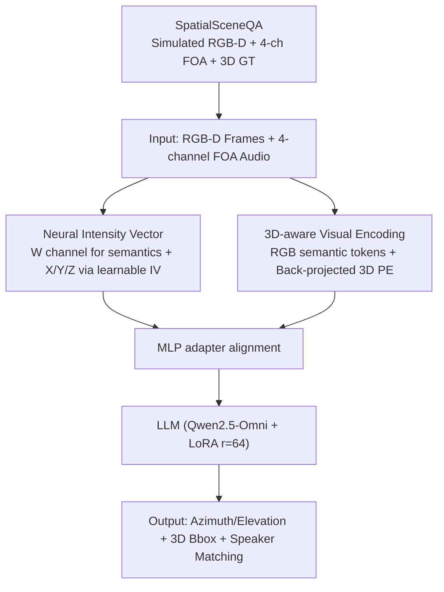

# JAEGER: Joint 3D Audio-Visual Grounding and Reasoning in Simulated Physical Environments

**Conference**: ICML 2026  
**arXiv**: [2602.18527](https://arxiv.org/abs/2602.18527)  
**Code**: https://github.com/liuzhan22/JAEGER  
**Area**: Multimodal VLM / Audio & Speech / 3D Vision  
**Keywords**: Spatial Audio, FOA, RGB-D, 3D Visual Grounding, Audio-Visual LLM

## TL;DR
JAEGER adapts an end-to-end 3D audio-visual LLM from Qwen2.5-Omni using LoRA. By integrating RGB-D depth positional encoding, First-Order Ambisonics (FOA) dual-path audio, and a newly proposed Neural Intensity Vector, it extends traditional AV-LLMs from "2D RGB + Monophonic" to "3D Geometry + Multi-channel Spatial Audio," accompanied by the SpatialSceneQA benchmark with 61k samples.

## Background & Motivation

**Background**: Current mainstream Audio-Visual Large Language Models (AV-LLMs), such as Qwen2.5-Omni and VideoLLaMA 2, are predominantly based on a 2D setting of "RGB video + monophonic audio," leaving spatial structures and directional acoustics as implicit information. While 3D visual grounding has gained recent attention, most works handle either the visual side (point clouds, RGB-D + 3D positional encoding) or the audio side (binaural encoders, intensity vectors) in isolation, lacking a unified paradigm.

**Limitations of Prior Work**: First, **modality dimension mismatch**—monophonic audio theoretically cannot perform sound source localization, and RGB video lacks scale information to regress 3D boxes, leaving each modality short of one dimension. Second, existing cross-modal attempts either assume single-source scenarios with only RGB panoramas (e.g., Hear You Are), failing to test overlap robustness and depth-aware grounding, or rely on cascaded pipelines using traditional signal processing for DoA (e.g., SAVVY), which prevents end-to-end learning. Third, usable data is scarce; real-world multi-channel datasets like STARSS23 lack aligned depth information.

**Key Challenge**: Achieving true 3D physical reasoning requires both **metric-level geometry** (depth + camera intrinsic/extrinsic parameters) and **directional acoustics** (multi-channel spatial audio). Classic STFT-based intensity vectors degrade under strong reverberation and overlapping sources, while traditional geometric branches rely on external 3D segmenters; neither endpoint is fully end-to-end learnable.

**Goal**: (i) Perform end-to-end DoA estimation, 3D box grounding, and multi-speaker audio-visual matching within a unified AV-LLM framework; (ii) Design a spatial audio representation robust to reverberation and overlap; (iii) Provide large-scale simulation data with degree-level azimuth and elevation ground truth.

**Key Insight**: Simulation pipelines like Habitat-Sim + SoundSpaces 2.0 + Hunyuan3D-1.0 are mature enough to synchronously render RGB-D + FOA + precise 3D ground truth. Furthermore, the physical form of the Classical IV, $I'_C = F_W^* \odot F_C$, can be generalized to a latent space, allowing a neural network to learn a "neural intensity vector" more robust than STFT.

**Core Idea**: By utilizing a "Neural IV (CNN-encoded learnable FOA intensity vector) + Depth back-projected 3D sinusoidal positional encoding," JAEGER upgrades the AV-LLM from 2D to 3D for joint end-to-end training.

## Method

### Overall Architecture
The input to JAEGER consists of synchronized RGB-D frames and 4-channel FOA audio (W/X/Y/Z channels), producing natural language and structured 3D information (azimuth/elevation angles, 3D bbox `bbox(c, x, y, z, sx, sy, sz)`, and multi-speaker labels). The process follows a "Visual Stream + Audio Stream → MLP Projection → LLM (Qwen2.5-Omni initialization + LoRA r=64)" pipeline. The Visual Stream adds RGB semantic tokens to 3D sinusoidal positional encoding back-projected from depth. The Audio Stream is dual-path: the W channel extracts semantic content, while X/Y/Z channels extract spatial directional cues via Classical or Neural IV. Both streams are aligned by an MLP adapter and fed into the LLM. Task-specific selective fine-tuning includes: training only the audio side for DoA, only the visual side for grounding, or all modality projections + LoRA for joint reasoning.

### Key Designs

**1. Neural Intensity Vector (Neural IV): Learning Directionality in Adverse Conditions**

Classical methods rely on STFT-based Intensity Vectors for spatial direction, but these depend on fixed spectral transforms. In high reverberation or overlapping scenarios, noise in the complex cross-spectrum $F_W^* \odot F_C$ is amplified, degrading directional estimation. JAEGER lifts this physical structure into latent space, replacing fixed transforms with learnable modules. A data2vec-style 7-layer 1D-CNN (kernel `(10,3,3,3,3,2,2)`, stride `(5,2,2,2,2,2,2)`, 50 Hz frame rate) encodes each FOA channel into latents, yielding an omnidirectional channel $f_W$ and three directional channels $f_C,\ C \in \{X,Y,Z\}$. Retaining the "omni × directional element-wise product" skeleton, it replaces complex multiplication with a latent Hadamard product $h_C = f_W \odot f_C$, followed by a two-layer MLP for the final directional representation:

$$\mathbf{v}_{\text{NIV}} = \text{Linear}(\text{ReLU}(\text{Linear}(\text{Concat}(h_X, h_Y, h_Z)))).$$

This maintains the physical first principles of intensity vectors while allowing the CNN to learn directional embeddings more robust than fixed STFTs, particularly in "hard" scenarios involving overlapping sources and cross-scene generalization.

**2. 3D-aware Visual Encoding: Grounding Visual Tokens via Metric Back-projection**

Monocular RGB lacks metric scale, causing high error in LLM-regressed 3D box centers. JAEGER explicitly feeds the model the physical location corresponding to each token. Using camera intrinsics, each pixel $(u,v)$ and its depth $D_{uv}$ are back-projected into a metric 3D point $P_{uv} = D_{uv} \cdot K^{-1} [u, v, 1]^\top$, resulting in a point cloud $P \in \mathbb{R}^{H\times W\times 3}$. After adaptive average pooling to match the visual feature resolution $h\times w\times c$, each coordinate axis $\alpha \in \{x,y,z\}$ is encoded via sinusoidal formulas $\text{PE}(\alpha, 2j) = \sin(\alpha / 10000^{2j/\lfloor c/3 \rfloor})$ to form $F_{3D}$. This is element-wise added to semantic tokens: $\tilde F_{\text{visual}} = F_{\text{visual}} + F_{3D}$. This metric coordinate prior transforms bbox regression into a coordinate lookup task, improving 3D IoU and visual offset.

**3. SpatialSceneQA: A 61k Simulated Audio-Visual Reasoning Benchmark**

To support 3D audio-visual training, the authors constructed a dataset using SoundSpaces 2.0 to render Room Impulse Responses (RIRs) on HM3D meshes via bidirectional path tracing. FOA signals are generated by convolving dry speech (from LibriSpeech) with RIRs: $A_c^{(r)}(t) = R_c(\cdot;\mathbf{s},\mathbf{r},\theta) * A^{(s)}(t)$. Habitat-Sim renders synchronized RGB-D and semantic masks. Hunyuan3D-1.0 generated 120 loudspeaker meshes, filtered by a visibility constraint (≥500 pixels). The split is two-layered to prevent leakage: 130/15/36 at the HM3D scene level and 96/12/12 for loudspeaker meshes. The dataset covers five tasks: Single-source DoA, Overlapping DoA, 3D Visual Grounding, Single-source Matching, and Overlapping Matching.

### Loss & Training
- LLM utilizes LoRA (r=64, α=128, dropout 0.05). Qwen2.5-Omni weights initialize the visual encoder, monophonic audio branch, and LLM decoder. Neural IV and the new audio adapter are randomly initialized.
- Task-specific fine-tuning: A/B (DoA) tunes the audio encoder and Neural IV; C (Grounding) tunes the visual encoder; D/E (Reasoning) tunes all modality encoders and projectors.
- Training on A100 40GB with batch sizes of 1–3 for 3k–6k steps; cosine lr scheduler with 2.5k steps linear warm-up; peak lr $1\times 10^{-5}$, weight decay 0.05.

## Key Experimental Results

### Main Results

| Model | Modality | Audio DoA $\downarrow$ | Overlap DoA $\downarrow$ | 3D IoU $\uparrow$ | Visual Offset $\downarrow$ | 1-spk Acc $\uparrow$ | 2-spk Acc $\uparrow$ |
|------|------|------------------------|--------------------------|-------------------|----------------------------|---------------------|---------------------|
| Random | – | 90° | 90° | 0.00 | $\infty$ | 45.6 | 47.4 |
| Qwen2.5-Omni (zero-shot) | RGB + Mono | – | – | 0.00 | 2.40 m | 35.8 | 44.0 |
| BAT (5 ep) | Binaural | 2.16° | 19.09° | – | – | – | – |
| Qwen3-VL-8B (zero-shot) | RGB | – | – | 0.01 | 1.11 m | – | – |
| N3D-VLM (zero-shot) | RGB-D | – | – | 0.00 | 2.04 m | – | – |
| **Ours (Classical IV)** | RGB-D + FOA | 2.95° | 6.44° | 0.32 | 0.16 m | 99.5 | 98.6 |
| **Ours (Neural IV)** | RGB-D + FOA | **2.21°** | **4.11°** | **0.32** | **0.16 m** | **99.5** | **99.2** |

Visual offset is measured in meters. Key observation: Neural IV matches BAT on single-source DoA **but reduces error from 19.09° to 4.11° (nearly a 5× improvement) on overlapping sources**. On joint reasoning, 2D AV-LLMs perform near random (~35–45%), while JAEGER achieves 99.2%.

### Ablation Study

| Configuration | 1-spk Acc | 2-spk Acc | Description |
|------|-----------|-----------|------|
| Ours (Neural IV) | 99.5 | 99.2 | Full Model |
| Ours (Classical IV) | 99.5 | 98.6 | STFT-based IV; -0.6 on overlap |
| Ours (Neural) w/o Depth | 96.9 | 94.9 | No 3D PE; -2.6 / -4.3 |
| Ours (Classical) w/o Depth | 99.2 | 98.7 | Classical path less sensitive to depth |
| Ours w/o FOA Encoder | 43.8 | 47.6 | **No FOA → Crashes to random** |
| Ours w/o Depth & FOA | 43.8 | 45.7 | Both removed → random |

Cross-scene generalization (MAE °, Cross-evaluation): Neural IV remains more stable in mismatched train-test conditions (14.85° vs 19.25° MAE), indicating it learns more intrinsic directional cues.

### Key Findings
- **FOA encoder is crucial for joint reasoning**: Removing it leads to random performance (43.8%), which even RGB-D and fine-tuning cannot recover. This provides strong empirical support for the "explicit 3D necessity" argument.
- **Neural IV gains scale with difficulty**: While nearly equal to Classical IV in single-source scenarios, it is consistently superior in overlapping and cross-scene tasks.
- **Depth has a larger impact on the Neural path**: Neural w/o depth drops 4.3 points in 2-speaker scenarios, whereas Classical only drops 0.1, suggesting the higher precision of Neural IV is more sensitive to spatial coordinate ambiguity.

## Highlights & Insights
- **Lifting physical formulas to latent space is a reusable design**: Instead of discarding the first-principles structure of Classical IV ($F_W^* \odot F_C$), the authors neuralized it. This "preserving physical skeleton by replacing fixed transforms with learnable modules" paradigm is highly applicable to other signal processing fields (e.g., radar, sonar).
- **Metric scale through back-projection**: The narrative that "2D AV-LLMs fail even when fine-tuned" is powerful. By proving Qwen2.5-Omni remains at random performance without 3D modalities after fine-tuning, the authors elevate "3D necessity" from intuition to a counter-factual empirical proof.

## Limitations & Future Work
- **Purely simulated without real-world validation**: RIR rendering in SoundSpaces 2.0 differs from real microphone arrays/RGB-D sensors in terms of synchronization, calibration, and noise. Zero-shot evaluation on real datasets like STARSS23 is currently missing.
- **Constrained scenarios**: The setup limits source-receiver distance to 1–4 m within the same room and utilizes a visibility lower bound. Real embodied scenarios involving heavy occlusion, cross-room acoustics, and long distances are not yet addressed.
- **Static tasks**: Current tasks use static frames and sources; temporal reasoning (e.g., "moving toward a sound") of dynamic trajectories is left for future work.

## Related Work & Insights
- **vs Hear You Are**: Supports panoramic RGB + Binaural but assumes single sources and lacks depth. JAEGER handles RGB-D + FOA + overlapping sources.
- **vs SAVVY**: Uses RGB-D + multi-channel audio but relies on a cascaded pipeline with traditional DSP for DoA. JAEGER's end-to-end approach allows joint reasoning at 99.2% accuracy.
- **vs N3D-VLM**: As a pure vision 3D grounding model, N3D-VLM proved RGB-D + 3D PE allows LLMs to output 3D bboxes. JAEGER adopts this visual front-end and integrates audio, suggesting that the best practices for 3D visual grounding are converging.

## Rating
- Novelty: ⭐⭐⭐⭐ Neuralizing Classical IV is a clear incremental innovation.
- Experimental Thoroughness: ⭐⭐⭐⭐ Extensive cross-scene and ablation studies. Performance vs. random 2D models is compelling.
- Writing Quality: ⭐⭐⭐⭐ Clear causal chain between motivation, formulas, and results.
- Value: ⭐⭐⭐⭐ Open-sourced dataset and 3D AV-LLM paradigm serve as strong infrastructure for embodied AI.

## Related Papers

- [\[ICML 2026\] Probing Cross-modal Information Hubs in Audio-Visual LLMs](probing_cross-modal_information_hubs_in_audio-visual_llms.md)
- [\[ICML 2026\] Multimodal Fact-Level Attribution for Verifiable Reasoning](multimodal_fact-level_attribution_for_verifiable_reasoning.md)
- [\[ACL 2026\] Analyzing Reasoning Shifts in Audio Deepfake Detection under Adversarial Attacks: The Reasoning Tax versus Shield Bifurcation](../../ACL2026/audio_speech/analyzing_reasoning_shifts_in_audio_deepfake_detection_under_adversarial_attacks.md)
- [\[ICML 2025\] Teaching Physical Awareness to LLMs through Sounds](../../ICML2025/audio_speech/teaching_physical_awareness_to_llms_through_sounds.md)
- [\[CVPR 2026\] EgoAVU: Egocentric Audio-Visual Understanding](../../CVPR2026/audio_speech/egoavu_egocentric_audio-visual_understanding.md)

<!-- RELATED:END -->

<!-- RELATED:START -->

## Related Papers

- [\[ICML 2026\] Probing Cross-modal Information Hubs in Audio-Visual LLMs](probing_cross-modal_information_hubs_in_audio-visual_llms.md)
- [\[ICML 2026\] Multimodal Fact-Level Attribution for Verifiable Reasoning](multimodal_fact-level_attribution_for_verifiable_reasoning.md)
- [\[CVPR 2026\] EgoAVU: Egocentric Audio-Visual Understanding](../../CVPR2026/audio_speech/egoavu_egocentric_audio-visual_understanding.md)
- [\[ICML 2026\] The Silent Thought: Modeling Internal Cognition in Full-Duplex Spoken Dialogue Models via Latent Reasoning](the_silent_thought_modeling_internal_cognition_in_full-duplex_spoken_dialogue_mo.md)
- [\[ICML 2026\] PhaLar: Phasors for Learned Musical Audio Representations](phalar_phasors_for_learned_musical_audio_representations.md)

<!-- RELATED:END -->
