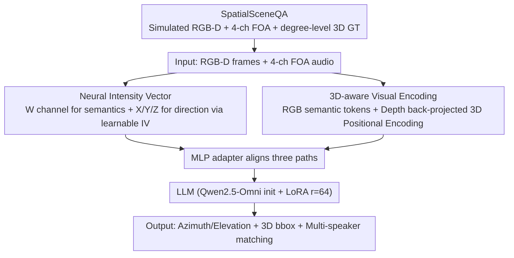

# JAEGER: Joint 3D Audio-Visual Grounding and Reasoning in Simulated Physical Environments

**Conference**: ICML 2026  
**arXiv**: [2602.18527](https://arxiv.org/abs/2602.18527)  
**Code**: https://github.com/liuzhan22/JAEGER  
**Area**: Multi-modal VLM / Audio Speech / 3D Vision  
**Keywords**: Spatial Audio, FOA, RGB-D, 3D Visual Grounding, Audio-Visual LLM

## TL;DR
Based on Qwen2.5-Omni, JAEGER adapts an end-to-end 3D audio-visual large model using LoRA. By integrating RGB-D depth positional encoding + First-Order Ambisonics (FOA) dual-track audio + a newly proposed Neural Intensity Vector, it extends traditional AV-LLMs from "2D RGB + Monophonic" to "3D Geometry + Multi-channel Spatial Audio," and releases the SpatialSceneQA simulation benchmark with 61k samples.

## Background & Motivation

**Background**: Current mainstream audio-visual large models (AV-LLMs), such as Qwen2.5-Omni and VideoLLaMA 2, are almost entirely based on the 2D setting of "RGB video + monophonic audio," leaving spatial structures and directional acoustics as implicit information. While 3D visual grounding has recently become popular, most works handle the visual side (point clouds, RGB-D + 3D positional encoding) or the audio side (binaural encoders, intensity vectors) separately, lacking a unified paradigm.

**Limitations of Prior Work**: First, **modality dimension mismatch**—monophonic audio cannot theoretically perform source localization, and RGB video lacks scale information to regress 3D boxes, leaving each modality short of one dimension. Second, existing cross-modal attempts either assume single sound sources with only RGB panoramas (e.g., Hear You Are), failing to test robustness against overlapping sources and depth-aware grounding, or rely on cascaded pipelines using traditional signal processing for DoA (e.g., SAVVY), which obstructs end-to-end learning. Third, available data is scarce; real multi-channel datasets like STARSS23 lack aligned depth information.

**Key Challenge**: To perform true 3D physical reasoning, one must simultaneously possess **metric-level geometry** (depth + camera intrinsic/extrinsic parameters) and **direction-level acoustics** (multi-channel spatial audio). However, classical STFT-based intensity vectors degrade under strong reverberation and overlapping sources, and traditional geometric branches rely on external 3D segmentors, neither of which are end-to-end learnable.

**Goal**: (i) Perform end-to-end DoA estimation, 3D box grounding, and multi-speaker audio-visual matching within a unified AV-LLM framework; (ii) Design spatial audio representations robust to reverberation and overlapping conditions; (iii) Provide large-scale simulation data with degree-level azimuth and elevation ground truth.

**Key Insight**: Simulation pipelines like Habitat-Sim + SoundSpaces 2.0 + Hunyuan3D-1.0 are now mature enough to synchronously render RGB-D + FOA + precise 3D ground truth. Furthermore, the physical form of the Classical IV, $I'_C = F_W^* \odot F_C$, can be generalized into the latent space, allowing the neural network to learn a "Neural Intensity Vector" that is more robust than STFT.

**Core Idea**: By utilizing a "Neural IV (learnable FOA intensity vector encoded by CNN) + 3D sinusoidal position encoding via depth back-projection," the model elevates AV-LLM from 2D to 3D through joint end-to-end training.

## Method

### Overall Architecture
The input to JAEGER consists of synchronized RGB-D frames + 4-channel FOA audio (including W/X/Y/Z channels), it outputs natural language + structured 3D information (azimuth, elevation angles, 3D bbox `bbox(c, x, y, z, sx, sy, sz)`, and multi-speaker matching labels Left/Center/Right). The system follows the flow of "Visual Stream + Audio Stream → MLP Projection → LLM (initialized with Qwen2.5-Omni + LoRA r=64)". The Visual Stream performs element-wise addition of RGB semantic tokens and 3D sinusoidal positional encoding back-projected from depth. The Audio Stream follows a dual path: the W channel extracts semantic content, while X/Y/Z channels extract spatial directional cues via Classical IV or Neural IV. These paths are aligned with the visual stream via an MLP adapter and fed into the LLM. Task-specific selective fine-tuning is employed: only the audio side for DoA, only the visual side for grounding, and all modality projections + LoRA for joint reasoning.

### Key Designs

**1. Neural Intensity Vector (Neural IV, the core novelty): Allowing the network to learn direction better than STFT in reverberation/overlap**

Classical methods rely on STFT-based Classical IV for spatial direction, but they depend on fixed spectral transforms. In the presence of strong reverberation or multiple overlapping sources, noise in the complex cross-spectrum $F_W^* \odot F_C$ is amplified, degrading direction estimation. JAEGER's approach lifts this physical structure into the latent space and replaces the fixed transform with learnable modules: first, a data2vec-style 7-layer 1D-CNN (kernel `(10,3,3,3,3,2,2)`, stride `(5,2,2,2,2,2,2)`, 50 Hz frame rate) encodes each FOA channel into latents, resulting in an omnidirectional channel $f_W$ and three directional channels $f_C,\ C \in \{X,Y,Z\}$. It then preserves the physically correct intensity vector skeleton of "omni × directional element-wise product," replacing complex conjugate multiplication with a latent Hadamard product $h_C = f_W \odot f_C$, followed by a concatenation through a two-layer MLP for the final directional representation:

$$\mathbf{v}_{\text{NIV}} = \text{Linear}(\text{ReLU}(\text{Linear}(\text{Concat}(h_X, h_Y, h_Z)))).$$

This preserves the first-principles acoustic structure of intensity vectors while allowing the CNN to learn a more stable directional embedding than fixed STFT—this is precisely where it outperforms Classical IV in "hard scenarios" like overlapping sources and cross-scene generalization.

**2. 3D-aware Visual Encoding: Grounding visual tokens into metric space via depth back-projection + 3D sinusoidal PE**

Monocular RGB lacks metric scale, causing large errors when LLMs directly regress 3D box centers. Therefore, the model must explicitly be told "which physical position this token grid corresponds to." The method uses camera intrinsics to back-project each pixel $(u,v)$ and its depth $D_{uv}$ into a metric 3D point $P_{uv} = D_{uv} \cdot K^{-1} [u, v, 1]^\top$, generating a point cloud $P \in \mathbb{R}^{H\times W\times 3}$ at the same resolution as the RGB. This is then aligned to the visual feature resolution $h\times w\times c$ using adaptive average pooling. The three coordinate axes $\alpha \in \{x,y,z\}$ each occupy $\lfloor c/3 \rfloor$ channels, encoded using sinusoidal formulas $\text{PE}(\alpha, 2j) = \sin(\alpha / 10000^{2j/\lfloor c/3 \rfloor})$ and concatenated to form $F_{3D}$, which is finally added element-wise to semantic tokens $\tilde F_{\text{visual}} = F_{\text{visual}} + F_{3D}$. With this metric coordinate prior, bbox center regression shifts from "guessing scale" to "querying within a known coordinate system," improving 3D IoU and visual offset.

**3. SpatialSceneQA: A 61k simulated audio-visual joint benchmark**

Since real multi-channel datasets like STARSS23 lack aligned depth and sufficient scale for end-to-end 3D audio-visual training, the authors constructed a dataset with degree-level ground truth using a simulation pipeline. The process involves three steps: using SoundSpaces 2.0 to perform bidirectional path-traced rendering of room impulse responses (RIR) on HM3D meshes, where FOA signals are obtained by convolving dry speech with RIR $A_c^{(r)}(t) = R_c(\cdot;\mathbf{s},\mathbf{r},\theta) * A^{(s)}(t)$ (dry speech from LibriSpeech, source-receiver distance 1–4 m, same-room constraint, 0.5 m obstacle margin); using Habitat-Sim to render synchronized RGB-D and semantic masks; and using Hunyuan3D-1.0 to generate 120 floor-standing speaker meshes inserted into scenes, filtered by a visibility constraint of ≥500 pixels (1920×1080). Data split includes leakage prevention: a 130/15/36 scene-level split for train/val/test to avoid room geometry leakage, and a separate 96/12/12 split for speaker meshes to test generalization. 1–3 candidates are inserted per scene to force the model to rely on geometric grounding rather than object class shortcuts. The final dataset covers 5 tasks: single-source DoA, overlapping DoA, 3D visual grounding, single-source multi-speaker matching, and overlapping multi-speaker matching.

### Loss & Training
- The LLM uses LoRA (r=64, α=128, dropout 0.05). Qwen2.5-Omni weights initialize the visual encoder, monophonic audio branch, and LLM decoder; Neural IV and the new audio adapter are randomly initialized.
- Task-specific selective fine-tuning: A/B (DoA) tunes the audio encoder + Neural IV + projector; C (Visual Grounding) tunes the visual encoder + projector; D/E (Joint Reasoning) tunes all modality encoders + projectors.
- Training on A100 40GB, batch 1–3, 3k–6k steps; cosine lr scheduler with 2.5k steps linear warm-up; peak lr $1\times 10^{-5}$, weight decay 0.05.

## Key Experimental Results

### Main Results

| Model | Modality | Audio DoA $\downarrow$ | Overlap DoA $\downarrow$ | 3D IoU $\uparrow$ | Visual Offset $\downarrow$ | 1-spk Acc $\uparrow$ | 2-spk Acc $\uparrow$ |
|------|------|------------------------|--------------------------|-------------------|----------------------------|---------------------|---------------------|
| Random | – | 90° | 90° | 0.00 | $\infty$ | 45.6 | 47.4 |
| Qwen2.5-Omni (zero-shot) | RGB + Mono | – | – | 0.00 | 2.40 m | 35.8 | 44.0 |
| BAT (5 ep) | Binaural | 2.16° | 19.09° | – | – | – | – |
| Qwen3-VL-8B (zero-shot) | RGB | – | – | 0.01 | 1.11 m | – | – |
| N3D-VLM (zero-shot) | RGB-D | – | – | 0.00 | 2.04 m | – | – |
| **Ours (Classical IV)** | RGB-D + FOA | 2.95° | 6.44° | 0.32 | 0.16 m | 99.5 | 98.6 |
| **Ours (Neural IV)** | RGB-D + FOA | **2.21°** | **4.11°** | **0.32** | **0.16 m** | **99.5** | **99.2** |

DoA is measured by Median Angular Error (°), and joint reasoning utilizes Accuracy for 3-way classification. Key Observation: On single-source DoA, Neural IV is on par with BAT (2.21° vs 2.16°), **but on overlapping sources, it drops from 19.09° to 4.11°, a nearly 5× improvement**. On joint reasoning, 2D AV-LLMs hover around ~35–45% even after fine-tuning, while JAEGER reaches 99.2%.

### Ablation Study

| Configuration | 1-spk Acc | 2-spk Acc | Description |
|------|-----------|-----------|------|
| Ours (Neural IV) | 99.5 | 99.2 | Full Model |
| Ours (Classical IV) | 99.5 | 98.6 | Reverted to STFT-based IV, drops 0.6 in overlaps |
| Ours (Neural) w/o Depth | 96.9 | 94.9 | Removed 3D PE, drops 2.6 / 4.3 |
| Ours (Classical) w/o Depth | 99.2 | 98.7 | Classical path is less sensitive to depth |
| Ours w/o FOA Encoder | 43.8 | 47.6 | **Removing FOA → drops to random** |
| Ours w/o Depth & FOA | 43.8 | 45.7 | Both removed → random |

Cross-scene Generalization (MAE °, Cross-evaluation):

| Train \ Test | Classical Single | Classical Overlap | Neural Single | Neural Overlap |
|--------------|-------------------|--------------------|----------------|-----------------|
| Train Single | 2.95° | **18.35°** | 2.21° | **14.91°** |
| Train Overlap | **19.25°** | 6.44° | **14.85°** | 4.11° |

Neural IV is more stable in all "train-test mismatch" cells compared to Classical (14.85° vs 19.25°), indicating it learns more intrinsic directional cues.

Ablation of 3D-aware Encoding (Task C): Adding depth improved Mean 3D IoU from 0.29 → 0.32 and Median Visual Offset from 0.18 m → 0.16 m.

### Key Findings
- **The FOA encoder is the lifeblood of joint reasoning**: Removing it leads to a drop to random performance (43.8%), which even RGB-D and LoRA fine-tuning cannot save—proving that monophonic input is fundamentally unable to perform spatial disambiguation.
- **Neural IV's benefits are amplified in "hard scenarios"**: It is nearly interchangeable with Classical IV in single-source cases (99.5 vs 99.5), but consistently superior in overlapping sources and cross-scene generalization (4.11° vs 6.44°, 14.91° vs 18.35°), suggesting that learnable spatial encoders show their value when SNR and reverberation worsen.
- **Depth has a greater impact on the Neural path than the Classical path**: Neural w/o depth on 2-spk dropped 4.3 points, while Classical dropped only 0.1. A possible reason is that Neural IV provides finer direction, making it more sensitive to the lack of depth (precision in one axis cannot compensate for blurriness in another).

## Highlights & Insights
- **Lifting physical formulas into latent space is a reusable design**: The core structure of Classical IV, $F_W^* \odot F_C$, is derived from acoustic first principles. The authors did not abandon this but replaced STFT with CNN and complex multiplication with latent Hadamard. This "hybrid" approach—preserving the physical operator skeleton while making the transforms learnable—is a paradigm that can be applied to signal-to-neural transitions in radar, sonar, or ultrasound.
- **Simulation Engineering**: The pipeline of HM3D + SoundSpaces 2.0 + Hunyuan3D-1.0 + LibriSpeech is a low-cost path to producing degree-level ground truth. The authors implemented robust details like scene-level splits, visibility constraints (500 pixels), and geometric generalization splits (96/12/12 mesh), ensuring benchmark cleanliness.
- **The narrative of "2D AV-LLMs fail even after fine-tuning" is strong**: Forcing Qwen2.5-Omni to fine-tune on its own data (which one would typically expect to help) and still seeing it fail to random performance elevates "the necessity of 3D modalities" from a hunch to a counterfactual empirical proof.

## Limitations & Future Work
- **Purely simulated, lacks real-world acoustic validation**: The authors admit that SoundSpaces 2.0 RIR rendering (path tracing + HRTF) differs from real microphone arrays/RGB-D sensors in synchronization, calibration, and noise characteristics. Zero-shot evaluations on real datasets like STARSS23 would increase credibility.
- **Relatively controlled scene settings**: Source-receiver distances are constrained to 1–4 m within the same room with visibility thresholds. Heavy occlusion, cross-room scenarios, long distances (>4 m), and >3 candidates—all common in embodied scenarios—were not tested.
- **Limited task granularity**: Current tasks use static single frames and static sources. Dynamic trajectories, source movement, speaker head rotation, and long-term reasoning (e.g., "hear someone speak and then walk towards them") are not yet covered.
- **Interpretability of Neural IV**: While performance is verified, what exactly is $h_C = f_W \odot f_C$ learning in the network? Probing or visualization could help physicists trust this module more.

## Related Work & Insights
- **vs Hear You Are (Ryu et al., 2026)**: Uses panoramic RGB + binaural, but its single-source assumption and lack of depth mean it cannot test overlap robustness or depth-aware grounding. JAEGER uses RGB-D + 4-channel FOA + overlapping sources with ≥2 candidates.
- **vs SAVVY (Chen et al., 2025)**: Also integrates RGB-D + multi-channel audio, but utilizes a cascaded pipeline + traditional DSP for DoA, preventing end-to-end learning. JAEGER internalizes DoA into LLM tokens and is fully differentiable.
- **vs BAT (Zheng et al., 2024)**: Binaural + HRTF. Single-source accuracy (2.16°) is slightly better than JAEGER (2.21°), but binaural representations are structurally weak against overlapping sources (19.09°) and cross-device/HRTF generalization; JAEGER's hardware-agnostic FOA + Neural IV is more versatile.
- **vs N3D-VLM (Wang et al., 2025)**: A visual-only 3D grounding path proving RGB-D + 3D PE allows LLMs to output 3D bboxes directly. JAEGER effectively inherits this visual frontend and fuses it with an audio path.
- **vs Tang et al. (2024)**: This work injected Classical IV into an auditory LLM for localized speech processing. JAEGER follows the IV logic but replaces STFT with CNN and extends it to an omni-modal LLM.

## Rating
- Novelty: ⭐⭐⭐⭐ Neural IV is a clear incremental neuro-interpretation of classical IV; 3D-aware visual encoding follows N3D-VLM; SpatialSceneQA is a solid engineering contribution.
- Experimental Thoroughness: ⭐⭐⭐⭐ Main tables + cross-scene generalization matrix + three-way ablation (depth/FOA/IV) were conducted. The "no FOA = random" result is highly persuasive. The only drawback is the lack of real-world acoustic transfer.
- Writing Quality: ⭐⭐⭐⭐ The causal chain from motivation to pain points to formulas and then to ablation is clear. The physical comparison table for Classical vs. Neural IV makes contributions straightforward.
- Value: ⭐⭐⭐⭐ The dataset + end-to-end 3D AV-LLM paradigm + open-source code/models make this a reusable infrastructure for embodied AI and spatial audio-visual research.

<!-- RELATED:START -->

## Related Papers

- [\[ICML 2026\] Probing Cross-modal Information Hubs in Audio-Visual LLMs](probing_cross-modal_information_hubs_in_audio-visual_llms.md)
- [\[ICML 2026\] Multimodal Fact-Level Attribution for Verifiable Reasoning](multimodal_fact-level_attribution_for_verifiable_reasoning.md)
- [\[ACL 2026\] Analyzing Reasoning Shifts in Audio Deepfake Detection under Adversarial Attacks: The Reasoning Tax versus Shield Bifurcation](../../ACL2026/audio_speech/analyzing_reasoning_shifts_in_audio_deepfake_detection_under_adversarial_attacks.md)
- [\[ICML 2025\] Teaching Physical Awareness to LLMs through Sounds](../../ICML2025/audio_speech/teaching_physical_awareness_to_llms_through_sounds.md)
- [\[CVPR 2025\] VinTAGe: Joint Video and Text Conditioning for Holistic Audio Generation](../../CVPR2025/audio_speech/vintage_joint_video_and_text_conditioning_for_holistic_audio_generation.md)

<!-- RELATED:END -->
