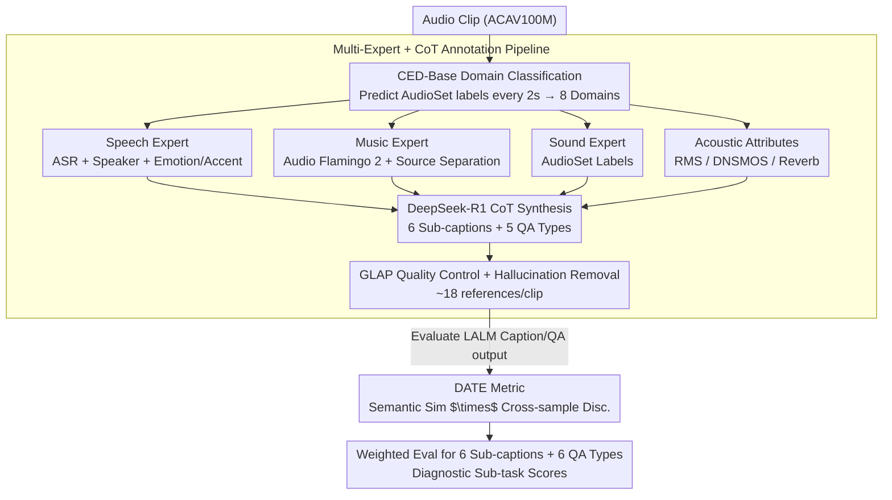

# MECAT: A Multi-Experts Constructed Benchmark for Fine-Grained Audio Understanding Tasks

**Conference**: ICML 2026  
**arXiv**: [2507.23511](https://arxiv.org/abs/2507.23511)  
**Code**: https://github.com/xiaomi-research/mecat  
**Area**: Audio-Language Understanding / Benchmark  
**Keywords**: Fine-grained Audio Understanding, Multi-expert Pipeline, Open-ended QA, Discriminative Metric DATE, ACAV100M

## TL;DR
MECAT utilizes a "Multi-expert Model + CoT LLM Reasoning" pipeline to construct 20k multi-perspective fine-grained audio captions and 100k open-ended QAs. It introduces the DATE metric (harmonic mean of semantic similarity and cross-sample discriminability), which for the first time stably distinguishes between generic and detail-accurate model outputs.

## Background & Motivation

**Background**: Large Audio-Language Models (LALMs) are shifting from closed-classification/ASR to open-ended audio captioning and QA. Representative benchmarks include AudioCaps, Clotho (human-labeled captions), ClothoAQA, and MMAU (QA). Mainstream metrics include BLEU/CIDEr/SPICE (word matching), FENSE (embedding similarity), and LLM-as-judge.

**Limitations of Prior Work**: (1) Data—human captions often provide coarse event-level descriptions ("a dog barking"); automated methods like AutoACD or LPMusicCaps use LLMs but rely on coarse metadata, leaving granularity unresolved. QAs are mostly yes/no or multiple-choice, failing to evaluate open-ended generation. (2) Highly homogeneous data sources—most benchmarks derive from AudioSet, leading to severe "one audio, multiple uses" and overestimation of model generalization. (3) Metrics—word matching punishes synonymous paraphrasing; embedding similarity fails to distinguish between generic outputs (e.g., "a dog barking while a person speaks") and detailed ones (e.g., "an excited dog gives short barks in a park near people chatting"); LLM-as-judge is discriminative but expensive, slow, and sensitive to prompts.

**Key Challenge**: To evaluate whether an LALM truly understands audio, there is a need for (a) multi-perspective and fine-grained reference annotations to allow room for detailing differences, and (b) an extensible metric that rewards "detail accuracy" while punishing "genericness." Both are currently missing.

**Goal**: (i) Construct an audio caption + QA benchmark with novel data sources, full domain coverage, and fine-grained granularity; (ii) Design an open-ended generation evaluation metric that does not rely on LLM judges but is more discriminative than FENSE; (iii) Systematically evaluate current SOTA LALMs to reveal real bottlenecks in fine-grained perception.

**Key Insight**: Instead of relying on a single LLM for automated labeling which often leads to coarse descriptions, the authors employ a complete set of domain experts (speech, music, sound events, and acoustic attributes) to extract structured analysis. An LLM then uses CoT to synthesize all expert evidence into multi-perspective descriptions. The evaluation metric combines Sentence-BERT embeddings with "TF-IDF weighting" and "cross-sample ranking," turning one-sided similarity into a discriminative problem of "whether it matches better relative to other samples."

**Core Idea**: Use "multi-expert pipeline generation + three major categories of multi-perspective captions (systemic/specific/unrelated)" for data, and create the DATE metric using "TF-IDF weighted embeddings $\times$ cross-sample discriminability." This transforms evaluation from "average similarity" to "the ability to distinguish a sample from others."

## Method

### Overall Architecture
MECAT aims to answer: how to determine if an audio model truly understands details or just writes generic sentences like "a dog is barking." It splits the task into two parts: creating reference data "fine enough to expose flaws" and designing a metric "capable of separating generic from detailed outputs." On the data side, domain experts extract structured attributes, which an LLM then synthesizes into captions and QA via CoT. On the evaluation side, cross-sample discriminability is added to semantic similarity to form the DATE metric.

### Key Designs

**1. Multi-expert + CoT Annotation Pipeline: Providing LLMs with Evidence instead of Raw Audio**
Directly asking an LLM to listen to raw audio and write captions often results in generic sentences. MECAT extracts attributes that can be accurately measured by specialized models first. The process: CED-Base predicts AudioSet labels in 2-second windows to determine domain classification (speech, music, sound, silence, and their mixtures); the speech domain undergoes ASR, speaker diarization, and attribute recognition (gender, age, emotion, accent); the music domain uses Audio Flamingo 2 for global descriptions and source separation; the sound domain uses AudioSet labels; and acoustic attributes (RMS, DNSMOS/NISQA2, reverberation time) are extracted. DeepSeek-R1 takes all expert outputs and metadata to perform CoT reasoning, outputting 6 sub-caption types (systemic long/short, speech, music, sound, acoustic) and 5 QA types. With hard evidence like ASR transcripts and tempo, the CoT captions naturally include details. Quality control uses GLAP to ensure the cosine similarity between audio and caption is significantly higher than random pairings.

**2. DATE Metric: Harmonic Mean of Semantic Similarity and Cross-sample Discriminability**
Embedding similarity metrics like FENSE often assign high scores to generic descriptions (e.g., "a dog is barking") for all dog-related audio. DATE transforms "how good is this description" into a discriminative problem. It first applies TF-IDF weighting to Sentence-BERT embeddings:
$$\mathbf{v}_T = \sum_t (\text{TF}_{emb}(t,T) \cdot \text{IDF}_{emb}(t)) \cdot E(t)$$
This gives higher weight to rare, discriminative words. Single-sample similarity is $S_{sim,i} = \cos(\mathbf{v}_{cand}, \mathbf{v}_{ref})$. The second term involves a cross-sample similarity matrix $\mathcal{M}$. For sample $i$, it looks at the rank $r_i$ of the diagonal element $M_{i,i}$ among all candidates in the $i$-th row. This is converted to a discriminability score: $S_{dis,i} = 1 - r_i/N$. The final metric is the harmonic mean:
$$\text{DATE}_i = \frac{2 \cdot S_{sim,i} \cdot S_{dis,i}}{S_{sim,i} + S_{dis,i}} \in [0, 1]$$
Generic descriptions receive low discriminability scores because they match too many samples, and the harmonic mean ensures only high scores in both similarity and discriminability yield a high total score.

**3. Weighted Evaluation for Sub-captions and QA: Decomposing "Fine-grained" into Diagnostic Sub-tasks**
MECAT decomposes fine-grained understanding into independent sub-tasks. For captions:
$$\text{Score}_{Cap} = 0.4 \cdot S_{Systemic} + 0.4 \cdot S_{Content\text{-}Specific} + 0.2 \cdot S_{Content\text{-}Unrelated}$$
where $S_{Systemic} = 0.8 \cdot S_{Long} + 0.2 \cdot S_{Short}$ and $S_{Content\text{-}Specific} = 0.6 \cdot S_{Speech} + 0.3 \cdot S_{Music} + 0.1 \cdot S_{Sound}$. The weights reflect the content distribution of ACAV100M. QA is divided into six types: Perception (DP), Analysis (SC, QAS), and Reasoning (ER, IJ, AC), using an equal-weighted average. Evaluating content sub-classes across "pure" and "mixed" domains (e.g., speech in pure domain S00 vs. mixed domain SM0) helps diagnose robustness in complex acoustic scenes.

### Loss & Training
N/A (Evaluation-focused paper). All LALMs generate caption/QA responses via Hugging Face or official scripts, and scores are calculated using the DATE metric.

## Key Experimental Results

### Main Results
DATE (%) performance of SOTA LALMs on MECAT-Caption (abridged Table 2):

| Model | Systemic Long | Speech (Pure) | Music (Pure) | Sound (Pure) | $\text{Score}_{Cap}$ |
|---|---|---|---|---|---|
| Caption-Only baseline | Lower | Lower | Lower | Lower | Lower |
| Mainstream LALM (e.g., Audio Flamingo / Qwen-Audio) | [Ref. Table] | [Ref. Table] | [Ref. Table] | [Ref. Table] | [Ref. Table] |

(Original Table 2 shows scores across 12 dimensions. Overall conclusion: All models perform significantly worse on systemic long captions, mixed domains, and sound-pure tasks compared to short captions and speech-pure tasks.)

### Ablation Study

| Configuration | Observation |
|---|---|
| Similarity only (FENSE) | Generic vs. detailed outputs have similar scores; inconsistent ranking. |
| Cross-sample discriminability only | Favors short sentences; punishes detailed descriptions. |
| **DATE (Harmonic Mean)** | Highly consistent with LLM-as-judge rankings; optimal discriminability. |
| Caption weights $(0.4, 0.4, 0.2)$ variations | Model rankings remain stable (Kendall's $\tau=0.92$). |

### Key Findings
- Existing LALMs score lowest on systemic long captions, showing they can recognize sounds but fail to organize multiple events into a contextual long description.
- Performance drops significantly in mixed domains (e.g., speech + music + sound), indicating that fine-grained perception in multi-source scenes is immature.
- The CDF distance between DATE and LLM-as-judge is significantly larger than that of FENSE, proving DATE approaches judge-level discriminability without the associated costs.

## Highlights & Insights
- The "Multi-expert + CoT" pipeline is a highly transferable design pattern for cross-modal evaluation (video, medical imaging, etc.).
- The DATE metric paradigm (Similarity $\times$ Discriminability) effectively suppresses generic template answers.
- The inclusion of "content-unrelated" captions (e.g., requiring a "no speech" response for pure music) cleverly builds hallucination penalties into the reference labels.

## Limitations & Future Work
- Data source is limited to ACAV100M; multi-source datasets (Podcasts, Movies) would be more robust.
- Audio clips are limited to under 10s, failing to evaluate long-form audio understanding.
- DATE relies on Sentence-BERT; professional terminology or low-resource languages may require different embeddings.
- Potential conflicts of interest (authors from Xiaomi; MiMo-Audio evaluated).

## Related Work & Insights
- **vs. AudioCaps / Clotho**: Coarse event-level vs. multi-perspective fine-grained; references expanded from 1 to ~18 per clip.
- **vs. LPMusicCaps / AutoACD**: Moving beyond LLMs reading only metadata; utilizing structured expert evidence for detailed CoT synthesis.
- **vs. MMAU**: Transitioning from closed-form multiple-choice to open-ended generation with DATE evaluation.
- **vs. FENSE**: Addressing FENSE's inability to distinguish generic vs. detailed outputs through a discriminative ranking term.

## Rating
- Novelty: ⭐⭐⭐⭐ Combination of multi-expert pipeline and DATE metric.
- Experimental Thoroughness: ⭐⭐⭐⭐ Evaluated 10+ LALMs but focuses mainly on general LALMs.
- Writing Quality: ⭐⭐⭐⭐ Clear task definitions and convincing motivation for DATE.
- Value: ⭐⭐⭐⭐⭐ Provides a new "data + metric" standard for open-ended audio understanding.

<!-- RELATED:START -->

## Related Papers

- [\[ACL 2026\] Towards Fine-Grained and Multi-Granular Contrastive Language-Speech Pre-training](../../ACL2026/audio_speech/towards_fine-grained_and_multi-granular_contrastive_language-speech_pre-training.md)
- [\[CVPR 2026\] AMUSE: Audio-Visual Benchmark and Alignment Framework for Agentic Multi-Speaker Understanding](../../CVPR2026/audio_speech/amuse_audio-visual_benchmark_and_alignment_framework_for_agentic_multi-speaker_u.md)
- [\[ACL 2026\] SegTune: Structured and Fine-Grained Control for Song Generation](../../ACL2026/audio_speech/segtune_structured_and_fine-grained_control_for_song_generation.md)
- [\[CVPR 2026\] FoleyDirector: Fine-Grained Temporal Steering for Video-to-Audio Generation via Structured Scripts](../../CVPR2026/audio_speech/foleydirector_fine-grained_temporal_steering_for_video-to-audio_generation_via_s.md)
- [\[ICLR 2026\] MMSU: A Massive Multi-task Spoken Language Understanding and Reasoning Benchmark](../../ICLR2026/audio_speech/mmsu_a_massive_multi-task_spoken_language_understanding_and_reasoning_benchmark.md)

<!-- RELATED:END -->
