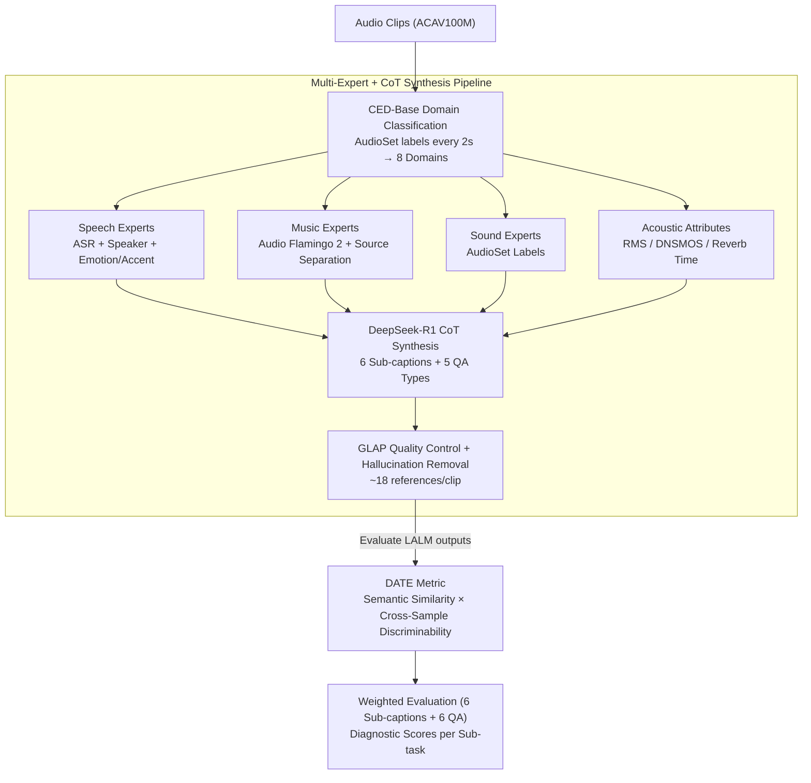

# MECAT: A Multi-Experts Constructed Benchmark for Fine-Grained Audio Understanding Tasks

**Conference**: ICML 2026  
**arXiv**: [2507.23511](https://arxiv.org/abs/2507.23511)  
**Code**: https://github.com/xiaomi-research/mecat  
**Area**: Audio-Language Understanding / Evaluation Benchmark  
**Keywords**: Fine-grained Audio Understanding, Multi-expert Pipeline, Open-ended QA, Discriminative Metric DATE, ACAV100M

## TL;DR
MECAT constructs 20k multi-perspective fine-grained audio captions and 100k open-ended QA pairs using a "multi-expert models + CoT LLM reasoning" pipeline. It proposes the DATE metric (harmonic mean of semantic similarity and cross-sample discriminability), achieving the first stable differentiation between generic and detailed audio model outputs.

## Background & Motivation

**Background**: Large Audio-Language Models (LALMs) are shifting from closed-set classification/ASR to open-ended audio captioning and QA. Representative benchmarks include AudioCaps and Clotho (human-labeled captions), ClothoAQA, and MMAU (QA). Metrics primarily rely on surface-level matching (BLEU/CIDEr/SPICE), embedding similarity (FENSE), or LLM-as-judge.

**Limitations of Prior Work**: (1) Data—human captions provide only event-level coarse descriptions (e.g., "a dog barking"). AutoACD/LPMusicCaps use LLMs for automated labeling, but the input metadata is often coarse, leaving granularity unresolved. QA mostly consists of yes/no or multiple-choice, failing to test open-ended generation. (2) Data sources are highly homogeneous—many benchmarks derive from AudioSet, leading to severe sample reuse and overestimated generalization. (3) Metrics—word matching penalizes synonymous paraphrasing; embedding similarity fails to distinguish between generic outputs ("a dog barking and a person talking") and detailed ones ("an excited dog barking briefly in a park while people chat nearby"). LLM-as-judge is discriminative but expensive, slow, and sensitive to prompts.

**Key Challenge**: To evaluate whether LALMs truly understand audio, there is a need for (a) multi-perspective and fine-grained reference annotations to allow space for capturing detailed differences, and (b) a scalable metric that rewards "factual detail" while punishing "genericness." Both are currently lacking.

**Goal**: (i) Construct an audio caption + QA benchmark with novel data sources, full domain coverage, and fine-grained granularity; (ii) Design an open-ended generation metric that does not rely on LLM judges but is more discriminative than FENSE; (iii) Systematically evaluate current SOTA LALMs to reveal real bottlenecks in fine-grained perception.

**Key Insight**: Since a single LLM is prone to generating coarse descriptions, one can instead use a suite of domain-expert models (speech, music, sound events, acoustic attributes) to extract structured analysis, then let an LLM synthesize all expert evidence via CoT to write multi-perspective descriptions. For evaluation, "TF-IDF weighting" and "cross-sample ranking scores" are added to Sentence-BERT embeddings, transforming unilateral similarity into a discriminative problem of "whether it matches better relative to other samples."

**Core Idea**: Feed data via a "multi-expert pipeline generation + three categories (systemic/specific/unrelated) of multi-perspective captions" and create the DATE metric using "TF-IDF weighted embeddings $\times$ cross-sample discriminability," shifting evaluation from "average similarity" to "ability to distinguish a sample from others."

## Method

### Overall Architecture
MECAT aims to determine whether an audio model truly understands details or merely outputs generic phrases. This is addressed by: creating reference data fine enough to expose model limitations, and designing a metric that separates generic outputs from detailed ones. On the data side, domain experts extract structured attributes, which the LLM synthesizes into captions and QA via CoT. For evaluation, the DATE metric combines semantic similarity with cross-sample discriminability.

### Key Designs

**1. Multi-Expert + CoT Synthesis Pipeline: Evidence-based Reasoning**

Directly using an LLM to hear raw audio often results in generic sentences. MECAT extracts attributes through specialized models first. Process: CED-Base determines domain classification (speech, music, sound, silence, or mixtures); the speech domain undergoes ASR, diarization, and attribute identification; the music domain uses Audio Flamingo 2 and source separation; the sound domain uses AudioSet labels; acoustic attributes (RMS, DNSMOS, etc.) are extracted globally. DeepSeek-R1 performs CoT reasoning based on these expert outputs and metadata to generate 6 sub-caption types and 5 QA types. Quality is ensured using GLAP audio-caption cosine similarity, requiring the correct pair to outperform random samples by a threshold, alongside hallucination removal.

**2. DATE Metric: Harmonic Mean of Semantic Similarity and Cross-Sample Discriminability**

Embedding metrics like FENSE often give high scores to "a dog barking" for all dog-related audio, failing to differentiate generic from detailed outputs. DATE transforms "goodness" into a discriminative problem. It uses TF-IDF weighted Sentence-BERT embeddings: $\mathbf{v}_T=\sum_t (\text{TF}_{emb}(t,T)\cdot\text{IDF}_{emb}(t))\cdot E(t)$, giving higher weight to discriminative words. Single-sample similarity is $S_{sim,i}=\cos(\mathbf{v}_{cand},\mathbf{v}_{ref})$. Then, a cross-sample similarity matrix $\mathcal{M}$ is constructed to find the rank $r_i$ of the diagonal element $M_{i,i}$ in its row, converted to discriminability $S_{dis,i}=1-r_i/N$. The final metric is $\text{DATE}_i=\frac{2\cdot S_{sim,i}\cdot S_{dis,i}}{S_{sim,i}+S_{dis,i}}\in[0,1]$.

**3. Diagnostic Sub-tasks: Weighted 6 Sub-captions and 6 QA Categories**

MECAT breaks fine-grained understanding into independent diagnostic sub-tasks. Caption score: $\text{Score}_{Cap}=0.4\cdot S_{Systemic}+0.4\cdot S_{Content\text{-}Specific}+0.2\cdot S_{Content\text{-}Unrelated}$, where $S_{Systemic}$ weights long vs. short descriptions and $S_{Content\text{-}Specific}$ covers speech/music/sound based on ACAV100M distribution. QA categories cover Perception (DP), Analysis (SC, QAS), and Reasoning (ER, IJ, AC). This structure allows diagnosing whether a model fails on long descriptions, mixed audio, or reasoning tasks.

### Loss & Training
Ours is an evaluation benchmark; no training/loss is involved. Evaluated LALMs generate responses via official inference scripts, which are kemudian scored using DATE.

## Key Experimental Results

### Main Results
DATE (%) performance of SOTA LALMs on MECAT-Caption (Abridged Table 2):

| Model | Systemic Long | Speech (Pure) | Music (Pure) | Sound (Pure) | $\text{Score}_{Cap}$ |
|---|---|---|---|---|---|
| Caption-Only baseline | Low | Low | Low | Low | Low |
| Mainstream LALMs (e.g. Qwen-Audio) | [See Paper] | [See Paper] | [See Paper] | [See Paper] | [See Paper] |

(Main findings from Table 2: All models perform significantly worse on systemic long captions, mixed domains, and sound-pure domains compared to short captions or speech-pure domains, revealing much larger fine-grained gaps than traditional benchmarks.)

### Ablation Study

| Configuration | Observation |
|---|---|
| Similarity only (FENSE) | Generic and detailed outputs get similar scores; model rankings are inconsistent. |
| Cross-sample discriminability only | Short sentences gain an advantage; detailed descriptions are unfairly penalized. |
| **DATE (Harmonic Mean)** | Model rankings align highly with LLM-as-judge; CDF curves show optimal separation. |
| Caption Weight Adjustment | Kendall's $\tau=0.92$; model rankings remain stable regardless of small weight shifts. |

### Key Findings
- Existing LALMs score lowest on systemic long captions, indicating they can recognize sounds but fail to organize multiple events into contextual long descriptions.
- Performance drops significantly in mixed domains (e.g., Speech + Music + Sound), suggesting lack of robustness in complex acoustic scenes.
- DATE's CDF aligns much closer to LLM-as-judge than FENSE, proving it approximates human/LLM judgment without the associated costs.

## Highlights & Insights
- The "Multi-Expert + CoT" pipeline is a transferable design pattern for any domain where structured attributes can be extracted before LLM synthesis.
- DATE's core logic—combining absolute similarity with relative discriminability—naturally suppresses generic template answers.
- Explicit "Negative Reference" (forcing the model to state if a domain is absent) cleverely bakes hallucination penalty directly into the reference annotations.

## Limitations & Future Work
- Data source is limited to ACAV100M; multi-source mixtures (Podcasts, Movies) would be more robust.
- Audio clips are capped at 10s, preventing evaluation of long-context understanding (e.g., lectures).
- DATE relies on Sentence-BERT; specific domain-heavy or non-English scenarios may require specialized embeddings.
- Potential conflict of interest (some authors from Xiaomi, whose MiMo-Audio was evaluated).

## Related Work & Insights
- **vs AudioCaps / Clotho**: Coarse event-level vs. multi-perspective fine-grained; references expanded from 1 to ~18/clip.
- **vs LPMusicCaps / AutoACD**: Conventional LLM-labeling still yields generic descriptions; MECAT uses expert pipelines to provide "hard evidence" for CoT details.
- **vs MMAU**: MMAU is closed-set choice-based; MECAT uses open-ended generation + DATE to measure actual generation quality rather than "guessing."
- **vs FENSE**: DATE fixes FENSE's inability to distinguish generic vs. detailed outputs through the cross-sample discriminability term.

## Rating
- Novelty: ⭐⭐⭐⭐ Combination of multi-expert pipeline and DATE metric is highly innovative for audio.
- Experimental Thoroughness: ⭐⭐⭐⭐ Evaluated 10+ SOTAs with sensitivity analysis, though narrow-domain models were less represented.
- Writing Quality: ⭐⭐⭐⭐ Clear task definitions and convincing motivation for DATE.
- Value: ⭐⭐⭐⭐⭐ Provides a new "data + metric" standard for open-ended audio understanding.

<!-- RELATED:START -->

## Related Papers

- [\[ACL 2026\] Towards Fine-Grained and Multi-Granular Contrastive Language-Speech Pre-training](../../ACL2026/audio_speech/towards_fine-grained_and_multi-granular_contrastive_language-speech_pre-training.md)
- [\[CVPR 2026\] AMUSE: Audio-Visual Benchmark and Alignment Framework for Agentic Multi-Speaker Understanding](../../CVPR2026/audio_speech/amuse_audio-visual_benchmark_and_alignment_framework_for_agentic_multi-speaker_u.md)
- [\[ICLR 2026\] MMSU: A Massive Multi-task Spoken Language Understanding and Reasoning Benchmark](../../ICLR2026/audio_speech/mmsu_a_massive_multi-task_spoken_language_understanding_and_reasoning_benchmark.md)
- [\[CVPR 2026\] FoleyDirector: Fine-Grained Temporal Steering for Video-to-Audio Generation via Structured Scripts](../../CVPR2026/audio_speech/foleydirector_fine-grained_temporal_steering_for_video-to-audio_generation_via_s.md)
- [\[ACL 2026\] SegTune: Structured and Fine-Grained Control for Song Generation](../../ACL2026/audio_speech/segtune_structured_and_fine-grained_control_for_song_generation.md)

<!-- RELATED:END -->
