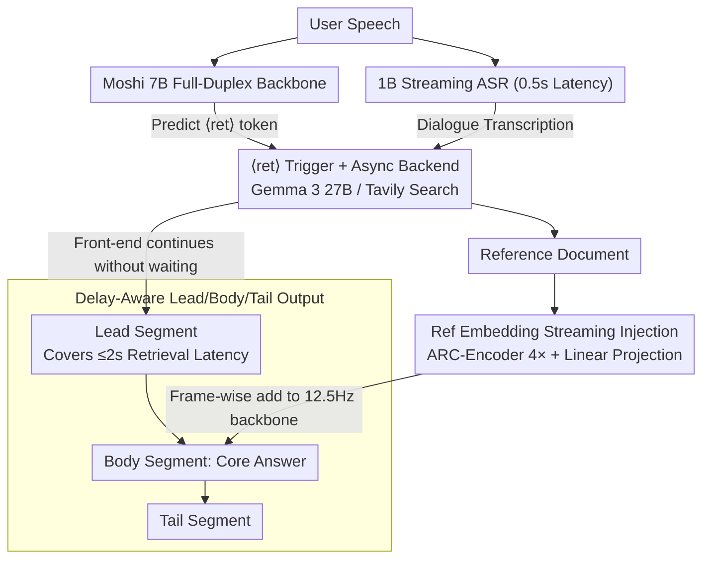

# MoshiRAG: Asynchronous Knowledge Retrieval for Full-Duplex Speech Language Models

**Conference**: ICML 2026  
**arXiv**: [2604.12928](https://arxiv.org/abs/2604.12928)  
**Code**: https://github.com/kyutai-labs/moshi-rag (Available)  
**Area**: Dialogue Systems / Full-Duplex Speech / Retrieval-Augmented Generation  
**Keywords**: full-duplex, speech LM, RAG, Moshi, asynchronous retrieval, keyword delay

## TL;DR
MoshiRAG incorporates a special $\langle\text{ret}\rangle$ trigger token into the Moshi full-duplex speech model, allowing the model to asynchronously invoke an LLM or search engine backend while speaking. By exploiting the natural "keyword delay" between the start of an utterance and the appearance of critical keywords, it preserves full-duplex interactivity while hiding retrieval latencies of up to 2 seconds. This enables the model to achieve factuality on par with GPT-4o Audio across LlamaQ, WebQ, TriviaQA, and HaluEval.

## Background & Motivation
**Background**: Modern speech dialogue systems are shifting from cascaded ASR-Dialogue-TTS pipelines toward end-to-end speech LMs. Full-duplex models (successors to Moshi and dGSLM) can "listen and speak" simultaneously, closely mimicking human interaction, whereas turn-based models (e.g., GLM-4-Voice, Freeze-Omni) are limited to alternating turns.

**Limitations of Prior Work**: (1) Native speech LMs are trained on significantly less data than text LMs, leading to lower factuality compared to similarly sized text models. (2) Scaling model size improves factuality but conflicts with the strict real-time requirements of full-duplex systems. (3) Existing RAG frameworks are primarily turn-based, introducing synchronous wait times that disrupt full-duplex flow.

**Key Challenge**: Factuality requires external knowledge via RAG, but RAG introduces latency that breaks the full-duplex experience. There is a conflict between sacrificing factuality or sacrificing real-time interaction.

**Goal**: (1) Enable the Moshi model to autonomously judge when external knowledge is required; (2) Trigger retrieval without interrupting the speech stream; (3) Maintain a hot-swappable backend without requiring model retraining.

**Key Insight**: The authors observe a neglected temporal structure: the "keyword delay" (KD) between the start of speech (TTFAT) and the actual appearance of the keyword. For many models, this delay exceeds 3 seconds. If retrieval can be completed within this gap (target $\le 2$ seconds), the model can "fetch the answer while delivering a polite opening statement."

**Core Idea**: Use a $\langle\text{ret}\rangle$ trigger token, an asynchronous backend, and stream-injected reference embeddings to transform synchronous RAG into a full-duplex-compatible "retrieval-while-speaking" mechanism.

## Method

### Overall Architecture
MoshiRAG enables a full-duplex model to retrieve external knowledge without stuttering. It splits the traditional synchronous RAG process into two layers: a real-time front end and a "slow-thinking" back end. The front end is a full-duplex model based on Moshi 7B that processes user audio and its own previous tokens, including a new $\langle\text{ret}\rangle$ token. An auxiliary 1B streaming ASR (0.5s latency) transcribes user speech. Once Moshi emits the $\langle\text{ret}\rangle$ token, the transcribed dialogue is sent to an asynchronous backend (e.g., Gemma 3 27B or Tavily search). The front end continues generating a "lead" segment (opening) without waiting. Once results return, they are projected via a reference encoder and added frame-by-frame to the backbone, allowing the model to seamlessly integrate the knowledge into the "body" of the response.

### Key Designs

**1. $\langle\text{ret}\rangle$ Trigger Token + Async Backend: Turning Synchronous RAG into Event-Driven Tool Calls**

Synchronous RAG interrupts full-duplex flow. MoshiRAG introduces a special token $\langle\text{ret}\rangle$ into the RQ-Transformer's vocabulary. During training, $\langle\text{ret}\rangle$ is placed at the start of the "lead" segment in each RAG-enabled turn. During inference, when the model predicts $\langle\text{ret}\rangle$, the system sends the ASR transcription to the backend. The front end continues running without waiting for a result. This decouples real-time responsiveness from backend reasoning.

**2. Delay-Aware Data Synthesis: Training Openings to Mask Latency**

The physical foundation is keyword delay: the gap from current onset (TTFAT) to keyword often exceeds 3s. If data contains enough samples where the lead segment covers $\sim 2$s of retrieval, the model learns to retrieve while speaking. Authors synthesized 1.9M dialogues using three Gemma 3 27B roles (User/Moshi/Reference) with strictly isolated information access. Each RAG turn is structured into (lead, body, tail). During training, retrieval delays are simulated by sampling $d'\sim\mathcal{U}(1.0,\,d_{\text{lead}}-1.0)$ with 80% probability, and a fallback $d'\sim\mathcal{U}(0,\,d_{\text{lead}})$ with 20% probability, ensuring at least 1s of buffer before the body starts.

**3. Reference Embedding Streaming Injection: Interfacing Variable Text into 12.5 Hz Backbone**

Prepending reference text would consume context and break the 12.5 Hz streaming property. MoshiRAG uses a pre-trained ARC-Encoder to compress the reference text by 4x, followed by a trainable linear projection $h_i^{\text{ref}}=\text{proj}(\text{emb}_i^{\text{ref}})$. Starting from $d/f_r$ steps after $\langle\text{ret}\rangle$, these are added frame-wise to the temporal Transformer input: $h_i'=h_i+h_{i-(i_{\text{ret}}+d/f_r)}^{\text{ref}}$ for $l$ steps. 20% dropout was applied at training to ensure robustness when references are missing.

### Loss & Training
The base loss follows Moshi's standard text/speech next-token prediction. The reference text encoder is frozen, while the linear projection and dropout vectors are learnable. Learning rate: $2\times 10^{-6}$, batch size: 32, 100k updates. Simple VAD (80ms window, -65 dBFS) is used for silence cleaning.

## Key Experimental Results

### Main Results

| Model | LlamaQ | WebQ | TriviaQA | HaluEval | TTFAT(s) | KD(s) | E2EKD(s) |
|------|--------|------|----------|----------|-------|----|-------|
| GPT-4o Audio | 88.4 | 81.0 | 90.6 | 68.7 | — | 5.5 | — |
| GLM-4-Voice 9B | 64.7 | 32.2 | 39.1 | 21.2 | 0.3 | 4.2 | 4.4 |
| Freeze-Omni 7B | 72.0 | 44.7 | 53.9 | 14.0 | — | — | — |
| **Ours (MoshiRAG)** | Close to GPT-4o Audio | Significant Lead | Significant Lead | Significant Lead | Small | $\le 2$s | Managed |

Table 1 in the paper indicates that MoshiRAG achieves significantly higher quality (ref) and response (resp) scores on four QA benchmarks compared to open-source speech LMs, while maintaining lower FLOPs/sec than larger models like GLM-4-Voice.

### Ablation Study

| Configuration | Key Observation |
|------|---------|
| Search (Tavily) vs LLM Backend (Gemma 3) | Backends are hot-swappable; LLM is more accurate, but Search provides real-time web info. |
| Reference Encoders | ARC-Encoder provides the best trade-off between quality and latency at 4x compression. |
| Without Lead/Body/Tail Structure | Resulting speech segments were misaligned, leading to unnatural pauses or disjointed audio. |
| Mathematical Reasoning (OOD) | Successfully solved simple math via "Speech $\rightarrow$ LLM tool call" format. |

### Key Findings
- The E2EKD (End-to-End Keyword Delay) window (typically $>3$s) provides the physical budget to convert synchronous RAG into an asynchronous process.
- Factuality in speech LMs can be addressed via external knowledge sources rather than just parameter scaling; the 7B Moshi matches or exceeds several 9B+ competitors.
- This represents an early form of full-duplex tool use, where the model treats the backend as an "external brain."

## Highlights & Insights
- Redefining "keyword delay" from a negative latency metric into a "usable time budget" is the core innovation of this work.
- The $\langle\text{ret}\rangle$ design elegantly migrates the mature text-LLM function calling paradigm into the speech domain.
- Frame-wise additive injection into the temporal Transformer, rather than prompt concatenation, is a hardware-aware design that respects 12.5 Hz streaming constraints.

## Limitations & Future Work
- Training relies heavily on synthetic dialogues and multi-channel TTS, leaving a gap with real human dialogue regarding disfluency, accents, and noise.
- The $\langle\text{ret}\rangle$ trigger is a "hard decision" without a formal confidence or cost-benefit mechanism.
- Evaluations are primarily single-turn QA; strategic multi-turn knowledge usage (clarifying questions before retrieving) is less explored.
- Currently limited to the English version of Moshi.

## Related Work & Insights
- **vs StreamRAG / KAME**: StreamRAG is restricted to turn-based settings; KAME uses fixed-interval calls which waste computation. MoshiRAG uses on-demand, event-driven RAG for better efficiency.
- **vs Moshi**: Directly inherits the RQ-Transformer + dual-channel architecture, requiring only one new token and a projection layer for significant factuality gains.
- **vs Chain-of-Thought for audio**: CoT improves reasoning; MoshiRAG improves knowledge access. These are orthogonal and potentially combinable.

## Rating
- Novelty: ⭐⭐⭐⭐ First full-duplex RAG system; innovative use of keyword delay.
- Experimental Thoroughness: ⭐⭐⭐⭐ Strong coverage of QA, backends, and encoders.
- Writing Quality: ⭐⭐⭐⭐⭐ Clear explanation of latency metrics (TTFAT/KD/E2EKD); excellent engineering motivation.
- Value: ⭐⭐⭐⭐⭐ Opens the door for full-duplex voice agents with tool-use capabilities.

<!-- RELATED:START -->

## Related Papers

- [\[ICML 2026\] The Silent Thought: Modeling Internal Cognition in Full-Duplex Spoken Dialogue Models via Latent Reasoning](the_silent_thought_modeling_internal_cognition_in_full-duplex_spoken_dialogue_mo.md)
- [\[ACL 2026\] MTR-DuplexBench: Towards a Comprehensive Evaluation of Multi-Round Conversations for Full-Duplex Speech Language Models](../../ACL2026/audio_speech/mtr-duplexbench_towards_a_comprehensive_evaluation_of_multi-round_conversations_.md)
- [\[ACL 2026\] Full-Duplex-Bench-v2: A Multi-Turn Evaluation Framework for Duplex Dialogue Systems with an Automated Examiner](../../ACL2026/audio_speech/full-duplex-bench-v2_a_multi-turn_evaluation_framework_for_duplex_dialogue_syste.md)
- [\[ACL 2026\] How Tokenization Limits Phonological Knowledge Representation in Language Models and How to Improve Them](../../ACL2026/audio_speech/how_tokenization_limits_phonological_knowledge_representation_in_language_models.md)
- [\[ICML 2026\] Towards Understanding Modality Interaction in Multimodal Language Models via Partial Information Decomposition](towards_understanding_modality_interaction_in_multimodal_language_models_via_par.md)

<!-- RELATED:END -->
