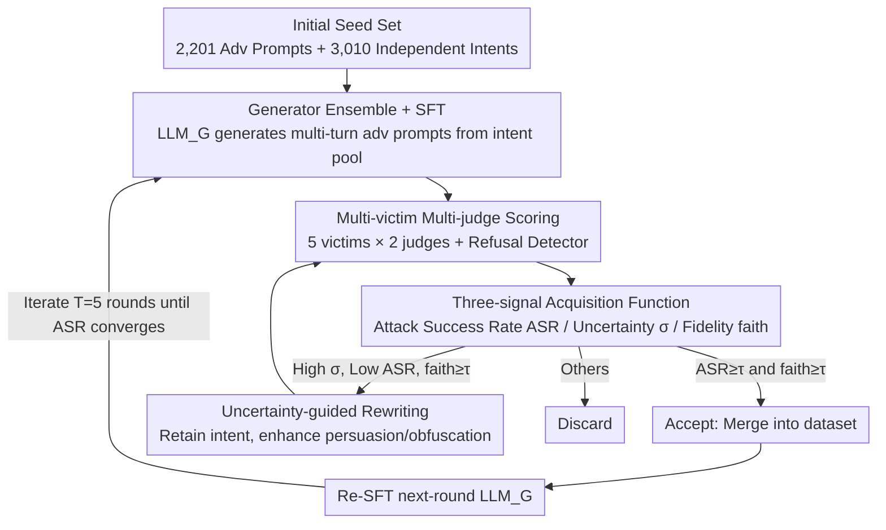

# MultiBreak: A Scalable and Diverse Multi-turn Jailbreak Benchmark for Evaluating LLM Safety

**Conference**: ICML 2026  
**arXiv**: [2605.01687](https://arxiv.org/abs/2605.01687)  
**Code**: None  
**Area**: AI Security / LLM Evaluation  
**Keywords**: Multi-turn jailbreak, jailbreak benchmark, active learning, uncertainty-guided, LLM redteaming

## TL;DR
MultiBreak utilizes an iterative framework of "active learning + uncertainty-guided rewriting" to expand a multi-turn jailbreak dataset to 10,389 conversations and 2,665 independent harmful intents. With a diversity score of 0.942, it significantly outperforms previous works and increases ASR on DeepSeek-R1-7B / GPT-4.1-mini by 54% / 34.6% respectively compared to the next best dataset.

## Background & Motivation

**Background**: The mainstream approach for evaluating LLM safety alignment involves constructing jailbreak datasets to force LLMs into generating non-compliant content under adversarial prompts. While single-turn jailbreaks (GCG, PAIR, HarmBench, etc.) are relatively mature, they often disconnect from real-user interactions. Research is shifting toward multi-turn jailbreaks (Crescendo, MRJ-Agent, CoSafe, MHJ, SafeDialBench, RedQueen) that bypass safety guardrails through gradual escalation or benign framing.

**Limitations of Prior Work**: Existing multi-turn jailbreak benchmarks are either small in scale (CoSafe 1.4k, MHJ 537, SafeDialBench 2k) or rely on template replication (RedQueen expands 1.4k intents to 56k using 40 templates), both of which make "diversity" a bottleneck. Even after deduplication with Qwen3-0.6B embeddings, at best only 76% of intents are truly independent, leading to evaluation results that are sensitive to minor prompt perturbations and inconsistent across different LLMs.

**Key Challenge**: There is an inherent contradiction between expanding scale and maintaining diversity—human annotation is high quality but expensive; automated LLM generation is cheap but prone to "mode collapse" (repeatedly generating similar attacks); furthermore, safety-aligned LLMs often refuse to generate harmful content.

**Goal**: (1) Scale the multi-turn jailbreak dataset by an order of magnitude without quality degradation; (2) Systematically cover a broader taxonomy of harmful intents without relying on template replication; (3) Reveal which categories are secure in single-turn settings but high-risk in multi-turn scenarios.

**Key Insight**: The authors reframe "benchmark construction" as pool-based active learning: starting from a large pool of harmful intents, iteratively fine-tune an attack generator $\to$ evaluate on multiple victims/judges $\to$ use an acquisition function to categorize samples into accept / rewrite / discard $\to$ use an uncertainty-guided rewriter to recover "marginally successful" samples.

**Core Idea**: Use an acquisition function + rewriting to amplify high-value training signals from samples where the model is "uncertain," resulting in an adversarial prompt set that is both diverse and possesses high ASR.

## Method

### Overall Architecture
MultiBreak addresses the core contradiction of expanding a multi-turn jailbreak dataset by an order of magnitude without collapsing diversity. The authors reframe "benchmark construction" as a pool-based active learning problem: first, aggregate a deduplicated initial seed set; then, let an attack generator continuously produce multi-turn adversarial prompts on an unlabeled pool of harmful intents. After joint scoring by multiple victims and judges, an acquisition function diverts samples (Accept / Rewrite / Discard). Accepted samples are fed back to fine-tune the generator for the next round. This cycle continues for several iterations until ASR converges. The process is driven by the model's own "uncertain samples" as high-value signals, achieving both high ASR and high diversity.

### Key Designs

**1. Three-signal Acquisition Function: Deciding to Accept, Rewrite, or Discard**

This serves as the "router" of the active learning loop. If samples were selected only based on ASR, the generator would quickly overfit to a few effective patterns, causing mode collapse. If selected only based on uncertainty, significant noise would be introduced. Thus, three signals are calculated across a grid of multiple victims × multiple judges: 
- Attack Success Rate $\text{ASR}(q_{adv})=\frac{1}{|\mathcal V||\mathcal J|}\sum_V\sum_J J(q_{adv},V(q_{adv}))$ measures if the attack is stable (exploit).
- Uncertainty $\sigma(q_{adv})=\text{Std}_{V,J}\, J(q_{adv},V(q_{adv}))$ measures the variance in scores across victim-judge pairs to locate "marginal but informative" samples (explore).
- Fidelity $\text{faith}(q,q_{adv})=\cos(\text{Enc}(q),\text{Enc}(q_{adv}))$ uses Qwen3-0.6B embeddings to calculate semantic similarity between the original intent $q$ and the adversarial prompt $q_{adv}$ to prevent topic drift. 
The decision $\alpha(q_{adv})$ is: **Accept** if ASR $\ge\tau_h$ and faith $\ge\tau_f$; **Rewrite** if $\sigma\ge\tau_\sigma$, ASR $<\tau_h$, and faith $\ge\tau_f$; otherwise **Discard**.

**2. Generator Ensemble + SFT rather than prompting: Breaking Safety Alignment Guardrails**

Directly prompting a safety-aligned LLM to generate harmful content often results in repeated refusals or disloyal outputs (failure modes in Fig. 3). On Mistral-7B-Instruct, prompting yields only 2% ASR, while full-parameter SFT increases this to 25%, showing that fine-tuning is key to bypassing guardrails. The authors use an ensemble of LLaMA3-8B-Instruct + Qwen2.5-7B-Instruct (Full SFT) + DeepSeek-Distill-Qwen-14B (LoRA) as $\text{LLM}_G$. Combining different model families further reduces the risk of the generator biasing toward a single attack paradigm. Notably, the rewriter $\text{LLM}_R$ uses an un-tuned Qwen2.5-7B because it only reads $q_{adv}$ and not the original $q$, avoiding safety triggers and reducing fine-tuning costs.

**3. Multi-victim Multi-judge De-biasing + Uncertainty-guided Rewriting: Extracting Signals from Model Disagreements**

Single judges exhibit consistency biases, misjudging samples that succeed on some models but fail on others. The authors utilize LLaMA Guard + GPT-4o-mini as dual judges, combined with a keyword-based refusal detector. Samples caught by the refusal detector are discarded immediately, while others provide an uncertainty estimate $\sigma$. Instead of discarding "low ASR + high $\sigma$" marginal samples, they are sent to the rewriter with instructions to "retain harmful intent, clarify vague expressions, and strengthen persuasion/obfuscation." This "pulls" samples from conflict zones into success zones—verified by the significant drop in $\sigma$ after rewriting (Fig. 4). This replaces human annotation in traditional active learning with "automated rewriting + verification," extracting additional signals more efficiently than purely generating new data.

### Loss & Training
The generator utilizes standard SFT loss for fine-tuning, while the rewriter remains un-tuned (instruction prompting). The judge side uses majority voting between dual judges and hard filtering via the refusal detector. Multi-turn lengths for adversarial prompts are randomly sampled $n\sim\text{Uniform}(2,6)$. The initial seed set contains $|Q_{adv}^{(0)}|=2{,}201$ multi-turn prompts and $|Q|=3{,}010$ independent harmful intents (deduplicated via Qwen3-0.6B and filtered for false harmfuls via closed-source victims). In each round, accepted samples are merged into the dataset $\mathcal D^{(t+1)}=\mathcal D^{(t)}\cup\mathcal S_{\text{accept}}$ before the next $\text{LLM}_G^{(t+1)}$ is fine-tuned. ASR converges after approximately $T=5$ iterations.

## Key Experimental Results

### Main Results
Table 1 (Dataset Comparison): MultiBreak features 2-6 turns, 10,389 samples, 2,665 independent intents, and a diversity of 0.942. Comparisons: CoSafe (1,400/961/0.843), MHJ (537/406/0.810), SafeDialBench (2,037/1,078/0.762), RedQueen (56k template-based/656/0.680).

Table 2 (ASR, judge: LG=LLaMA Guard / GPT=GPT-4o-mini):

| Dataset | DeepSeek-7B (LG/GPT) | Qwen3-8B | LLaMA3.1-8B | Gemini-2.5-FL | GPT-4.1-mini |
|--------|----------------------|----------|-------------|---------------|--------------|
| CoSafe @1 | 0.127 / 0.235 | 0.079/0.340 | 0.063/0.456 | 0.059/0.557 | 0.019/0.552 |
| MHJ @1 | 0.293 / … | … | … | … | … |
| **MultiBreak** | **Significant Lead** | (+54% on DeepSeek, +34.6% on GPT-4.1-mini relative to next best) |

### Ablation Study

| Configuration | Impact | Explanation |
|------|------|------|
| Full pipeline (5 iter) | ASR 50%+ | Qwen victim + LLaMA generator. |
| Initial $\mathcal D_0$ only | 10.77% | 4.47/3.77 pp higher than CoSafe/RedQueen. |
| SFT without active learning | 25% | Stronger than prompting but much lower than active learning. |
| Prompting without SFT | 2% | Safety-aligned LLMs repeatedly refuse. |
| Without rewrite | ASR / Diversity drop | Critical marginal information is lost. |
| Without multi-victim/judge | Judge bias | ASR becomes unstable. |

### Key Findings
- **Iterative Monotonicity of Active Learning**: ASR rose from 10% to over 50% within 5 iterations, and $\sigma$ decreased after each rewrite, confirming the acquisition function effectively "mines" informative samples.
- **Transferability**: Vulnerabilities exposed by an attack generator fine-tuned on small open-source models transfer to large closed-source models like GPT-4.1-mini and Gemini-2.5-Flash-Lite.
- **Turn-based Vulnerability**: Harmful categories that appear safe in single-turn settings show significantly higher ASR in multi-turn settings, indicating that the weak points of LLM safety guardrails differ across turn lengths.

## Highlights & Insights
- **Dataset Construction as Active Learning**: A natural but previously unsystematized perspective. The three-way acquisition function (accept/rewrite/discard) is clean and transferable to any "data generation + hard example utilization" task (e.g., RLHF preference data, code repair).
- **Uncertainty as Rewriting Opportunity**: Replaces the expensive human-in-the-loop requirement of traditional active learning with "LLM rewriting + validation," maximizing sample efficiency at zero human cost.
- **Isolation of the Rewriter**: Identifying that safety-aligned LLMs refuse based on intent $q$, the authors design the rewriter to only see $q_{adv}$, cleverly bypassing refusal without additional fine-tuning costs.

## Limitations & Future Work
- Intent labels rely on judge LLMs (LG + GPT-4o-mini) and rule-based detectors, which may have false positives/negatives; final ASR metrics are dependent on judge quality.
- Experiments are primarily in English; the scalability of multi-lingual multi-turn jailbreaking is unverified.
- The dataset is double-edged—while useful for safety research, it also lowers the barrier for constructing large-scale jailbreak attacks.
- High computational requirements for 5 iterations of ensemble evaluation and SFT.

## Related Work & Insights
- **vs RedQueen (Jiang 2024)**: RedQueen uses 1.4k intents × 40 templates, resulting in low token diversity. MultiBreak expands independent intents (2,665 vs 656) via active learning.
- **vs CoSafe / MHJ / SafeDialBench**: These benchmarks are limited to the thousand-sample scale with narrow category coverage. MultiBreak leads in both scale and diversity.
- **Single-turn vs Multi-turn**: This work provides the first systematic evidence that many categories appearing safe in single-turn evaluations are far more vulnerable in multi-turn scenarios, arguing for a mandatory shift in LLM safety evaluation protocols.

## Rating
- Novelty: ⭐⭐⭐⭐ Active learning + uncertainty rewriting is a fresh approach for jailbreak benchmarks.
- Experimental Thoroughness: ⭐⭐⭐⭐⭐ Covers 5 victims and 2 judges with cross-dataset baselines and multi-dimensional analysis.
- Writing Quality: ⭐⭐⭐⭐ Clear framework diagrams and concise notation.
- Value: ⭐⭐⭐⭐⭐ An immediately useful resource for the safety evaluation community; the method is adaptable to other data expansion tasks.

<!-- RELATED:START -->

## Related Papers

- [\[ICLR 2026\] EchoMind: An Interrelated Multi-level Benchmark for Evaluating Empathetic Speech Language Models](../../ICLR2026/audio_speech/echomind_an_interrelated_multi-level_benchmark_for_evaluating_empathetic_speech_.md)
- [\[ICML 2026\] MECAT: A Multi-Experts Constructed Benchmark for Fine-Grained Audio Understanding Tasks](mecat_a_multi-experts_constructed_benchmark_for_fine-grained_audio_understanding.md)
- [\[ICLR 2026\] Incentive-Aligned Multi-Source LLM Summaries](../../ICLR2026/audio_speech/incentive-aligned_multi-source_llm_summaries.md)
- [\[ICML 2026\] SafeSearch: Automated Red-Teaming of LLM-Based Search Agents](safesearch_automated_red-teaming_of_llm-based_search_agents.md)
- [\[ICML 2026\] Evaluating and Rewarding LALMs for Expressive Role-Play TTS via Mean Continuation Log-Probability](evaluating_and_rewarding_lalms_for_expressive_role-play_tts_via_mean_continuatio.md)

<!-- RELATED:END -->
