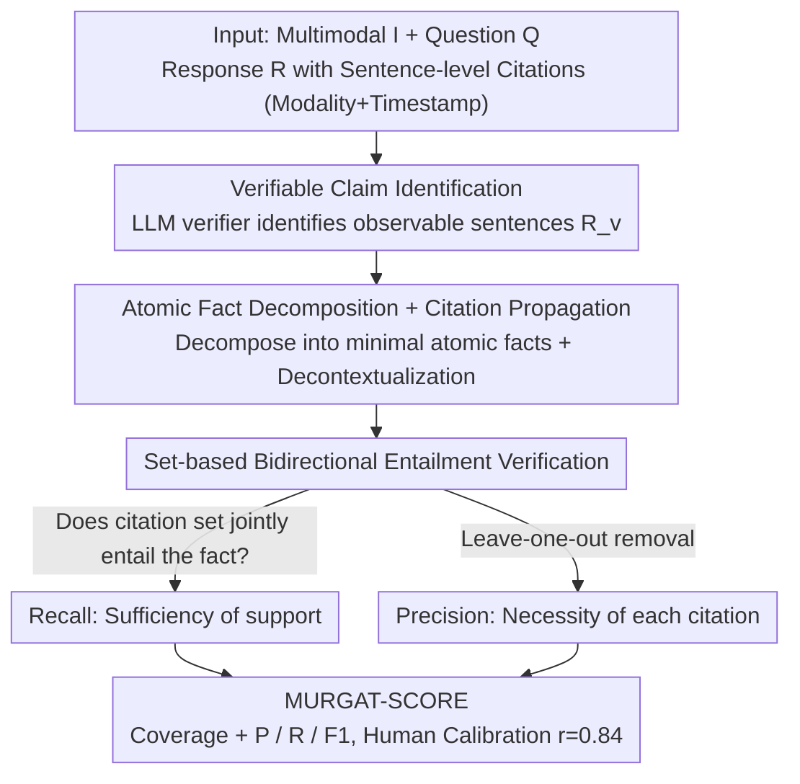

# Multimodal Fact-Level Attribution for Verifiable Reasoning

**Conference**: ICML 2026  
**arXiv**: [2602.11509](https://arxiv.org/abs/2602.11509)  
**Code**: [github.com/meetdavidwan/murgat](https://github.com/meetdavidwan/murgat)  
**Area**: Multimodal VLM / Verifiable Reasoning / Evaluation  
**Keywords**: Multimodal Attribution, Citation Quality Evaluation, Atomic Fact Decomposition, MURGAT-SCORE, Reasoning-Citation Decoupling

## TL;DR
MURGAT is the first benchmark to evaluate the ability of MLLMs to provide "precise modality + timestamp citations at a factual granularity" in multimodal reasoning outputs. It employs a three-step evaluation protocol (Verifiable Claim Identification → Atomic Fact Decomposition → Attribution Quality) and an automated evaluator, MURGAT-SCORE, which achieves high human alignment (Pearson 0.84). The study reveals that strong models often produce hallucinated citations even when answers are correct, and that enhanced reasoning often comes at the cost of verifiable citations.

## Background & Motivation

**Background**: MLLMs are increasingly utilized for real-world tasks involving multi-step reasoning and long-form responses (e.g., video QA, medical reports, educational demonstrations). Reliable deployment requires "traceability"—where every factual claim can be mapped back to a specific modality and time segment of the input. While existing works address text attribution (Gao 2023b) and temporal grounding in videos (Hendricks 2017, Lei 2021), they focus on simple observational or retrieval-based scenarios ("where does X appear").

**Limitations of Prior Work**: (1) Existing evaluations typically measure only a single modality (vision) or operate at a coarse source-level (whole-video) granularity, failing to distinguish between "observable sentences" and "reasoning sentences," which allows models to score high even with incorrect timestamps. (2) Real-world tasks require joint attribution across heterogeneous modalities (video, audio, charts) and fine-grained assessment based on "atomic facts." (3) Mainstream "generate-then-attribute" pipelines often sacrifice reasoning quality for citation quality.

**Key Challenge**: There is a disconnection between internal latent reasoning processes and verifiable surface citations in MLLMs. Longer reasoning paths often make the final citations harder to track, while stricter citation requirements can stifle complex reasoning capabilities.

**Goal**: (1) Construct a fine-grained multimodal attribution benchmark that distinguishes between "observation vs. reasoning"; (2) Provide an automated evaluator with high human alignment to make large-scale benchmarking affordable; (3) Systematically characterize the relationships between reasoning effort, model scale, attribution strategies, and final attribution quality.

**Key Insight**: Responses are processed in three layers: citations are required only for observable sentences, sentences are decomposed into atomic facts for precision/recall evaluation, and modalities and time segments are explicitly distinguished. This allows the decoupling of "reasoning quality" and "attribution quality" for independent assessment, exposing their underlying trade-offs.

**Core Idea**: Verifiable multimodal attribution evaluation is restructured into a three-stage pipeline: "Sentence-level filtering → Atomic fact decomposition + Citation propagation → Set-based precision/recall entailment verification." An MLLM-as-judge is used to select the optimal automated evaluator, which is then calibrated against human judgment.

## Method

### Overall Architecture
The objective is to measure, at an "atomic fact" level, whether an MLLM accurately cites the correct modality and time segment for every factual claim when performing multi-step reasoning on video, audio, or charts. MURGAT decomposes this into a three-stage evaluation pipeline: an LLM verifier identifies "directly observable sentences," these are decomposed into minimal independent atomic facts with propagated citations, and finally, a bidirectional entailment check calculates Recall (sufficiency of citations to support the fact) and Precision (necessity of each citation). The input consists of multimodal input $I$, question $Q$, and response $R=\{r_i\}$, where each verifiable sentence $r_i$ includes a citation set $C_i = \{c_i^j\}$ specifying a modality and timestamp (e.g., `(audio, 0:42-0:46)`).

### Key Designs

**1. Verifiable Claim Identification: Separating Observation from Reasoning**

Traditional attribution evaluations treat all sentences equally. This either forces models to invent citations for reasoning sentences, damaging reasoning quality, or unfairly penalizes reasoning sentences that cannot be attributed. Worse, models can "game" the system by omitting citations on reasoning sentences. MURGAT uses an LLM verifier to determine if each sentence $r_i$ is directly observable from input $I$, yielding a set of verifiable sentences $R_v = \{r_i \in R \mid \text{Verifier}(r_i, I) = \text{True}\}$. For example, "The video defines thrust as forward (audio 0:42, visual 0:45)" is observable and kept, whereas "Therefore, this claim is incorrect" is a reasoning conclusion and discarded. Subsequent precision/recall are calculated only on the set of cited verifiable sentences $R_{vc} = \{r_i \in R_v \mid C_i \neq \emptyset\}$, completely decoupling reasoning and citation quality.

**2. Atomic Fact Decomposition + Citation Propagation + Decontextualization**

Evaluating at the sentence level leads to inaccurate scores for compound sentences that are partially correct. MURGAT utilizes an LLM decomposer to break each $r_i \in R_{vc}$ into atomic facts $\{a_i^1, \ldots, a_i^n\}$, where each is a "minimal, independently verifiable" claim. Decontextualization resolves pronouns to specific entities (following FActScore, Min 2023). Sentence-level citations $C_i$ are then propagated to all atomic facts from that sentence, forming pairs $\{(a_i^j, C_i)\}$ for evaluation. This preserves context while avoiding the unrealistic demand for MLLMs to generate atomic-level citations during inference.

**3. Set-based Bidirectional Entailment + MURGAT-SCORE Calibration**

To verify if citations are sufficient and necessary, MLLM judges determine if the set $C_i$ jointly entails $a_i^j$ (Recall). If entailed, a "leave-one-out" test is performed by removing citations $c_i^k$ individually to check if each is strictly necessary (Precision). This prevents models from "citation stuffing" to inflate recall. Modality and timestamp alignment are central to this multimodal protocol. The MURGAT-S metric integrates coverage $= |R_{vc}|/|R_v|$ with precision, recall, and F1. To ensure reliability, the authors collected human annotations on WorldSense and Video-MMMU, scanning multiple MLLMs as judges (Gemini-2.5-Flash, Gemini-3-Flash/Pro, Qwen3-Omni-Instruct/Thinking), ultimately selecting an ensemble with Pearson $r=0.84$.

### Loss & Training
This work does not train models but constructs an evaluation protocol. MURGAT-SCORE is the metric itself. The paper explores an inference-time decoupling strategy—allowing the model to reason freely before extracting citations separately—which improves MURGAT-S by +9.6 at the cost of answer accuracy, illustrating a systemic trade-off.

## Key Experimental Results

### Main Results
Evaluations on WorldSense + Video-MMMU across various strong MLLMs.

| Model | QA Accuracy | MURGAT-S | Observations |
| :--- | :--- | :--- | :--- |
| Gemini-3-Pro | High | High | Large model + more thinking → more accurate citations |
| Gemini-2.5-Flash | Medium | Medium | Correct answers but citations often wrong or missing |
| Qwen3-Omni-Instruct | Medium | Low | Basic instruction version has mediocre citation quality |
| Qwen3-Omni-Thinking | Slight Incr. | Decrease | Small model + more thinking → messier citations |
| Decoupled Pipeline | Slight Decr. | +9.6 | Systematic trade-off observed |

### Ablation Study

| Configuration | Key Finding | Description |
| :--- | :--- | :--- |
| W/O Verifiable Claim ID | Reasoning sentences penalized | Distorts precision/recall |
| W/O Atomic Decomposition | Unfair sentence-level scores | Partially correct compound sentences scored too high |
| W/O Citation Leave-one-out | Precision becomes invalid | Models cheat recall by using redundant citations |
| Judge: GPT-4o-mini | $r=0.59$ | Significantly worse than the optimal ensemble |
| Judge: Gemini-3-Pro + Calib. | $r=0.84$ | Final setting for MURGAT-S |

### Key Findings
- **"Reasoning Tax"**: Requiring citations in simple recognition tasks decreases QA accuracy, but in complex reasoning tasks, it can act as a scaffold by forcing the model to refine its reasoning chain.
- **Scale and Effort Interaction**: Gemini-3-Pro shows gains in MURGAT-S with increased thinking budget; however, smaller models (e.g., Qwen3-Omni-Thinking) tend to "drift" during longer reasoning, suggesting a disconnect between latent reasoning and surface citations.
- **Hallucinated Grounding**: Even when QA is correct, strong models show high citation error rates, indicating that "knowing the answer" and "knowing where the evidence is" are distinct capabilities in MLLMs.

## Highlights & Insights
- **Explicit Separation**: Distinguishing "verifiable vs. reasoning" sentences redefines attribution evaluation, establishing a new paradigm that avoids unfair penalties on reasoning steps.
- **Atomic-level Multimodal Citations**: Successfully extends the FActScore concept to multimodality (requiring specific modalities and timestamps) while using leave-one-out checks to ensure citation precision.
- **Human-Aligned MURGAT-SCORE**: The $r=0.84$ correlation makes automated evaluation credible, and the multi-judge calibration method is transferable to other MLLM-as-judge scenarios.

## Limitations & Future Work
- The protocol relies heavily on LLM verifiers/decomposers/judges, which may introduce internal biases despite human calibration.
- Datasets are primarily limited to WorldSense and Video-MMMU; scalability to other domains (e.g., medical imaging, lab reports) remains to be verified.
- No training-side solution is proposed; while the "decoupled pipeline" shows a trade-off, systematic training for accurate multimodal attribution remains an open problem.
- Citation precision depends on the granularity of human-provided segments; fuzzy factual boundaries may introduce noise into precision metrics.

## Related Work & Insights
- **vs. MCiteBench / MAVIS**: These focus on image-level VQA or document evidence with single modalities and coarse granularity. MURGAT mandates dual modality/timestamp tags and includes audio/charts.
- **vs. MIRAGE**: MIRAGE uses atomic decomposition and VLM verification for multimodal RAG, finding that models often misattribute evidence. MURGAT’s protocol is finer (verifiable vs. reasoning) and operates at the timestamp level.
- **vs. Video Temporal Grounding (Hendricks 2017, Lei 2021)**: Traditional grounding assumes the target segment is specified in the prompt; MURGAT requires the model to self-select evidence during reasoning.
- **vs. FActScore (Min 2023)**: The atomic decomposition is inspired by FActScore but extended to multimodal contexts with bidirectional citation set validation.

## Rating
- Novelty: ⭐⭐⭐⭐⭐ First complete loop for multimodal factual attribution separating verifiable and reasoning claims.
- Experimental Thoroughness: ⭐⭐⭐⭐ Covers various strong models and reasoning efforts, though dataset variety is somewhat limited.
- Writing Quality: ⭐⭐⭐⭐⭐ The protocol is presented intuitively, with clear definitions and examples.
- Value: ⭐⭐⭐⭐⭐ Provides critical infrastructure for the study of verifiable and trustworthy MLLM deployment.

<!-- RELATED:START -->

## Related Papers

- [\[AAAI 2026\] PSA-MF: Personality-Sentiment Aligned Multi-Level Fusion for Multimodal Sentiment Analysis](../../AAAI2026/audio_speech/psa-mf_personality-sentiment_aligned_multi-level_fusion_for_multimodal_sentiment.md)
- [\[ACL 2026\] When Misinformation Speaks and Converses: Rethinking Fact-Checking in Audio Platforms](../../ACL2026/audio_speech/when_misinformation_speaks_and_converses_rethinking_fact-checking_in_audio_platf.md)
- [\[ICLR 2026\] Beyond Instance-Level Alignment: Dual-Level Optimal Transport for Audio-Text Retrieval](../../ICLR2026/audio_speech/beyond_instance-level_alignment_dual-level_optimal_transport_for_audio-text_retr.md)
- [\[ICML 2026\] JAEGER: Joint 3D Audio-Visual Grounding and Reasoning in Simulated Physical Environments](jaeger_joint_3d_audio-visual_grounding_and_reasoning_in_simulated_physical_envir.md)
- [\[ICML 2026\] Multimodal Fusion via Self-Consistent Task-Gradient Fields](multimodal_fusion_via_self-consistent_task-gradient_fields.md)

<!-- RELATED:END -->
