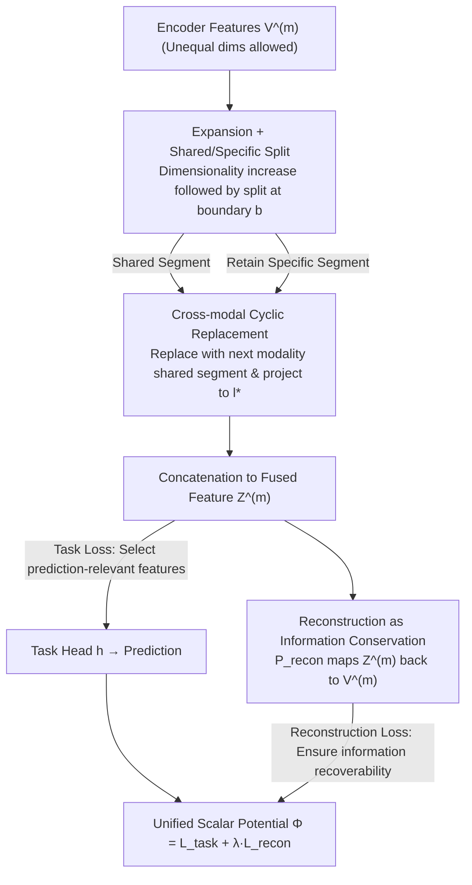

# Multimodal Fusion via Self-Consistent Task-Gradient Fields

**Conference**: ICML 2026  
**arXiv**: [2410.15475](https://arxiv.org/abs/2410.15475)  
**Code**: To be confirmed  
**Area**: Multimodal VLM / Multimodal Fusion / Optimization  
**Keywords**: Self-Consistent Field, Task Gradients, Multimodal Fusion, Autoencoder, Missing Modality

## TL;DR
SCFAE reformulates the multimodal fusion block as a "Self-Consistent Field" (SCF) composed of "task loss + reconstruction loss." By partitioning each modality's features into "shared/specific" subspaces and cyclically replacing shared components across modalities, it ensures that task gradients backpropagate cleanly to each encoder. Consequently, it achieves higher robustness than strongly coupled or heavily regularized fusion methods across three scenarios: unequal input lengths, modal conflict, and missing modalities.

## Background & Motivation

**Background**: Current mainstream multimodal fusion methods follow two paradigms: Coupled (e.g., Cross-Attention, Coupled Mamba, AdaMMS), which aggressively mix features from various modalities to form joint representations, and Decoupled (e.g., MISA, DrFuse, DLF), which separate features into independent subspaces using auxiliary objectives such as mutual information minimization, contrastive loss, or orthogonality constraints.

**Limitations of Prior Work**: The authors shift the perspective from "representation quality" to "gradient pathways." Coupled fusion introduces functional dependencies between multiple encoders in the forward pass; the absence of any modality causes the shared gradient pathway to collapse, rendering the remaining encoders ineffective. Decoupled fusion utilizes auxiliary losses to pull encoder parameters, but these secondary objectives often conflict with the main task gradient direction, effectively placing competing forces on the encoder. Furthermore, nearly all coupled designs require modalities to be aligned to identical dimensions before fusion. Long-sequence modalities (e.g., 4096-d video vs. 128-d images) must be compressed before entering the fusion block, directly discarding available information.

**Key Challenge**: The fusion block simultaneously functions as an "information coupler" and a "gradient distributor." Existing methods disrupt the feedback loop while pursuing representation quality—gradients are either entangled (coupled) or pulled astray by auxiliary losses (decoupled). The result follows the Information Conservation Principle (Jiang et al. 2023): "No matter how sophisticated the fusion, it cannot recover information that was not extracted initially."

**Goal**: Design a fusion module that satisfies two criteria: (i) maintaining clear optimization pathways to ensure task gradients are directly fed back to each feature extractor; (ii) isolating modal-specific information into independent subspaces to minimize inter-modal mutual information, thereby maintaining robustness against missing inputs.

**Key Insight**: The authors draw an analogy to the Self-Consistent Field (SCF) from computational chemistry/electrochemistry (specifically the Poisson–Nernst–Planck equations). SCF describes a feedback loop where the "field depends on the system state, and the state is reshaped by the field." Multiple forces (drift, diffusion) maintain coherence by sharing a single scalar potential function $\Phi$, preventing conflict. By likening multimodal features to "particle distributions," the task loss acts as the drift force pushing features toward prediction-relevant regions, while the reconstruction loss acts as the diffusion force maintaining feature separability; both share a unified objective function.

**Core Idea**: Construct a single scalar potential $\Phi = L_{\mathrm{task}} + \lambda L_{\mathrm{recon}}$ using "task loss + reconstruction loss" components. This is paired with an autoencoder architecture featuring "expansion $\rightarrow$ shared/specific split $\rightarrow$ cross-modal cyclic replacement of shared components $\rightarrow$ reconstruction to original features." This allows feature organization to emerge naturally from the gradient of a unified objective rather than being enforced by auxiliary losses.

## Method

### Overall Architecture
SCFAE addresses the issue of fusion blocks disrupting task gradient feedback loops. It reformulates fusion as a single scalar potential $\Phi = L_{\mathrm{task}} + \lambda L_{\mathrm{recon}}$, allowing the shared/specific organization of features to emerge naturally via the gradient of a single objective. It acts as a plug-and-play fusion block $g(\cdot)$, leaving the pre-encoders $f^{(m)}$ and post-task head $h$ unchanged. Given $M$ modal features $\{V_i^{(m)} \in \mathbb{R}^{l^{(m)}}\}$ with potentially unequal dimensions, it learns four mapping networks (expansion, shared, specific, reconstruction) per modality using SwiGLU + Linear. Features are expanded and then split into shared and specific segments. The shared segments are cyclically interchanged between modalities before being reassembled into fused features for the task head. Simultaneously, a reconstruction mapping pushes the fused features back to the original encoder outputs—task loss drives prediction-relevant signals into shared segments via the exchange link, while reconstruction loss ensures no information is discarded.

### Key Designs

**1. Expansion + Shared/Specific Splitting: Creating Geometric Redundancy for Decoupling**

Each modal feature $V_i^{(m)}$ is first projected into a higher-dimensional space $n l^{(m)}$ via $\mathbf{P}_{\mathrm{expand}}^{(m)}$, then split at a pre-specified boundary $b^{(m)}$ into a shared segment $\hat Z_{i,\mathrm{shared}}^{(m)} \in \mathbb{R}^{b^{(m)}}$ and a specific segment $\hat Z_{i,\mathrm{specific}}^{(m)} \in \mathbb{R}^{n l^{(m)} - b^{(m)}}$. The key challenge is that splitting without expansion causes segments to compete for capacity in the original representation space, leading to incomplete decoupling. The "geometric redundancy" provided by expansion allows shared and specific components to displace each other. Crucially, the boundary $b^{(m)}$ is a structural hyperparameter (defaulting to a uniform $b = 0.5$) rather than a learning objective. Extracting the decision of "how much capacity to allocate" from the optimization process into a structural prior eliminates optimization conflicts, which is the prerequisite for the SCF framework to function without auxiliary losses.

**2. Cross-modal Cyclic Replacement of Shared Components: Forcing Consistent Signals through Interchangeability**

Defining $k = (m+1) \bmod M$, the shared segment of modality $m$ is replaced with that of the next modality $k$, and then projected to a unified dimension $l^*$ (the minimum of all modal dimensions). The specific segment is retained and projected back to the original dimension $l^{(m)}$, finally forming $Z_i^{(m)} = [Z_{i,\mathrm{specific}}^{(m)}; Z_{i,\mathrm{shared}}^{(m)}]$. This step is the "self-consistent" core: each modality is reorganized with evidence from another, yet must still satisfy the task head without performance degradation. This forces the system such that "interchange only avoids harming prediction if the shared segments of A and B both capture truly consistent cross-modal information." When task gradients backpropagate through this exchange link, they naturally push consistent cross-modal patterns into shared segments and noise into specific segments without requiring mutual information estimation or contrastive losses. This instantiates the SCF abstraction $\phi = \mathcal{F}[c],\ \partial c / \partial t = \mathcal{G}[\phi]$ within the fusion block.

**3. Reconstruction Constraint as Information Conservation: Recoverability without Competing for Gradient Direction**

A mapping $\mathbf{P}_{\mathrm{recon}}^{(m)}$ is learned for each modality to project the reorganized $Z_i^{(m)}$ back to the original encoder output $V_i^{(m)}$, with the loss defined by cosine similarity: $\mathcal{L}_{\mathrm{recon}} = \sum_{m=1}^M \mathrm{Sim}(V_i^{(m)}, \mathbf{P}_{\mathrm{recon}}^{(m)} Z_i^{(m)})$. The authors identify this as the "diffusion force," analogous to the diffusion term in PNP equations that maintains concentration gradients and prevents particle collapse. It does not dictate how features should decouple; it simply mandates that "all information must be recoverable." Consequently, the network cannot "cheat" by discarding a difficult modality to achieve separation. The essential difference from auxiliary supervisions like mutual information lower bounds or contrastive loss is that reconstruction only constrains "information recoverability" (a physical property) and does not compete with the task loss in the semantic alignment direction. Thus, the two gradients are naturally compatible under the shared potential $\Phi$.

### Loss & Training
The complete objective is the single scalar potential $\Phi = L_{\mathrm{task}} + \lambda L_{\mathrm{recon}}$. $L_{\mathrm{task}}$ primarily shapes the shared subspace (determining which cross-modal signals aid prediction), while $L_{\mathrm{recon}}$ organizes the specific subspace (ensuring unique modal information is not lost). Hyperparameters include the expansion factor $n$ (experiments show $n \geq 2$ is sufficient) and the shared boundary ratio $b$ (default $b^{(m)} = 0.5$). Training is conducted using PyTorch + Apex O1 on a single RTX 4090.

## Key Experimental Results

### Main Results: Three Challenging Scenarios

| Dataset | Task / Challenge | Metric | Prev. SOTA (AdaMMS) | SCFAE | Gain |
|--------|------------|------|--------------------|-------|------|
| ActivityNet 128-128 | Equal Length Image-Video Retrieval | mAP@10 | 0.358 | **0.363** | +0.5 |
| ActivityNet 4096-128 | **Unequal Length** Image-Video Retrieval | mAP@10 | 0.360 | **0.367** | +0.7 |
| FakeAVCeleb (Audio only) | Deepfake Detection / **Signal Conflict** | ACC | 93.45 | **95.74** | +2.29 |
| FakeAVCeleb (Visual only) | Same as above | ACC | 93.10 | **95.35** | +2.25 |
| FakeAVCeleb (AV, AUC) | Same as above | AUC | 98.25 | **98.70** | +0.45 |
| CMU-MOSEI (Avg. 7 missing combos) | Sentiment Analysis / **Missing Modality** | ACC/F1 | 80.1/80.8 | **80.3/81.1** | +0.2/+0.3 |
| CMU-MOSEI {a} only | Audio only case | ACC/F1 | 67.2/69.0 | **69.3/71.0** | +2.1/+2.0 |

The gain in unequal length scenarios is larger than in equal length cases, validating that "reconstruction constraints preserve video information otherwise lost to dimensional alignment." Significant improvements in single-modality classification for FakeAVCeleb prove that SCFAE maintains single-modality separability. The advantage of SCFAE is most pronounced in audio-only/visual-only MOSEI scenarios, indicating it prevents weak modalities from being "gradient-hijacked" by the dominant text modality.

### Ablation Study: Damage to Encoders by Fusion Training (Tab. 6, FakeAVCeleb)

Measured by "how much a single encoder's performance drops after joint training" ($\Delta$ closer to 0 is better):

| Fusion Strategy (VideoMAE V2-S + WavLM-B) | Audio Δ ACC | Visual Δ ACC | Audio Δ AUC | Visual Δ AUC |
|---|---|---|---|---|
| Cross-Attention (4 layers) | -0.42 | -7.54 | -0.28 | -10.08 |
| Mutual Info. Min. | -0.85 | -3.10 | -0.61 | -3.92 |
| Contrastive Constraints | -1.12 | -2.63 | -0.74 | -2.80 |
| **SCFAE (Ours)** | **-0.08** | **-0.88** | **-0.04** | **-0.83** |

The trend is consistent across both VideoMAE V2-S + WavLM-B and R(2+1)D + ResNetSE backbones—Cross-Attention degrades the Visual encoder ACC by nearly 10 points, while SCFAE limits the damage to less than 1 point. This table provides the strongest evidence for the "gradient pathway protection" hypothesis.

### Key Findings
- **Coupled Cross-Attention is the primary killer of encoder quality**: Across all three backbone combinations, it causes the visual encoder to drop 6–12 AUC points when probed individually. While decoupled methods with auxiliary losses (MI Min/Contrastive) perform better, they still lose 3–6 points. SCFAE reduces this damage to <1 point.
- **Unequal inputs become an advantage for SCFAE**: Transitioning from 128-128 to 4096-128, almost all baselines show no significant gain or even slight declines. Only the SCFAE series improves from 0.363 to 0.367, proving that "no forced alignment + reconstruction for information preservation" effectively utilizes additional signals from long sequences.
- **Gains are largest in partial modality scenarios (MOSEI)**: In the absence of text, SCFAE outperforms the second-best baseline by 2 points in ACC/F1. However, when all modalities are present, the lead is only 0.2 points—this suggests the primary benefit of SCFAE lies not in the "comfort zone" where strong modalities are present, but in extreme scenarios where non-dominant modalities must perform independently.
- **Hyperparameter Insensitivity**: Performance saturates at expansion factor $n \geq 2$, and a split boundary of $b = 0.5$ is sufficient. This makes it more engineering-friendly than contrastive loss methods that rely heavily on temperature coefficients and loss weights.

## Highlights & Insights
- **Elevating "Gradient Pathways" to a First-Class Citizen**: While previous fusion papers focused on representation purity or alignment, this work shifts back upstream—fusion blocks are not just information couplers but gradient distributors. This explains why complex fusion methods often perform worse than simple concatenation regarding single-modality separability.
- **Encoding Constraints Structurally rather than via Loss**: The SCF/PNP philosophy suggests sharing a single potential function $\Phi$ for different optimization forces. Consequently, the reconstruction term is not an "external auxiliary supervision" but originates from the same source as the task loss, preventing gradient cancellation.
- **Cyclic Replacement of Shared Components is an Underrated Trick**: Compared to explicit mutual information estimation, replacing modal shared segments is a structural constraint that forces the capture of cross-modal consistency without complex negative sampling or temperature tuning.
- **Portability**: SCFAE does not modify encoders; it is a parameter-light fusion block that can be plugged into any "dedicated encoder + fusion + task head" pipeline, making it ideal for medical imaging, asynchronous sensors, or high-interpretability scenarios.

## Limitations & Future Work
- The method was validated on three medium-scale benchmarks; its stability and convergence dynamics in large-scale foundation models (e.g., ImageBind, CLIP-scale training) remain to be verified.
- The boundary $b^{(m)}$ defaults to 0.5, but modal information density is naturally uneven (e.g., text >> audio in MOSEI); uniform allocation may not be optimal. The authors do not systematically discuss adaptive $b^{(m)}$ based on modal capacity.
- Cyclic replacement $k = (m+1) \bmod M$ is a simple ring permutation. Whether this chain-like self-consistency remains effective for a large number of modalities ($M \geq 5$) is an open question.
- Reconstruction uses cosine similarity, which is insensitive to magnitude. Tasks where magnitude itself is a signal (e.g., power spectra, distance regression) might require L2 or contrastive reconstruction.

## Related Work & Insights
- **vs. Cross-Attention / Coupled Mamba**: These rely on explicit cross-modal attention for functional dependence. In contrast, SCFAE's shared segments are replaced to ensure "only truly consistent cross-modal signals survive," avoiding entanglement and preserving single-modality separability.
- **vs. MISA / DrFuse / DLF (Decoupling with auxiliary loss)**: These use mutual information minimization or orthogonal constraints. SCFAE uses "reconstruction as information conservation," which only constrains physical recoverability, ensuring natural compatibility with task loss and avoiding gradient conflict.
- **vs. Perceiver / ImageBind (End-to-end foundation models)**: These feed raw inputs into a unified Transformer, mixing extraction and fusion. SCFAE follows the "extract $\rightarrow$ fuse $\rightarrow$ predict" route, suitable for scenarios with strong dedicated encoders or a need for interpretable modal contributions.
- **vs. MMIN / IMDer (Missing modality completion)**: These explicitly model the generation of missing modalities. SCFAE instead ensures non-dominant modalities "remain organized" via reconstruction forces, allowing them to remain effective during testing even when used alone.

## Rating
- Novelty: ⭐⭐⭐⭐ Using the SCF/PNP physical analogy to rephrase multimodal fusion is a fresh perspective, and cyclic replacement is a rare structural decoupling design.
- Experimental Thoroughness: ⭐⭐⭐⭐ Covers three typical challenge scenarios with sufficient baselines. Tab. 6 provides hard, diagnostic evidence of encoder damage. However, it lacks validation on large-scale foundation models.
- Writing Quality: ⭐⭐⭐⭐ Clear motivation regarding "gradient distribution," and the physical analogy is well-integrated.
- Value: ⭐⭐⭐⭐ Clarifies the often-overlooked principle of "gradient pathway protection." The method is parameter-efficient, plug-and-play, and hyperparameter-insensitive.

<!-- RELATED:START -->

## Related Papers

- [\[ICLR 2026\] Scalable Multilingual Multimodal Machine Translation with Speech-Text Fusion](../../ICLR2026/audio_speech/scalable_multilingual_multimodal_machine_translation_with_speech-text_fusion.md)
- [\[ICML 2026\] A Semantically Consistent Dataset for Data-Efficient Query-Based Universal Sound Separation](a_semantically_consistent_dataset_for_data-efficient_query-based_universal_sound.md)
- [\[ICML 2026\] Sparse Tokens Suffice: Jailbreaking Audio Language Models via Token-Aware Gradient Optimization](sparse_tokens_suffice_jailbreaking_audio_language_models_via_token-aware_gradien.md)
- [\[AAAI 2026\] PSA-MF: Personality-Sentiment Aligned Multi-Level Fusion for Multimodal Sentiment Analysis](../../AAAI2026/audio_speech/psa-mf_personality-sentiment_aligned_multi-level_fusion_for_multimodal_sentiment.md)
- [\[NeurIPS 2025\] Resounding Acoustic Fields with Reciprocity](../../NeurIPS2025/audio_speech/resounding_acoustic_fields_with_reciprocity.md)

<!-- RELATED:END -->
