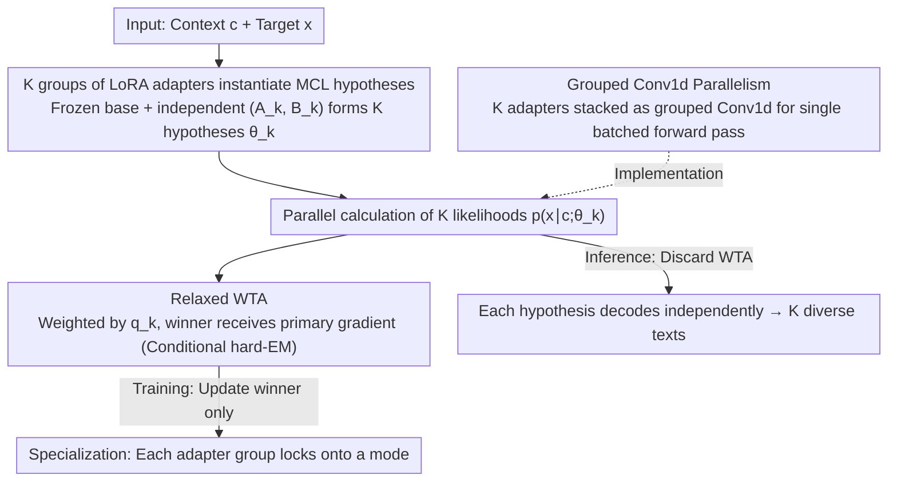

# Multiple Choice Learning of Low-Rank Adapters for Language Modeling

**Conference**: ICML 2026  
**arXiv**: [2507.10419](https://arxiv.org/abs/2507.10419)  
**Code**: https://github.com/Victorletzelter/LoRA-MCL (Available)  
**Area**: LLM Efficiency / PEFT / Diverse Decoding  
**Keywords**: LoRA, Multiple Choice Learning, Winner-Takes-All, Diverse Generation, Mixture Distributions

## TL;DR
This paper introduces LoRA-MCL, which integrates the "winner-takes-all" training paradigm of Multiple Choice Learning into LoRA fine-tuning. By treating $K$ groups of low-rank adapters as $K$ competing hypotheses and updating only the most suitable adapter for each training sample, the method enables a single base model to generate multiple diverse and reasonable text outputs covering different modes of the conditional distribution in a single forward pass. It refreshes the quality–diversity Pareto front across audio/image captioning and machine translation tasks.

## Background & Motivation

**Background**: In "one-to-many" tasks such as audio/image captioning and machine translation, the target distribution $p(x\mid c)$ for a given context $c$ is typically multimodal (e.g., an image can be described in both English and French; an audio clip can have different event labels). Current large models almost exclusively use Maximum Likelihood Estimation (MLE/teacher forcing) for next-token training, relying on inference-side strategies like Beam Search, Diverse Beam Search (DBS), and nucleus sampling to "artificially" foster diversity.

**Limitations of Prior Work**: MLE minimization on a mixture distribution $p(x)=\sum_k p(z_k)p(x\mid z_k)$ collapses to a weighted average rather than recovering individual modes. Inference-side DBS requires manual tuning of the diversity penalty $\lambda$ and often forces a trade-off between diversity and quality. Techniques like TTA or temperature sampling are either unstable or degrade readability.

**Key Challenge**: The training objective itself lacks a concept of "modes." All diversity patches are posterior remedies at inference, treating symptoms rather than the root cause. To enable models to "naturally" output multiple valid candidates, diversity must be embedded within the training objective.

**Goal**: (1) Adapt the Multiple Choice Learning (MCL) multi-hypothesis training paradigm to next-token language modeling; (2) Resolve two critical bottlenecks of MCL on large models—parameter explosion of multiple heads and training collapse to a single hypothesis; (3) Theoretically prove that this training recovers modes of mixture distributions instead of collapsing to an average; (4) Validate the quality–diversity trade-off on real large-scale models.

**Key Insight**: The authors observe that while classic MCL uses "shared backbone + multiple output heads," duplicating an LLM's `lm_head` (e.g., ~640M parameters for Qwen2-Audio) $K$ times is infeasible. LoRA provides the ability to "cheaply replicate a model"—one only needs to add a set of rank-$r$ adapters $A_k, B_k$ per layer, while all hypotheses share the frozen base.

**Core Idea**: Use $K$ groups of LoRA adapters instead of $K$ output heads, paired with a relaxed Winner-Takes-All loss, allowing each adapter group to automatically specialize in one mode of the target distribution.

## Method

### Overall Architecture
The core problem LoRA-MCL addresses is how to separate the multiple modes of the target distribution during the training phase of a single LLM. It grafts the "multi-hypothesis competition" idea of Multiple Choice Learning onto LoRA. For each LoRA-enabled layer $\ell$, $K$ sets of adapters $\{(A_\ell^k, B_\ell^k)\}_{k=1}^K$ are prepared. With frozen base parameters $\theta$, the $k$-th "hypothesis model" is defined as $\theta_k = \theta \cup \{(A_\ell^k, B_\ell^k)\}_\ell$. During training, likelihoods $p(x\mid c;\theta_k)$ are calculated in parallel for all $K$ hypotheses, and a Winner-Takes-All (WTA) loss is used to backpropagate gradients only to the most suitable hypothesis. This process is equivalent to a conditional hard-EM: the E-step selects the winner $k^\star=\arg\max_k p(x\mid c;\theta_k)$, and the M-step updates only $\theta_{k^\star}$. During inference, the WTA is discarded, and each hypothesis independently decodes a candidate, producing $K$ texts covering different modes in one forward pass.

### Key Designs

**1. Instantiating MCL Hypotheses with K LoRA Adapters: Circumventing Head Replication**

Classic MCL uses a "shared backbone + $K$ output heads," but replicating the LLM `lm_head` is unaffordable, and training new heads from scratch destroys pre-trained knowledge. The key observation is that LoRA's low-rank residual channels are "cheap model clones." By adding rank-$r$ matrices $(A_\ell^k, B_\ell^k)$ at each layer, base semantics are preserved while adapters provide directions for modal specialization. The extra parameters for $K$ hypotheses (approx. $K \times L \times 2dr$) are negligible compared to the base $|\theta|$. The training objective applies the MCL WTA loss to next-token modeling: $\mathcal{L}^{\mathrm{WTA}} = -\mathbb{E}_{c,x}[\max_{k}\log p(x\mid c;\theta_k)]$. Theoretical proof (Prop. 1) shows that when data comes from a finite mixture and the model is sufficiently expressive, LoRA-MCL is equivalent to conditional hard-EM, converging to the conditional entropy $\mathcal{H}(x\mid c,z)$, which is strictly lower than MLE. The lower bound $\min \mathcal{L}(\theta) - \log K \le \min \mathcal{L}^{\mathrm{WTA}}(\theta)$ characterizes the information gain from multiple hypotheses.

**2. Relaxed WTA: Solving Training Collapse with Relaxed-WTA and Annealed-MCL**

Hard WTA suffers from "the rich get richer" effect: if one hypothesis is slightly better early on, it wins consistently, and others never receive gradients, leading to a single collapsed model. This is solved by softening WTA: $\mathcal{L}^{\mathrm{WTA}} = -\mathbb{E}_{c,x}[\sum_k q_k \log p(x\mid c;\theta_k)]$. Two methods for $\{q_k\}$ are proposed. **Relaxed-WTA** gives the winner $q_{k^\star}=1-\varepsilon$ and distributes $\varepsilon/(K-1)$ to others. It is stable, though too large an $\varepsilon$ reduces diversity. **Annealed-MCL** uses softmax weights $q_k(x,c;\uptau)=p(x\mid c;\theta_k)^{1/\uptau}/Z$ with temperature annealing $\uptau(t)=\uptau(0)\rho^t$. High temperatures prevent early collapse, while low temperatures allow convergence to hard WTA for pure specialization.

**3. Grouped Convolution Parallelism: Folding K Forwards into One**

A naive implementation requires $K$ sequential forward passes, scaling training time linearly with $K$. This work leverages PyTorch's grouped convolutions to fold multi-hypothesis LoRA into a single batched operation. The input is replicated $K$ times along the batch dimension, and $K$ sets of $(A_\ell^k, B_\ell^k)$ are stacked. This is equivalent to a grouped `nn.Conv1d` (groups=$K$) in the LoRA path, while the frozen base forward is naturally shared. Since $r \ll d$, the parameter overhead is minimal, and the extra cost is primarily the $K$-fold increase in activations. This engineering foundation allows LoRA-MCL training costs to align with standard LoRA rather than $K \times$ LoRA, enabling experiments on 7B–8B models.

### Loss & Training
The final training objective is relaxed WTA: $\mathcal{L}^{\mathrm{WTA}}(\theta_1,\dots,\theta_K)=-\mathbb{E}_{c,x}\big[\sum_{k=1}^{K} q_k \log p(x\mid c;\theta_k)\big]$. For LoRA configuration, adapters are injected into $Q, K, V$ and FFN matrices across all Transformer layers, with rank $r=8$, scaling $\alpha=8$ (32 for vision), and $K\in\{3,5,7\}$. Models are trained for 1 epoch (AudioCaps) or 10 epochs (Clotho) on Qwen2-Audio, and 1 epoch on LLaVA-1.6. During MAP decoding (greedy/Beam Search/DBS), to ensure computational fairness, if LoRA-MLE uses beam size $B$, each LoRA-MCL hypothesis uses $B/K$.

## Key Experimental Results

### Main Results

| Dataset | Metric | Best LoRA-MLE | Best LoRA-MoE | LoRA-MCL ($K=3$, BS=1) | Gain |
| :--- | :--- | :--- | :--- | :--- | :--- |
| TextCaps (Image) | SPIDEr ↑ | 0.915 (DBS λ=1.0) | 0.926 (DBS λ=1.0) | **0.955** | +0.029 |
| TextCaps | mBLEU-4 ↓ | 0.416 | 0.421 | 0.520 | Lower (worse) than DBS |
| AudioCaps (Audio) | Test Loss ↓ | 2.181 ($r=8{\times}5$) | – | **1.999** ($K=5$) | −0.18 |
| Clotho | Test Loss ↓ | 2.812 ($r=8$) | – | **2.612** ($K=7$) | −0.20 |
| Syn. Bilingual (FR) | SPIDEr ↑ | 0.411 | – | **0.464** | +0.053 |
| Syn. Bilingual (FR) | mBLEU-4 ↓ | 0.138 | – | **0.027** | −0.111 |

Note: In image captioning, LoRA-MCL shows slightly lower diversity (higher mBLEU-4) than DBS but significantly stronger SPIDEr/CIDEr scores. The authors note that DBS can be combined with LoRA-MCL to get both benefits.

### Ablation Study

| $K$ (LoRA-MCL, $\varepsilon=0.05$) | AudioCaps Test Loss ↓ | Clotho Test Loss ↓ |
| :--- | :--- | :--- |
| LoRA-MLE Single ($r=8$) | 2.203 | 2.812 |
| LoRA-MLE ($r=8\times3$, equal params) | 2.195 | 2.868 |
| LoRA-MLE ($r=8\times7$, equal params) | 2.182 | 2.935 |
| LoRA-MCL, $K=3$ | 2.063 | 2.663 |
| LoRA-MCL, $K=5$ | 1.999 | 2.643 |
| LoRA-MCL, $K=7$ | **1.932** | **2.612** |

### Key Findings
- **Gains are not from parameter count**: Increasing the rank of LoRA-MLE to $r=8K$ yields minimal improvements (2.18→2.18 on AudioCaps), while LoRA-MCL with the same total parameters reduces loss by over 0.2, proving the gain stems from multi-hypothesis specialization.
- **Monotonic loss decrease with $K$**: In line with Prop. 1 and the lower bound $\min\mathcal{L}-\log K$, loss decreases as $K$ increases and does not saturate up to $K=7$.
- **Strong specialization in bilingual experiments**: In a $K=2$ LoRA-MCL setup with French-translated samples, the winner for French samples falls on head 1 ~89% of the time, and on head 2 ~97% of the time for English. MLE collapses to an average strategy, often entering loops in French.
- **Toy Markov chain validation**: Under a mixture of two Markov chains, MLE converges to a weighted average transition matrix $\bar P$, while LoRA-MCL hypotheses recover the two original matrices, validating the collapse formula in the theory.

## Highlights & Insights
- **LoRA as a "cheap MCL head" is a brilliant paradigm shift**: MCL has suffered from parameter explosion for a decade. Using LoRA's low-rank residual channels as lightweight clones bypasses the impossibility of duplicating the `lm_head` while preserving pre-trained knowledge.
- **Robust Coupling of Theory and Experiment**: Prop. 1 provides a conditional entropy lower bound and hard-EM equivalence. The toy Markov chain quantitatively visualizes the "MLE collapse" and "MCL mode recovery," which is then mirrored in real LLM experiments on bilingual data.
- **Grouped Convolution Parallelism is key for deployment**: By resolving the $K\times$ training speed bottleneck, the authors make LoRA-MCL practically viable for 7B–8B scale models.
- **High Generalizability**: This training paradigm (K LoRA + relaxed WTA) can be applied to any PEFT-friendly base model for language specialization, diverse implementational styles in code generation, or varying reward preferences in alignment.

## Limitations & Future Work
- Hyperparameters for Relaxed-WTA ($\varepsilon$) and Annealed-MCL schedules are fixed; adaptive adjustments based on data distribution could be explored.
- In image captioning, LoRA-MCL diversity (mBLEU-4) still trails DBS+LoRA-MLE, suggesting training-side diversity hasn't fully captured the potential; combining both is suggested.
- The number of hypotheses $K$ is a given prior; a data-driven mechanism to select $K$ to match the "true number of modes" is currently missing.
- Experiments are limited to the fine-tuning stage; extending this to pre-training could mitigate the single-failure mode of current LLMs.

## Related Work & Insights
- **vs. Classic MCL (Lee 2016 / Rupprecht 2017)**: Classic MCL uses shared backbones with multiple heads and hard WTA. This work adapts the paradigm to LLMs by using multiple LoRA sets and relaxed WTA, solving both parameter and training efficiency issues.
- **vs. LoRA-MoE (Wu 2024 / Li 2024)**: MoE also uses multiple LoRAs but remains anchored to the MLE objective, focusing on computational sparsity via gating. Experts are often redundant with weak diversity. LoRA-MCL explicitly encourages specialization through WTA, outperforming LoRA-MoE in experiments (SPIDEr 0.955 vs 0.926).
- **vs. Diverse Beam Search / TTA**: These are inference-side diversity patches decoupled from the training objective. LoRA-MCL moves the source of diversity into the training objective's modal priors, yielding a superior quality–diversity Pareto front.

## Rating
- Novelty: ⭐⭐⭐⭐ Mapping MCL to LoRA is an intuitive but previously unexplored combination that elegantly solves head replication issues.
- Experimental Thoroughness: ⭐⭐⭐⭐ Covers toy models, audio/image captioning, and translation across $K\in\{1,3,5,7\}$. Lacks combinations with recent LoRA variants like DoRA/AdaLoRA.
- Writing Quality: ⭐⭐⭐⭐ Clear derivation of motivation; strong alignment between Prop. 1 and toy experiments; reproducible engineering details.
- Value: ⭐⭐⭐⭐ Provides a fundamental "diverse by training" paradigm for LLM fine-tuning, applicable to any task requiring multiple candidate outputs.

<!-- RELATED:START -->

<!-- RELATED:END -->

## Related Papers

- [\[ACL 2026\] Multimodal In-Context Learning for ASR of Low-Resource Languages](../../ACL2026/audio_speech/multimodal_in-context_learning_for_asr_of_low-resource_languages.md)
- [\[ICML 2026\] Algorithmic Recourse of In-Context Learning for Tabular Data](algorithmic_recourse_of_in-context_learning_for_tabular_data.md)
- [\[ICLR 2026\] TASTE: Text-Aligned Speech Tokenization and Embedding for Spoken Language Modeling](../../ICLR2026/audio_speech/taste_text-aligned_speech_tokenization_and_embedding_for_spoken_language_modelin.md)
- [\[ICML 2025\] FLAM: Frame-Wise Language-Audio Modeling](../../ICML2025/audio_speech/flam_frame-wise_language-audio_modeling.md)
- [\[NeurIPS 2025\] A Multi-Task Benchmark for Abusive Language Detection in Low-Resource Settings](../../NeurIPS2025/audio_speech/a_multitask_benchmark_for_abusive_language_detection_in_lowr.md)

<!-- RELATED:END -->
