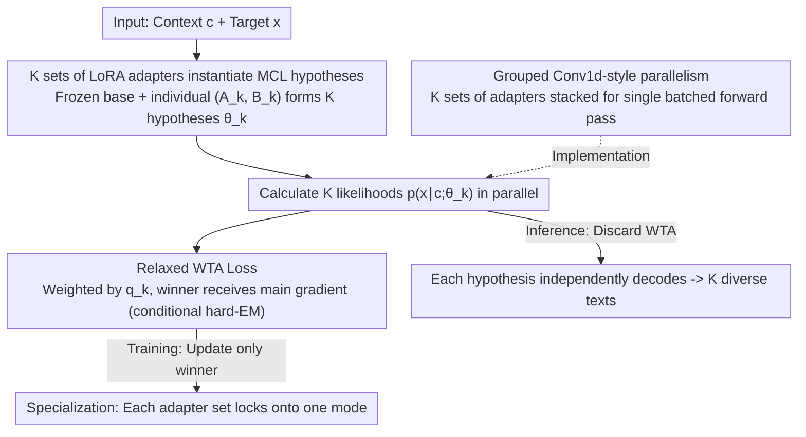

# Multiple Choice Learning of Low-Rank Adapters for Language Modeling

**Conference**: ICML 2026  
**arXiv**: [2507.10419](https://arxiv.org/abs/2507.10419)  
**Code**: https://github.com/Victorletzelter/LoRA-MCL (Available)  
**Area**: LLM Efficiency / PEFT / Diverse Decoding  
**Keywords**: LoRA, Multiple Choice Learning, Winner-Takes-All, Diverse Generation, Mixture Distribution

## TL;DR
This paper introduces LoRA-MCL, which integrates the "Winner-Takes-All" training paradigm of Multiple Choice Learning into LoRA fine-tuning. By treating $K$ sets of low-rank adapters as $K$ competing hypotheses and updating only the most suitable adapter for each training sample, a single base model can generate multiple diverse and plausible texts covering different modes of the conditional distribution in a single forward pass. It achieves a new Pareto frontier for quality-diversity in audio/image captioning and machine translation.

## Background & Motivation

**Background**: In "one-to-many" tasks such as audio/image captioning and machine translation, the target distribution $p(x\mid c)$ for a given context $c$ is typically multimodal (e.g., an image can have descriptions in both English and French; an audio clip can have different event labels). Current large models almost exclusively use Maximum Likelihood Estimation (MLE / teacher forcing) for next-token training, relying on inference-time decoding strategies like Beam Search, Diverse Beam Search (DBS), and nucleus sampling to "manually" induce diversity.

**Limitations of Prior Work**: Minimizing MLE on a mixture distribution $p(x)=\sum_k p(z_k)p(x\mid z_k)$ collapses the model to a weighted average rather than recovering individual modes. Inference-side DBS requires manual tuning of the diversity penalty $\lambda$ and often necessitates a choice between diversity and quality. Techniques like TTA and temperature sampling are either unstable or degrade readability.

**Key Challenge**: The training objective itself lacks the concept of "modes," and all diversity patches are post-hoc fixes at inference time, addressing the symptoms rather than the cause. To enable a model to "naturally" output multiple plausible candidates, diversity must be embedded into the training objective.

**Goal**: (1) Adapt the Multiple Choice Learning (MCL) paradigm to next-token language modeling; (2) Resolve the two major bottlenecks of MCL in large models—parameter explosion of multiple heads and training collapse to a single hypothesis; (3) Theoretically prove that this training can recover the modes of a mixture distribution rather than collapsing to an average; (4) Validate the quality-diversity trade-off on real-world large models.

**Key Insight**: The authors observe that the classic MCL approach involves a "shared backbone + multiple output heads." However, replicating the `lm_head` of an LLM (e.g., ~640 million parameters for Qwen2-Audio) $K$ times is impractical. LoRA provides an efficient way to "replicate the model" by simply adding $K$ sets of rank $r$ adapters ($A_k, B_k$) per layer while sharing the frozen base parameters.

**Core Idea**: Replace $K$ output heads with $K$ sets of LoRA adapters combined with a relaxed Winner-Takes-All loss, allowing each set of adapters to automatically specialize in a specific mode of the target distribution.

## Method

### Overall Architecture
The core problem LoRA-MCL addresses is how to disentangle multiple modes of the target distribution during training. It prepares $K$ sets of adapters $\{(A_\ell^k, B_\ell^k)\}_{k=1}^K$ for each LoRA-enabled layer $\ell$. With frozen base parameters $\theta$, the $k$-th "hypothetical model" is defined as $\theta_k = \theta \cup \{(A_\ell^k, B_\ell^k)\}_\ell$. During training, likelihoods $p(x\mid c;\theta_k)$ are calculated for all $K$ hypotheses, and a Winner-Takes-All (WTA) loss backpropagates gradients only to the most suitable hypothesis. This process is equivalent to a conditional hard-EM: the E-step selects the winner $k^\star=\arg\max_k p(x\mid c;\theta_k)$, and the M-step updates only $\theta_{k^\star}$. During inference, the WTA is discarded, and each hypothesis independently decodes a candidate, producing $K$ texts covering different modes in one forward pass.

### Key Designs

**1. Instantiating MCL Hypotheses via K LoRA Adapters: Avoiding Head Replication**

Classic MCL uses a "shared backbone + $K$ output heads," but LLM `lm_heads` are massive, and training new heads from scratch destroys pre-trained knowledge. The key observation is that LoRA's low-rank residual paths serve as "cheap model clones." By adding $K$ sets of $(A_\ell^k, B_\ell^k)$ matrices per layer, the base semantics are preserved while the adapters provide mode-specific specialization. The additional parameter count is $K \times L \times 2dr$, which is negligible relative to $|\theta|$. Training follows the WTA loss: $\mathcal{L}^{\mathrm{WTA}} = -\mathbb{E}_{c,x}[\max_{k}\log p(x\mid c;\theta_k)]$. Prop. 1 theoretically guarantees that when data comes from a finite mixture and the model is sufficiently expressive, LoRA-MCL maximizes information gain, bounded by $\min \mathcal{L}(\theta) - \log K \le \min \mathcal{L}^{\mathrm{WTA}}(\theta)$.

**2. Relaxed WTA: Solving Training Collapse via Relaxed-WTA and Annealed-MCL**

Hard WTA can lead to "winner-takes-all" collapse where one hypothesis dominates early and others never receive gradients. The solution is a softened WTA using normalized weights: $\mathcal{L}^{\mathrm{WTA}} = -\mathbb{E}_{c,x}[\sum_k q_k \log p(x\mid c;\theta_k)]$. 
Two strategies for $\{q_k\}$ are proposed:
- **Relaxed-WTA**: The winner receives $q_{k^\star}=1-\varepsilon$, and others split $\varepsilon/(K-1)$ (typically $\varepsilon \in [0.05, 0.1]$).
- **Annealed-MCL**: Uses a temperature-based soft assignment $q_k(x,c;\uptau)=p(x\mid c;\theta_k)^{1/\uptau}/Z$, where temperature $\uptau$ is annealed from high (uniform updates) to low (hard WTA specialization).

**3. Grouped Convolution Parallelism: Batching K Hypotheses**

Naive implementation requires $K$ forward passes, increasing training time linearly. This work leverages PyTorch's grouped operations by replicating the input $K$ times and stacking $K$ adapters into a single tensor. This is equivalent to a `nn.Conv1d` grouped variant (groups=$K$), where each input group interacts only with its corresponding weight group. Since $r \ll d$, the overhead is mainly in activation memory rather than computation, allowing LoRA-MCL to scale to 7B–8B models efficiently.

### Loss & Training
The final training objective is relaxed WTA: $\mathcal{L}^{\mathrm{WTA}}(\theta_1,\dots,\theta_K)=-\mathbb{E}_{c,x}\big[\sum_{k=1}^{K} q_k \log p(x\mid c;\theta_k)\big]$. For LoRA, adapters are injected into $Q, K, V$ and FFN matrices across all layers with rank $r=8$ and $\alpha=8$ (or $\alpha=32$ for vision). $K \in \{3, 5, 7\}$. Training takes 1 epoch (AudioCaps) or 10 epochs (Clotho) on Qwen2-Audio, and 1 epoch on LLaVA-1.6. During inference, for fair compute comparison, if LoRA-MLE uses beam size $B$, LoRA-MCL uses $B/K$ per hypothesis.

## Key Experimental Results

### Main Results

| Dataset | Metric | LoRA-MLE (Best) | LoRA-MoE (Best) | LoRA-MCL ($K=3$, BS=1) | Gain |
|--------|------|---------------|----------------|------------------------|------|
| TextCaps (Image) | SPIDEr ↑ | 0.915 (DBS λ=1.0) | 0.926 (DBS λ=1.0) | **0.955** | +0.029 |
| TextCaps | mBLEU-4 ↓ | 0.416 | 0.421 | 0.520 | Higher than DBS |
| AudioCaps (Audio) | Test loss ↓ | 2.181 ($r=8{\times}5$) | – | **1.999** ($K=5$) | −0.18 |
| Clotho | Test loss ↓ | 2.812 ($r=8$) | – | **2.612** ($K=7$) | −0.20 |
| Bilingual (French) | SPIDEr ↑ | 0.411 | – | **0.464** | +0.053 |
| Bilingual (French) | mBLEU-4 ↓ | 0.138 | – | **0.027** | −0.111 |

### Ablation Study

| $K$ (LoRA-MCL, $\varepsilon=0.05$) | AudioCaps Test loss ↓ | Clotho Test loss ↓ |
|---|---|---|
| LoRA-MLE Single ($r=8$) | 2.203 | 2.812 |
| LoRA-MLE ($r=8\times3$, equivalent params) | 2.195 | 2.868 |
| LoRA-MLE ($r=8\times7$, equivalent params) | 2.182 | 2.935 |
| LoRA-MCL, $K=3$ | 2.063 | 2.663 |
| LoRA-MCL, $K=5$ | 1.999 | 2.643 |
| LoRA-MCL, $K=7$ | **1.932** | **2.612** |

### Key Findings
- **Gains are not from parameters**: Increasing LoRA-MLE rank to $r=8K$ barely improves the AudioCaps test loss (2.18), whereas LoRA-MCL reduces it by >0.2 with the same parameters, showing the gain comes from hypothesis specialization.
- **Monotonic improvement with K**: Theoretical loss decreases with larger $K$, and experiments confirm that loss does not saturate up to $K=7$.
- **Strong specialization in bilingual tasks**: In a $K=2$ setup with French/English samples, ~89% of French samples were handled by head 1, and ~97% of English by head 2. MLE collapsed to an "average" strategy biased toward English.
- **Toy Markov chain verification**: Under mixed Markov chains, MLE converges to a weighted average transition matrix $\bar P$, while LoRA-MCL successfully recovers individual original matrices.

## Highlights & Insights
- **LoRA as a "Cheap MCL Head"**: This is an elegant paradigm shift. LoRA's low-rank paths naturally serve as lightweight model clones, bypassing the engineering hurdle of replicating the `lm_head` while preserving pre-trained knowledge.
- **Solid Theory-Experiment Coupling**: Prop. 1 provides a rigorous bound for conditional entropy. The transition from toy Markov chains to bilingual LLM experiments provides a standard roadmap for validating theoretical disentanglement in the real world.
- **Grouped Convolution Parallelism**: This is the key engineering factor for practical deployment. By aligning training costs with standard LoRA, the authors make MCL feasible for 7B–8B scale models.
- **Strong Transferability**: This training paradigm can be easily applied to any PEFT-compatible base model for multi-lingual translation, alignment (different reward preferences), or code generation.

## Limitations & Future Work
- Hyperparameters like $\varepsilon$ and temperature scheduling are fixed; adaptive adjustments based on data distribution could be explored.
- In image captioning, the diversity (mBLEU-4) of LoRA-MCL is slightly inferior to DBS+LoRA-MLE, suggesting training-side diversity can be combined with DBS for better results.
- The number of hypotheses $K$ is a fixed prior. A data-driven mechanism to select $K$ based on actual mode counts is missing.
- The experiments are focused on fine-tuning; extending this to pre-training is a potential direction.

## Related Work & Insights
- **vs. Classic MCL**: Classic MCL uses multiple heads and hard WTA; this work uses multiple LoRAs and relaxed WTA, making it feasible for LLMs.
- **vs. LoRA-MoE**: MoE uses multiple LoRAs but still optimizes via MLE and uses gating for sparse sample routing. LoRA-MCL explicitly encourages specialization through the competition objective. LoRA-MCL outperforming LoRA-MoE (SPIDEr 0.955 vs 0.926) validates this distinction.
- **vs. Diverse Beam Search / TTA**: These are inference-side "patches." LoRA-MCL shifts diversity into the training objective, leading to a better quality-diversity Pareto frontier.

## Rating
- Novelty: ⭐⭐⭐⭐ Mapping MCL to LoRA is intuitive yet previously unexplored; the combination is simple but effective with rigorous theoretical mapping.
- Experimental Thoroughness: ⭐⭐⭐⭐ Covers toy experiments, audio/image captioning, machine translation, and bilingual synthesis across various $K$ values.
- Writing Quality: ⭐⭐⭐⭐ Clear motivation, good synergy between Prop. 1 and toy experiments, and reproducible engineering details.
- Value: ⭐⭐⭐⭐ Provides a "diversity-by-design" training paradigm for LLMs, relevant for any task requiring multiple candidate outputs.

<!-- RELATED:START -->

## Related Papers

- [\[ACL 2026\] Multimodal In-Context Learning for ASR of Low-Resource Languages](../../ACL2026/audio_speech/multimodal_in-context_learning_for_asr_of_low-resource_languages.md)
- [\[ICML 2026\] Algorithmic Recourse of In-Context Learning for Tabular Data](algorithmic_recourse_of_in-context_learning_for_tabular_data.md)
- [\[ICLR 2026\] TASTE: Text-Aligned Speech Tokenization and Embedding for Spoken Language Modeling](../../ICLR2026/audio_speech/taste_text-aligned_speech_tokenization_and_embedding_for_spoken_language_modelin.md)
- [\[ICML 2026\] The Silent Thought: Modeling Internal Cognition in Full-Duplex Spoken Dialogue Models via Latent Reasoning](the_silent_thought_modeling_internal_cognition_in_full-duplex_spoken_dialogue_mo.md)
- [\[NeurIPS 2025\] A Multi-Task Benchmark for Abusive Language Detection in Low-Resource Settings](../../NeurIPS2025/audio_speech/a_multitask_benchmark_for_abusive_language_detection_in_lowr.md)

<!-- RELATED:END -->
