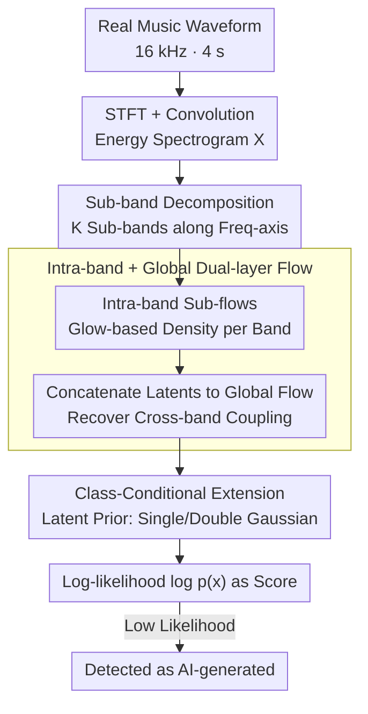

# MusicDET: Zero-Shot AI-Generated Music Detection

**Conference**: ICML 2026  
**arXiv**: [2605.18072](https://arxiv.org/abs/2605.18072)  
**Code**: https://github.com/Chaolei98/MusicDET (Available)  
**Area**: AI Security / AI-Generated Content (AIGC) Detection / Audio Forgery  
**Keywords**: AI-Generated Music Detection, Zero-Shot Detection, Normalizing Flows, Sub-band Decomposition, Likelihood Estimation

## TL;DR
MusicDET redefines "AI-Generated Music (AIGM) detection" as a zero-shot problem trained exclusively on real music. By employing sub-band decomposition, intra-band normalizing flows, and a global normalizing flow to learn the probability distribution of real music energy spectrograms, the model utilizes likelihood values as "authenticity scores." It reduces the average EER from ~17% to 4.51% (zero-shot) and 0.89% (with class-conditional priors) under cross-generator evaluation on FakeMusicCaps / SONICS.

## Background & Motivation
**Background**: AI-generated music (AIGM) is rapidly penetrating creation and distribution sectors, yet detection—as a reverse forensic direction—lags behind generation. Existing AIGM detectors (SpecTTTra, AASIST, MERT/W2V2-AASIST, WPT, etc.) mostly follow the discriminative paradigm of speech deepfake detection: training a binary classifier on both real and fake samples to capture specific artifacts left by particular generators.

**Limitations of Prior Work**: This discriminative paradigm achieves high accuracy in closed-set scenarios (same generator for training/testing) but suffers an EER drop to 30%+ when tested on unseen generators. Cross-family transfers (e.g., MusicGen → MusicLDM, Suno V3 → Udio 130) are largely ineffective. Engineering a separate detector for every emerging generator is impractical.

**Key Challenge**: Discriminative detection models "forgery" as "specific artifact distributions of a certain generator," essentially learning a library of generator fingerprints. However, "real music" is a stable and shared target, while "forgery" is an open, expanding set. Approximating an open set using the complement of a stable distribution inevitably leads to OOD generalization failure. Furthermore, speech deepfake detectors rely on low-level cues from voice conversion/TTS, which are unsuitable for music with complex melodies, harmonies, timbres, and rhythms.

**Goal**: Split the task into two sub-problems: ① Performing detection **without any generated samples in the training set** (closer to real-world deployment); ② Providing a unified framework independent of generators that generalizes to unseen models.

**Key Insight**: Experts identify AI music better than average listeners because they possess stronger priors of "what real music sounds like." This intuition is formalized by using normalizing flows to construct a precisely computable probability density $p_X(x)$ for real music, where forged samples naturally fall into low-likelihood regions.

**Core Idea**: Use sub-band decomposition + intra-band normalizing flows + global normalizing flows to perform one-class density estimation on time-frequency energy spectrograms, treating the log-likelihood $\log p_X(x)$ as the authenticity score.

## Method

### Overall Architecture
MusicDET addresses the detection problem by identifying unseen generators without exposure to forged samples during training. It treats the task as a one-class density estimation of real music: extracting time-frequency energy spectrograms from 16 kHz, 4s waveforms and using normalizing flows to learn the probability density $p_X(x)$. During inference, the log-likelihood $\log p_X(x)$ serves as the score; low likelihood indicates AI generation. To ensure stability on non-stationary music spectra, the framework slices the spectrogram into sub-bands, builds densities via intra-band sub-flows, and then recovers cross-band coupling via a global flow.

### Key Designs

**1. Sub-band Decomposition: Preventing Likelihood Collapse from Mixed Statistics**

Music spectra are highly non-stationary along the frequency axis—low frequencies contain rhythmic pulses and fundamental frequencies, while high frequencies contain timbre details and transients. Fitting a single flow to the entire spectrogram results in unstable density estimation due to multi-modal mixing, leading to high variance in $\log p_X$. MusicDET partitions the spectrogram into $K_b$ sub-bands $X = [X^{\text{low}}, X^{\text{high}}, \dots]$ (default $K_b=2$). This decomposes the complex problem into multiple nearly unimodal sub-distributions. This partitioning does not assume independence; cross-band dependencies are handled by the subsequent global flow.

**2. Intra-band + Global Dual-layer Flow: Balancing Detail and Structure**

MusicDET utilizes a dual-layer structure to capture both intra-band fine-grained patterns and cross-band global coupling. The first layer consists of Glow-style sub-flows $f_\theta^{\text{band}}: x^{\text{band}} \leftrightarrow h_K^{\text{band}}$, each comprising $K$ flow steps (ActNorm + invertible $1\times1$ convolution + affine coupling). The second layer concatenates the latent representations $h_K^{\text{band}}$ and processes them through a global flow $f_\theta^{\text{global}}$, projecting them to a latent Gaussian prior $p_Z(z) = \mathcal{N}(\mu_{\text{real}}, I)$. Since the transformation is bijective and the Jacobian is computable, the likelihood is:

$$\log p_X(x) = \log p_Z(f_\theta(x)) + \sum_j \log \left| \det J_{f_j} \right|$$

This "invertible + computable Jacobian" property allows $\log p_X(x)$ to be used directly for detection.

**3. Class-Conditional Extension: Unifying Zero-Shot and Supervised Settings**

When forged samples are available, MusicDET keeps the backbone fixed but changes the latent prior to a class-conditional double Gaussian $p_{Z|Y}(z|y) = \mathcal{N}(\mu_y, I)$, pushing real and fake classes toward $\mu_{\text{real}} = 5$ and $\mu_{\text{fake}} = -5$ respectively. Training minimizes the conditional NLL $-\mathbb{E}[\log p_{X|Y}(x|y)]$. Flow parameters $\theta$ are shared; class information is injected only via the prior mean. During inference, calculating **only** $\log p_X(x \mid y=\text{real})$ ensures that even seen AI samples fall into the low-likelihood region of the real prior.

### Loss & Training
Zero-shot setting: Minimize NLL of real music, $\min_\theta \mathbb{E}_{x \sim \mathcal{D}_{\text{real}}}[-\log p_X(x)]$. Class-conditional setting: Minimize conditional NLL, $\min_\theta \mathbb{E}_{(x,y) \sim \mathcal{D}_{\text{train}}}[-\log p_{X|Y}(x|y)]$. Hyperparameters: 10 epochs, Adam, lr $5 \times 10^{-4}$, batch 64, flow steps $K = 2$, sub-bands $K_b = 2$, prior mean $\mu_{\text{real}} = 5$. SpecAugment is used for time-frequency masking.

## Key Experimental Results

### Main Results
Cross-generator evaluation: training and testing subsets come from different AI generators. Average EER (lower is better).

**FakeMusicCaps (Mean EER across 5 TTM generators)**:

| Method | Zero-Shot | MusicGen | MusicLDM | AudioLDM2 | Stable Audio | Mustango | Avg EER ↓ |
|------|--------|----------|----------|-----------|--------------|----------|-------------|
| AASIST | ✗ | 31.13 | 32.91 | 28.04 | 33.64 | 37.93 | 32.73 |
| W2V2-AASIST† (Full FT) | ✗ | 7.78 | 20.87 | 2.87 | 6.66 | 19.13 | 11.46 |
| WPT-W2V2-AASIST | ✗ | 10.84 | 27.31 | 4.62 | 10.44 | 34.84 | 17.61 |
| SpecTTTra-α | ✗ | 11.60 | 31.45 | 7.24 | 10.29 | 27.56 | 17.63 |
| **MusicDET (Zero-Shot)** | ✓ | **5.64** | **6.55** | **2.36** | **3.82** | **4.18** | **4.51** |
| **Class-Conditional MusicDET** | ✗ | 1.67 | 0.15 | 0.22 | 2.40 | 0.04 | **0.89** |

Zero-shot MusicDET outperforms full fine-tuned W2V2-AASIST† (11.46) by ~7 points without seeing any forged samples.

**SONICS (Mean EER across Suno / Udio subsets)**:

| Method | Zero-Shot | Suno V2 | Suno V3 | Suno V3.5 | Udio 32 | Udio 130 | Avg EER ↓ |
|------|--------|---------|---------|-----------|---------|----------|-------------|
| W2V2-AASIST† | ✗ | 16.20 | 0.37 | 0.47 | 24.97 | 21.70 | 12.74 |
| Spec-ViT | ✗ | 0.43 | 0.50 | 0.44 | 3.80 | 1.00 | 1.23 |
| SpecTTTra-α | ✗ | 0.70 | 1.34 | 0.93 | 7.83 | 2.50 | 2.66 |
| **MusicDET (Zero-Shot)** | ✓ | 2.80 | 3.20 | 2.93 | 2.73 | 2.80 | **2.89** |
| **Class-Conditional MusicDET** | ✗ | 0.00 | 0.00 | 0.00 | 0.00 | 0.00 | **0.00** |

The zero-shot version maintains extreme consistency across subsets (EER 2.73–3.20), showing high robustness to generator choice.

### Ablation Study
**Efficiency Comparison**:

| Config | Inference (M/S) ↑ | FLOPs (G) ↓ | Mem (GB) ↓ | Params (M) ↓ | EER (%) ↓ |
|------|------------------|--------------|--------------|-------------|-----------|
| MERT-AASIST† | 173 | 73.20 | 3.68 | 315.88 | 15.64 |
| SpecTTTra-α | 810 | 2.85 | 0.33 | 16.83 | 17.63 |
| **MusicDET** | 516 | 4.09 | **0.11** | **8.13** | **4.51** |

**Leave-one-subdomain-out**: Training without "jazz" or "piano" subsets yielded EERs of 2.5% and 4.1% respectively, confirming that real music priors generalize across genres.

### Key Findings
- **Optimal Sub-bands/Depth**: Performance peaks at $K_b=2$ and $K=2$; larger values lead to overfitting.
- **Prior Mean $\mu_{\text{real}}$**: Crucial for performance; $\mu_{\text{real}}=5$ provides the best discriminative power.
- **Overfitting Avoidance**: Discriminative baselines show low diagonal EER but high off-diagonal EER (30–48%) in confusion matrices, whereas MusicDET remains near 0 everywhere.

## Highlights & Insights
- **Problem Reformulation**: Shifting from AIGM classification to zero-shot detection transfers the burden of open-set generalization to the problem definition—modeling the real distribution automatically creates immunity to unseen generators.
- **Factorized Flow**: Sub-band decomposition splits the multi-modal music distribution into manageable sub-distributions while maintaining precision through global coupling.
- **Efficiency**: With 8.13M parameters and 0.11GB memory usage, the model is significantly more deployment-friendly than fine-tuned foundation models like W2V2 (300M+).

## Limitations & Future Work
- **Limitations**: Only validated on 16 kHz, 4s segments; lacks modeling for long-term consistency (bar/phrase-level). High-quality human-indistinguishable AI music (e.g., Suno V4) requires further testing.
- **Technical Concerns**: Prior means ($\mu_{\text{real}}, \mu_{\text{fake}}$) are empirically set; normalizing flows might suffer likelihood collapse on extreme musical styles (noise, heavy reverb).
- **Future Directions**: Replacing the global flow with autoregressive flows to capture long-term dependencies; introducing conditional likelihoods based on genre/instrument.

## Related Work & Insights
- **vs SpecTTTra**: SpecTTTra is a typical discriminative method; it achieves 0.7% within a subset but fails (17.63%) across generators. MusicDET's zero-shot approach (4.51%) is intrinsically more robust.
- **vs Visual Anomaly Detection**: While visual anomaly detection often models pre-trained features via flows, MusicDET is the first to apply this to AIGM detection, specifically using sub-band decomposition to handle multi-modal frequency distributions.
- **vs Speech Deepfake Detection**: MusicDET's focus on physical musical properties makes it more generalizable, as evidenced by its strong performance on ASVspoof and CtrSVDD benchmarks.

## Rating
- Novelty: ⭐⭐⭐⭐⭐ First formulation of "Zero-Shot AIGM Detection"; novel use of dual-layer sub-band flows in audio forensics.
- Experimental Thoroughness: ⭐⭐⭐⭐ Extensive cross-generator and cross-task testing; lacking evaluations on very recent generators.
- Writing Quality: ⭐⭐⭐⭐ Clear motivation and concise formulation of the "detector vs classifier" boundary.
- Value: ⭐⭐⭐⭐⭐ Directs the community toward density estimation for open-set detection; lightweight and easy to reproduce.

<!-- RELATED:START -->

## Related Papers

- [\[ICML 2026\] Probing Token Spaces under Generator Shift in AI-Generated Music Detection](probing_token_spaces_under_generator_shift_in_ai-generated_music_detection.md)
- [\[ICML 2026\] Polyphonia: Zero-Shot Timbre Transfer in Polyphonic Music with Acoustic-Informed Attention Calibration](polyphonia_zero-shot_timbre_transfer_in_polyphonic_music_with_acoustic-informed_.md)
- [\[ICML 2026\] VocSim: A Training-Free Benchmark for Zero-Shot Content Identity Recognition for Single-Source Audio](vocsim_a_training-free_benchmark_for_zero-shot_content_identity_in_single-source.md)
- [\[ACL 2025\] Double Entendre: Robust Audio-Based AI-Generated Lyrics Detection via Multi-View Fusion](../../ACL2025/audio_speech/double_entendre_robust_audio-based_ai-generated_lyrics_detection_via_multi-view_.md)
- [\[ACL 2025\] ControlSpeech: Towards Simultaneous and Independent Zero-shot Speaker Cloning and Zero-shot Language Style Control](../../ACL2025/audio_speech/controlspeech_zero_shot.md)

<!-- RELATED:END -->
