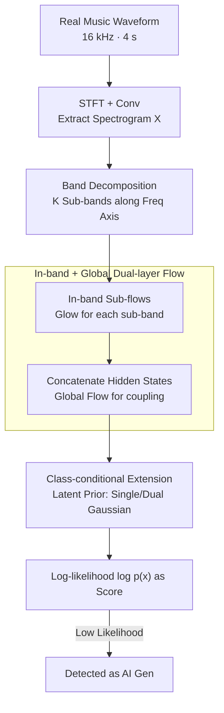

# MusicDET: Zero-Shot AI-Generated Music Detection

**Conference**: ICML 2026  
**arXiv**: [2605.18072](https://arxiv.org/abs/2605.18072)  
**Code**: https://github.com/Chaolei98/MusicDET (Available)  
**Area**: AI Safety / AI-Generated Content Detection / Audio Forgery  
**Keywords**: AI-generated music detection, zero-shot detection, normalizing flows, frequency band decomposition, likelihood estimation

## TL;DR
MusicDET reformulates "AI-generated music detection" as a zero-shot problem trained exclusively on real music. It utilizes band decomposition, in-band normalizing flows, and a global normalizing flow to learn the probability distribution of real music spectrograms. By treating the likelihood value as a "genuineness score," it reduces the average EER from ~17% to 4.51% (zero-shot) and 0.89% (with class-conditional priors) under cross-generator evaluation on FakeMusicCaps / SONICS.

## Background & Motivation
**Background**: AI-generated music (AIGM) is rapidly permeating creation and distribution, yet detection for forensics lags behind generation. Existing AIGM detectors (SpecTTTra, AASIST, MERT/W2V2-AASIST, WPT, etc.) mostly follow the discriminative approach of speech deepfake detection—training a binary classifier on both real and fake samples to capture artifacts left by specific generators.

**Limitations of Prior Work**: This discriminative paradigm achieves high accuracy in closed-set scenarios (same generator for training/testing) but collapses (EER 30%+) when testing on unseen generators. Transfers like MusicGen → MusicLDM or Suno V3 → Udio 130 are generally ineffective. Training a dedicated detector for every emerging generator is engineeredly impractical.

**Key Challenge**: Discriminative detection models "forgery" as "specific artifact distributions from certain generators," essentially learning a library of generator fingerprints. However, while "real music" is a stable and shared target, "forgery" is an open, ever-expanding set. Approximating an open set with the complement of a stable distribution inevitably leads to OOD generalization failure. Furthermore, speech deepfake detectors rely on low-level voice conversion/TTS cues that are unsuitable for music with complex melody, harmony, timbre, and rhythm.

**Goal**: Split into two sub-problems. ① Perform detection **without any synthetic samples** in the training set (closer to real-world deployment); ② Provide a unified framework that is generator-agnostic and stable across unseen generators.

**Key Insight**: Experts identify AI music more easily than average listeners because they have a stronger prior of "what real music sounds like." This intuition is mathematized: using normalizing flows to establish a precisely computable probability density $p_X(x)$ for real music, where forged samples naturally fall into low-likelihood regions.

**Core Idea**: Utilize band decomposition, in-band normalizing flows, and a global normalizing flow to perform one-class density estimation on time-frequency spectrograms, using the log-likelihood $\log p_X(x)$ as the detection score.

## Method

### Overall Architecture
MusicDET addresses the problem of identifying any unseen generator without exposure to forged samples by converting it into a one-class density estimation of real music. It extracts a time-frequency spectrogram from a 16 kHz, 4 s waveform and uses normalizing flows to learn a density $p_X(x)$. During inference, the log-likelihood $\log p_X(x)$ serves as the score; low likelihood indicates AI generation. To ensure stable density estimation on highly non-stationary music spectra, the framework splits the spectrogram into several sub-bands, builds densities with in-band sub-flows, and recovers cross-band coupling with a global flow.

### Key Designs

**1. Band Decomposition: Preventing Likelihood Collapse from Mixed Statistics**

Music spectra are highly non-stationary along the frequency axis—low frequencies contain rhythmic pulses and fundamental frequencies, while high frequencies contain timbre details and transients. Statistical differences between them are immense. Fitting a single flow to the entire spectrogram results in instability due to multi-modal mixing, leading to high variance in $\log p_X$. MusicDET splits the spectrogram into $K_b$ sub-bands $X = [X^{\text{low}}, X^{\text{high}}, \dots]$ (default 2: low for rhythm/base, high for timbre/harmonics). Each band is handled by an independent sub-flow. This decomposition does not assume band independence; cross-band dependencies are handled by the global flow, aligning with physical music priors and providing better numerical estimation.

**2. In-band + Global Dual-layer Normalizing Flow: Balancing Detail and Structure**

A single flow struggle to capture both fine in-band patterns and global cross-band coupling. MusicDET uses a dual-layer structure. The first layer consists of Glow-style sub-flows $f_\theta^{\text{band}}: x^{\text{band}} \leftrightarrow h_K^{\text{band}}$, each with $K$ flow steps (ActNorm + invertible $1\times1$ convolution + affine coupling) to capture in-band patterns (e.g., smooth evolution of low-frequency harmony). The second layer concatenates latent representations $h_K^{\text{band}}$ and feeds them into a global flow $f_\theta^{\text{global}}$, projecting to a Gaussian prior $p_Z(z) = \mathcal{N}(\mu_{\text{real}}, I)$ to capture cross-band coupling (e.g., alignment between fundamental and harmonics). Since the transformation is bijective with a computable Jacobian determinant, the data likelihood is calculated via the change-of-variables:

$$\log p_X(x) = \log p_Z(f_\theta(x)) + \sum_j \log \left| \det J_{f_j} \right|$$

This "invertibility + computable Jacobian" property allows $\log p_X(x)$ to function as the detection score.

**3. Class-conditional Extension: Unifying Zero-shot and Supervised Settings**

When forged samples are available, MusicDET keeps the backbone fixed and shifts the latent prior from a single Gaussian to a class-conditional dual Gaussian $p_{Z|Y}(z|y) = \mathcal{N}(\mu_y, I)$, pushing the two classes toward $\mu_{\text{real}} = 5$ and $\mu_{\text{fake}} = -5$. Training minimizes the conditional NLL $-\mathbb{E}[\log p_{X|Y}(x|y)]$. Flow parameters $\theta$ are shared; class info is injected only via the prior mean. During inference, **only** $\log p_X(x \mid y=\text{real})$ is calculated. Thus, even known AI samples are pushed toward $\mu_{\text{fake}}$ in latent space, falling naturally into the low-likelihood region of the real prior. This maintains the "detector" nature and avoids over-fitting to generator-specific artifacts.

### Loss & Training
Zero-shot: Minimize NLL of real music, $\min_\theta \mathbb{E}_{x \sim \mathcal{D}_{\text{real}}}[-\log p_X(x)]$. Class-conditional: Minimize conditional NLL, $\min_\theta \mathbb{E}_{(x,y) \sim \mathcal{D}_{\text{train}}}[-\log p_{X|Y}(x|y)]$. 10 epochs, Adam, lr $5 \times 10^{-4}$, batch size 64, $K = 2$ flow steps per band, 2 bands, $\mu_{\text{real}} = 5$. SpecAugment used for augmentation. One RTX 4090 is sufficient.

## Key Experimental Results

### Main Results
Cross-generator evaluation: Training and test subsets from different AI generators. Lower average EER is better.

**FakeMusicCaps (Avg. EER across 5 TTM generators)**:

| Method | Zero-shot | MusicGen | MusicLDM | AudioLDM2 | Stable Audio | Mustango | Avg. EER ↓ |
|------|--------|----------|----------|-----------|--------------|----------|-------------|
| AASIST | ✗ | 31.13 | 32.91 | 28.04 | 33.64 | 37.93 | 32.73 |
| W2V2-AASIST† (Full FT) | ✗ | 7.78 | 20.87 | 2.87 | 6.66 | 19.13 | 11.46 |
| WPT-W2V2-AASIST | ✗ | 10.84 | 27.31 | 4.62 | 10.44 | 34.84 | 17.61 |
| SpecTTTra-α | ✗ | 11.60 | 31.45 | 7.24 | 10.29 | 27.56 | 17.63 |
| **MusicDET (Zero-shot)** | ✓ | **5.64** | **6.55** | **2.36** | **3.82** | **4.18** | **4.51** |
| **Class-Conditional MusicDET** | ✗ | 1.67 | 0.15 | 0.22 | 2.40 | 0.04 | **0.89** |

Zero-shot MusicDET, without seeing any fake samples, outperforms the fully fine-tuned W2V2-AASIST† (11.46) by ~7 points, demonstrating dominant cross-generator advantages.

**SONICS (Avg. EER across 5 Suno/Udio subsets)**:

| Method | Zero-shot | Suno V2 | Suno V3 | Suno V3.5 | Udio 32 | Udio 130 | Avg. EER ↓ |
|------|--------|---------|---------|-----------|---------|----------|-------------|
| W2V2-AASIST† | ✗ | 16.20 | 0.37 | 0.47 | 24.97 | 21.70 | 12.74 |
| Spec-ViT | ✗ | 0.43 | 0.50 | 0.44 | 3.80 | 1.00 | 1.23 |
| SpecTTTra-α | ✗ | 0.70 | 1.34 | 0.93 | 7.83 | 2.50 | 2.66 |
| **MusicDET (Zero-shot)** | ✓ | 2.80 | 3.20 | 2.93 | 2.73 | 2.80 | **2.89** |
| **Class-Conditional MusicDET** | ✗ | 0.00 | 0.00 | 0.00 | 0.00 | 0.00 | **0.00** |

The class-conditional version achieves 0.00 EER across all SONICS subsets. While the zero-shot version is not the absolute lowest, it shows **minimal variance** (2.73–3.20), indicating insensitivity to the choice of generator.

### Ablation Study
**Efficiency (Table 3, trained on FakeMusicCaps)**:

| Configuration | Infer Speed (M/S) ↑ | FLOPs (G) ↓ | Memory (GB) ↓ | Param (M) ↓ | EER (%) ↓ |
|------|------------------|--------------|--------------|-------------|-----------|
| MERT-AASIST† | 173 | 73.20 | 3.68 | 315.88 | 15.64 |
| WPT-W2V2-AASIST | 140 | 76.29 | 1.33 | 0.69 | 17.61 |
| SpecTTTra-α | 810 | 2.85 | 0.33 | 16.83 | 17.63 |
| **MusicDET** | 516 | 4.09 | **0.11** | **8.13** | **4.51** |

**Leave-one-subdomain-out (Table 4)**: Training after removing jazz or piano. Resulting EERs: jazz (2.5%), piano (4.1%), showing the real music prior generalizes to unseen styles.

### Key Findings
- **Number of bands and flow depth are not "the more the better"**: Peak performance at 2 bands and $K=2$.
- **Prior mean $\mu_{\text{real}}$ impact**: Optimal at $\mu_{\text{real}} = 5$; too small lacks discriminative power, too large causes numerical instability.
- **Cross-generator Confusion Matrix**: Discriminative baselines show low EER on the diagonal but 30–48% off-diagonal. Class-conditional MusicDET stays near 0 throughout the matrix.
- **Cross-task Transfer**: Effective on ASVspoof2019LA and CtrSVDD, suggestingizing real distribution with flows generalizes to broader audio forensics like speech and singing voice anti-spoofing.

## Highlights & Insights
- **Problem Reformulation is Key**: Transitioning from "AIGM discrimination" to "zero-shot detection" shifts the burden of open-set generalization from the model to the problem definition. Learning only the real distribution grants immunity to unseen generators.
- **Elegant Factorization**: The decomposition into "in-band sub-distributions × global coupling" preserves density estimation precision while reducing instability from fitting complex multi-modal distributions.
- **Unified Paradigm**: Sharing the backbone and only injecting priors in the latent space provides a cleaner unification of zero-shot and supervised settings than concatenating heads.
- **Deployment-Friendly**: 8.13 M parameters and 0.11 GB memory present a significant advantage over heavy 300 M+ parameter models.

## Limitations & Future Work
- **Acknowledged Limitations**: Validated only on 16 kHz, 4 s snippets; lacks long-term structural modeling (phrase-level consistency). High-quality/human-indistinguishable AI music (e.g., Suno V4+) needs more testing.
- **Methodological Concerns**: ① $\mu_{\text{real}}, \mu_{\text{fake}}$ are empirically set; ② Bijective requirements of flows might cause likelihood collapse on extreme genres (noise music, heavy reverb); ③ Perfect SONICS scores might suggest over-fitting Suno/Udio statistical fingerprints.
- **Future Directions**: Replacing the global flow with autoregressive flows to capture long-term dependencies; introducing conditional likelihood $p(x | \text{genre})$; fusion with semantic scores (e.g., CLAP) to counter "timbre-real but content-chaotic" fakes.

## Related Work & Insights
- **vs SpecTTTra (Rahman et al., 2025)**: Typical discriminative method; good on single subsets (0.7% EER) but fails cross-subset (17.63%). MusicDET's zero-shot approach (4.51% cross-generator EER) is truly "one model fits all."
- **vs WPT-W2V2-AASIST (Xie et al., 2026)**: Focuses on feature alignment via wavelet prompts; MusicDET focuses on density estimation, outperforming it on FakeMusicCaps (4.51 vs 17.61).
- **vs Rudolph et al. 2021 (Visual Anomaly Detection)**: Typically fits flows to pre-trained features. MusicDET is the first to apply this to AIGM, using band decomposition to handle multi-modal frequency distributions.
- **vs Speech Deepfake Detection**: MusicDET's physical frequency design is more general, outperforming speech-specific designs on speech tasks while remaining effective for complex music.

## Rating
- Novelty: ⭐⭐⭐⭐⭐ First formal proposal of "Zero-shot AIGM detection"; novel combination of band decomposition and dual-layer flows in audio forensics.
- Experimental Thoroughness: ⭐⭐⭐⭐ Wide coverage including dual datasets, confusion matrices, cross-task transfer, and efficiency; lacks latest V4+ generator evaluations.
- Writing Quality: ⭐⭐⭐⭐ Clear motivation and concise logic.
- Value: ⭐⭐⭐⭐⭐ Demonstrates that open-set AIGM detection should pursue density estimation over chasing new generator artifacts. Lightweight and industrial-ready.

<!-- RELATED:START -->

## Related Papers

- [\[ICML 2026\] Polyphonia: Zero-Shot Timbre Transfer in Polyphonic Music with Acoustic-Informed Attention Calibration](polyphonia_zero-shot_timbre_transfer_in_polyphonic_music_with_acoustic-informed_.md)
- [\[ACL 2025\] Double Entendre: Robust Audio-Based AI-Generated Lyrics Detection via Multi-View Fusion](../../ACL2025/audio_speech/double_entendre_robust_audio-based_ai-generated_lyrics_detection_via_multi-view_.md)
- [\[ACL 2025\] ControlSpeech: Towards Simultaneous and Independent Zero-shot Speaker Cloning and Zero-shot Language Style Control](../../ACL2025/audio_speech/controlspeech_zero_shot.md)
- [\[ACL 2025\] Zero-Shot Text-to-Speech for Vietnamese](../../ACL2025/audio_speech/zero-shot_text-to-speech_for_vietnamese.md)
- [\[ACL 2026\] ReStyle-TTS: Relative and Continuous Style Control for Zero-Shot Speech Synthesis](../../ACL2026/audio_speech/restyle-tts_relative_and_continuous_style_control_for_zero-shot_speech_synthesis.md)

<!-- RELATED:END -->
