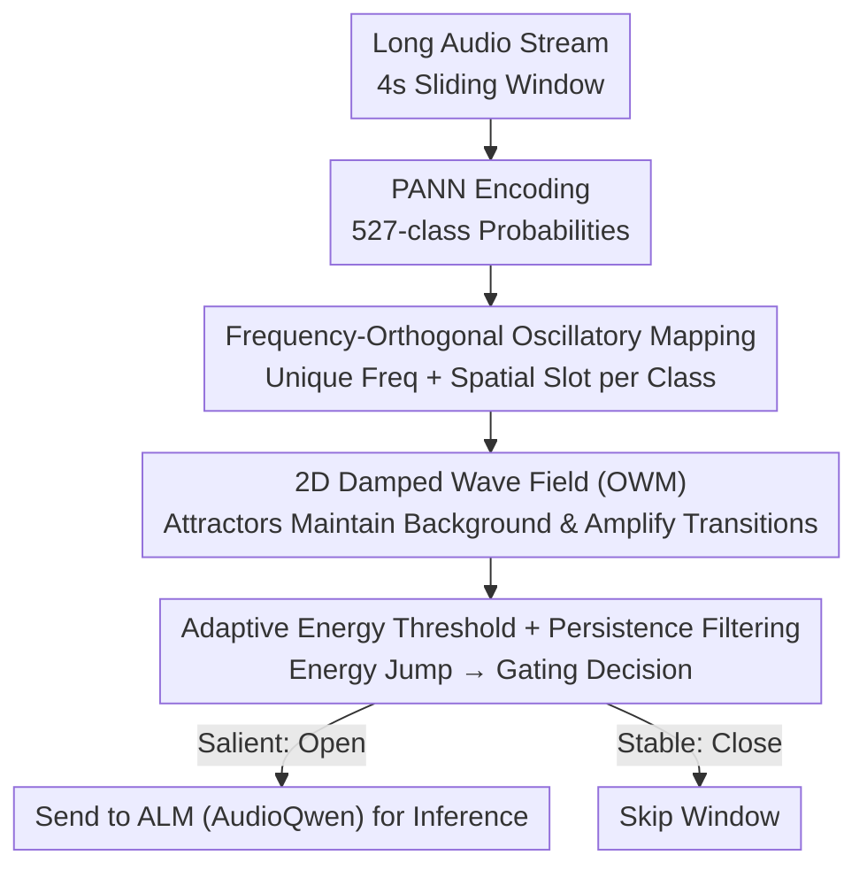

# NAACA: Training-Free NeuroAuditory Attentive Cognitive Architecture with Oscillatory Working Memory for Salience-Driven Attention Gating

**Conference**: ICML 2026  
**arXiv**: [2605.13651](https://arxiv.org/abs/2605.13651)  
**Code**: https://github.com/zjyuan1208/NAACA-Oscillatory-Working-Memory (Available)  
**Area**: Audio Language Models / Neuro-inspired Architecture / Attention Allocation  
**Keywords**: Auditory Saliency, Oscillatory Working Memory, Training-Free Gating, ALM Long Audio Understanding

## TL;DR
This work utilizes a 2D oscillatory wave field (OWM) inspired by cortical oscillations for real-time saliency detection, serving as a "training-free attention gate" for Audio Language Models (ALMs) in long audio tasks. By feeding only truly significant windows to the ALM, it improves AP from 53.5% to 70.6% on XD-Violence while reducing ALM calls by approximately 40%.

## Background & Motivation

**Background**: Audio Language Models (e.g., AudioQwen) have achieved open-vocabulary semantic understanding for short audio, serving as key modules for integrating speech and environmental sounds into multimodal reasoning. In long-duration scenarios such as street surveillance or bioacoustics, current practices involve slicing the stream into sliding windows for segment-wise ALM processing or feeding the entire sequence into a transformer to let it self-select key points.

**Limitations of Prior Work**: Inference on long streams often suffers from "attention dilution," where background noise consumes the token budget, drowning out rare but critical events (e.g., gunshots, cries for help, sudden cheers). In the paper's demo, a 60s clip is sliced into four 15s windows, and the onset of a bagpipe in the final segment is entirely missed; the model only "sees" it if the final 15s is placed at the beginning. While exhaustive short-window inference covers all salient points, ALM computational costs become prohibitively high for industrial deployment.

**Key Challenge**: There is a trade-off between perceptual recall and computational budget. One must either consume excessive GPU resources for continuous ALM calls or risk missing rare events. Traditional statistical drift detectors (e.g., the Rabanser series) or representation-based methods require long-term historical samples and significant overhead, making them difficult to deploy online and unsupervised.

**Goal**: Construct a lightweight gating module that requires no training, does not rely on historical labels, and can determine "when to wake up the ALM" online.

**Key Insight**: The authors draw inspiration from cognitive neuroscience: the brain uses attention gating to filter stable backgrounds and amplify salient stimuli. Cortical working memory is maintained by attractor states, where oscillatory dynamics decouple encoding and maintenance ($\beta$ for maintenance, $\gamma$ for encoding). This suggests that saliency can be decoded from "state transitions" without training a specialized classifier.

**Core Idea**: The 527-class probabilities output by a PANN encoder are used as sinusoidal driving signals for different frequencies, injected into a $64 \times 64$ 2D damped wave field (OWM). By detecting abrupt changes in global energy relative to an adaptive threshold, the ALM attention gating problem is transformed into a biophysically interpretable oscillatory energy detection task.

## Method

### Overall Architecture
NAACA addresses the dilemma of background noise overwhelming rare events in long audio streams without resorting to exhaustive ALM calls. It inserts a parameter-free physical gate before the ALM: each 4s sliding window is encoded by PANN into 527-class sound probabilities, which are then injected into a 2D Oscillatory Working Memory (OWM). The decision of "when to call the ALM" is reduced to detecting global energy transients in the wave field. Only PANN and the ALM use pre-trained weights; the OWM itself contains zero learnable parameters.

### Key Designs

**1. Frequency-Orthogonal Oscillatory Mapping: Transforming Probabilities into Separable Oscillatory Identities**

The gate must decode "distributional changes" from frame-wise probabilities. If 527 classes are mixed, energy alone cannot distinguish which class is changing. NAACA assigns each class a unique frequency and a unique spatial slot: the carrier frequency $f_i = f_{\min} + i (f_{\max} - f_{\min}) / (C-1)$ is distributed linearly over $[51, 1200]$ Hz, with the instantaneous amplitude taken from the class probability $a_i(t)$. Non-zero driving is restricted to its own spatial patch $\Omega_i$: $S_i(x,t) = a_i(t) \sin(\omega_i t)\, \mathbf{1}_{\Omega_i}(x)$. $64 \times 64 = 4096$ grid points are deterministically assigned (approx. 7-8 per class). Class activity is separable in the frequency domain (via damped response at $\omega_i$) and spatial domain, so transitions evoke global transients by disturbing phase relationships.

**2. 2D Damped Wave Field as Working Memory: Using Attractor Dynamics to Maintain Background and Amplify Transitions**

The OWM serves as the working memory carrier, sensitive to changes while "remembering" stable backgrounds. It is a 2D velocity-pressure field where pressure $p(x,y,t)$ stores the auditory state and velocity $\mathbf{v}$ controls lateral propagation, following:  
$$\partial_t p + k^p p = -c^2(x,y)\,\nabla\!\cdot\!\mathbf{v} + S$$  
$$\partial_t \mathbf{v} + k^v \mathbf{v} = -\nabla p$$  
evolved with $\Delta t = 0.01$. The wave velocity field $c(x,y)=c(y)$ uses a striped pattern to generate slow-propagating coherent modes via Bragg-matching. Theorem 2.4 proves this striped structure is optimal for saliency sensitivity. In steady states, the field forms "sound category $\to$ spatial resonance" attractors; energy remains stable during smooth inputs, while category switches trigger global energy reorganization.

**3. Adaptive Thresholding + Continuous Filtering: Translating Energy Transients into Robust Decisions**

Continuous energy signals must be converted into binary decisions. Since background noise levels drift with time and location, static thresholds fail. NAACA estimates background drift within a sliding window $W=20$, calculating the mean $\mu$ and standard deviation $\sigma$ of the energy-derived drift. It uses an adaptive threshold:  
$$T_{\text{adapt}} = \mu + 2\sigma(1 + \alpha\cdot\text{trend})$$  
where the trend factor weights recent energy rises to prevent false alarms during gradual background changes. The final decision results from threshold crossings combined with multi-frame persistence filtering to suppress single-point outliers.

### Loss & Training
NAACA is entirely training-free. PANN and AudioQwen use frozen pre-trained weights, and the OWM has no trainable parameters. Hyperparameters (freq range 51-1200 Hz, damping $k^p=k^v=10$, $64\times64$ grid, $W=20$, threshold factor 2) are derived directly from the sensitivity analysis of Theorem 2.1/2.4.

## Key Experimental Results

### Main Results
Performance on the XD-Violence audio track (500 test samples) compared with supervised and zero-shot baselines:

| Method | Modality | Training | AP (%) |
|------|------|------|--------|
| AudioQwen (exhaustive) | Audio | No | 53.50 |
| Random 4s Segments | Audio | No | 60.44 |
| HL-Net (Supervised) | Audio | Yes | 60.50 |
| AVadCLIP (Supervised) | Audio | Yes | 52.51 |
| Holmes-VAU (Supervised) | Video | Yes | 87.68 |
| TRACE (w/ Cross-attn) | Video | Partial | 83.67 |
| **NAACA (Ours)** | Audio | No | **70.60** |

Without training, NAACA outperforms all supervised audio baselines and exceeds Random 4s selection by 10.16% (Gain), proving the effectiveness of OWM selection.

### Ablation Study

| Configuration | XD-Violence AP | Time Sent Ratio | Description |
|------|---------------|-----------------|------|
| AudioQwen exhaustive | 53.50 | 1.00 | Baseline exhaustive windowing |
| Random 4s (same # segments) | 60.44 | $\approx$ 0.6 | Isolates "short input" contribution |
| NAACA full | 70.60 | 0.597 | OWM Selection |
| NAACA on USoW | (Qualitative) | 0.650 | Cross-dataset consistency |

"Short input" alone contributes $+6.94$ AP, while OWM selection adds another $+10.16$ AP.

### Key Findings
- OWM selection reduces ALM calls by ~40% (from 57 to 34 per 60s) while increasing AP by 17.1%, shifting the Pareto frontier.
- FFT analysis of the $p$-field shows that steady backgrounds primarily involve $\beta$-band (15-30 Hz) oscillations (maintenance), while drifts shift to the $\gamma$-band (30-50 Hz) (encoding), aligning with frequency band division in cortical working memory.
- Qualitative cases in USoW show OWM distinguishes three types of drift: entirely new events (car engines), sub-class switches (hi-hat entries), and robustness to short pauses (infant crying gaps do not fragment the event).

## Highlights & Insights
- Using a physics-level wave simulation instead of a learned detector is an elegant, counter-intuitive move. By parameterizing the wave velocity field through a Bragg optimality theorem, the OWM is reduced to almost zero hyperparameters.
- The cognitive proposition "salience $\neq$ loudness, salience = context change" is translated into "global energy transients relative to an adaptive threshold," providing a cross-modal abstraction for LLM attention gating.
- Performance gains come from "processing less" rather than "processing smarter," which is highly beneficial for streaming deployment.

## Limitations & Future Work
- Performance is capped by PANN and AudioQwen; specialized domains (e.g., medical sounds, mechanical failures) may require stronger pre-trained encoders.
- Hard gating loses boundary context, potentially affecting long-range causal reasoning. Future work suggests "soft-gating" via KV-cache modulation.
- Current evaluations focus on anomaly detection AP and temporal precision; downstream QA or instruction following (SpeechIQ style) tasks are needed to verify if selected windows are sufficient for multi-turn reasoning.

## Related Work & Insights
- **vs. Rabanser et al. (Drift Detectors)**: Those require long-term samples to estimate distributions; NAACA uses a 20-frame sliding window, making it better for open-set deployment despite weaker formal false-alarm rate guarantees.
- **vs. Supervised Methods (AVadCLIP/HL-Net)**: These require fine-tuning on domain labels; NAACA has zero migration cost.
- **vs. KV-cache Video Methods (MA-LMM)**: Both target transformer context bottlenecks, but NAACA operates at the input layer via physical gating, whereas MA-LMM compresses in latent space; the two are complementary.

## Rating
- Novelty: ⭐⭐⭐⭐⭐ Direct use of cortical wave simulation as a detector is highly original.
- Experimental Thoroughness: ⭐⭐⭐⭐ Solid results on XD-Violence and USoW; lacks SpeechIQ-style downstream tasks.
- Writing Quality: ⭐⭐⭐⭐⭐ Theoretical proofs for intuition make for a clear narrative.
- Value: ⭐⭐⭐⭐ Provides an immediately applicable, lightweight gating component for ALM deployment.

<!-- RELATED:START -->

## Related Papers

- [\[ACL 2026\] Temporal Contrastive Decoding: A Training-Free Method for Large Audio-Language Models](../../ACL2026/audio_speech/temporal_contrastive_decoding_a_training-free_method_for_large_audio-language_mo.md)
- [\[ICML 2026\] Polyphonia: Zero-Shot Timbre Transfer in Polyphonic Music with Acoustic-Informed Attention Calibration](polyphonia_zero-shot_timbre_transfer_in_polyphonic_music_with_acoustic-informed_.md)
- [\[ICML 2026\] Attend to Anything: Foundation Model for Unified Human Attention Modeling](attend_to_anything_foundation_model_for_unified_human_attention_modeling.md)
- [\[ICLR 2026\] Dynamic Parameter Memory: Temporary LoRA-Enhanced LLM for Long-Sequence Emotion Recognition in Conversation](../../ICLR2026/audio_speech/dynamic_parameter_memory_temporary_lora-enhanced_llm_for_long-sequence_emotion_r.md)
- [\[CVPR 2026\] Multi-speaker Attention Alignment for Multimodal Social Interaction](../../CVPR2026/audio_speech/multi-speaker_attention_alignment_for_multimodal_social_interaction.md)

<!-- RELATED:END -->
