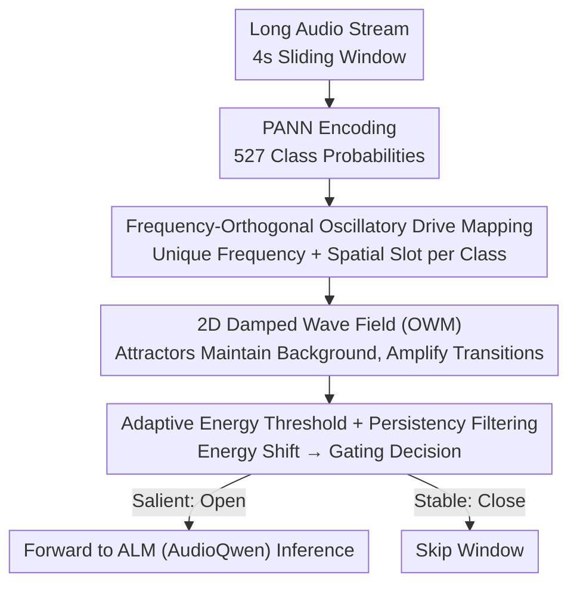

# NAACA: Training-Free NeuroAuditory Attentive Cognitive Architecture with Oscillatory Working Memory for Salience-Driven Attention Gating

**Conference**: ICML 2026  
**arXiv**: [2605.13651](https://arxiv.org/abs/2605.13651)  
**Code**: https://github.com/zjyuan1208/NAACA-Oscillatory-Working-Memory (Available)  
**Area**: Audio Language Models / Neuro-inspired Architecture / Attention Allocation  
**Keywords**: Auditory Saliency, Oscillatory Working Memory, Training-free Gating, Long Audio Understanding in ALMs

## TL;DR
This work utilizes a 2D oscillatory wave field (OWM) inspired by cortical oscillations for real-time saliency detection. Serving as a "training-free attention gate" for Audio Language Models (ALMs) on long audio, it feeds only truly salient windows into the ALM. This increases the AP on XD-Violence from 53.5% to 70.6% while reducing approximately 40% of ALM calls.

## Background & Motivation

**Background**: Audio Language Models (e.g., AudioQwen) are capable of open-vocabulary semantic understanding for short audio clips, acting as key modules for integrating speech and environmental sounds into multimodal reasoning. In long-duration audio scenarios like street surveillance or bioacoustics, current practices typically involve slicing streams into sliding windows for segment-by-segment processing or feeding the entire sequence into a Transformer for self-selection.

**Limitations of Prior Work**: Long-stream inference suffers from "attention dilution," where background sounds consume most of the token budget, causing rare but critical events (e.g., gunshots, cries for help, sudden cheers) to be submerged. Demos show that in a 60s clip split into four 15s windows, a bagpipe onset in the final segment is often missed unless that segment is moved to the front. While exhaustive short-window inference covers all salient points, it leads to prohibitive ALM invocation costs.

**Key Challenge**: There is a trade-off between perceptual recall and computational budget. One must either consume GPU resources for constant ALM calls or risk missing rare events. Traditional statistical drift detectors (e.g., the Rabanser series) or representation-based methods require long-term historical samples and significant overhead, making them difficult for online, unsupervised deployment.

**Goal**: Construct a lightweight gating module that requires no training, does not rely on historical labels, and can decide "when to wake up the ALM" online.

**Key Insight**: The authors draw inspiration from cognitive neuroscience: the brain uses attention gating to filter stable backgrounds and amplify salient stimuli. Cortical working memory is maintained by attractor states, where oscillatory dynamics decouple encoding and maintenance ($\beta$ for maintenance, $\gamma$ for encoding). This suggests that saliency can be decoded from "state transitions" without a dedicated classifier.

**Core Idea**: Map the 527-class probabilities from a PANN encoder as frequency-orthogonal sinusoidal drive signals into a $64 \times 64$ 2D damped oscillatory wave field (OWM). Use sudden changes in global energy relative to an adaptive threshold as "salient event" signals, transforming the ALM's attention gating problem into a biophysically interpretable oscillatory energy detection problem.

## Method

### Overall Architecture
NAACA addresses the dilemma of background noise drowning out rare events in long audio streams without resorting to exhaustive ALM calls. It inserts a parameter-free physical gate before the ALM: each 4s sliding window is encoded by PANN into 527 sound class probabilities, which drive the OWM. The decision of "when to call the ALM" is reduced to "when the total energy of the wave field shifts abruptly." In this pipeline, only PANN and the ALM have pre-trained weights; the OWM itself has no learnable parameters.

### Key Designs

**1. Frequency-Orthogonal Oscillatory Drive Mapping: Converting Probability Vectors into Separable Oscillatory Identities**

The gate must detect distribution changes from frame-level probabilities. If 527 categories are mixed, energy alone cannot distinguish which category is shifting. NAACA assigns each category a unique carrier frequency $f_i = f_{\min} + i (f_{\max} - f_{\min}) / (C-1)$ linearly between $[51, 1200]$ Hz, with the instantaneous amplitude taken from the category probability $a_i(t)$. Each category drives only its assigned spatial patch $\Omega_i$, defined as $S_i(x,t) = a_i(t) \sin(\omega_i t)\, \mathbf{1}_{\Omega_i}(x)$. The $64\times64=4096$ grid points are deterministically allocated to the 527 classes. "Which category is active" becomes separable in the frequency and spatial domains. A transition in input categories disturbs global phase relationships, triggering a transient energy spike. This zero-training approach makes migration to different encoders effortless.

**2. 2D Damped Wave Field as Working Memory: Using Attractor Dynamics to Maintain Background and Amplify Transitions**

The OWM acts as the working memory carrier. It is a 2D velocity-pressure field where pressure $p(x,y,t)$ stores the current auditory state and velocity $\mathbf{v}$ controls lateral propagation. It evolves via a first-order system:
$$\partial_t p + k^p p = -c^2(x,y)\,\nabla\!\cdot\!\mathbf{v} + S$$
$$\partial_t \mathbf{v} + k^v \mathbf{v} = -\nabla p$$
with a time step $\Delta t = 0.01$. The wave speed field $c(x,y)=c(y)$ uses a striped pattern (alternating light/dark blue) to generate slow-propagating coherent modes via Bragg-matching. This couples "maintenance-type" low frequencies with "encoding-type" high frequencies. Theorem 2.4 in the paper proves this striped structure is the optimal solution for saliency sensitivity. In steady states, the field forms attractors at "sound category → spatial resonance" locations; local tremors only become global energy rearrangements when category distributions truly shift.

**3. Adaptive Energy Threshold + Persistency Filtering: Translating Energy Surges into Robust Gating Decisions**

The final step converts continuous energy signals into binary decisions. Since background noise levels drift with time and environment, static thresholds fail. NAACA estimates the mean $\mu$ and standard deviation $\sigma$ of energy-derived drift within a sliding window of length $W=20$. It uses an adaptive threshold $T_{\text{adapt}} = \mu + 2\sigma(1 + \alpha\cdot\text{trend})$. The trend factor weights the drift—if energy gradually increases, the threshold rises to avoid false triggers. The final gate decision uses threshold crossing combined with multi-frame persistency filtering to suppress single-point false alarms. This allows the system to work stably across diverse datasets like XD-Violence and USoW.

### Loss & Training
NAACA is entirely **training-free**. PANN and AudioQwen are frozen pre-trained models. The OWM has zero trainable parameters. All hyperparameters (frequency range 51-1200 Hz, damping $k^p=k^v=10$, grid $64\times64$, window $W=20$, threshold factor 2) are derived directly from sensitivity analyses in Theorems 2.1/2.4. There is no gradient descent or labeling—only one-time geometric/physical initialization.

## Key Experimental Results

### Main Results
On the audio-only track of XD-Violence (500 test samples), comparisons were made with supervised audio, supervised video, and zero-shot video models:

| Method | Modality | Training | AP (%) |
| :--- | :--- | :--- | :--- |
| AudioQwen (Exhaustive) | Audio | No | 53.50 |
| Random 4s Segment | Audio | No | 60.44 |
| HL-Net (Supervised) | Audio | Yes | 60.50 |
| AVadCLIP (Supervised) | Audio | Yes | 52.51 |
| Holmes-VAU (Supervised) | Video | Yes | 87.68 |
| TRACE (w/ Cross-attn Adapt) | Video | Partial | 83.67 |
| **Ours (NAACA)** | Audio | No | **70.60** |

Without training, NAACA outperforms all supervised audio baselines and exceeds the "Random 4s" baseline by 10.16 percentage points, proving the effectiveness of OWM segment selection beyond just shortening the input.

### Ablation Study

| Configuration | XD-Violence AP | Time Sent Ratio | Description |
| :--- | :--- | :--- | :--- |
| AudioQwen Exhaustive | 53.50 | 1.00 | Full sliding window baseline |
| Random 4s (same count) | 60.44 | $\approx$ 0.6 | Isolated "Short Input" contribution |
| NAACA Full | 70.60 | 0.597 | OWM Selection |
| NAACA on USoW | (Qualitative) | 0.650 | Cross-dataset consistency |

"Short input" contributes $+6.94$ AP, while OWM saliency selection adds another $+10.16$ AP. The overlap between OWM-detected drift points and ground-truth event frames is 61.1%, indicating successful identification of critical moments.

### Key Findings
- OWM selection reduces ALM calls by ~40% (from 57 to 34 calls per 60s segment) while raising AP by 17.1 points, effectively pushing the Pareto frontier.
- FFT analysis of the $p$-field shows that steady-state periods are dominated by $\beta$-band (15-30 Hz) oscillations (maintenance), while post-drift segments shift to $\gamma$-band (30-50 Hz) (encoding), consistent with cortical frequency division of labor.
- Qualitative cases in USoW show OWM distinguishes three types of drift: completely new events (engine, bagpipe), sub-category switches (hi-hat entry), and robustness to short pauses (baby crying gaps do not split into multiple events).

## Highlights & Insights
- Replacing a learned detector with a physical simulation wave field is an elegant, counter-intuitive move. By proving the optimality of Bragg stripes, the wave speed field is parameterized down to a single degree of freedom (period), making the OWM nearly zero-hyperparameter.
- The cognitive proposition "saliency $\neq$ loudness, saliency = context change" is translated into "transient global energy relative to adaptive thresholds." This provides a cross-modal abstraction: any input stream encoded as a "quasi-attractor dynamical system" can use energy surges as saliency signals.
- Performance gains come from "processing less" rather than "processing smarter," which is deployment-friendly for streaming. It suggests that long-context issues can be addressed by "gating then feeding" rather than just expanding context windows.

## Limitations & Future Work
- The performance ceiling is locked by PANN and AudioQwen. PANN is trained on AudioSet; it may fail in specialized fields (e.g., medical sounds, mechanical faults).
- Hard gating loses boundary context, which might hinder long-range causal reasoning. Future work could explore "soft gating" via KV-cache modulation, though this requires white-box access to the ALM.
- Evaluation is currently focused on anomaly detection AP and temporal precision. It lacks SpeechIQ-style downstream QA or instruction following; it remains to be seen if OWM-selected windows are sufficient for multi-turn reasoning.
- Experiments cover XD-Violence and USoW (60s clips); stability in hour-long continuous streams has not yet been verified.

## Related Work & Insights
- **vs Rabanser et al. (Statistical Detectors)**: Those require long history to estimate reference distributions. NAACA calculates thresholds with only a 20-frame window, better for open-world deployment, despite fewer formal false-alarm rate guarantees.
- **vs AVadCLIP / HL-Net (Supervised)**: Those require fine-tuning on domain labels and re-labeling for new scenarios. NAACA's migration cost is zero, though its ceiling is capped by the pre-trained ALM.
- **vs MA-LMM (KV-cache Video Methods)**: Both aim to break Transformer context bottlenecks. MA-LMM compresses in the latent space, while NAACA gates at the input layer; the two approaches are complementary.

## Rating
- **Novelty**: ⭐⭐⭐⭐⭐ Using cortical wave simulation directly as a detector is a rare and highly original mechanism.
- **Experimental Thoroughness**: ⭐⭐⭐⭐ Covers dual datasets, quantitative/qualitative analysis, and spectral analysis. Missing SpeechIQ-style downstream tasks.
- **Writing Quality**: ⭐⭐⭐⭐⭐ Includes 4 theorems providing formal guarantees; the narrative from cognitive motivation to physical modeling is very clear.
- **Value**: ⭐⭐⭐⭐ Provides a lightweight, plug-and-play gating component for long-audio ALM deployment, highly practical for industrial pipelines.

<!-- RELATED:START -->

## Related Papers

- [\[ACL 2026\] Temporal Contrastive Decoding: A Training-Free Method for Large Audio-Language Models](../../ACL2026/audio_speech/temporal_contrastive_decoding_a_training-free_method_for_large_audio-language_mo.md)
- [\[ICML 2026\] Polyphonia: Zero-Shot Timbre Transfer in Polyphonic Music with Acoustic-Informed Attention Calibration](polyphonia_zero-shot_timbre_transfer_in_polyphonic_music_with_acoustic-informed_.md)
- [\[CVPR 2026\] InfinityHuman: Towards Long-Term Audio-Driven Human Animation](../../CVPR2026/audio_speech/infinityhuman_towards_long-term_audio-driven_human_animation.md)
- [\[ICML 2026\] Attend to Anything: Foundation Model for Unified Human Attention Modeling](attend_to_anything_foundation_model_for_unified_human_attention_modeling.md)
- [\[ICLR 2026\] Dynamic Parameter Memory: Temporary LoRA-Enhanced LLM for Long-Sequence Emotion Recognition in Conversation](../../ICLR2026/audio_speech/dynamic_parameter_memory_temporary_lora-enhanced_llm_for_long-sequence_emotion_r.md)

<!-- RELATED:END -->
