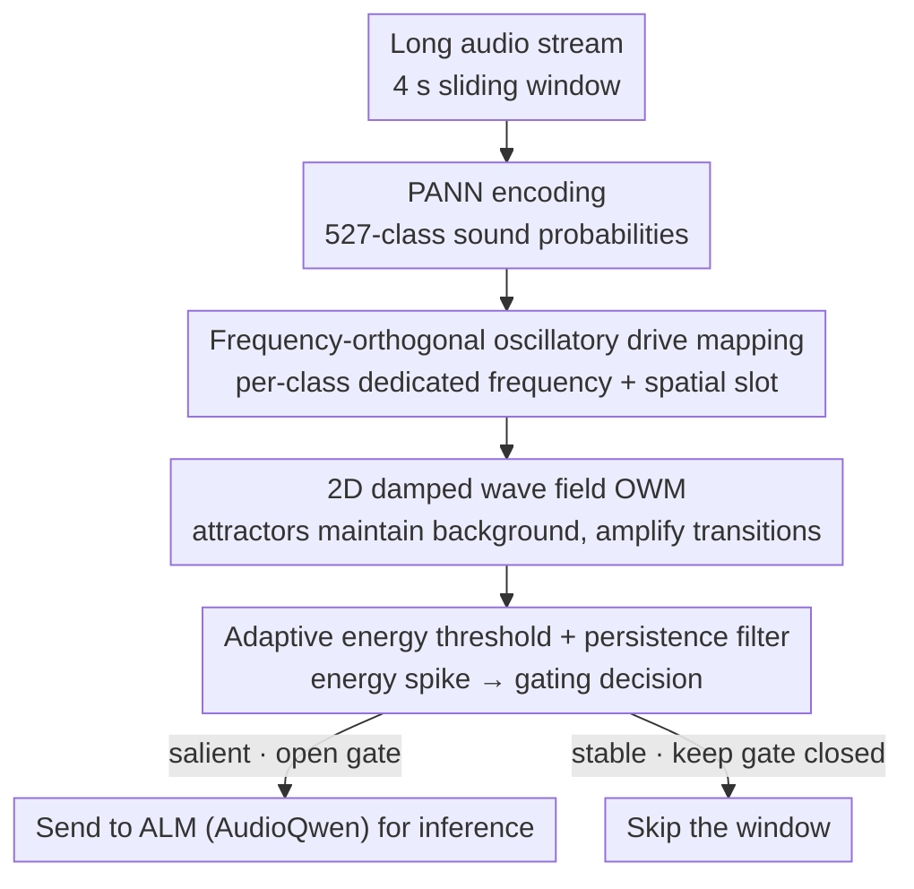

# NAACA: Training-Free NeuroAuditory Attentive Cognitive Architecture with Oscillatory Working Memory for Salience-Driven Attention Gating

**Conference**: ICML 2026  
**arXiv**: [2605.13651](https://arxiv.org/abs/2605.13651)  
**Code**: https://github.com/zjyuan1208/NAACA-Oscillatory-Working-Memory (yes)  
**Area**: Audio & Speech  
**Keywords**: Auditory salience, Oscillatory Working Memory, Training-free gating, Long-audio ALM understanding

## TL;DR
A cortical-oscillation-inspired 2D wave field (OWM) performs real-time salience detection and serves as a training-free attention gate in front of an Audio Language Model on long audio, feeding only the genuinely salient windows into the ALM — lifting AP on XD-Violence from 53.5% to 70.6% while cutting ALM calls by roughly 40%.

## Background & Motivation

**Background**: Audio Language Models (e.g. AudioQwen) can already perform open-vocabulary semantic understanding of short audio and are the key module for plugging speech and environmental sound into multimodal reasoning. In long-duration audio scenarios such as street surveillance and bioacoustics, the common practice is either to cut the stream into sliding windows fed segment by segment into the ALM, or to dump the whole clip into a transformer and let it pick out the important parts on its own.

**Limitations of Prior Work**: Long-stream inference suffers from "attention dilution" — background sound consumes the vast majority of the token budget, while rare but critical events (gunshots, cries for help, sudden cheering) get drowned out. In the paper's demo, splitting 60 s into four 15 s windows causes the bagpipe onset in the final segment to be completely missed; only when the last 15 s is moved to the very front does the model "see" it. Exhaustive short-window inference can cover all salient points, but ALM call costs blow up and become impractical in industrial deployment.

**Key Challenge**: There is a trade-off between perceptual recall and compute budget. Either you burn GPU by calling the ALM constantly, or you call it less and miss rare events. Traditional statistical drift detectors (e.g. the Rabanser line) or representation-based methods require long historical samples and heavy overhead, making it hard to be online, unsupervised, and deployable.

**Goal**: Build a lightweight gating module that needs no training, depends on no historical labels, and can decide online "when to wake up the ALM".

**Key Insight**: The authors draw inspiration from cognitive neuroscience — the brain uses attentional gating to filter stable backgrounds and amplify salient stimuli; cortical working memory is maintained by attractor states, and oscillatory dynamics decouple encoding from maintenance (β for maintenance, γ for encoding). This suggests salience can be read out from "state transitions" without training a dedicated classifier.

**Core Idea**: Treat the 527-class probabilities output by the PANN encoder as sinusoidal driving signals of different frequencies, inject them into a $64 \times 64$ 2D damped wave field (OWM), and use abrupt changes in global energy relative to an adaptive threshold as the "salient event" signal — turning ALM attention gating into a biophysically interpretable oscillatory-energy detection problem.

## Method

### Overall Architecture
NAACA tackles the dilemma that in long audio streams background sound drowns out rare critical events, yet one cannot mindlessly exhaustively call the ALM. Its approach is to insert a completely parameter-free physical gate in front of the ALM: each 4 s sliding window is encoded by PANN into 527-class sound probabilities, and this set of probabilities is then injected as a driving signal into a 2D damped wave field (OWM), so that "when to wake up the ALM" degenerates into "when does the wave field's total energy spike". Across the whole pipeline only PANN and the ALM carry pretrained weights — the OWM itself has zero learnable parameters.

### Key Designs

**1. Frequency-orthogonal oscillatory drive mapping: turning the probability vector into separable oscillatory identities**

For the gate to work, it must be able to read "the distribution changed" out of a stream of per-frame probabilities; the difficulty is that if all 527 classes are mixed together, looking at energy alone cannot tell which class is moving. NAACA's solution is to assign each class both a dedicated frequency and a dedicated spatial slot: the carrier frequency of class $i$, $f_i = f_{\min} + i (f_{\max} - f_{\min}) / (C-1)$, is laid out linearly over $[51, 1200]$ Hz, the instantaneous amplitude is directly the class probability $a_i(t)$, and the drive is nonzero only on its own spatial patch $\Omega_i$, written as $S_i(x,t) = a_i(t) \sin(\omega_i t)\, \mathbf{1}_{\Omega_i}(x)$; the $64\times64=4096$ grid points are deterministically partitioned among the 527 classes in row-major order (about 7–8 cells per class), with nothing learned. This way "which class is active" is separable both in the frequency domain (different $\omega_i$ have different damped responses) and in space (different $\Omega_i$); once the input transitions between classes it simultaneously perturbs the phase relations at multiple spatial locations, triggering a global energy transient. Compared with learning a classification head, switching encoders requires only recomputing frequencies and grid assignments, so transfer cost is nearly zero.

**2. The 2D damped wave field as working memory: using attractor dynamics to maintain background and amplify transitions**

A driving signal alone is not enough; a carrier that can "remember stable backgrounds and stay sensitive to change" is needed, and this is exactly the working-memory role the OWM plays. It is a 2D velocity–pressure field where the pressure $p(x,y,t)$ stores the current auditory state and the velocity $\mathbf{v}$ governs lateral propagation between neighboring grid points, following the first-order system $\partial_t p + k^p p = -c^2(x,y)\,\nabla\!\cdot\!\mathbf{v} + S$ and $\partial_t \mathbf{v} + k^v \mathbf{v} = -\nabla p$, discretized with time step $\Delta t = 0.01$. The wave-speed field is deliberately designed to be stripe-shaped $c(x,y)=c(y)$ (alternating light and dark blue), producing slowly propagating coherent modes via Bragg-matched periodicity so that "maintenance" low frequencies and "encoding" high frequencies couple in phase; the paper's Theorem 2.4 proves this stripe structure is precisely the optimum for salience sensitivity. At steady state the field naturally forms "sound class → spatial resonance location" attractors, analogous to cortical topographic organization: when the input distribution is stationary the energy amplitude stays naturally stable, and only a genuine class switch triggers a global energy reorganization, so the judgment of "what changed" is pushed onto a biophysical quantity, eliminating the need to train any detector.

**3. Adaptive energy threshold + persistence filter: translating energy spikes into robust gating decisions**

The final step turns the continuous energy signal into a binary open/close gating decision; the key is that the background noise level drifts dramatically across cities and times of day, so a static threshold is bound to fail. NAACA estimates the mean $\mu$ and standard deviation $\sigma$ of the energy-derived drift within a sliding window of length $W=20$, and decides using the adaptive threshold $T_{\text{adapt}} = \mu + 2\sigma(1 + \alpha\cdot\text{trend})$, where the trend factor weights the drift trend — if the recent energy has been steadily rising it means the background as a whole is shifting, so the threshold is correspondingly raised to avoid false triggers; the final gate = threshold crossing combined with a multi-frame persistence filter to suppress single-point false alarms. Precisely because the threshold is a relative statistic, the system can work stably on the very different XD-Violence and USoW (median gating rates of 0.597 and 0.650 respectively).

### Loss & Training
NAACA is entirely training-free — both PANN and AudioQwen are frozen pretrained models, the OWM has no trainable parameters, and all "hyper-parameters" (frequency range 51–1200 Hz, damping $k^p=k^v=10$, grid $64\times64$, sliding window $W=20$, threshold multiplier 2) are given directly by the sensitivity analysis of Theorems 2.1/2.4. There is no gradient descent, no labels — only a one-shot geometric/physical parameter setup.

## Key Experimental Results

### Main Results
On the audio-only track of XD-Violence (500 test samples), compared against supervised audio models, supervised video models, and zero-shot video models:

| Method | Modality | Training | AP (%) |
|------|------|------|--------|
| AudioQwen (exhaustive) | Audio | No | 53.50 |
| Random 4 s segment | Audio | No | 60.44 |
| HL-Net (supervised) | Audio | Yes | 60.50 |
| AVadCLIP (supervised) | Audio | Yes | 52.51 |
| Holmes-VAU (supervised) | Video | Yes | 87.68 |
| TRACE (with cross-attn adapter) | Video | Partial | 83.67 |
| **NAACA (ours)** | Audio | No | **70.60** |

Without any training, NAACA beats all supervised audio baselines and is 10.16 points higher than Random 4 s (showing OWM segment selection is genuinely effective, not just a benefit of shorter inputs); it still trails supervised video methods, but that is the inherent audio-only ceiling of the modality.

### Ablation Study

| Config | XD-Violence AP | Time Sent Ratio | Note |
|------|---------------|-----------------|------|
| AudioQwen exhaustive | 53.50 | 1.00 | Full sliding-window inference baseline |
| Random 4 s (same segment count) | 60.44 | $\approx$ 0.6 | Isolates the "short input" contribution |
| NAACA full | 70.60 | 0.597 | OWM segment selection |
| NAACA on USoW | (qualitative) | 0.650 | Cross-dataset consistency |

"Short input" alone contributes $+6.94$ AP, and OWM salience selection contributes another $+10.16$ AP; the drift points detected by OWM overlap ground-truth event frames at 61.1%, confirming it really selects the critical moments.

### Key Findings
- OWM segment selection raises AP by 17.1 points while cutting ALM calls by about 40% (57 → 34 calls per 60 s clip), directly pushing out the Pareto frontier.
- FFT spectral analysis of the $p$-field shows that during the steady-state background period oscillations are mainly in the β band (15–30 Hz) (corresponding to maintenance), and after drift some examples switch to the γ band (30–50 Hz) (corresponding to encoding), consistent with the frequency-band division of labor in cortical working memory — providing interpretability evidence for the model.
- In qualitative USoW cases OWM distinguishes three types of drift: entirely new events (car engine, bagpipe), sub-class switches (hi-hat entering/leaving), and robustness to brief pauses (gaps in baby crying are not split into multiple events) — showing it captures "distribution change" rather than "volume change".

## Highlights & Insights
- Replacing "training a detector" with a physics-simulation-grade wave field is a remarkably elegant, counterintuitive move: by parameterizing the wave-speed field through the optimality theorem of Bragg stripes, the authors compress it down to a single degree of freedom — the stripe period — making the whole OWM essentially hyper-parameter-free, and generalizing to a new encoder requires only recomputing the frequency assignment.
- The cognitive-science thesis "salience ≠ loudness, salience = context change" is translated into "a transient of the system's total energy relative to an adaptive threshold", offering a cross-modal, reusable abstraction for future LLM attention gating: as long as an input stream can be encoded into a "quasi-attractor dynamical system" like the OWM, energy spikes can serve as the salience signal.
- The performance gain comes from "processing less" rather than "processing more cleverly", which is especially friendly to streaming deployment — it tells the community that long context need not be solved only by expanding the context window, but can also be addressed by "gate first, feed second".

## Limitations & Future Work
- The performance ceiling is locked by PANN + AudioQwen; PANN is trained on the AudioSet label set, so it fails on rare specialized domains (medical bird calls, mechanical-fault sounds) and would need a stronger pretrained encoder.
- Hard gating discards boundary context, which may hurt long-range causal reasoning; the authors suggest future "soft gating" via KV-cache modulation, but that requires white-box access to the ALM.
- The current evaluation is mainly anomaly-detection AP + temporal precision, lacking SpeechIQ-style downstream QA and instruction-following tasks, so it is unclear whether the windows OWM keeps are sufficient for genuine multi-turn reasoning.
- Experiments only cover XD-Violence (movie audio) and USoW (urban sound), both at short-to-medium length (around 60 s); stability on truly hour-long streams remains unverified.

## Related Work & Insights
- **vs Rabanser et al. statistical drift detectors**: They need long historical samples to estimate a reference distribution, whereas NAACA computes its threshold from just 20 frames of sliding statistics, making it better suited to open-ended deployment — but its theoretical guarantees are weaker (no formalized false-alarm rate).
- **vs AVadCLIP / HL-Net supervised methods**: These rely on domain annotation for fine-tuning and require re-labeling to transfer to new scenes; NAACA is training-free with zero transfer cost, but at the price of a ceiling dictated by the pretrained ALM.
- **vs MA-LMM and other KV-cache long-video methods**: Both aim to break the transformer context bottleneck, but MA-LMM compresses in the latent space while NAACA gates physically at the input layer — and the two can in fact be stacked.
- Insight: transferring the idea "salience = physical-system transient" to video/text streams is an open problem — e.g. could the energy of LLM hidden states serve as a token-level salience signal to drive event triggering for a RAG retriever or an agent?

## Rating
- Novelty: ⭐⭐⭐⭐⭐ Using a cortical-wave simulation directly as a detector is mechanistically something very few people do
- Experimental Thoroughness: ⭐⭐⭐⭐ XD-Violence + USoW dual datasets + quantitative & qualitative + spectral analysis is already solid, but lacks SpeechIQ-style downstream tasks
- Writing Quality: ⭐⭐⭐⭐⭐ Four theorems turn intuition into formal guarantees, and the storyline (cognitive motivation → physical modeling → salience detection) is very clear
- Value: ⭐⭐⭐⭐ Provides an immediately pluggable lightweight gating component for "long-audio LLM deployment", very practical for industrial pipelines

<!-- RELATED:START -->

## Related Papers

- [\[ICML 2026\] VocSim: A Training-Free Benchmark for Zero-Shot Content Identity Recognition of Single-Source Audio](vocsim_a_training-free_benchmark_for_zero-shot_content_identity_in_single-source.md)
- [\[ACL 2026\] Temporal Contrastive Decoding: A Training-Free Method for Large Audio-Language Models](../../ACL2026/audio_speech/temporal_contrastive_decoding_a_training-free_method_for_large_audio-language_mo.md)
- [\[ICML 2026\] Polyphonia: Zero-Shot Timbre Transfer in Polyphonic Music with Acoustic-Informed Attention Calibration](polyphonia_zero-shot_timbre_transfer_in_polyphonic_music_with_acoustic-informed_.md)
- [\[ICML 2026\] Attend to Anything: Foundation Model for Unified Human Attention Modeling](attend_to_anything_foundation_model_for_unified_human_attention_modeling.md)
- [\[ICLR 2026\] Dynamic Parameter Memory: Temporary LoRA-Enhanced LLM for Long-Sequence Emotion Recognition in Conversation](../../ICLR2026/audio_speech/dynamic_parameter_memory_temporary_lora-enhanced_llm_for_long-sequence_emotion_r.md)

<!-- RELATED:END -->
