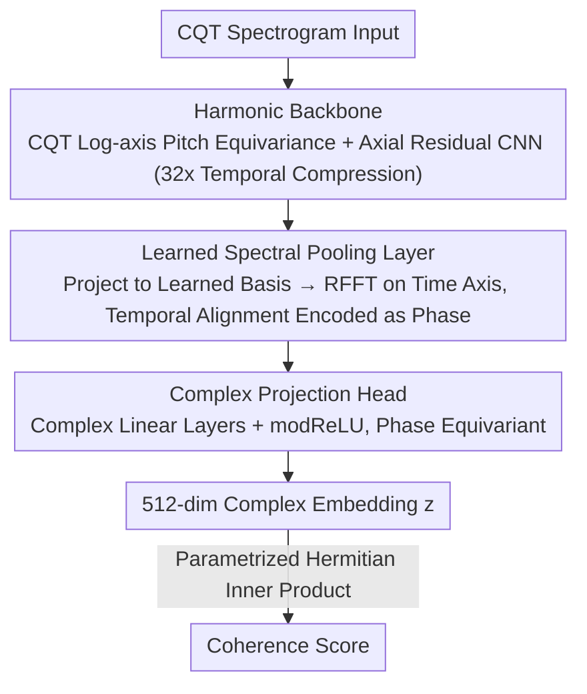

# PhaLar: Phasors for Learned Musical Audio Representations

**Conference**: ICML 2026  
**arXiv**: [2605.03929](https://arxiv.org/abs/2605.03929)  
**Code**: TBD  
**Area**: Audio / Music Information Retrieval  
**Keywords**: Phase Equivariance, Complex-valued Neural Networks, Audio Coherence, Stem Retrieval, Contrastive Learning

## TL;DR
PhaLar achieves a 70% relative improvement over SOTA on musical stem retrieval tasks by projecting audio features onto the complex plane and leveraging phase equivariance—encoding temporal alignment as phase rotations via FFT. It uses only 44% of the competitor's parameters and achieves 7× training acceleration; it represents a fundamental paradigm shift from "phase invariance" to "phase equivariance."

## Background & Motivation

**Background**: Existing audio representation learning inherits the computer vision paradigm—treating spectrograms as 2D images processed by CNNs / ViTs, using Global Average Pooling (GAP) to achieve translation invariance. Foundation models like CLAP and CDPAM perform well on semantic similarity tasks.

**Limitations of Prior Work**: Translation invariance is beneficial for semantic classification (identifying the presence of a "guitar") but detrimental to structural coherence tasks. Musical **stem retrieval** (finding missing parts that match a drum + bass mix in time and harmonics) requiring precise temporal alignment. GAP discards temporal order, mapping completely misaligned rhythms to the same latent representation—even if two segments contain the same instruments, they may be entirely incoherent.

**Key Challenge**: Semantic similarity and structural coherence are built on entirely different geometric foundations. Foundation models are designed to be "structure-blind"—useful for identifying a "rock song" but useless for evaluating whether two audio clips are temporally aligned.

**Goal**: Design a representation learning framework that **explicitly preserves temporal alignment information** rather than discarding it, while maintaining parameter efficiency and training speed.

**Key Insight**: The Fourier Shift Theorem—**temporal shifts in the time domain correspond to phase rotations in the frequency domain**. By leveraging this physical property to encode temporal relationships as phase angles, coherence can be evaluated on the complex plane.

**Core Idea**: Transition from real-valued magnitude features to complex-valued phasor representations. A learned spectral pooling layer applies FFT to map the temporal dimension to the frequency domain, followed by phase-equivariant complex-valued neural networks (CVNNs) to naturally preserve rather than destroy phase information.

## Method

### Overall Architecture
PhaLar addresses whether "two musical stems are aligned in time and harmonics," whereas traditional methods erase temporal order via GAP. The solution lies in the Fourier Shift Theorem—temporal shifts equal phase rotations. Consequently, the pipeline does not seek "invariance by discarding time" but encodes temporal alignment into phase, which is then read by a phase-sensitive CVNN. The process involves three stages: a lightweight CNN extracts tonal features from CQT spectrograms, a learned spectral pooling layer applies RFFT along the time dimension to convert temporal positions into phase angles, and a complex-valued head compares alignment in the complex plane to output a 512-dimensional complex embedding for coherence scoring.

### Key Designs

**1. Harmonic Backbone: Using CQT Log-spacing to transform "Pitch Shift" into Linear Translation for Convolutional Reuse**

The first step in stem retrieval is extracting pitch-aware features. However, as musical intervals (e.g., a "major third") appear in different keys, standard spectrograms require convolutional kernels to learn variants for each key, which is parameter-inefficient and fails to capture general rules. The backbone uses Constant-Q Transform (CQT) spectrograms where the frequency axis is log-spaced. In this coordinate system, pitch shifts become pure linear translations, allowing a single kernel to recognize the same interval across all keys. This hardcodes "pitch equivariance" as an inductive bias. The backbone is a 10-layer axial residual CNN, splitting convolutions into frequency-wise $3 \times 1$, temporal $1 \times 3$, and pointwise $1 \times 1$ to decouple harmonic and temporal processing. Strided convolutions every other layer compress time by a total of 32×.

**2. Learned Spectral Pooling Layer: Converting Temporal Information into Phase Rotation instead of Discarding it**

This module replaces GAP to preserve temporal alignment. It first flattens the backbone output $X \in \mathbb{R}^{B \times H \times F \times T'}$ across channel and frequency dimensions to $\bar{X} \in \mathbb{R}^{B \times (HF) \times T'}$, then projects onto a learned basis $W_{\text{proj}} \in \mathbb{R}^{(HF) \times D}$ to obtain $Z_{\text{time}} = \bar{X} W_{\text{proj}} \in \mathbb{R}^{B \times T' \times D}$. Projecting across all frequencies ensures each semantic channel encodes both interval structure and absolute frequency position. The key step is a Real FFT (RFFT) along the temporal axis: $S = \text{rfft}(Z_{\text{time}}) \in \mathbb{C}^{B \times C \times D}$ ($C = \lfloor T'/2 \rfloor + 1$), truncated/padded to a fixed $C = 8$, resulting in a fixed-length embedding of $D \times C = 640$ complex values. The Fourier Shift Theorem dictates that temporal shifts in the time domain translate to rotations of the phase angle $\angle S_{c, d}$. Thus, "temporal offset" is explicitly written into the phase, transforming temporal alignment into a geometric relationship on the complex plane. This layer essentially learns a modulation spectrum applied to learned semantic features.

**3. Complex Projection Head: Using Phase Equivariance to Propagate Alignment Info to the Final Score**

Encoding phase is insufficient if a standard real-valued MLP destroys it. This head operates entirely in the complex domain and satisfies phase equivariance: $f(x \cdot e^{i\theta}) = f(x) \cdot e^{i\theta}$. If the input rotates by a phase, the output rotates identically, ensuring alignment information is not lost. It consists of two complex linear layers with Complex RMSNorm and modReLU activation, projecting to a 512-dimensional complex vector $z \in \mathbb{C}^{512}$. Coherence is calculated via a parametrized Hermitian inner product: $s(z_x, z_y) = \Re(z_x^H W z_y)$, where $W \in \mathbb{C}^{D \times D}$ is a learnable complex weight matrix. This complex weight allows the model to apply a learnable phase rotation to "align" two stems, tolerating micro-temporal deviations like "lazy" rhythms. Taking the real part collapses the complex alignment into a scalar score while maintaining phase sensitivity. No saturating nonlinearity is used at the end to allow high-energy transients (like drum hits) to contribute more to the score. At inference, the score is symmetrized as $s_{\text{comm}} = \frac{s(z_x, z_y) + s(z_y, z_x)}{2}$.

## Key Experimental Results

### Main Results (Musical Stem Retrieval Accuracy)

| Dataset | K | PhaLar (2.3M) | COCOLA (5.2M) | Relative Gain |
|--------|---|-------------|-------------|---------|
| MoisesDB | 8 | 86.79% | 75.81% | +14.3% |
| MoisesDB | 16 | 81.49% | 64.44% | +26.4% |
| MoisesDB | 64 | **70.87%** | 41.84% | **+69.2%** |
| Slakh2100 | 8 | 87.69% | 79.33% | +10.5% |
| Slakh2100 | 16 | 83.28% | 71.58% | +16.3% |
| Slakh2100 | 64 | 72.37% | 55.84% | +29.5% |
| ChocoChorales | 64 | 98.61% | 89.34% | +10.3% |

PhaLar establishes a new SOTA across all datasets with only 44% of COCOLA's parameters. On **MoisesDB K=64** (the hardest setting), it achieves a +69% gain, demonstrating that phase encoding is most advantageous at high K values where distractors often have similar tonality.

### Ablation Study (MoisesDB K=64)

| Configuration | Accuracy ↑ | Drop |
|------|--------|------|
| PhaLar Full | 70.87% | — |
| w/o Spectral Pooling (GAP + Real MLP) | 51.97% | -18.9 |
| w/o Phase Equivariance (Mag only + Real MLP) | 60.59% | -10.3 |
| w/o Phase Equivariance (Complex Cosine Sim) | 61.93% | -8.94 |
| w/o Indefinite $W$ (PSD Constraint) | 67.85% | -3.02 |
| w/o Strict Pitch Equivariance (Mel Spectrogram) | 69.21% | -1.66 |

### Key Findings
- **Phase information is indispensable**: Using magnitude only leads to a 10.3% drop, proving relative phase angles are critical for detecting musical coherence.
- **Indefinite weight matrices are beneficial**: Results dropped 3% under PSD constraints—indefinite metric spaces allow the model to capture destructive interference (negative similarity scores indicating anti-phase alignment).
- **CQT outperforms Mel**: The strict log-spacing of CQT provides a stronger pitch-equivariant bias than Mel's approximation.
- **Top correlation with human coherence judgment**: In 880 ratings from 22 participants, PhaLar achieved Pearson 0.387 and Spearman 0.414, significantly higher than all baselines (CLAP was near-random).
- **Zero-shot beat tracking**: By calculating similarity with synthetic metronomes of varying BPM, it achieved F1 = 0.627 on GTZAN—confirming the model linearizes "alignment" into geometric primitives (phase rotation).
- **Parameter Efficiency**: Training completed in 50 GPU hours (vs. 340 hours for COCOLA), a 7× speedup.

## Highlights & Insights
- **Paradigm shift from phase invariance to phase equivariance**: A fundamental change in architectural philosophy. While traditional models pursue translation invariance for semantic robustness, PhaLar explicitly preserves temporal structure. This insight extends to fields like radar and MRI time series.
- **Elegant mapping from real-valued magnitude to complex phasors**: The Fourier Shift Theorem transforms temporal alignment into a geometric rotation problem. Standard FFT automatically handles phase, representing a rare successful application of CVNNs in discriminative (rather than generative) tasks.
- **Interpretability of phase equivariance**: The model learns two types of features in the complex plane—"rotating" features that revolve around the origin to capture periodic rhythmic structures, and "magnitude-only" features that oscillate within a limited range to represent time-invariant properties like tonality or mood.

## Limitations & Future Work
- Dependency on RFFT periodicity assumptions leads to performance drops for non-periodic tempo changes (rubato / ritardando).
- Limited performance on sustained arpeggiated pads or instruments lacking clear periodicity.
- Sensitivity to heavy compression or lossy audio formats which destroy fine-grained magnitude/phase info in the input spectrum.
- Training data bias toward Western pop; "coherence" as a geometric concept may not fit cultural contexts where micro-temporal deviations are stylistic features.

## Related Work & Insights
- **vs. COCOLA** (Ciranni 2025): Both target musical coherence, but COCOLA still utilizes GAP, discarding temporal info. PhaLar achieves deeper structural awareness and higher parameter efficiency via CQT pitch equivariance and CVNN phase equivariance.
- **vs. Foundation Models (CLAP / CDPAM)**: Optimized for semantic classification, these are blind to alignment tasks. Even equipping MERT (95M) with PhaLar's spectral pooling + CVNN head only reached 46% (vs. PhaLar's 71%), indicating end-to-end architectural consistency is more critical than just improving the aggregation layer.
- **vs. FAD / ViSQOL**: Traditional feature-based metrics measure marginal distribution similarity, ignoring conditional requirements (whether a stem fits a specific mix). PhaLar avoids these limitations as a reference-aware perceptual metric.

## Rating
- Novelty: ⭐⭐⭐⭐⭐ Fundamental paradigm shift from invariance to equivariance; ingenious combination of FFT and complex learning.
- Experimental Thoroughness: ⭐⭐⭐⭐⭐ Three multi-source datasets + semantic/perceptual baselines + human listening tests + zero-shot beat tracking + chord probing + comprehensive ablation.
- Writing Quality: ⭐⭐⭐⭐⭐ Clear logical chain, strong motivation, accurate visualizations; dedicated interpretability analysis.
- Value: ⭐⭐⭐⭐⭐ 69% relative SOTA improvement; the phase-equivariant framework is inspiring for radar, medical imaging, and other complex-signal domains.

<!-- RELATED:START -->

## Related Papers

- [\[ACL 2026\] MSU-Bench: Musical Score Understanding Benchmark](../../ACL2026/audio_speech/musical_score_understanding_benchmark_evaluating_large_language_models39_compreh.md)
- [\[ICML 2026\] Towards Streaming Synchronized Spatial Audio Generation via Autoregressive Diffusion Transformer](towards_streaming_synchronized_spatial_audio_generation_via_autoregressive_diffu.md)
- [\[NeurIPS 2025\] Perceptually Aligning Representations of Music via Noise-Augmented Autoencoders](../../NeurIPS2025/audio_speech/perceptually_aligning_representations_of_music_via_noise-augmented_autoencoders.md)
- [\[ACL 2026\] FC-TTS: Style and Timbre Control in Zero-Shot Text-to-Speech with Disentangled Speech Representations](../../ACL2026/audio_speech/fc-tts_style_and_timbre_control_in_zero-shot_text-to-speech_with_disentangled_sp.md)
- [\[ICCV 2025\] Zero-AVSR: Zero-Shot Audio-Visual Speech Recognition with LLMs by Learning Language-Agnostic Speech Representations](../../ICCV2025/audio_speech/zero-avsr_zero-shot_audio-visual_speech_recognition_with_llms_by_learning_langua.md)

<!-- RELATED:END -->
