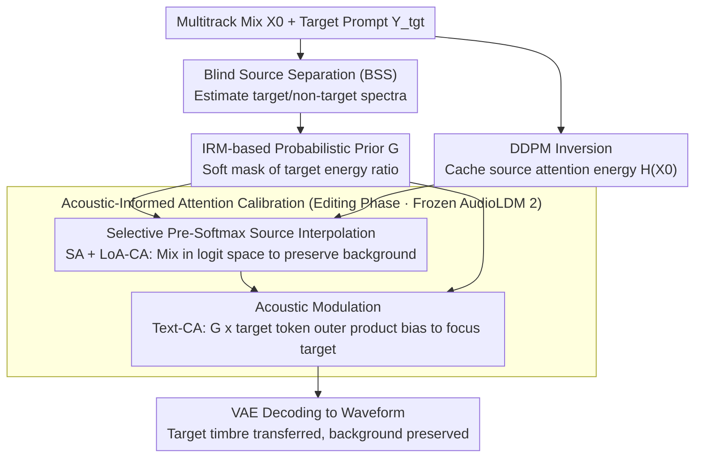

# Polyphonia: Zero-Shot Timbre Transfer in Polyphonic Music with Acoustic-Informed Attention Calibration

**Conference**: ICML 2026  
**arXiv**: [2605.10203](https://arxiv.org/abs/2605.10203)  
**Code**: None  
**Area**: Diffusion Models / Music Generation / Zero-Shot Editing / Audio Signal Processing  
**Keywords**: Timbre Transfer, Attention Calibration, Ideal Ratio Mask, Multitrack Mixing, AudioLDM 2

## TL;DR
Polyphonia extends zero-shot timbre transfer from single-track to dense multitrack mixes. By utilizing the Ideal Ratio Mask (IRM) obtained through Blind Source Separation (BSS) as an external acoustic prior, it performs "source interpolation + acoustic modulation" within the pre-softmax attention logits. This allows the spectrum of the target part (e.g., vocals) to be replaced by a new timbre (e.g., violin) while strictly preserving the background accompaniment, achieving a 15.5% improvement in target alignment compared to the Prev. SOTA.

## Background & Motivation
**Background**: Text-to-music diffusion models (AudioLDM 2, Stable Audio) can generate high-fidelity music from text, but a gap remains for professional production: **fine-grained editing control**. Among these tasks, "stem-specific timbre transfer" (replacing the timbre of one specific track while keeping others unchanged) is the most useful yet challenging sub-task.

**Limitations of Prior Work**: Existing zero-shot editing approaches fail in two ways: (1) **Vanilla cross-attention methods** (MusicGen, DDPM-Friendly, SDEdit): While cross-attention captures semantics, it lacks spectral resolution. In dense mixes, target tokens and background spectra become entangled, leading to diffuse attention maps and **boundary leakage**, where the background is regenerated alongside the target; (2) **Feature preservation methods** (Melodia, SteerMusic, MusicMagus): These inject self/cross-attention or apply energy gradients for "rigid preservation." However, in dense mixes, the features to be preserved are themselves entangled, leading to **target misalignment** where the target timbre fails to manifest.

**Key Challenge**: Images contain opaque pixels where each pixel belongs to "target XOR background," making cross-attention naturally separable. Audio is a **spectral superposition**, where the same time-frequency bin carries multiple parts. There is no binary mask; query vectors $Q$ represent "mixed features" rather than discrete objects. Consequently, cross-attention responds to both target and non-target keys, preventing precise localization.

**Goal**: (1) Identify an objective, zero-shot computable prior for the "target spectral envelope" to compensate for the insufficient spectral resolution of cross-attention; (2) Use this prior within the attention mechanism for simultaneous "target alignment" and "non-target preservation"; (3) Establish a standardized evaluation for stem-specific timbre transfer.

**Key Insight**: Since internal attention is unreliable (Fig. 2(b) shows diffuse CA maps for vocals even with correct conditions), the focus shifts to external acoustic knowledge. The **Ideal Ratio Mask (IRM)** $G_\text{IRM}=\sqrt{|S_\text{tgt}|^2/(|S_\text{tgt}|^2+|S_\text{con}|^2)}$ from speech enhancement provides a natural probabilistic "target energy proportion," which can be obtained zero-shot via Blind Source Separation (BSS).

**Core Idea**: Inject the IRM as a soft acoustic prior into the pre-softmax attention logits of the diffusion U-Net. Specifically, use "source interpolation" in Self-Attention/LoA-CA to retain the background and "acoustic modulation" in Text-CA to focus the target semantics.

## Method

### Overall Architecture
The objective is to change the timbre of a single part within a dense multitrack mix while keeping everything else intact. The main difficulty is that audio spectra are superimposed, meaning no binary masks like those in images exist, making internal attention fail at target localization. Polyphonia does not rely on the model's internal attention; instead, it uses BSS to calculate an external "target energy proportion map" (IRM) from the mix. This map is treated as a soft prior and injected into the frozen AudioLDM 2 attention mechanism: background is preserved in the Self-Attention and LoA paths, while target semantics are compressed into the appropriate spectral regions in the Text-CA path. The entire pipeline follows an inversion-then-edit dual-path structure and requires no training.

Specifically, the input is the log-mel spectrogram of the multitrack mix $X_0\in\mathbb{R}^{T\times F}$ and the target prompt $Y_\text{tgt}$ (e.g., "violin"). First, BSS decomposes the estimated target $\tilde S_\text{tgt}$ and non-target $\tilde S_\text{con}$ to construct the acoustic prior $G$. Then, DDPM inversion maps $X_0$ to latents and caches source hidden features $\mathcal{H}(X_0)$ (including source energy matrices $E_\text{src}$ for SA/LoA-CA). During the editing phase, Acoustic-Informed Attention Calibration is performed during the T-UNet forward pass, and the VAE decoder reconstructs the waveform.

### Key Designs

**1. IRM-based Probabilistic Acoustic Prior $G$: Substituting Binary Masks with Energy Proportions**

The pain point is that audio time-frequency bins are superpositions of multiple parts; one bin carries both target and background, meaning there is no discrete "pixel ownership" mask as in images. Consequently, internal cross-attention becomes diffuse in dense mixes. Polyphonia moves localization cues from internal attention to external BSS. A naive approach would use normalized target magnitude $G_\text{norm}=\mathcal{N}(|\tilde S_\text{tgt}|)$, but this only considers loudness and ignores background energy, mistakenly tagging loud background regions as the target and distorting them. Polyphonia instead uses the **Ideal Ratio Mask** $G_\text{IRM}=\sqrt{|\tilde S_\text{tgt}|^2/(|S_\text{tgt}|^2+|\tilde S_\text{con}|^2)}\in[0,1]$, representing the "proportion of target energy at this time-frequency point." Background-dominant positions are automatically suppressed, while target-dominant positions approach 1. This creates a continuous soft mask that respects the physics of audio superposition while providing a computable instruction for where to edit or preserve. Finally, it is aligned to the AudioLDM 2 input space using a Mel filterbank to obtain $G_{X_0}$ and downsampled to each LDM layer resolution $G_z^l$. Since BSS is a pre-trained component, the process remains zero-shot.

**2. Selective Pre-Softmax Source Interpolation: Mixing in Logit Space to Preserve Background Structure**

This step addresses the requirement that "the structure and texture of non-target parts must be strictly preserved." Polyphonia caches the source attention energy (pre-softmax logit) $E_\text{src}\in\mathcal{H}(X_0)$ during inversion. During editing, $G$ is used for weighted mixing: $E_\text{mix}=(1-G)\odot E_\text{src}+G\odot Q K^\top/\sqrt{d}$, followed by softmax to obtain $\text{Attn}_\text{itp}=\text{softmax}(E_\text{mix})V$. Background regions (small $G$) inherit source logits, while target regions (large $G$) allow the current Q-K to decide. Critically, mixing occurs in **logit space rather than post-softmax**. Traditional prompt-to-prompt methods (Hertz, Cao) perform replacement on post-softmax probabilities, which works for images but linearly smears sparse attention peaks in audio, introducing entropy and destroying structure. By mixing in logit space and letting the non-linearity of softmax amplify it, the sparse patterns of the source attention—which tokens are strong or weak—are preserved cleanly. This is applied to both SA and LoA-CA.

**3. Acoustic Modulation: Using IRM as an Inductive Bias for Text-CA to Focus Target Semantics**

The final step solves the issue of "target token attention diffusing in dense mixes and leaking into the background." Polyphonia constructs a target token mask $\mathbf{m}^\text{text}\in\{0,1\}^{L_y}$, where $\mathbf{m}_i^\text{text}=1$ if token $i$ is the target noun (e.g., "violin"). The flattened acoustic prior $\mathbf{g}=\text{Flatten}(G)\in\mathbb{R}^{L_z}$ and the token mask undergo an outer product to form a spatio-textual bias $\mathbf{B}=\mathbf{g}\otimes\mathbf{m}^\text{text}\in\mathbb{R}^{L_z\times L_y}$, which is injected into the pre-softmax logit: $E_\text{bias}=Q K^\top/\sqrt{d}+\lambda\cdot\mathbf{B}$. Intuitively, this selectively raises attention logits at the intersection of "high-energy target latent positions" and "target semantic tokens," forcing the generation focus to align with the original target's spectral envelope. The parameter $\lambda$ controls modulation strength, and its continuity complements $G$, resulting in a smooth transition between the target editing area and the background preservation area.

### Loss & Training
Completely **Training-Free**: The AudioLDM 2 base model parameters are untouched; all modifications occur within the inversion/editing attention paths. Algorithm 1 summarizes the full procedure. A pre-trained Demucs-like 4-stem separator is used for BSS, with target-to-stem mapping handling specialized instruments via the "Others" category.

## Key Experimental Results

### Main Results
Evaluated on PolyEvalPrompts: 1,170 editing tasks across MusicDelta and MUSDB18-HQ test sets. Objective metrics: CLAP (text alignment), CQT1-PCC (rhythm/melody fidelity), LPAPS (perceptual similarity), FAD/KAD (quality distribution distance). Subjective metrics: 5-point scale for TTA (Target Timbre Alignment), CTI (Content Temporal Integrity), and GAC (Global Audio Coherence).

| Dataset | Method | CLAP↑ | CQT1-PCC↑ | LPAPS↓ | FAD↓ | TTA↑ | GAC↑ |
|--------|------|-------|-----------|--------|------|------|------|
| MusicDelta | SDEdit | 0.119 | 0.090 | 6.907 | 1.914 | 1.13 | 1.46 |
| MusicDelta | MusicGen | 0.377 | 0.069 | 6.142 | 1.331 | 3.59 | 3.62 |
| MusicDelta | Melodia | 0.380 | 0.513 | 3.540 | 0.715 | 3.22 | 3.47 |
| MusicDelta | SteerMusic | 0.317 | **0.556** | 3.614 | 0.738 | 3.16 | 3.32 |
| MusicDelta | **Ours** | **0.437** | 0.547 | 4.096 | 0.949 | **3.80** | **3.69** |

CLAP (Target Timbre Alignment) increased by ~15.5% compared to the strongest baseline. Subjective TTA/GAC scores also ranked first, while CQT1-PCC remained competitive, indicating background rhythm was preserved.

### Ablation Study

| Configuration | Critical Change | Observation |
|------|---------|------|
| Full Polyphonia | IRM + Pre-Softmax SI + Acoustic Modulation | Best overall balance. |
| $G_\text{norm}$ vs. IRM | Replace prob. ratio with normalized magnitude | High-energy background areas mis-edited; non-target distortion. |
| w/o Source Interpolation | Use only Acoustic Modulation | Background structure lost (CQT1-PCC drops significantly). |
| w/o Acoustic Modulation | Use only SI | Target semantic leakage; CLAP / TTA decline. |
| Post-Softmax SI | Mix in probability space | SA entropy increases (structure loss); LoA loses sharpness. |
| Separate-Edit-Remix | Edit target independently, then add signals | SongEval coherence drops; target sounds "detached" from accompaniment. |

### Key Findings
- **IRM is more critical than $G_\text{norm}$**: Using loudness-based guidance misidentifies quiet target regions in loud backgrounds; IRM's "energy proportion" concept is the core of non-target integrity.
- **Pre-Softmax injection outperforms Post-Softmax**: Shannon entropy analysis shows Pre-Softmax keeps SA close to the source and keeps LoA sharper, confirming that mixing before non-linear amplification is the correct order.
- **Separate-Edit-Remix is ineffective**: Independently generating the target lacks contextual coherence. Holistic editing with IRM guidance is required to ensure acoustic unity.
- **Audio vs. Visual Fundamentals**: The authors clarify that spectral superposition differs from binary occlusion masks in images, explaining why direct adaptations of image editing techniques fail in music.

## Highlights & Insights
- **Diagnosis + Prescription**: The paper clarifies the "semantic-acoustic misalignment" failure mode using Fig. 2 before offering the dual-calibration remedy; this "attribution to geometry" logic is a template for methodology papers.
- **Bridging Signal Processing and Diffusion**: Using IRM (traditionally for denoising) as a spatial prior for diffusion latents is a novel cross-disciplinary application of Blind Source Separation.
- **Pre-Softmax Injection as a Transferable Trick**: Any editing scenario requiring hierarchical attention control could benefit from evaluating Pre- vs. Post-Softmax injection.
- **PolyEvalPrompts Benchmark**: With 1,170 tasks and 10 metrics, it transforms "stem-specific timbre transfer" into a reproducible scientific problem.

## Limitations & Future Work
- **Dependency on BSS**: Models like Demucs are trained on specific stem taxonomies; rare instruments default to the "Others" category, reducing localization precision.
- **Token Mask Parsing**: Currently relies on rule-based identification; complex prompts may lead to missing modifiers.
- **$\lambda$ as a Manual Hyperparameter**: Different instrument pairs require different $\lambda$ values; automated adaptation is missing.
- **Backbone Generalization**: Robustness on other models like Stable Audio has not been demonstrated.

## Related Work & Insights
- **Comparison to SDEdit/DDIM Inversion**: Global inversion lacks localization; Polyphonia uses IRM gating to restrict changes to the target spectrum.
- **Comparison to Melodia/SteerMusic**: These rely on internal attention which is contaminated in dense mixes; this work uses external IRM for a clean acoustic boundary.
- **Related to PPAE (Xu 2024)**: While PPAE targets sparse acoustic events, Polyphonia manages dense music where overlap is the primary challenge.

## Rating
- Novelty: ⭐⭐⭐⭐ Utilizing IRM for diffusion editing is a first; the pre-softmax dual-calibration design is innovative.
- Experimental Thoroughness: ⭐⭐⭐⭐ Large-scale benchmark (1,170 tasks) and extensive ablation; however, lacks cross-backbone validation.
- Writing Quality: ⭐⭐⭐⭐⭐ Problem motivation and "semantic-acoustic misalignment" diagnosis are exceptionally clear.
- Value: ⭐⭐⭐⭐ Provides a ready-to-use zero-shot solution for multitrack music editing and reintegrates classical signal processing priors into the diffusion paradigm.

## Related Papers

- [\[ICML 2026\] MusicDET: Zero-Shot AI-Generated Music Detection](musicdet_zero-shot_ai-generated_music_detection.md)
- [\[ACL 2026\] FC-TTS: Style and Timbre Control in Zero-Shot Text-to-Speech with Disentangled Speech Representations](../../ACL2026/audio_speech/fc-tts_style_and_timbre_control_in_zero-shot_text-to-speech_with_disentangled_sp.md)
- [\[ICLR 2026\] AC-Foley: Reference-Audio-Guided Video-to-Audio Synthesis with Acoustic Transfer](../../ICLR2026/audio_speech/ac-foley_reference-audio-guided_video-to-audio_synthesis_with_acoustic_transfer.md)
- [\[ACL 2025\] ControlSpeech: Towards Simultaneous and Independent Zero-shot Speaker Cloning and Zero-shot Language Style Control](../../ACL2025/audio_speech/controlspeech_zero_shot.md)
- [\[ACL 2025\] Zero-Shot Text-to-Speech for Vietnamese](../../ACL2025/audio_speech/zero-shot_text-to-speech_for_vietnamese.md)

<!-- RELATED:END -->

<!-- RELATED:START -->

## Related Papers

- [\[ICML 2026\] MusicDET: Zero-Shot AI-Generated Music Detection](musicdet_zero-shot_ai-generated_music_detection.md)
- [\[ACL 2026\] FC-TTS: Style and Timbre Control in Zero-Shot Text-to-Speech with Disentangled Speech Representations](../../ACL2026/audio_speech/fc-tts_style_and_timbre_control_in_zero-shot_text-to-speech_with_disentangled_sp.md)
- [\[ICLR 2026\] AC-Foley: Reference-Audio-Guided Video-to-Audio Synthesis with Acoustic Transfer](../../ICLR2026/audio_speech/ac-foley_reference-audio-guided_video-to-audio_synthesis_with_acoustic_transfer.md)
- [\[ICML 2026\] VocSim: A Training-Free Benchmark for Zero-Shot Content Identity Recognition for Single-Source Audio](vocsim_a_training-free_benchmark_for_zero-shot_content_identity_in_single-source.md)
- [\[ACL 2025\] ControlSpeech: Towards Simultaneous and Independent Zero-shot Speaker Cloning and Zero-shot Language Style Control](../../ACL2025/audio_speech/controlspeech_zero_shot.md)

<!-- RELATED:END -->
