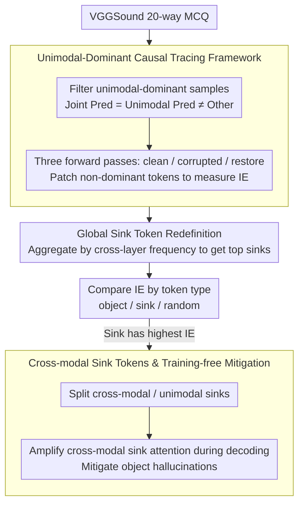

# Probing Cross-modal Information Hubs in Audio-Visual LLMs

**Conference**: ICML 2026  
**arXiv**: [2605.10815](https://arxiv.org/abs/2605.10815)  
**Code**: https://github.com/kaistmm/crossmodal-hub  
**Area**: Multimodal VLM / Mechanistic Interpretability / Audio-Visual LLM  
**Keywords**: AVLLM, attention sink, cross-modal information, causal tracing, hallucination mitigation

## TL;DR
The authors employ a causal tracing and unimodal-dominance framework to reveal hidden hubs in Audio-Visual LLMs called "cross-modal sink tokens," where the majority of cross-modal information is condensed. Based on this, a training-free attention amplification strategy is proposed to significantly mitigate object hallucinations.

## Background & Motivation

**Background**: Audio-Visual Large Language Models (AVLLM) have become a unified architecture for series like Qwen2.5/3-Omni and video-SALMONN by temporally interleaving audio encoding, video encoding, and text tokens into an LLM backbone. They are regarded as key to achieving "full-scene multimodal reasoning."

**Limitations of Prior Work**: While extensive mechanistic interpretability research (causal tracing, sparse autoencoders, circuit discovery) exists for text and vision LLMs, how AVLLMs fuse information from two non-text modalities remains largely a black box. This makes it difficult to locate the roots of hallucinations or perform safety audits.

**Key Challenge**: Audio and video interact bi-directionally, where either side may inject semantics into the other during self-attention. However, the authors find that the positions of sink tokens in AVLLMs are not as layer-stable as those in LVLMs, rendering traditional layer-wise localization methods ineffective.

**Goal**: To answer two specific sub-questions: (1) In which tokens is cross-modal information actually stored? Is it object-aligned tokens or sink tokens? (2) Is there functional differentiation within sink tokens?

**Key Insight**: The authors invent a "unimodal-dominant" filtering strategy, retaining only samples where the joint prediction equals the unimodal prediction but differs from the other modality's prediction (e.g., video-dominant). Such samples naturally indicate information flow: the dominated side must move information to the tokens of the other side. Thus, causal tracing on non-dominant tokens clearly reveals which positions carry "external signals."

**Core Idea**: Sink tokens are subdivided into unimodal sinks and cross-modal sinks based on "which modality attends to them." The latter serve as the true cross-modal information hubs. Consequently, simply increasing the attention weight of cross-modal sinks during decoding significantly reduces hallucinations at zero training cost.

## Method

### Overall Architecture
The analysis pipeline consists of three stages: (i) Filtering audio-dominant and video-dominant samples using a 20-way MCQ on VGGSound, keeping only $\hat y_{av}=\hat y_a \neq \hat y_v$ or its dual; (ii) Measuring the indirect effect across three forward passes: clean / corrupted (dominant modality zeroed) / corrupted-with-restoration (patching clean hidden states onto non-dominant tokens); (iii) Categorizing candidate tokens into object / sink / random / all non-dominant to compare which yields the highest IE. In the downstream application stage, sink tokens are further split into cross-modal and unimodal based on "attention from the opposing modality." Attention is amplified only for cross-modal sinks during decoding to serve as a training-free hallucination suppressor.

### Key Designs

**1. Unimodal-dominant Causal Tracing Framework: Decomposing Bi-directional Interaction into Directional Causal Interventions**

Traditional causal tracing in LLM/LVLM only tracks the unidirectional flow from text to other modalities. However, in AVLLMs, both audio and video can be signal sources, and blind tracing across all samples would be drowned in noise. The authors solve this by retaining only "unimodal-dominant" samples—using audio dominance as an example, where the condition $\hat y_{av}=\hat y_a \neq \hat y_v$ (joint prediction equals audio prediction but differs from video prediction) filters for segments where audio provides decisive clues while video is ambiguous. These samples naturally indicate info flow from audio to video tokens. Three forward passes are performed: a clean run, a corrupted run (zeroing original audio representations), and a restoration run (patching hidden states $h_S^{\text{clean}}$ of a video token subset $S$ from the clean run back into the corrupted run). If the prediction is restored, it indicates $S$ absorbed audio information in the clean run. This is quantified by $\text{IE}_{\text{clean}}(S)=P_{h_S^{\text{clean}}}[o_{\text{clean}}]-P[o_{\text{clean}}]$ and the dual $\text{IE}_{\text{corrupt}}(S)$. This is effective because dominant samples provide inherent "source-target" labels, transforming passive observation into equivalent causal intervention experiments and bypassing the difficulty of directional tracking in bi-directional interactions.

**2. Global Sink Token Redefinition: Locking Stable Hubs in AVLLMs with Layer-Drifting Sinks**

The authors observe that unlike LVLMs, sink token positions in AVLLMs change in every layer. If sinks are selected layer-wise, they mix with dense non-sink tokens, distorting IE attribution. The strategy is to no longer select sinks layer-by-layer but to count the frequency of each token identified as a sink across all layers. The top $|\mathcal T|/N$ tokens with the highest frequency are selected as global sinks, where $N\in\{2,3,4\}$ controls sparsity. Sinks themselves are still identified by "abnormally large activation magnitudes in predefined sink dimensions." Aggregating by frequency preserves the sparsity of sinks while directing causal tracing toward a cross-layer stable subset—resulting in the sink subset's IE being significantly higher than object or random baselines.

**3. Cross-modal Sink Tokens and Training-free Hallucination Mitigation: Amplifying "Fused Credible Summaries" into Inference**

Hallucinations often arise from the LLM over-relying on local noise from a single modality. The authors calculate the average attention weights from same-modality vs. cross-modality for each sink token. Sinks with high cross-modality attention are classified as cross-modal sinks—the true hubs carrying integrated cross-modal info. During generation, an amplification coefficient is applied to cross-modal sink tokens in the attention matrix. This forces the model to rely more on these fused cross-modal summaries rather than local tokens from individual modalities. This suppresses hallucinations because cross-modal sinks represent "factual summaries supported by both modalities," and amplifying them pulls reasoning back into factual regions supported by both. Furthermore, the intervention only modifies attention weights without changing parameters or requiring training, deployable with a few lines of hooks.

### Loss & Training
No training is involved in the analysis phase (pure forward + hooks). The hallucination mitigation phase is also an inference-only intervention, introducing only a scalar adjustment coefficient. All experiments are conducted directly on five open-source checkpoints: Qwen2.5-Omni (7B/3B), video-SALMONN-o1 (7B), and video-SALMONN2+ (7B/3B).

## Key Experimental Results

### Main Results

Patching effects of different token subsets (Higher IE indicates more cross-modal information; audio-dominant setting, values from Table 1):

| Model | All Non-dominant (Upper) | Object | Sink (N=2) | Random (N=2) |
|---|---|---|---|---|
| Qwen2.5-Omni 7B | 9.61 / 5.28 | 5.04 / 2.44 | 6.24 / 2.94 | 4.24 / 2.37 |
| Qwen2.5-Omni 3B | 7.83 / 3.48 | 3.53 / 1.12 | 6.99 / 2.70 | 4.05 / 1.20 |
| video-SALMONN-o1 7B | 35.55 / 33.18 | 16.22 / 15.06 | 25.33 / 22.73 | 20.43 / 18.11 |
| video-SALMONN2+ 7B | 6.45 / 5.27 | 3.78 / 3.93 | 4.79 / 4.20 | 4.21 / 4.01 |

(Values are $\text{IE}_{\text{clean}}$ / $\text{IE}_{\text{corrupt}}$. Sinks consistently outperform object and random tokens given an equivalent token count.)

### Ablation Study

| Configuration | Key Finding | Meaning |
|---|---|---|
| Sink N=2/3/4 | Halving tokens leads to only minor IE drops | Sink info is highly concentrated; high sparsity maintains performance |
| Object token | Only slightly better than random | Object-aligned tokens are not primary storage locations, refuting the object-centric hypothesis in LVLMs |
| Cross-modal vs. Unimodal Sink | Former has significantly higher IE | Functional differentiation exists within sinks; cross-modal sinks are the true hubs |

### Key Findings
- Across five models, results consistently indicate that cross-modal information storage follows a "sink-centric" rather than an "object-centric" hypothesis, which contradicts the phenomenon in LVLMs where object info is stored in object tokens.
- Sink positions in AVLLMs drift across layers, meaning direct application of LVLM interpretability conclusions fails. Frequency-aggregated global sinks provide a more portable definition.
- By amplifying cross-modal sink attention, a significant decrease in object hallucinations is observed without retraining, validating the "mechanistic understanding → engineering modification" loop.

## Highlights & Insights
- Using "unimodal dominance" as a natural causal intervention tool cleverly avoids the problem of "bi-directional interaction being untraceable." This approach is applicable to future LLM analyses with more than three modalities.
- The binary classification of unimodal vs. cross-modal sinks advances research on "what attention sinks are" from "positional" to "functional"; cross-modal sinks can be viewed as "multimodal summary registers" learned spontaneously by the model.
- The training-free hallucination mitigation requires only a few lines of hooks in the attention layer, incurring near-zero overhead. It is suitable for industrial deployment and highly interpretable—explaining "why the model is now more credible."

## Limitations & Future Work
- Experiments only cover VGGSound-style samples and MCQ protocols; whether the functional differentiation of sinks holds in open-ended Q&A needs verification.
- Only "Audio-Visual" modalities were analyzed. Models like Qwen3-Omni have introduced speech and image generation; whether the cross-modal sink concept extends to these output ports is unknown.
- The attention amplification coefficient is currently a uniform scalar. Future work could implement per-head/per-layer adaptation or even a lightweight gating mechanism to dynamically select amplification intensity.

## Related Work & Insights
- **vs. Neo et al. (LVLM object-centric)**: They found LVLMs store object info in object tokens; Ours proves AVLLMs use sink tokens instead, suggesting internal structural differences between modality combinations are larger than expected.
- **vs. Kang/Luo (LVLM sink)**: Previous work only identified that sinks aggregate global information; Ours further splits sinks into unimodal/cross-modal categories, pushing research granularity to the sub-class level.
- **vs. Retraining Mitigation (RLHF / DPO)**: Ours does not modify parameters or collect preference data, providing a zero-data alternative path especially suitable for emergency patching post-deployment.

## Rating
- Novelty: ⭐⭐⭐⭐ First to extend causal tracing to bi-directional multimodal scenarios and propose the cross-modal sink concept.
- Experimental Thoroughness: ⭐⭐⭐⭐ Consistent validation across five open-source AVLLMs with rigorous token-aligned control designs.
- Writing Quality: ⭐⭐⭐⭐ Intuitive framework and diagrams; clear hypothesis-verification structure.
- Value: ⭐⭐⭐⭐ Provides both interpretability insights and practical training-free mitigation; closes the loop between mechanism research and engineering.

<!-- RELATED:START -->

## Related Papers

- [\[AAAI 2026\] CCFQA: A Benchmark for Cross-Lingual and Cross-Modal Speech and Text Factuality Evaluation](../../AAAI2026/audio_speech/ccfqa_a_benchmark_for_cross-lingual_and_cross-modal_speech_and_text_factuality_e.md)
- [\[ICML 2026\] Towards Understanding Modality Interaction in Multimodal Language Models via Partial Information Decomposition](towards_understanding_modality_interaction_in_multimodal_language_models_via_par.md)
- [\[ICML 2026\] Do Audio LLMs Listen or Read? Analyzing and Mitigating Paralinguistic Failures with VoxParadox](do_audio_llms_listen_or_read_analyzing_and_mitigating_paralinguistic_failures_wi.md)
- [\[ICML 2026\] JAEGER: Joint 3D Audio-Visual Grounding and Reasoning in Simulated Physical Environments](jaeger_joint_3d_audio-visual_grounding_and_reasoning_in_simulated_physical_envir.md)
- [\[ICML 2026\] Probing Token Spaces under Generator Shift in AI-Generated Music Detection](probing_token_spaces_under_generator_shift_in_ai-generated_music_detection.md)

<!-- RELATED:END -->
