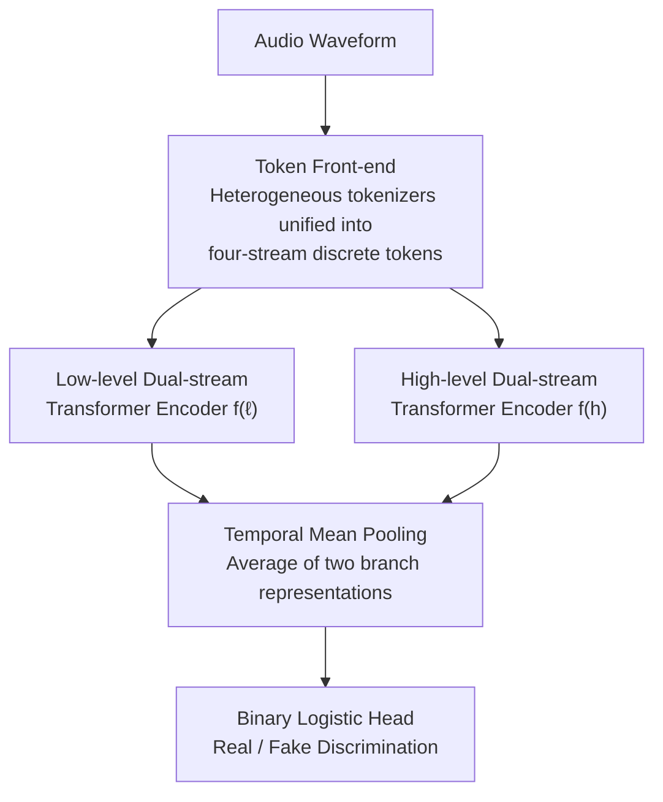

# Probing Token Spaces under Generator Shift in AI-Generated Music Detection

**Conference**: ICML2026  
**arXiv**: [2606.08663](https://arxiv.org/abs/2606.08663)  
**Code**: https://github.com/MAAP-LAB/CoMoE  
**Area**: Audio/Speech · AI-Generated Content Detection  
**Keywords**: AI music detection, neural audio codecs, discrete tokens, generator shift, cross-source generalization

## TL;DR
This paper elevates the **token space** (choice of tokenizer), which was previously treated as a "preprocessing detail" in AI music detection, to a **primary experimental variable**. By fixing the downstream classifier (CoMoE) and swapping only the input tokens, and conducting "source-restricted" evaluations on the newly constructed MoM-open (where only one fake generator is seen during training while others are used for testing), the study demonstrates that different token spaces exhibit massive robustness gaps under generator shift (e.g., X-Codec tokens achieving 89.0% AUC vs. EnCodec tokens at 58.6% on Fake-Udio).

## Background & Motivation

**Background**: AI music detection aims to determine whether a piece of music is human-composed or produced by generative models (such as Suno, Udio, DiffRhythm). Existing detectors are mostly based on spectrograms, raw waveforms, or continuous self-supervised representations (e.g., MERT, Wav2Vec2) and report near-saturated high scores on standard benchmarks like SONICS and CLAM.

**Limitations of Prior Work**: Training and test sets in standard benchmarks often share the same set of generators. Consequently, detectors likely learn **generator-specific fingerprint artifacts** rather than the essential distinction of "fake vs. real." When deployed, detectors must face **generator sources never seen during training**, where high scores on standard splits severely overestimate real-world robustness.

**Key Challenge**: What determines whether a model can still detect fakes after a generator shift? Existing work focuses on classifier architecture design but ignores that the **input representation (token space) itself** might be the key to controlling cross-generator robustness. Furthermore, codec-style discrete tokens are not a single representation—different tokenizers induce different codebooks, temporal rates, and quantization behaviors, transforming the choice of tokenizer from a preprocessing detail into an experimental independent variable.

**Goal**: (i) Elevate tokenizer selection from a preprocessing detail to a controlled experimental variable; (ii) Construct a reproducible, open benchmark with source-restricted splits; (iii) Quantify the differences between various token spaces under generator shift.

**Key Insight**: The authors hypothesize that codec-style discrete tokens provide a forensic perspective distinct from continuous acoustic/semantic features. Neural codecs use Residual Vector Quantization (RVQ) to represent audio as multi-stream codebook sequences, potentially exposing forgery traces in codebook usage, token transitions, and quantization hierarchies that are invisible after pooling continuous features. To verify this, variables must be **controlled**: fix the classifier and training recipe, and only change the tokens.

**Core Idea**: Use a **fixed, compact classifier CoMoE** as a "probe" to ensure all differences reflect the input token space, then use source-restricted evaluations to force the dimension of generator shift to light.

## Method

### Overall Architecture
The method consists of two components: a **controlled probe CoMoE** (making the tokenizer swap the sole variable) and an **evaluation protocol MoM-open + source-restricted split** (to expose the hidden difficulty of generator shift). The data flow of CoMoE is as follows: any audio is mapped via a tokenizer front-end into **four streams of discrete tokens** (two low-level, two high-level). The low-level and high-level pairs are fed into two Transformer encoders with identical structures. Temporal mean pooling extracts two branch representations, which are then averaged and fed into a binary logistic head for real/fake classification.

In the entire pipeline, **the only replaced component is the tokenizer front-end**—the classifier architecture, training recipe, and evaluation protocol are all frozen. Thus, any difference between two CoMoE results is cleanly attributed to the token space itself.

### Key Designs

**1. CoMoE: A controlled probe with fixed downstream and swapped token spaces**

To answer whether the token space or the classifier determines robustness, the classifier must be held constant. CoMoE consumes four discrete token streams $\mathbf{T}=(\mathbf{T}^{(\ell_1)},\mathbf{T}^{(\ell_2)},\mathbf{T}^{(h_1)},\mathbf{T}^{(h_2)})$, where each stream $\mathbf{T}^{(s)}\in\{0,\dots,C-1\}^{L}$ (codebook size $C=1024$, truncated/padded to fixed length $L$). The low-level and high-level pairs are processed by two 4-layer Transformer encoders with hidden dimension $d=256$ and 4 heads. After temporal mean pooling, two branch representations are obtained:

$$\mathbf{h}^{(\ell)}=\mathrm{Pool}\big(f^{(\ell)}(\mathbf{T}^{(\ell_1)},\mathbf{T}^{(\ell_2)})\big),\quad \mathbf{h}^{(h)}=\mathrm{Pool}\big(f^{(h)}(\mathbf{T}^{(h_1)},\mathbf{T}^{(h_2)})\big)$$

The two branch representations are averaged and passed through a logistic head $\hat{y}=\sigma(\mathbf{w}^\top \mathbf{z}+b)$, where $\mathbf{z}=\tfrac{1}{2}(\mathbf{h}^{(\ell)}+\mathbf{h}^{(h)})$. The dual-branch design draws inspiration from the "complementary semantic and low-level artifacts" approach (e.g., AIDE in AIGC image detection), allowing different codebook levels to carry different forensic information. All CoMoE variants share this four-stream classifier, which is the prerequisite for its role as a "probe."

**2. Token Front-end: Unifying heterogeneous tokenizers into a single four-stream interface**

Different tokenizers vary in codebook count, temporal rate, and quantization methods, making direct comparison difficult. The authors use a unified rule to map them to "two low-level + two high-level" streams: for RVQ codecs, **early codebooks are treated as low-level and late codebooks as high-level**; for SSL models like MERT, **shallow layers are low-level and deep layers are high-level**. Specifically: EnCodec 24kHz uses codebooks $q=0,1$ as low and $q=6,7$ as high; DAC 44kHz uses $q=0,1$ and $q=7,8$; X-Codec mini (a semantic-aware codec trained on music with 12-layer RVQ) uses $q=0,1$ and $q=10,11$; MERT $k$-means applies MiniBatch $k$-means discretization to frame features from layers $\{0,1,11,12\}$, where layers $0,1$ are low-level and $11,12$ are high-level. This mapping is a **controlled interface rather than a theoretical constraint**, ensuring all tokenizers are compared on a level playing field.

**3. MoM-open and source-restricted splits: Exposing the hidden difficulty of generator shift**

The original MoM-CLAM benchmark relies on real audio from YouTube, which is difficult to redistribute or reproduce. The authors replaced the real half with the freely distributable **FMA-medium + MTG-Jamendo** while retaining the original fake generator protocols to reconstruct **MoM-open** (146,309 items total). The key innovation is the **split protocol**: besides the standard base split, they designed **fake-source restricted** splits (Fake-Suno3.5 / Fake-Udio), where the model is trained only on one fake source and tested on the others. Validation sets are sampled only from the training sources, and thresholds are never selected using held-out generators. The significance of this split is that base and real-restricted results are almost saturated, whereas fake-source restriction serves as the "microscope" that truly reveals token space differences.

### Loss & Training
All CoMoE variants share the same recipe: AdamW, 12 epochs, learning rate $2\times10^{-4}$, label smoothing 0.05, seed 42, on a single H100. Metrics include AUC and held-out-fake detection rates (using a fixed threshold $\tau^\star$ selected by maximizing the validation F1 score). Two non-CoMoE baselines are included: MLP(MERT) (mean-pooled MERT features + small MLP) and CLAM (the dual-rate reference detector from the original benchmark, using MERT + Wav2Vec2 with weighted cross-attention).

## Key Experimental Results

### Main Results
Cross-generator OOD AUC (%). Base and real-restricted results are near saturation; differences are concentrated in the fake-source restricted columns. Absolute values are shown outside parentheses.

| Model | base | Fake-Suno3.5 | Fake-Udio |
|------|------|--------------|-----------|
| CLAM | 99.92 | **97.72** | 66.51 |
| MLP (MERT) | 99.77 | 86.87 | 67.45 |
| CoMoE (X-Codec) | 99.93 | 86.97 | **89.04** |
| CoMoE (DAC) | 99.82 | 88.33 | 77.28 |
| CoMoE (EnCodec) | 96.44 | 85.15 | 58.64 |
| CoMoE (MERT $k$-means) | 99.83 | 92.22 | 73.26 |
| MERT-continuous (same backbone) | 99.87 | 93.84 | 71.91 |

### Operation Point Analysis
Held-out-fake detection rates (%) on unseen fake sources after fixing the validation set threshold—note how this can diverge from AUC rankings.

| Model | Fake-Suno3.5 | Fake-Udio |
|------|--------------|-----------|
| CLAM | 71.0 | 2.6 |
| MLP (MERT) | 60.1 | 26.0 |
| CoMoE (X-Codec) | 38.7 | **45.1** |
| CoMoE (DAC) | 61.4 | 29.2 |
| CoMoE (EnCodec) | 43.8 | 23.5 |
| CoMoE (MERT $k$-means) | 51.9 | 17.3 |
| MERT-continuous | 49.9 | 7.8 |

### Key Findings
- **Token space identity is the dominant factor under a fixed architecture**: All CoMoE variants share the same classifier, yet on Fake-Udio, EnCodec drops to 58.64%, DAC to 77.28%, while X-Codec remains at 89.04%—all differences stem from the input tokens. Furthermore, there is no "universal optimal token": MERT $k$-means is strongest on Fake-Suno3.5 (92.22%), while X-Codec dominates on Fake-Udio, suggesting the optimal token space varies with the target generator.
- **The collapse of CLAM is most dramatic**: A strong baseline with 99.92% on the base split sees its AUC drop to 66.51% on Fake-Udio, with a corresponding held-out detection rate of only 2.6% (almost total failure)—proving that robustness on standard splits can be a total illusion.
- **Music-pretrained representations alone do not explain the gain**: MLP(MERT) is strong on base/real-restricted but drops significantly on fake-restricted, indicating that X-Codec’s advantage is not just due to "music-pretrained representations" but also the **serialized token structure**.
- **Discretization per se does not explain AUC but affects operation point stability**: MERT-continuous, using the same backbone with continuous features, achieves higher AUC on Fake-Suno3.5 (93.84 vs 92.22) but its Fake-Udio held-out detection rate collapses from 17.3% to 7.8%. This divergence between AUC and operation point behavior emphasizes that fake-source evaluation must consider both.

## Highlights & Insights
- **Reframing "preprocessing details" as "primary experimental variables"**: The greatest value of this paper is not a specific SOTA number, but a paradigm shift—reminding researchers that under generator shift, token spaces should be systematically ablated like architectures, rather than choosing a tokenizer arbitrarily. This insight is transferable to all "cross-generator" forensic tasks like speech deepfake and AIGC image/video detection.
- **Controlled probe methodology is rigorous**: Freezing all variables except one is the standard way to decouple "representation vs. classifier" issues. CoMoE is a lightweight implementation of this logic for codec tokens, with low reproduction costs (single H100, 12 epochs).
- **Warning on AUC vs. Operation Point divergence**: CLAM’s 66.51% AUC on Fake-Udio might seem "non-random," but a detection rate of only 2.6% at a fixed threshold reveals total failure in deployment, warning that reporting only AUC can mask real-world effectiveness in transfer scenarios.

## Limitations & Future Work
- The authors acknowledge that **MoM-open is an open reconstruction**; replacing the real half with FMA/Jamendo means it is not strictly equivalent to the original MoM-CLAM. Additionally, X-Codec mini is not entirely independent of the YuE-related toolchain (potential representation-generator leakage).
- **Control over training pool size was not enforced**: The number of training samples varies significantly across generators (Suno-v3.5 has 28,611 tracks, Suno-v2 only 660), potentially confounding the results on fake-source restriction.
- **Diagnosis without solution**: The paper proves token space matters but does not propose a method for "how to select or fuse token spaces" under generator shift. Future work should evaluate more generators, control pool sizes, and test calibration or fusion effects.

## Related Work & Insights
- **vs. CLAM (Dual-rate continuous representation detector)**: CLAM uses weighted cross-attention between MERT and Wav2Vec2 continuous streams; it is strongest on base splits but collapses under shift. This work uses discrete tokens and finds certain codec tokens (like X-Codec) are more robust on Udio.
- **vs. SONICS (Mel-spectrogram time-frequency tokenization)**: SONICS tokens are based on Mel-spectrograms; this paper systematically evaluates codec-style discrete tokens and notes they have never been compared under cross-generator evaluation.
- **vs. Speech Deepfake Detection**: Codec tokens and quantization levels have long been used as cues in speech forensics. This paper brings this idea to music deepfakes and adds the crucial realization that different tokenizers induce different spaces that must be treated as experimental variables.

## Rating
- Novelty: ⭐⭐⭐⭐ Reframing token space as a primary variable is a novel perspective, though the method is a probe rather than a new model.
- Experimental Thoroughness: ⭐⭐⭐⭐ Clean controls across tokenizers and splits with dual metrics; however, training sizes were uncontrolled and generator counts were limited.
- Writing Quality: ⭐⭐⭐⭐ Logical flow for controlled variables; conclusions are well-supported by data.
- Value: ⭐⭐⭐⭐ Highly diagnostic; directly transferable to other AIGC forensic tasks, though it diagnoses without offering a constructive solution.

<!-- RELATED:START -->

## Related Papers

- [\[ICML 2026\] MusicDET: Zero-Shot AI-Generated Music Detection](musicdet_zero-shot_ai-generated_music_detection.md)
- [\[ACL 2025\] Double Entendre: Robust Audio-Based AI-Generated Lyrics Detection via Multi-View Fusion](../../ACL2025/audio_speech/double_entendre_robust_audio-based_ai-generated_lyrics_detection_via_multi-view_.md)
- [\[ICML 2026\] CMI-RewardBench: Evaluating Music Reward Models with Compositional Multimodal Instruction](cmi-rewardbench_evaluating_music_reward_models_with_compositional_multimodal_ins.md)
- [\[ICML 2026\] Probing Cross-modal Information Hubs in Audio-Visual LLMs](probing_cross-modal_information_hubs_in_audio-visual_llms.md)
- [\[ACL 2026\] Analyzing Reasoning Shifts in Audio Deepfake Detection under Adversarial Attacks: The Reasoning Tax versus Shield Bifurcation](../../ACL2026/audio_speech/analyzing_reasoning_shifts_in_audio_deepfake_detection_under_adversarial_attacks.md)

<!-- RELATED:END -->
