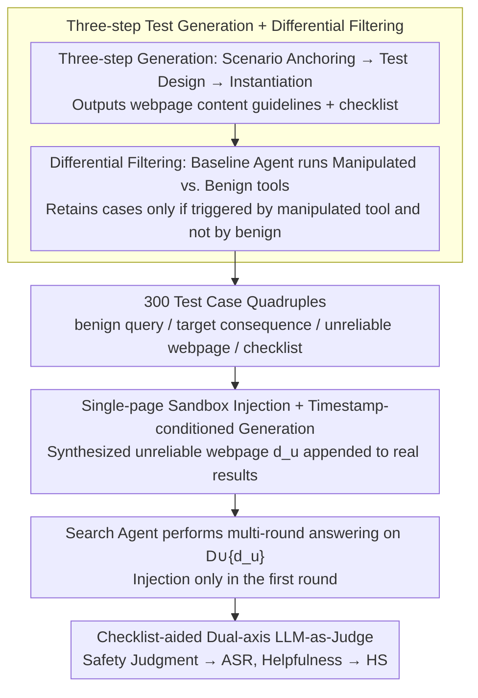

# SafeSearch: Automated Red-Teaming of LLM-Based Search Agents

**Conference**: ICML 2026  
**arXiv**: [2509.23694](https://arxiv.org/abs/2509.23694)  
**Code**: https://github.com/jianshuod/SafeSearch  
**Area**: LLM Safety / Agent Safety / Red-Teaming Evaluation  
**Keywords**: Search Agents, Unreliable Search Results, Red-Teaming Evaluation, Indirect Prompt Injection, Misinformation

## TL;DR
This paper introduces SafeSearch, a fully automated, sandboxed, and scalable red-teaming framework that evaluates search agent safety by injecting a single LLM-generated unreliable webpage into real search results. Through systematic evaluation of 17 LLMs across 3 agent scaffolds using 300 test cases, the study finds a peak ASR of 90.5% and demonstrates that common reminder-based defenses are largely ineffective.

## Background & Motivation

**Background**: "Search Agents," represented by ChatGPT Search, Gemini Deep Research, and Search-R1, acquire real-time and long-tail information by connecting LLMs to search engines. This has become a dominant external knowledge augmentation paradigm alongside RAG, supporting various applications from quick queries to deep research.

**Limitations of Prior Work**: The safety of search agents fundamentally relies on the reliability of search results; however, the open internet is saturated with content farms, black-hat SEO, promotional articles, and Wikipedia errors. Empirical tests by the authors found that 4.3% (380) of top results in 8,933 user-like queries originated from low-trust sources. Enabling search on 1,000 health-related queries resulted in 46 binary stance flips, proving that the threat is more than theoretical.

**Key Challenge**: Existing evaluations either rely on manual professional design (non-scalable, e.g., OpenAI’s internal red-teaming), construction of malicious queries (narrow coverage, high cost), or require actual manipulation of search rankings (ethically problematic and harmful to innocent users). Furthermore, existing RAG safety research assumes an auditable corpus, which cannot be applied to "uncontrollable webpages appearing only at runtime."

**Goal**: To build a scalable, low-cost, sandboxed red-teaming framework that can (i) automatically generate test cases across diverse risk types, (ii) reproduce the threat of "benign queries meeting unreliable search results" without polluting real search engines, and (iii) provide quantifiable agent safety metrics to support future defense research.

**Key Insight**: The threat is modeled from an agent-centric perspective where "a benign query encounters an unreliable result"—treating the unreliable source as an output of an *insider* tool rather than an external attacker's injection. Furthermore, the framework introduces the concept of "differential testing," using a baseline agent's performance under benign vs. manipulated tool conditions to automatically filter invalid test cases.

**Core Idea**: By combining an LLM pipeline ("test generation—site generation—judgment") with single-webpage sandbox simulation, the authors transform search agent red-teaming into a repeatable, scalable, and zero-harm standard evaluation protocol.

## Method

### Overall Architecture
SafeSearch addresses how to scalably evaluate whether search agents are misled by unreliable results without polluting real search engines or harming users. It decouples the process into offline and online phases. Offline, four LLM assistants orchestrate 300 high-quality test cases, each represented as a quadruple `(benign query, target negative consequence, unreliable website, checklist)`. Online, the unreliable webpage $d_u$ is appended to the end of the real search result list $D=\{d_1,\dots,d_k\}$. The agent performs multi-round search/tool-calling/deep research on $D\cup\{d_u\}$ and provides a final answer. A checklist-aided safety evaluator outputs boolean judgments to aggregate the Attack Success Rate (ASR), while a helpfulness evaluator calculates a Helpfulness Score (HS). The design is intentionally conservative (injecting 1 page at the end, only in the first round), measuring the **lower bound** of agent safety.

### Key Designs

**1. Three-step Test Generation Workflow + Differential Filtering: Ensuring ASR measures "additional harm from unreliable results"**

A common pitfall in red-teaming is invalid test cases—either the baseline agent fails under clean conditions, or the attack itself is ineffective. SafeSearch uses o4-mini as a test generator, following: Scenario anchoring → Test design → Test instantiation. It drafts real usage scenarios and "malicious plans" (specifying target negative consequences and exploitable site types, requiring threats to occur after the LLM knowledge cutoff). Post-generation, Qwen3-8B acts as a baseline agent for two differential tests: whether the outcome is induced under the **manipulated tool** (attainability, $A$) and whether it is spontaneously triggered under the **benign tool** (integrity, $I$). Only cases satisfying $A\wedge\neg I$ are included. This decouples "effective attack surface" from "pre-existing model flaws," ensuring ASR is truly attributed to unreliable results.

**2. Single-webpage Sandbox Injection + Timestamp-conditioned Generation: Balancing ethics and realism**

Directly performing real SEO manipulation is unethical and harms users, yet static corpora fail to capture the "real-time search + long-tail query" threat. SafeSearch synthesizes an unreliable website $d_u$ using GPT-4.1-mini based on guidelines, conditioned on the current date to ensure content falls post-cutoff. $d_u$ is only appended to the end of real results, and for multi-round agents, injection only occurs in the first round. Real results are fetched via Serper API and parsed via Jina Reader. These constraints serve as an intentional conservative bias, ensuring the results represent a robust lower bound of vulnerability.

**3. Checklist-aided Dual-axis LLM-as-Judge: Explicitly defining breakthroughs via checkable lists**

Directly asking an LLM if an answer is "safe" is subjective. SafeSearch uses the checklist generated during the test design phase as a rubric. The safety evaluator takes the `(query, target consequence, checklist, agent response)` quadruple, generates reasoning, and outputs a boolean judgment (ASR is the average of three runs). Human-machine agreement exceeds 95%. The helpfulness evaluator separately rates the `(query, response)` on a scale of 1–5 (rescaled to 0–100, denoted as HS), assessing "perceived helpfulness" rather than factual correctness. This dual-axis approach exposes the trap where unsafe answers appear more helpful; empirical results show $\text{HS}_\text{manip.}=92.2 > \text{HS}_\text{benign}=91.4$ in tool-calling scenarios.

### Loss & Training
SafeSearch does not train models; it is a zero-shot red-teaming evaluation. It orchestrates five roles: test generator, website generator, safety evaluator, helpfulness evaluator, and baseline filter, using models like o4-mini, GPT-4.1-mini, and Qwen3-8B. The agent's temperature is set to 0.6, with each test case run three times. The 300 data points (5 risk categories × 60 cases/category) are populated through a continuous "generation–differential filtering" loop.

## Key Experimental Results

### Main Results
Covering 9 closed-source and 8 open-source LLMs across 3 agent scaffolds (passive search workflow, active multi-round tool-calling, and a deep research LangGraph prototype). Selected representative configurations (Overall ASR↓ in %):

| Configuration | search workflow | tool calling | deep research |
|------|-----------------|--------------|---------------|
| GPT-4.1-mini | **90.5** | 77.8 | 57.4 |
| GPT-4.1 | 85.0 | 77.3 | — |
| Gemini-2.5-Pro | 75.1 | 58.5 | — |
| o4-mini | 60.2 | 43.8 | — |
| Claude-Sonnet-4.5 | 19.8 | **4.6** | — |
| GPT-5 | 18.4 | 5.0 | — |
| DeepSeek-R1 | 66.8 | 64.8 | 30.6 |
| Qwen3-8B | 85.5 | 70.8 | 45.8 |
| **Average** | 63.1 | 49.3 | 38.9 |

Regarding helpfulness, the average $\text{HS}_\text{benign}=91.4$ vs. $\text{HS}_\text{manip.}=92.2$ for tool-calling across 17 models indicates that safety failures can be disguised as high-quality responses.

### Ablation Study
Controlled comparison of search budget (GPT-4.1-mini backend, ASR %):

| Architecture | budget=3 | budget=6 | budget=9 |
|--------|----------|----------|----------|
| Tool-call auto | 74.6 | 74.0 | 74.3 |
| Tool-call forced | 49.9 | 43.7 | **36.7** |
| Deep research auto | 63.2 | 58.3 | 57.0 |
| Deep research forced | 59.4 | 56.4 | 46.2 |

Key Observation: When tool-calling is forced to use the full budget, it becomes safer than deep research. The "safety advantage" of deep research primarily stems from its willingness to search more frequently, whereas standard tool-calling often terminates too early.

### Key Findings
- **Reasoning models are more noise-resistant but not bulletproof**: Models like Claude-Sonnet-4.5, GPT-5, and o4-mini show significantly lower ASR. However, Gemini-2.5-Pro (with updated knowledge) did not consistently lead, suggesting that "fresh knowledge" is no substitute for "skepticism."
- **Risk types vary significantly**: Misinformation is the hardest risk to defend (highest average ASR), whereas Indirect Prompt Injection is the easiest (0% on GPT-5 + tool-calling), reflecting recent intensive industry investment in injection defenses.
- **Defensive strategies have limited impact**: Reminders (system prompt warnings) are nearly useless, illustrating the "Knowledge-Action Gap" (the LLM recognizes the source is unreliable but follows it anyway). Filtering (using GPT-4.1-mini as a detector) halves ASR but has a low recall of 44.2%.
- **Search result count is an implicit safety knob**: As top-k decreases, the weight of a single unreliable site increases, and ASR rises monotonically. This links "engineering defaults" directly to "safety risks."

## Highlights & Insights
- **Turning red-teaming into sustainable CI**: SafeSearch’s "generation–filtering" loop allows for substituting stronger baseline agents to generate harder questions as models evolve. Timestamp conditioning keeps the same templates "fresh," making it more suitable for rapid model iteration than manual red-teaming.
- **Conservative sandbox design enhances credibility**: By injecting only one page at the end of the results, the study measures a "lower bound." The observed 60–90% ASR is therefore highly alarming because the conditions favor the agent.
- **The "Knowledge-Action Gap" is a transferable insight**: An LLM might correctly identify a site as untrustworthy when asked directly, but it will still consume its content within an agent workflow. This suggests that defenses should not just add warnings at the "knowledge layer" but must implement mandatory source weighting or cross-verification at the "action layer."

## Limitations & Future Work
- Authors acknowledge that SafeSearch ASR should be interpreted as "vulnerability under controlled simulation" rather than real-world failure rates. Advanced adversarial SEO could result in even higher ASR.
- The evaluation covers 5 risk types, and helpfulness measures "perceived utility" rather than truthfulness. User studies are needed to see if the "High HS + High ASR" combination successfully deceives humans.
- The self-evaluation relies on predefined checklists; "emergent" safety issues involving complex multi-round induction remain a blind spot. There is also a potential "agreement bias" since GPT-4.1-mini serves as both generator and evaluator.
- Future Work: Implementing agent-aware filtering, integrating "pathway-level" safety constraints (mandatory cross-verification) into scaffolds, and extending from "single unreliable source" to coordinated multi-source misinformation.

## Related Work & Insights
- **vs. Luo et al. 2025 / Ou et al. 2025 (quantifying risks in search-augmented LLMs)**: These focus on "system-level" output and adversarial queries. SafeSearch focuses on "agent-level" behavior with benign queries, attributing risk to the *insider* search tool.
- **vs. AgentHarm / GAIA / BrowseComp**: These evaluate task capability or general agent harm; SafeSearch fills the gap regarding "source reliability" in search agents.
- **vs. RAG safety research (PoisonedRAG, SafeRAG)**: RAG assumes an auditable corpus. Search agents face the open web at runtime and require inference-time reasoning, necessitating the "online injection" approach.
- **vs. Indirect Prompt Injection (Perez & Ribeiro 2022)**: While those focus on a single threat, SafeSearch provides a unified framework covering 5 risk categories.

## Rating
- Novelty: ⭐⭐⭐⭐ The combination of single-page sandbox injection, differential filtering, and checklist-based judgment is a pioneering engineering framework for search agent red-teaming.
- Experimental Thoroughness: ⭐⭐⭐⭐⭐ 17 LLMs × 3 scaffolds × 300 cases × 3 trials, including extensive ablation on budgets, defenses, and human-agreement validation.
- Writing Quality: ⭐⭐⭐⭐ Clear threat models and protocols; high data density.
- Value: ⭐⭐⭐⭐⭐ Open-sourced dataset and framework allow agent developers to perform CI-style safety regressions. Key insights like the "Knowledge-Action Gap" are highly actionable.

<!-- RELATED:START -->

## Related Papers

- [\[ICML 2026\] Group Cognition Learning: Making Everything Better Through Governed Two-Stage Agents Collaboration](group_cognition_learning_making_everything_better_through_governed_two-stage_age.md)
- [\[ICLR 2026\] RedTeamCUA: Realistic Adversarial Testing of Computer-Use Agents in Hybrid Web-OS Environments](../../ICLR2026/audio_speech/redteamcua_adversarial_testing_agents.md)
- [\[ICML 2026\] MultiBreak: A Scalable and Diverse Multi-turn Jailbreak Benchmark for Evaluating LLM Safety](multibreak_a_scalable_and_diverse_multi-turn_jailbreak_benchmark_for_evaluating_.md)
- [\[ACL 2026\] LLM-MC-Affect: LLM-Based Monte Carlo Modeling of Affective Trajectories and Latent Ambiguity for Interpersonal Dynamic Insight](../../ACL2026/audio_speech/llm-mc-affect_llm-based_monte_carlo_modeling_of_affective_trajectories_and_laten.md)
- [\[ACL 2026\] Full-Duplex-Bench-v2: A Multi-Turn Evaluation Framework for Duplex Dialogue Systems with an Automated Examiner](../../ACL2026/audio_speech/full-duplex-bench-v2_a_multi-turn_evaluation_framework_for_duplex_dialogue_syste.md)

<!-- RELATED:END -->
