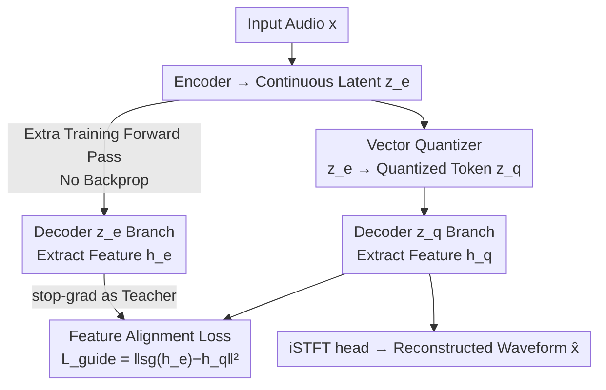

# Self-Guidance: Enhancing Neural Codecs via Decoder Manifold Alignment

**Conference**: ICML2024  
**arXiv**: [2606.12940](https://arxiv.org/abs/2606.12940)  
**Code**: [Demo Website](https://sgvqvae.github.io/sgvqvae-demo) (demo only, code not explicitly open-sourced)  
**Area**: Speech Codec / Audio Tokenizer / VQ-VAE  
**Keywords**: Neural Speech Codec, Quantization Error, Decoder Manifold Alignment, Self-Guidance, Low Bitrate

## TL;DR
During VQ-VAE speech codec training, the decoder is fed both the "quantized tokens" and "pre-quantization continuous latents." A lightweight feature alignment loss forces the decoder's internal features from the former path to align with those of the latter. This significantly enhances reconstruction fidelity with zero inference overhead and allows the codebook size to be reduced fourfold without performance loss.

## Background & Motivation
**Background**: Neural speech codecs like SoundStream and EnCodec are essentially VQ-VAEs. The encoder compresses audio into continuous latents $z_e$, and the vector quantizer maps $z_e$ to tokens $z_q$ in a finite codebook via nearest neighbor search. The decoder then reconstructs the waveform from $z_q$. These discrete tokens serve as the foundation for modern speech LLMs/TTS systems through next-token prediction.

**Limitations of Prior Work**: Quantization is inherently lossy. Section 3.2 presents a key comparative experiment using EnCodec and BigCodec: if the decoder directly receives the **pre-quantization** continuous latents $z_e$ (bypassing quantization), reconstruction quality is significantly higher than with quantized tokens $z_q$ (e.g., EnCodec's STOI increases from 0.88 to 0.95). This indicates that quantization error $e_q = \lVert z_e - z_q \rVert_2$ is the primary bottleneck limiting fidelity, as it discards information that the decoder could otherwise utilize.

**Key Challenge**: To reduce quantization error, mainstream methods either use Residual Vector Quantization (RVQ) for hierarchical quantization or significantly expand the codebook size (e.g., TS3Codec and XCodec2 expand to over $2^{16}$). While effective for the codec itself, these approaches shift the burden to downstream LLMs. Hierarchical codebooks require complex mechanisms for autoregressive Transformers, and simply expanding the codebook increases the complexity of autoregressive sequence modeling exponentially for flat, unstructured audio vocabularies.

**Goal**: Minimize the impact of quantization error on final audio quality without modifying the quantizer, expanding the codebook, or increasing inference costs, while facilitating downstream LLMs with smaller codebooks.

**Key Insight**: The authors shift the perspective: rather than focusing solely on reducing $e_q$, the **decoder should be made robust to quantizer imperfections**. Since the decoder produces high-quality audio from continuous latents, this "high-fidelity path" can serve as an internal teacher, guiding the decoder to produce similar internal features even when fed quantized tokens.

**Core Idea**: Use the pre-quantization latents $z_e$ as internal guidance signals during training. A feature mapping loss is applied to the intermediate features of the decoder to align the manifolds of the "$z_q$ path" and the "$z_e$ path"—a mechanism termed self-guidance (SG).

## Method

### Overall Architecture
The objective of self-guidance is to enable the decoder to output high-fidelity features from $z_q$ that approximate those from the "clean $z_e$." Standard VQ-VAE training only uses the original audio $x$ as the reconstruction target, implicitly hoping for consistency between paths. However, the authors' analysis suggests this implicit constraint is insufficient to eliminate quantization artifacts, requiring **explicit** guidance.

During training, an additional forward pass is added to the decoder: in addition to the standard $z_q \to$ decoder path, the pre-quantization $z_e$ also passes through the decoder. Intermediate features $h_q$ (from the $z_q$ branch) and $h_e$ (from the $z_e$ branch) are extracted from the output of the final Transformer block in the XCodec2 decoder (prior to the iSTFT head). A feature mapping loss then pulls $h_q$ toward $h_e$. This mechanism only adds one forward pass during training without requiring backpropagation through the $z_e$ path and remains entirely unchanged during inference.

### Key Designs

**1. Self-Guidance Feature Alignment Loss: Pre-quantization Latents as Internal Teachers**

Addressing the loss of information caused by quantization, where standard reconstruction losses fail to regulate internal representations, the authors introduce a feature mapping loss:

$$\mathcal{L}_{\text{guide}} = \lVert \text{sg}(h_e) - h_q \rVert_2^2$$

where $\text{sg}(\cdot)$ denotes the stop-gradient operation. This design has two critical aspects: (i) it uses $h_e$ as the high-fidelity target but freezes it via stop-gradient, ensuring the $z_q$ branch follows the $z_e$ branch without degrading the high-quality path; (ii) it constrains the **internal manifold** of the decoder directly, explicitly instructing the decoder to maintain consistent internal states regardless of input. Visualization of the latent feature alignment error $\lVert h_e - h_q \rVert_2^2$ confirms that SG significantly reduces alignment divergence.

**2. Alignment at the Transformer Backbone Output: Avoiding iSTFT and Adversarial Interference**

The features $h$ are extracted from the last Transformer block rather than the final waveform. Since XCodec2 utilizes a Transformer backbone followed by an iSTFT head instead of convolutional upsampling, this choice is justified by: (i) the Transformer contains the majority of learnable parameters and has the capacity to benefit from self-guidance; (ii) the iSTFT head separates latent features from waveform generation, preventing waveform-level reconstruction or adversarial losses from interfering with feature alignment.

**3. End-to-End Single-Stage Training with Near-Zero Overhead**

Unlike traditional self-distillation which requires a pre-trained teacher model, SG integrates the "teacher" into the same end-to-end training process—the $z_e$ branch acts as both part of the data flow and the teacher. The total training objective is:

$$\mathcal{L}_{\text{total}} = \lambda_{guide}\mathcal{L}_{\text{guide}} + \mathcal{L}_{\text{semantic}} + \mathcal{L}_{\text{acoustic}} + \mathcal{L}_{\text{adv}}$$

which includes the self-guidance loss, semantic feature MSE, multi-scale Mel-spectrogram L1, and adversarial losses from multi-period and spectral discriminators. Because the extra forward pass for the $z_e$ branch **does not require backpropagation**, the time per epoch increases negligibly from 25668.0s to 25783.8s (<0.5%). SG is thus a "free" gain.

### Loss & Training
The implementation involves two modifications to the official XCodec2: adding the $z_e$ forward pass and incorporating $\mathcal{L}_{\text{guide}}$ into the generator loss. All codebook sizes (8192/16384/65536) use the same training setup. Training was conducted on LibriSpeech (960h, 16kHz) for 600k steps using 8×RTX 4090 GPUs, totaling approximately 237.75 hours.

## Key Experimental Results

### Main Results
On the LibriSpeech test-clean set, applying SG to XCodec2 resulted in improvements across nearly all six metrics. At a codebook size of 65536, it achieved SOTA for low-bitrate single-codebook codecs.

| Codec | Frame Rate | Codebook | PESQ↑ | STOI↑ | MCD↓ | WER↓ | SIM↑ |
|----------|------|------|-------|-------|------|------|------|
| Ground Truth | — | — | 4.64 | 1.000 | 0.00 | 2.5 | 1.00 |
| XCodec2 | 50Hz | 8192 | 2.03 | 0.892 | 3.84 | 4.1 | 0.72 |
| **XCodec2+SG** | 50Hz | 8192 | **2.13** | **0.898** | **3.60** | **3.8** | **0.73** |
| XCodec2 | 50Hz | 65536 | 2.28 | 0.910 | 3.57 | 3.2 | 0.79 |
| **XCodec2+SG** | 50Hz | 65536 | **2.39** | **0.915** | **3.41** | 3.2 | **0.80** |
| TS3Codec | 50Hz | 131072 | 2.23 | 0.910 | 3.50 | 3.6 | 0.68 |

Notably, XCodec2+SG with a 65536 codebook outperforms TS3Codec with a 131072 codebook (PESQ 2.39 vs 2.23).

### Ablation Study / Generalization

| Dimension | Key Finding |
|----------|----------|
| 4× Codebook Compression | 16384 codebook + SG matches the 65536 baseline (4x reduction without fidelity loss). |
| Quantizer Generalization | Improvements observed across FSQ, SimVQ, and Residual FSQ. |
| Decoder Generalization | Effective for both Transformer-based (XCodec2) and RNN/CNN-based (BigCodec) architectures. |
| Downstream TTS | Smaller codebooks simplify the token modeling space, significantly improving LLM-based speech synthesis. |
| Training Overhead | Epoch time increased by <0.5% (25668.0s → 25783.8s); zero changes to inference. |

### Key Findings
- Histograms of latent feature alignment error $\lVert h_e - h_q \rVert_2^2$ provide direct evidence: the distribution shifts left and narrows with SG, proving the decoder manifold is truly aligned, not just the waveform metrics.
- The "4x codebook compression" is the most valuable conclusion for downstream tasks, decoupling fidelity from massive codebooks and providing LLMs with a smaller, more manageable vocabulary.
- Gains are consistent across various quantizers and decoder backbones, suggesting SG is a universal training paradigm for VQ-VAE decoders rather than a specialized trick.

## Highlights & Insights
- The shift in perspective is elegant: instead of trying to "reduce quantization error," the authors "immunize the decoder against quantization error," avoiding the cycle of complex quantizers burdening downstream LLMs.
- The stop-gradient usage is pivotal: by freezing the high-fidelity path as a teacher, it prevents the alignment process from degrading the clean path.
- Practically cost-free: With no backprop on the extra forward pass and no changes to inference, this "free lunch" improvement is highly adoptable.
- High transferability: The concept of aligning internal features between clean and degraded inputs can be extended to any autoencoder with lossy intermediate steps (e.g., lossy compression, quantization-aware training).

## Limitations & Future Work
- Experiments were limited to the English LibriSpeech dataset; generalization to multi-lingual, noisy, or musical audio remains unknown.
- The choice of the alignment point (last Transformer block) is empirical based on XCodec2; the optimal layer for purely convolutional decoders has not been systematically discussed.
- $\mathcal{L}_{\text{guide}}$ uses simple L2 alignment; whether more perceptually or semantically relevant metrics (e.g., multi-layer or weighted alignment) offer better results is worth exploring.
- While gains are stable, the absolute improvement in PSEQ is around +0.1. The true "killer feature" is the 4x codebook compression rather than the reconstruction metrics themselves.

## Related Work & Insights
- **vs. Residual/Large Codebook Quantizers (RVQ, TS3Codec)**: These reduce error at the quantizer level but increase LLM burden; SG handles error at the decoder level, enabling smaller codebooks.
- **vs. Self-Distillation**: Both use feature mapping losses, but self-distillation usually requires a pre-trained teacher and targets generalization. SG uses the "pre-quantization latent" path within the same training session to specifically target VQ-VAE decoder robustness to quantization error.
- **vs. Direct Continuous Latent Feeding**: While feeding $z_e$ improves quality, $z_e$ is unavailable at inference (discretization is necessary for LLMs). SG distills knowledge from the high-fidelity path into the $z_q$ path, capturing the benefits of continuous latents while maintaining a discrete interface.

## Rating
- Novelty: ⭐⭐⭐⭐ The perspective of robustifying the decoder is clean and under-explored, though the mechanism (feature alignment + stop-grad) is classic.
- Experimental Thoroughness: ⭐⭐⭐⭐ Validated across codebooks, quantizers, backbones, and downstream TTS; however, language and audio types are limited.
- Writing Quality: ⭐⭐⭐⭐ Clear chain of motivation, observation, and methodology.
- Value: ⭐⭐⭐⭐ Zero inference overhead and 4x codebook compression are highly practical for speech LLMs.

<!-- RELATED:START -->

## Related Papers

- [\[ICLR 2026\] MAPSS: Manifold-Based Assessment of Perceptual Source Separation](../../ICLR2026/audio_speech/mapss_manifold-based_assessment_of_perceptual_source_separation.md)
- [\[ICML 2026\] Multimodal Fusion via Self-Consistent Task-Gradient Fields](multimodal_fusion_via_self-consistent_task-gradient_fields.md)
- [\[ACL 2026\] An Exploration of Mamba for Speech Self-Supervised Models](../../ACL2026/audio_speech/an_exploration_of_mamba_for_speech_self-supervised_models.md)
- [\[ICLR 2026\] Toward Complex-Valued Neural Networks for Waveform Generation](../../ICLR2026/audio_speech/toward_complex-valued_neural_networks_for_waveform_generation.md)
- [\[ACL 2025\] MultiMed: Multilingual Medical Speech Recognition via Attention Encoder Decoder](../../ACL2025/audio_speech/multimed_multilingual_medical_speech_recognition_via_attention_encoder_decoder.md)

<!-- RELATED:END -->
