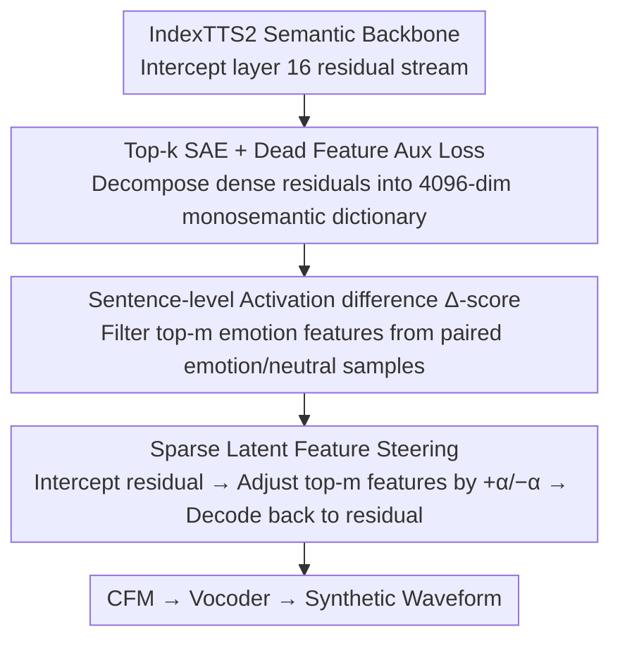

# Sparse Autoencoders for Interpretable Emotion Control in Text-to-Speech

**Conference**: ICML 2026  
**arXiv**: [2606.01479](https://arxiv.org/abs/2606.01479)  
**Code**: Available (GitHub-Demo link)  
**Area**: Audio/Speech (TTS Controllable Generation + Interpretability)  
**Keywords**: Sparse Autoencoders, Emotion-controllable TTS, Activation Steering, Semantic Backbone, Interpretability

## TL;DR
The authors train a Top-k Sparse Autoencoder (SAE) on the residual stream of the semantic backbone of an LLM-based TTS (IndexTTS2). By using "sentence-level activation rate differences," they identify a small set of sparse latent features strongly correlated with target emotions. During inference, they perform bidirectional emotion induction and suppression by intervening only on these features without modifying backbone parameters. This approach outperforms global mean-difference steering and existing TTS baselines.

## Background & Motivation
**Background**: LLM-based TTS models (e.g., CosyVoice, Spark-TTS, IndexTTS2) have achieved highly natural and expressive speech synthesis by embedding large language models into the generation pipeline. Emotional controllability has become a critical capability for applications such as audiobooks and human-computer interaction (HCI).

**Limitations of Prior Work**: Existing emotional TTS models generally follow two paths. The first is label/prompt-based conditioning (e.g., EmoVoice, VALL-E-X), which models emotions as discrete classes, thereby **flattening fine-grained differences and lacking continuous intensity adjustment**. The second is reference-based style transfer (e.g., Spark-TTS), which performs well but **requires finding suitable reference audio and is non-adjustable**. Neither approach possesses intrinsic interpretability. Recently, Xie et al. 2025 introduced activation steering for training-free emotion control but used a dense mean-difference direction for global shifting in the **acoustic stage of a Diffusion Transformer**.

**Key Challenge**: Emotional expression is a multidimensional phenomenon coordinated by **multiple acoustic factors** such as pitch, energy, and prosody. Using a single dense global direction only captures aggregate shifts, **losing the interpretability of "which dimension is responsible for what" while also limiting modular control**. Furthermore, prior works primarily intervene in downstream acoustic modules, leaving the encoding of emotions within the **autoregressive semantic backbone** under-studied.

**Goal**: (1) Determine if emotion-related changes can be decomposed into sparse latent features within the semantic backbone; (2) Identify the small subset aligned with specific emotions; (3) Utilize it for bidirectional (induction/suppression) emotion control.

**Key Insight**: The authors transfer the SAE—a tool verified in the LLM interpretability community for converting "polysemantic → sparse monosemantic" representations—to the residual stream of a TTS semantic backbone. This shifts emotion analysis forward from the "acoustic implementation layer" to the "semantic generation layer."

**Core Idea**: A Top-k SAE is used to decompose the semantic backbone residual activations into a 4096-dimensional sparse dictionary. The top-$m$ emotion features are selected based on the "sentence-level trigger frequency in target emotion samples vs. paired neutral samples." During inference, guiding emotions along a set of interpretable sparse directions is achieved by adding or subtracting an offset $\alpha$ to their activation values.

## Method

### Overall Architecture
This method addresses the problem of "how to achieve interpretable, intensity-adjustable, bidirectional control of emotional expression within the autoregressive semantic backbone without modifying the TTS backbone." The authors keep the IndexTTS2 pipeline intact (text/reference audio generates semantic tokens, then processed via CFM and vocoder for waveform synthesis) and only attach a bypass SAE to the residual stream of the 16th layer pre-LayerNorm. In the offline stage, a 1280→4096→1280 Top-k autoencoder is trained using hidden states from the decoding phase to decompose dense residuals into a sparse interpretable dictionary. During inference, residuals at each step are intercepted, encoded into sparse latents, adjusted for pre-selected emotion features, and decoded back into the residual space for downstream processing. The entire SAE contains only ~10.5M parameters (~40MB in fp32) and can be trained in 30,000 steps on a single H100, remaining completely plug-and-play for the backbone.

### Key Designs

**1. Top-k SAE + Dead Feature Aux Loss: Decomposing polysemantic residuals into monosemantic directions**

Emotion is coordinated by multiple acoustic factors, but semantic backbone residuals are dense and polysemantic. Direct intervention cannot clarify "which dimension was moved." The authors use a Top-k SAE to project the residual $x\in\mathbb{R}^d$ onto an $n=4096$ dimensional overcomplete dictionary, retaining only $k=32$ active values: Encoding $z=\mathrm{Top}_k(\mathrm{ReLU}(W_{\text{enc}}(x-b_{\text{pre}})+b_{\text{enc}}))$ forces features to compete as "explanations" for the input, while decoding $\hat{x}=W_{\text{dec}}z + b_{\text{pre}}$ performs linear reconstruction. Each decoder column $d_j$ corresponds to a semantic direction in the residual space. The primary loss is $\mathcal{L}_{\text{rec}}=\|x-\hat{x}\|_2^2$. This token-level sparsity combined with dictionary-level competition is key to splitting polysemantic neurons into monosemantic directions.

Overcomplete dictionaries often suffer from many "dead features." If left unmanaged, many noisy features contaminate the candidate pool during selection. Therefore, the authors select inactive latent variables $\tilde{z}$ to fit the residuals $(x-\hat{x})$ that the main path cannot explain, resulting in an auxiliary loss $\mathcal{L}_{\text{aux}}=\|(x-\hat{x})-W_{\text{dec}}\tilde{z}\|_2^2$. This forces "sleeping" features to "resuscitate" and capture residuals, making the total loss $\mathcal{L}=\mathcal{L}_{\text{rec}}+\lambda_{\text{aux}}\mathcal{L}_{\text{aux}}$, which significantly boosts the utilization rate of the 4096-dimensional dictionary.

**2. Sentence-level Activation Difference ($\Delta$-score): Selecting features that truly govern emotion**

Only a few directions in the dictionary are relevant to a specific emotion; a stable criterion is needed to filter them. The authors fix the text and speaker timbre, changing only the emotion reference to generate paired emotional and neutral samples. Instead of looking at token-level peaks, they first collapse activations into a binary indicator of whether the feature was triggered in the whole sentence: $\mathbf{1}_i^{(e)}(u)=\mathbb{1}[\exists t,\ a_{i,t}^{(e)}(u)>0]$. They then calculate the sentence-level trigger rate $r_i^{(e)}$ and use the paired difference $\Delta_i^{(e)}=\frac{1}{|\mathcal{D}|}\sum_u (\mathbf{1}_i^{(e)}(u)-\mathbf{1}_i^{(\text{neutral})}(u))$ as the selection metric. Selecting the top-$m$ (where $m=6$) based on this score reveals extremely strong discriminative power; for instance, top-6 features for anger might have $\Delta=1$, meaning they are triggered in all anger samples but never in paired neutral samples.

The reason for using sentence-level frequency instead of token-level peaks is that emotional expression spans the entire sentence, whereas token-level peaks are often dominated by transient noise. The reason for using paired differences instead of absolute frequencies is to naturally filter out "globally high-frequency but emotion-irrelevant" persistent features. This seemingly simple metric construction directly determines the interpretability and stability of subsequent interventions and represents a minimal adaptation of general SAE selection criteria for the TTS semantic backbone.

**3. Sparse Latent Feature Steering: Bidirectional, continuous emotional shifting along interpretable directions**

Once features are selected, control must be interpretable, reversible, and intensity-adjustable without touching the backbone. Under the linear reconstruction approximation $x \approx b_{\text{pre}}+\sum_j a_j(x)\,d_j$, the authors only modify active values where $j\in\mathcal{F}_e$ such that $a_j^{\text{new}}=a_j+\alpha_e$. This is equivalent to shifting the residual by $x_{l,t}^{\text{new}}\approx x_{l,t}+\alpha_e \sum_{j\in\mathcal{F}_e} d_j$. The "composite direction" during deployment is the sum of the top-6 decoded feature directions. $\alpha_e>0$ induces the target emotion, while $\alpha_e<0$ suppresses it. Sharing the same $\mathcal{F}_e$ and $\alpha_e$ across all tokens (time-invariant) naturally generalizes to token-dependent $\alpha_e$.

Compared to the dense mean-difference in Global Steering, shifting along $\sum_{j\in\mathcal{F}_e} d_j$ explicitly decomposes "global emotion shifts" into several lines, each corresponding to observable acoustic properties (pitch, energy, spectral brightness). This is both interpretable and modular—experiments showed that intervening on Latent #24 alone significantly raised F0 (+23.11 Hz) and RMS energy (+0.00435) without significantly changing duration. Combined with a continuous $\alpha_e$, it provides a physically meaningful "intensity knob" for emotion that is plug-and-play.

### Loss & Training
The SAE training loss is $\mathcal{L}=\mathcal{L}_{\text{rec}}+\lambda_{\text{aux}}\mathcal{L}_{\text{aux}}$, with decoder columns constrained to unit norm. Training data consists of residual activations from the layer-16 decoding phase of 56,000 emotion-controlled TTS-generated samples (7 emotions × 20 timbres × 400 texts), trained on a single H100 for 30,000 steps. The emotion selection analysis utilizes an additional 43,408 text-speaker matched generated samples to estimate $\Delta_i^{(e)}$.

## Key Experimental Results

### Main Results: Bidirectional Emotion Steering (Table 1, Selection of 3 Emotions × 9 Metrics)

| Setting | Emotion | Metric | VALL-E-X | Spark-TTS | EmoVoice | CosyVoice | Random SAE | Global Steering | **SAE-Emotion (Ours)** |
|------|------|------|----------|-----------|----------|-----------|------------|-----------------|------------------------|
| Induction (Neutral→Anger) | Anger | Emo-SIM↑ | 0.831 | 0.857 | 0.806 | 0.813 | 0.892 | 0.910 | **0.912** |
| Induction (Neutral→Anger) | Anger | WER↓ | 3.1 | 2.7 | 4.1 | 3.9 | 1.4 | **0.1** | 0.3 |
| Induction (Neutral→Happiness) | Happiness | Emo-SIM↑ | 0.697 | 0.770 | 0.728 | 0.712 | 0.813 | 0.879 | **0.885** |
| Induction (Neutral→Sadness) | Sadness | Emo-SIM↑ | 0.869 | 0.907 | 0.850 | 0.799 | 0.858 | 0.876 | **0.880** |
| Suppression (Anger→Neutral) | Anger | Emo-SIM(vs Neutral)↑ | – | – | – | – | 0.841 | 0.915 | **0.939** |
| Suppression (Happiness→Neutral) | Happiness | Emo-SIM↑ | – | – | – | – | 0.886 | 0.920 | **0.924** |
| Suppression (Sadness→Neutral) | Sadness | Emo-SIM↑ | – | – | – | – | 0.939 | 0.933 | **0.941** |

On the induction side, Emo-SIM for all three emotions is the highest or tied for first, with WER generally $\leq 0.3$. On the suppression side, Emo-SIM is also highest for all three, validating that **a single set of sparse features supports both addition (induction) and subtraction (suppression) control**.

### Ablation Study (Table 2 + Selection vs. Random Comparison)

| Configuration | EMOS↑ | NMOS↑ | Description |
|------|-------|-------|------|
| **SAE-Emotion (top-6 by Δ)** | **3.22** | **3.49** | Full Method |
| Global Steering (Dense Mean Diff) | 3.10 | 3.38 | Removed "Sparse Decomposition", reverted to global direction |
| Random SAE (Random 6 features) | 1.82 | 3.22 | Removed "Selection by Score", validates selection logic |

In blind tests with 20 raters (0–5 scale): SAE-Emotion is significantly superior to Global Steering and Random SAE in perceived emotional accuracy (EMOS), and NMOS is also the highest. This indicates that sparse decomposition does not harm naturalness and provides more accurate emotion perception.

### Key Findings
- **Emotions are sparsely organized in the SAE dictionary**: The $\Delta$-score distribution for anger vs. neutral is centered at 0 with a thin positive tail forming the cluster of emotion features; happiness and sadness exhibit similar heavy-tailed distributions.
- **Single latents map to observable acoustic properties**: Intervening only on Latent #24 significantly raises F0 (+23.11 Hz, p=1.07e-4), RMS energy, and spectral centroid while keeping duration constant, suggesting SAE大致 decouples "pitch/brightness/energy" into different directions.
- **Selection Metric > Randomness**: Random SAE EMOS is only 1.82, much lower than SAE-Emotion’s 3.22, proving that performance comes from "choosing the right features" rather than "sparsity itself."
- **Sparse Decomposition > Dense Global**: SAE-Emotion Emo-SIM $\geq$ Global Steering across all tests, with EMOS +0.12, showing the gain of decomposing global shifts into interpretable directions.
- **Calibratable Continuous Intensity Control**: Scanning $\alpha\in\{-60, 0, +60\}$ for the rank-1 happiness feature shows generated samples moving continuously toward the true happiness reference in the emotion prototype space, indicating $\alpha$ is a physically meaningful "emotion intensity knob."

## Highlights & Insights
- **Transferring SAE from LLM interpretability to TTS semantic backbones**: While prior SAE applications in TTS focused on the acoustic autoencoder layer (analyzing pitch/timbre), this work is the first to place it on the residual stream of an autoregressive LLM backbone. This elevates interpretability from "acoustic implementation" to "high-level semantic/emotional structure."
- **Sentence-level trigger frequency difference is a simple but critical engineering trick**: Replacing "per-token peaks" with "sentence-level trigger frequency differences" aligns with the intuition that "emotion spans the whole sentence" and naturally filters out high-frequency persistent features. This logic of adjusting general SAE criteria for task-specific properties is transferable.
- **Sparse composite directions as plug-and-play control interfaces**: The form $\alpha_e \sum_{j\in\mathcal{F}_e} d_j$ packages bidirectional, continuous, interpretable, and non-modifying control into a single additive residual perturbation. This instantiates the valuable "control knob" paradigm from LLM steering research in the TTS domain.

## Limitations & Future Work
- The authors acknowledge that SAE training requires significant storage and compute for activations. The analysis is limited to a single backbone (IndexTTS2), with cross-architecture generalization only validated at a small scale in the appendix.
- Personal observations: (1) $m$ and $\alpha$ are tuned empirically per-emotion ($m=6, \alpha\in[-60, 60]$); a principled method for automatically calibrating "how many features/what intensity" is missing. (2) Experiments only cover anger/happiness/sadness; disgust/fear/surprise from the 7-emotion dataset are missing from the main tables. (3) Sentence-level trigger rates flatten temporal structures, potentially losing information in scenarios involving "mid-sentence emotion shifts."
- Future improvements: Automatically solve for $m$ and $\alpha$ based on target displacements in the emotion prototype space; replace sentence-level rates with sliding windows to preserve temporal dynamics; combine single-emotion directions to create "composite emotion coordinate systems."

## Related Work & Insights
- **vs. Global Steering / Activation Engineering (Xie et al. 2025)**: They perform steering in the acoustic stage of a Diffusion Transformer. Ours performs sparse decomposition and multi-direction additive guiding in the autoregressive semantic backbone. Our advantage lies in interpretability and stability, though we require offline SAE training.
- **vs. Label/Prompt-based TTS (EmoVoice, VALL-E-X, CosyVoice)**: They rely on external signals. Ours provides a continuous knob without modified backbones but requires access to intermediate activations.
- **vs. Reference-based TTS (Spark-TTS)**: They rely on samples. Ours does not require runtime references and is reversible.
- **vs. Acoustic-SAE Work (Paek et al. 2025)**: They interpret pitch/timbre at the acoustic layer; we focus on high-level emotion at the semantic backbone. These routes are complementary.

## Rating
- **Novelty**: ⭐⭐⭐⭐ First application of Top-k SAE to LLM-TTS semantic backbone residual streams with a sentence-level selection criterion.
- **Experimental Thoroughness**: ⭐⭐⭐⭐ Comparison against four TTS baselines, two steering baselines, and human evaluation.
- **Writing Quality**: ⭐⭐⭐⭐ Clear structure; the progression from "why emotion isn't one direction" to "sparse combination directions" is logical.
- **Value**: ⭐⭐⭐⭐ Provides a plug-and-play, interpretable, and continuous interface for emotion control in modern TTS.

<!-- RELATED:START -->

## Related Papers

- [\[NeurIPS 2025\] From Black Box to Biomarker: Sparse Autoencoders for Interpreting Speech Models of Parkinson's Disease](../../NeurIPS2025/audio_speech/from_black_box_to_biomarker_sparse_autoencoders_for_interpreting_speech_models_o.md)
- [\[ICML 2026\] Position: Towards Responsible Evaluation for Text-to-Speech](position_towards_responsible_evaluation_for_text-to-speech.md)
- [\[ICLR 2026\] Scaling Speech Tokenizers with Diffusion Autoencoders](../../ICLR2026/audio_speech/scaling_speech_tokenizers_with_diffusion_autoencoders.md)
- [\[ACL 2026\] FC-TTS: Style and Timbre Control in Zero-Shot Text-to-Speech with Disentangled Speech Representations](../../ACL2026/audio_speech/fc-tts_style_and_timbre_control_in_zero-shot_text-to-speech_with_disentangled_sp.md)
- [\[ICML 2026\] Sparse Tokens Suffice: Jailbreaking Audio Language Models via Token-Aware Gradient Optimization](sparse_tokens_suffice_jailbreaking_audio_language_models_via_token-aware_gradien.md)

<!-- RELATED:END -->
