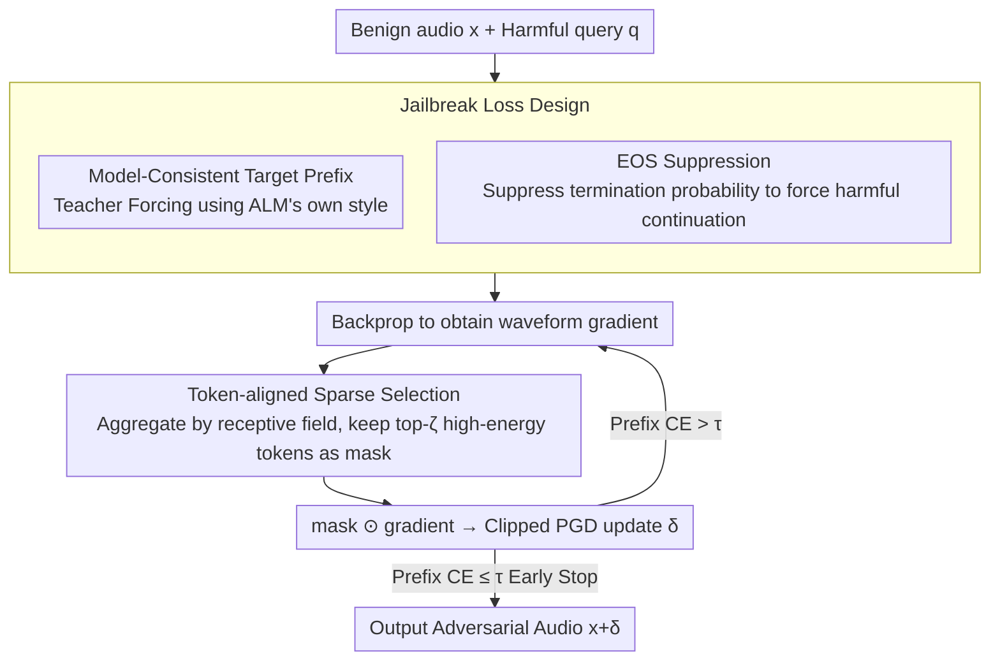

# Sparse Tokens Suffice: Jailbreaking Audio Language Models via Token-Aware Gradient Optimization

**Conference**: ICML 2026  
**arXiv**: [2605.04700](https://arxiv.org/abs/2605.04700)  
**Code**: Not disclosed  
**Area**: Audio & Speech / AI Safety  
**Keywords**: Audio Language Models, Jailbreak Attack, Sparse Optimization, Gradient Heterogeneity, Adversarial Perturbation

## TL;DR
This paper discovers that waveform gradients in Audio Language Model (ALM) jailbreak optimization are highly concentrated on a few tokens. It proposes TAGO, which updates only the waveform segments corresponding to the top-$\zeta$ high-energy tokens per step. On Qwen3-Omni, retaining only 25% of tokens maintains an 86% LLM-judge jailbreak success rate (vs. 87% for full tokens).

## Background & Motivation
**Background**: Audio Language Models (ALMs, e.g., Qwen-Omni / LLaMA-Omni) directly feed speech into an LLM backbone to generate natural language responses and have been widely deployed in human-computer interaction. Their security faces jailbreak threats similar to those of text-based LLMs. Existing ALM jailbreak attacks (SpeechGuard / AdvWave) follow the GCG approach from the text side, using "target prefix + Teacher Forcing cross-entropy" as the loss to perform dense PGD updates on the entire waveform.

**Limitations of Prior Work**: Audio waveforms have extremely high dimensionality (tens of thousands of samples per second). Performing dense updates on the entire waveform is slow and wastes gradient budget due to signal redundancy (large segments of silence / vowel steady-states). Existing works generally see ASR$_l$ drop below 45% on models with strong safety alignment like Qwen3-Omni (AdvWave 70%/45%), indicating that dense optimization is neither efficient nor sufficiently powerful.

**Key Challenge**: The authors deconstruct this problem from the "structure" of the optimization signal. Dense updates implicitly assume that gradient energy is uniformly distributed across tokens. However, ALM audio tokens are generated by a convolutional/downsampling front-end where each token corresponds to a specific receptive field. The influence of different tokens on the probability of the jailbreak prefix varies dramatically. If gradients are highly concentrated, distributing updates across all tokens dilutes the truly effective directions.

**Goal**: (1) Quantify the degree of non-uniformity in token-level gradients during ALM jailbreak optimization; (2) Design a jailbreak algorithm that enforces token-level sparsity during the optimization process; (3) Verify whether "dense optimization followed by pruning" is equivalent (subsequently proven to be non-equivalent).

**Key Insight**: By aggregating waveform gradients according to the receptive fields of tokens, one obtains the token-aligned gradient energy $\tilde{g}_i^{(k)}$. Characterization using coefficient of variation, top-$q$ mass, and $q_\alpha$ shows that in Qwen3-Omni, the top 16% of audio tokens carry 90% of the gradient energy (summing perspective: CV=2.74, $q_{0.9}=9.64$ / average of 60 tokens).

**Core Idea**: Use a token-aware sparse mask to apply gradients only to the receptive fields of the top-$\zeta$ high-energy tokens at each step, masking other positions to zero. This is combined with a "model-consistent prefix template" + EOS suppression term to systematically bypass the "prefix alignment" shortcut.

## Method

### Overall Architecture
TAGO addresses "how to more efficiently search for jailbreak perturbations on high-dimensional audio waveforms." The approach shifts white-box ALM jailbreak optimization from "dense PGD on the entire waveform" to "updating only waveform segments corresponding to a few high-energy tokens at each step." In each iteration, it backpropagates to obtain waveform gradients, aggregates them into token-level energy based on receptive fields, retains only the top-$\zeta$ tokens to form a binary mask, and performs clipped PGD updates. Simultaneously, it uses model-consistent prefixes and EOS suppression to block alignment shortcuts, stopping early when the prefix cross-entropy falls below a threshold. The inputs are benign audio $x\in\mathbb{R}^L$, a fixed text prompt, a harmful query $q$, and a retention ratio $\zeta$. The output is an adversarial audio $x+\delta$ that causes the ALM to start its response with the target prefix $r_{1:m}$ and continue generating harmful content.

### Key Designs

**1. Token-aligned Sparse Selection: Concentrating Perturbation Budget on Effective Tokens**

Dense PGD assumes gradient energy is uniform across tokens. However, the authors find that the top 16% of audio tokens account for 90% of gradient energy. Distributing updates uniformly wastes budget on low-energy regions (silence, steady-state vowels), diluting the step size in effective directions. TAGO maps each pre-attention audio token $\Phi_i(x)$ to a unique waveform interval $\mathcal{R}(i)\subseteq\{1,\dots,L\}$. It defines sample-level energy $g^{(k)}(s)=([\nabla_\delta\mathcal{L}]_s)^2$ and token-level energy $\tilde{g}_i^{(k)}=\sum_{s\in\mathcal{R}(i)}g^{(k)}(s)$. It selects the top index set $\mathcal{S}^{(k)}$ based on $\tilde{g}_i^{(k)}$ and constructs a mask $M^{(k)}=\mathbf{1}_{\cup_{i\in\mathcal{S}^{(k)}}\mathcal{R}(i)}$. The update rule is $\delta^{(k+1)}=\mathrm{Clip}_{[-\epsilon,\epsilon]}(\delta^{(k)}-\eta(M^{(k)}\odot\nabla_\delta\mathcal{L}))$. Crucially, the mask is re-selected at each step rather than fixed—high-energy tokens drift along the optimization trajectory, and dynamic selection is necessary to track tokens that are "effective early but later useless," which is why it outperforms post-hoc pruning.

**2. Model-Consistent Target Prefix: Preventing Teacher Forcing from Pulling the Model Out-of-Distribution**

GCG-style jailbreaks often force a uniform prefix like "Sure, here is..." for all harmful queries. However, response styles vary significantly across ALMs (e.g., Qwen-Omni vs. LLaMA-Omni). Forcing an OOD prefix makes the CE loss landscape rugged and optimization difficult. TAGO adopts the model's own style: it first queries the target ALM with a batch of benign prompts and extracts the first sentence of the response as a template $\mathsf{Prefix}(\cdot)$ with placeholders. For any harmful query $q$, it instantiates $r_{1:m}(q)=\mathsf{Prefix}(q)$ for Teacher Forcing. This keeps "prefix alignment" within the output manifold the model is already familiar with, making the CE loss smoother and easier to push below the threshold $\tau$ for early stopping.

**3. EOS Suppression: Closing the "Prefix Jailbreak but Immediate Stop" False Positive**

Safety alignment has a shortcut: the model is forced to output the target prefix but immediately outputs `<|im_end|>` to cut off generation, appearing as a successful jailbreak without actually generating harmful content. Citing Qi et al. 2025, the authors note that alignment is primarily achieved through "shaping the distribution of the first few tokens + early termination." Thus, an explicit loss term $\mathcal{L}_{\mathrm{eos}}=p_\theta(\mathrm{EOS}\mid h_m)$ is added (where $h_m$ is the decoding context after the prefix) to suppress the EOS probability, forcing the model to actually write out harmful content. The final objective is $\mathcal{L}=\frac{1}{m}\sum_{i=1}^m\mathcal{L}_{\mathrm{CE}}(r_i,p_\theta(\cdot\mid h_{i-1}))+\lambda\|\delta\|_2^2+\lambda_{\mathrm{eos}}\mathcal{L}_{\mathrm{eos}}$, targeting prefix alignment, perturbation energy constraint, and anti-termination respectively.

### Loss & Training
Optimization uses PGD with $\ell_\infty$ clipping. The early stopping criterion is when the prefix CE term $\leq\tau(\rho)=-\log\rho$, meaning the prefix is aligned with confidence $\rho$. The main experiments use $\rho=0.9$ ($\tau\approx 0.105$). Token retention ratios $\zeta$ are swept across $\{1.0, 0.75, 0.5, 0.25\}$. The threat model is white-box, perturbing only the waveform with fixed text prompts.

## Key Experimental Results

### Main Results
On AdvBench-50 (100 samples total, 2 speakers synthesized per query via Google TTS), comparing three ALMs:

| Model | Method | ASR$_r$ (%) | ASR$_l$ (%) |
|------|------|-------------|-------------|
| Qwen3-Omni | Direct | 0 | 0 |
| Qwen3-Omni | SpeechGuard | 100 | 42 |
| Qwen3-Omni | AdvWave | 70 | 45 |
| Qwen3-Omni | Post-hoc prune ($\zeta=0.25$) | 9 | 1 |
| Qwen3-Omni | TAGO ($\zeta=1.0$) | 100 | **87** |
| Qwen3-Omni | TAGO ($\zeta=0.25$) | 99 | **86** |
| Qwen2.5-Omni | AdvWave | 36 | 4 |
| Qwen2.5-Omni | TAGO ($\zeta=0.25$) | 97 | 53 |
| LLaMA-Omni | AdvWave | 100 | 68 |
| LLaMA-Omni | TAGO ($\zeta=0.25$) | 100 | 72 |

The advantage is maintained on HarmBench (Qwen3-Omni: Direct 4.5 → TAGO $\zeta=1.0$ 76.5 → $\zeta=0.25$ 70.0 ASR$_l$).

### Ablation Study
Sensitivity of TAGO to $\zeta$ and early stop $\rho$ (Qwen3-Omni):

| Configuration | ASR$_l$ (%) | Avg. Iterations | Note |
|------|-------------|------------|------|
| $\zeta=1.0,\rho=0.9$ | 87 | 256.64 | Dense Baseline |
| $\zeta=0.25,\rho=0.9$ | 86 | 323.16 | Recovered by +25.92% iterations with only 25% tokens |
| $\zeta=1.0,\rho=0.7$ | 32 | 75.39 | Early stop too loose; insufficient alignment |
| Post-hoc prune $\zeta=0.25$ | 1 | — | Dense then prune — complete failure |

Measured by SNR, TAGO ($\zeta=0.25, \rho=0.9$) achieves 20.65 / 21.83 / 22.45 dB on Qwen3-Omni / Qwen2.5-Omni / LLaMA-Omni respectively, indicating moderate perturbation energy.

### Key Findings
- **Gradient heterogeneity is a universal law**: On Qwen3-Omni, the CV of sum-gradient is as high as 2.74, with the top 10% of tokens accounting for 91.52% of energy ($q_{0.9}=9.64/60$). This is the foundational evidence for TAGO.
- **Sparsity must be applied online**: Post-hoc pruning at $\zeta=0.25$ results in an ASR$_l$ of only 1% (vs. 86% for TAGO), suggesting the optimization trajectory is reshaped by the sparse mask and cannot be approximated post-hoc; this is a powerful counter-example.
- **Iteration count increases only linearly**: Reducing $\zeta$ from 1.0 to 0.25 only requires 25.92% more iterations rather than 4x. This confirms that the top-$\zeta$ tokens carry most effective optimization directions.
- **Safety alignment strength varies significantly**: Direct attacks on Qwen3-Omni / Qwen2.5-Omni are nearly 0 (strong alignment), whereas LLaMA-Omni has an inherent ASR$_l$ of 49% (weak alignment); TAGO pulls all of them above 70%.

## Highlights & Insights
- **Rooted in Optimization Structure rather than Hacks**: By questioning the necessity of "dense waveform updates" and providing rigorous metrics (CV / top-$q$ mass / $q_\alpha$), sparsity is framed as an optimization fact rather than just an engineering trick.
- **Clever Token-as-analysis-unit Abstraction**: Using pre-attention audio tokens instead of post-attention representations avoids scattering temporal locality. This receptive field concept can migrate to any modality with conv/downsampling front-ends (e.g., video patches, point cloud voxels), offering methodological value for multi-modal security.
- **EOS Suppression Targets a Real Alignment Weakness**: It operationalizes the observation from Qi et al. 2025 regarding alignment shaping the first few tokens + termination into an optimizable objective. This trick is transferable to text-LLM jailbreaking where GCG often ignores EOS probability.

## Limitations & Future Work
- **Strong White-box Assumption**: Requires access to full parameters and gradients, making it inapplicable to closed-source API services. Approximation of token-level gradients via queries remains undiscussed.
- **Dependency on Known Receptive Fields**: The front-end $\mathcal{R}(i)$ is a fixed deterministic mapping. For ALMs with variable downsampling or dynamic chunking, this mapping could be more complex.
- **Hard Top-k Selection**: May miss synergistic effects across multiple medium-energy tokens. Soft/learned masks or group sparsity could be considered.
- **Defense Discussion is Brief**: While the authors suggest future alignment should "utilize token-level gradient heterogeneity," specific defense schemes (e.g., alignment augmentation on high-energy token segments) remain an open question.

## Related Work & Insights
- **vs. SpeechGuard / AdvWave**: Both use dense waveform (or suffix) updates. The core difference here is restricting updates to token-receptive-field subsets. On strongly aligned ALMs like Qwen3-Omni, ASR$_l$ jumping from 42/45 to 86 proves sparsity is a "free lunch" rather than a trade-off.
- **vs. Weighted-sampling Audio Attacks (Liu et al. 2020)**: Both exploit non-uniform importance, but the former uses static importance for sampling, whereas TAGO uses dynamic gradient energy and target prefixes. This represents an upgrade from static to dynamic and ASR attack to ALM jailbreaking.
- **vs. GCG (Zou et al. 2023) Text Jailbreak**: TAGO translates the phenomenon of "gradients concentrated in few tokens" from discrete token-level greedy search to continuous waveforms via receptive field aggregation. It can be viewed as the "gradient sparsity" counterpart of GCG for continuous modalities.

## Rating
- Novelty: ⭐⭐⭐⭐ First to systematically quantify token-level heterogeneity in ALM jailbreak gradients and use in-optimization sparsity as an attack lever.
- Experimental Thoroughness: ⭐⭐⭐⭐ Covers 3 ALMs, 2 benchmarks, $\zeta\times\rho$ sensitivity, post-hoc pruning counter-examples, and SNR quantification.
- Writing Quality: ⭐⭐⭐⭐ Clear organization of metrics/algorithms; Algorithm 1 and Equation 13 are intuitive.
- Value: ⭐⭐⭐⭐ Directly challenges the "dense optimization" baseline and points directed defense researchers toward high-energy token segments.

<!-- RELATED:START -->

## Related Papers

- [\[ACL 2026\] Data-efficient Targeted Token-level Preference Optimization for LLM-based Text-to-Speech](../../ACL2026/audio_speech/data-efficient_targeted_token-level_preference_optimization_for_llm-based_text-t.md)
- [\[ICML 2026\] Multimodal Fusion via Self-Consistent Task-Gradient Fields](multimodal_fusion_via_self-consistent_task-gradient_fields.md)
- [\[ACL 2025\] Analyzing and Mitigating Inconsistency in Discrete Audio Tokens for Neural Codec Language Models](../../ACL2025/audio_speech/audio_token_consistency.md)
- [\[ICML 2026\] Sparse Autoencoders for Interpretable Emotion Control in Text-to-Speech](sparse_autoencoders_for_interpretable_emotion_control_in_text-to-speech.md)
- [\[ICML 2026\] Two-Dimensional Quantization for Geometry-Aware Audio Coding](two-dimensional_quantization_for_geometry-aware_audio_coding.md)

<!-- RELATED:END -->
