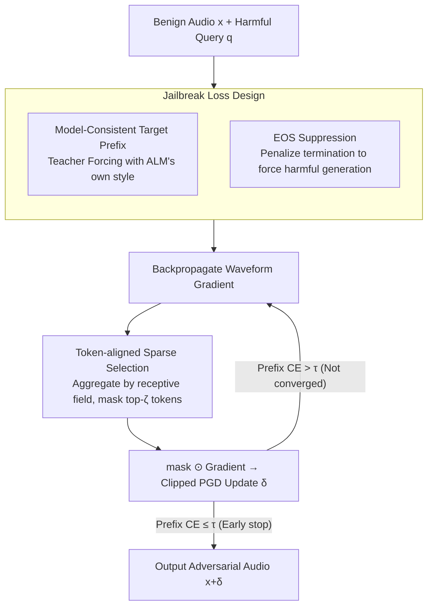

# Sparse Tokens Suffice: Jailbreaking Audio Language Models via Token-Aware Gradient Optimization

**Conference**: ICML 2026  
**arXiv**: [2605.04700](https://arxiv.org/abs/2605.04700)  
**Code**: Undisclosed  
**Area**: Audio & Speech / AI Safety  
**Keywords**: Audio Language Models, Jailbreaking Attacks, Sparse Optimization, Gradient Heterogeneity, Adversarial Perturbations

## TL;DR
This paper discovers that waveform gradients in Audio Language Model (ALM) jailbreak optimization are highly concentrated in a few tokens. It proposes TAGO, which updates only the waveform segments corresponding to the top-$\zeta$ high-energy tokens at each step. On Qwen3-Omni, retaining only 25% of tokens maintains an 86% LLM-judge jailbreak success rate (vs. 87% for full tokens).

## Background & Motivation
**Background**: Audio Language Models (ALMs, such as Qwen-Omni / LLaMA-Omni) directly feed speech into an LLM backbone to generate natural language responses and have been widely deployed in human-computer interaction. Their security faces jailbreaking threats similar to text LLMs. Existing ALM jailbreak attacks (SpeechGuard / AdvWave) follow the GCG approach from the text side, using "target prefix + teacher forcing cross-entropy" as the loss and performing dense PGD updates on the entire waveform.

**Limitations of Prior Work**: Audio waveforms have extremely high dimensionality (tens of thousands of samples per second). Performing dense updates on the entire waveform is slow and wastes gradient budget due to signal redundancy (large silent sections / vowel steady-state regions). Existing work on models with strong safety alignment like Qwen3-Omni generally sees ASR$_l$ drop below 45% (AdvWave 70%/45%), indicating that dense optimization is neither efficient nor powerful enough.

**Key Challenge**: The authors decompose this problem from the perspective of the "structure" of the optimization signal. Dense updates implicitly assume that gradient energy is uniformly distributed across tokens. However, ALM audio tokens are generated by front-end convolution/downsampling, where each token corresponds to a specific receptive field. The impact of different tokens on the target prefix probability varies significantly. If gradients are highly concentrated, distributing updates across all tokens dilutes the truly effective directions.

**Goal**: (1) Quantify the degree of token-level gradient non-uniformity in ALM jailbreak optimization; (2) Design a jailbreak algorithm that enforces token-level sparsity during the optimization process; (3) Verify whether "dense optimization followed by pruning" is equivalent (subsequently proved not to be).

**Key Insight**: At each step, waveform gradients are aggregated according to the token's receptive field to obtain the token-aligned gradient energy $\tilde{g}_i^{(k)}$. Its distribution is characterized using three metrics: coefficient of variation, top-$q$ mass, and $q_\alpha$. Empirical tests on Qwen3-Omni show that the top 16% of audio tokens account for 90% of the gradient energy (summation perspective: CV=2.74, $q_{0.9}=9.64$ / average 60 tokens).

**Core Idea**: A token-aware sparse mask is used to apply gradients only to the receptive fields of the top-$\zeta$ high-energy tokens at each step, with other positions masked to zero. This is combined with a "model-consistent prefix template" and an EOS suppression term to systematically bypass the alignment shortcut of "prefix alignment."

## Method

### Overall Architecture
TAGO aims to solve "how to more efficiently search for jailbreak perturbations on high-dimensional audio waveforms." It modifies the jailbreak optimization of white-box ALMs from "dense PGD on the full waveform" to "updating only the waveform segments corresponding to a few high-energy tokens at each step." In each iteration, it backpropagates to obtain waveform gradients, aggregates them into token-level energy based on receptive fields, retains only the top-$\zeta$ tokens to form a binary mask, and performs a clipped PGD update. Simultaneously, it uses model-consistent prefixes and EOS suppression to block alignment shortcuts, stopping early once the prefix cross-entropy falls below a threshold. The inputs are benign audio $x\in\mathbb{R}^L$, a fixed text prompt, a harmful query $q$, and a retention ratio $\zeta$. The output is an adversarial audio $x+\delta$ that causes the ALM to start its response with a target prefix $r_{1:m}$ and continue generating harmful content.

### Key Designs

**1. Token-aligned Sparse Selection: Concentrating Perturbation Budget on Effective Tokens**

Dense PGD implicitly assumes uniform gradient energy across tokens. However, observations show that the top 16% of audio tokens carry 90% of the gradient energy. Distributing updates evenly wastes budget on low-energy regions (silence, steady-state vowels), diluting the step size in effective directions. TAGO maps each pre-attention audio token $\Phi_i(x)$ to a unique waveform interval $\mathcal{R}(i)\subseteq\{1,\dots,L\}$. It defines sample-level energy $g^{(k)}(s)=([\nabla_\delta\mathcal{L}]_s)^2$ and token-level energy $\tilde{g}_i^{(k)}=\sum_{s\in\mathcal{R}(i)}g^{(k)}(s)$. It selects the top index set $\mathcal{S}^{(k)}$ based on $\tilde{g}_i^{(k)}$ to construct a mask $M^{(k)}=\mathbf{1}_{\cup_{i\in\mathcal{S}^{(k)}}\mathcal{R}(i)}$. The update rule is $\delta^{(k+1)}=\mathrm{Clip}_{[-\epsilon,\epsilon]}(\delta^{(k)}-\eta(M^{(k)}\odot\nabla_\delta\mathcal{L}))$. Crucially, the mask is reselected at each step rather than fixed—high-energy tokens drift along the optimization trajectory, and dynamic selection is required to follow tokens that shift from effective to ineffective.

**2. Model-Consistent Target Prefix: Preventing Teacher Forcing from Pulling the Model Out of Distribution**

GCG-style jailbreaks often force-feed a uniform prefix like "Sure, here is..." for all harmful queries. However, response styles vary across ALMs (e.g., Qwen-Omni vs. LLaMA-Omni). Force-aligning to an out-of-distribution prefix makes the CE loss landscape rugged and optimization difficult. TAGO adopts the model's own style: it queries the target ALM with a small batch of benign prompts and extracts the first sentence of the response as a template $\mathsf{Prefix}(\cdot)$. For any harmful query $q$, it instantiates $r_{1:m}(q)=\mathsf{Prefix}(q)$ for Teacher Forcing. This keeps "prefix alignment" on the output manifold the model is already familiar with, making the CE loss smoother and easier to push below the threshold $\tau$ for early stopping.

**3. EOS Suppression: Blocking False Positives of "Jailbreak Prefix followed by Abrupt Stop"**

Safety alignment has a shortcut: the model is forced to output the target prefix but immediately outputs `<|im_end|>` to cut off generation, appearing to be jailbroken without actually generating harmful content. Citing Qi et al. 2025, the authors note that alignment is mainly achieved through "shaping the distribution of the first few tokens + early termination." Thus, an EOS suppression term $\mathcal{L}_{\mathrm{eos}}=p_\theta(\mathrm{EOS}\mid h_m)$ is added to the loss (where $h_m$ is the context after the prefix) to penalize the EOS probability and force the model to continue writing harmful content. The final objective is $\mathcal{L}=\frac{1}{m}\sum_{i=1}^m\mathcal{L}_{\mathrm{CE}}(r_i,p_\theta(\cdot\mid h_{i-1}))+\lambda\|\delta\|_2^2+\lambda_{\mathrm{eos}}\mathcal{L}_{\mathrm{eos}}$.

### Loss & Training
Optimization uses PGD with $\ell_\infty$ clipping. The early stopping criterion is when the prefix CE term $\leq\tau(\rho)=-\log\rho$, meaning the prefix is aligned with high confidence. For the main experiments, $\rho=0.9$ (corresponding to $\tau\approx 0.105$). The token retention ratio $\zeta$ is swept across $\{1.0, 0.75, 0.5, 0.25\}$. The threat model is white-box, perturbing only the waveform with a fixed text prompt.

## Key Experimental Results

### Main Results
On AdvBench-50 (100 samples total, using Google TTS with 2 speakers per query), comparing three ALMs:

| Model | Method | ASR$_r$ (%) | ASR$_l$ (%) |
|------|------|-------------|-------------|
| Qwen3-Omni | Direct | 0 | 0 |
| Qwen3-Omni | SpeechGuard | 100 | 42 |
| Qwen3-Omni | AdvWave | 70 | 45 |
| Qwen3-Omni | Post-hoc prune ($\zeta=0.25$) | 9 | 1 |
| Qwen3-Omni | TAGO ($\zeta=1.0$) | 100 | **87** |
| Qwen3-Omni | TAGO ($\zeta=0.25$) | 99 | **86** |
| Qwen2.5-Omni | AdvWave | 36 | 4 |
| Qwen2.5-Omni | TAGO ($\zeta=0.25$) | 97 | 53 |
| LLaMA-Omni | AdvWave | 100 | 68 |
| LLaMA-Omni | TAGO ($\zeta=0.25$) | 100 | 72 |

TAGO maintains an advantage on HarmBench (Qwen3-Omni: Direct 4.5 → TAGO $\zeta=1.0$ 76.5 → $\zeta=0.25$ 70.0 ASR$_l$).

### Ablation Study
Sensitivity of TAGO to $\zeta$ and early stopping $\rho$ (Qwen3-Omni):

| Configuration | ASR$_l$ (%) | Avg. Iterations | Note |
|------|-------------|------------|------|
| $\zeta=1.0,\rho=0.9$ | 87 | 256.64 | Dense baseline |
| $\zeta=0.25,\rho=0.9$ | 86 | 323.16 | Only 25% tokens; +25.92% iters to recover performance |
| $\zeta=1.0,\rho=0.7$ | 32 | 75.39 | Stopping too early; insufficient prefix alignment |
| Post-hoc prune $\zeta=0.25$ | 1 | — | Dense then prune — complete failure |

Regarding SNR, TAGO ($\zeta=0.25,\rho=0.9$) achieved 20.65 / 21.83 / 22.45 dB on Qwen3-Omni / Qwen2.5-Omni / LLaMA-Omni respectively, indicating moderate perturbation energy.

### Key Findings
- **Gradient heterogeneity is a universal law**: On Qwen3-Omni, the CV of sum-gradient is as high as 2.74, with the top 10% of tokens accounting for 91.52% of the energy ($q_{0.9}=9.64/60$). This is the foundation of TAGO.
- **Sparsity must be applied online**: Post-hoc pruning at $\zeta=0.25$ results in an ASR$_l$ of only 1% (vs. 86% for TAGO), indicating that the optimization trajectory is reshaped by the sparse mask and is not a small perturbation that can be approximated afterward.
- **Iteration count increases only linearly**: Reducing $\zeta$ from 1.0 to 0.25 only requires 25.92% more iterations rather than 4x, showing that the top-$\zeta$ tokens indeed carry most of the effective optimization directions.
- **Safety alignment strength varies significantly across models**: Qwen3-Omni/Qwen2.5-Omni have nearly 0 ASR$_l$ under direct attack (strong alignment), while LLaMA-Omni has 49% (weak alignment). TAGO pulls all three above 70%.

## Highlights & Insights
- **Focusing on optimization structure rather than attack tricks**: By questioning whether "dense waveform updates" are necessary and using a rigorous set of metrics (CV / top-$q$ mass / $q_\alpha$), sparsity is framed not just as an engineering trick but as a statement of optimization fact.
- **Clever Token-as-analysis-unit abstraction**: Using pre-attention audio tokens instead of post-self-attention representations as the analysis unit avoids the dispersion of temporal locality by self-attention. The receptive field concept can be transferred to any modality with conv/downsample front-ends (e.g., video frame patches, point cloud voxels).
- **EOS suppression targets the actual weakness of alignment**: Materializing the observation by Qi et al. 2025 regarding alignment shaping the first few tokens into an optimizable objective is a trick that can be reused for text LLM jailbreaking.

## Limitations & Future Work
- **Strong white-box assumption**: Requires access to full parameters and gradients, making it not directly applicable to closed-source API services. The authors do not discuss whether token-level gradient statistics can be approximated via querying.
- **Dependence on known receptive fields**: The front-end $\mathcal{R}(i)$ is a fixed deterministic mapping. For ALMs with variable downsampling rates or dynamic patching, this mapping could be more complex.
- **Hard top-k token selection**: This may miss cases where multiple medium-energy tokens act synergistically. Soft/learned masks or group sparsity could be considered.
- **Defense side not fully discussed**: While advocating for safety alignment to "leverage token-level gradient heterogeneity," specific defense schemes (e.g., alignment augmentation on high-energy token segments) remain an open question.

## Related Work & Insights
- **vs. SpeechGuard / AdvWave**: Both use dense waveform (or suffix segment) updates. The core difference is that TAGO restricts updates to a subset of token receptive fields. On strongly aligned ALMs like Qwen3-Omni, ASR$_l$ jumps from 42/45 to 86, proving sparsity is a "free lunch" rather than a trade-off.
- **vs. Weighted-sampling audio adversarial attacks (Liu et al. 2020)**: Both are based on non-uniform waveform importance, but the former uses static importance estimation while TAGO uses dynamic gradient energy per step along with a Teacher Forcing jailbreak target.
- **vs. GCG (Zou et al. 2023) for Text LLM Jailbreaking**: TAGO transfers the phenomenon of "gradient concentration in a few tokens" from discrete token-level greedy search to continuous waveforms + receptive field aggregation. It can be seen as the continuous modality counterpart to GCG's "gradient sparsity."

## Rating
- Novelty: ⭐⭐⭐⭐ First to systematically quantify token-level heterogeneity of ALM jailbreak gradients and use in-optimization sparsity as an attack lever.
- Experimental Thoroughness: ⭐⭐⭐⭐ Covers 3 ALMs, 2 benchmarks, $\zeta\times\rho$ sensitivity, post-hoc pruning counter-examples, and SNR quantification.
- Writing Quality: ⭐⭐⭐⭐ Clear organization of metrics, algorithms, and formulas. High readability.
- Value: ⭐⭐⭐⭐ Directly challenges the "dense optimization" baseline and points to clear directions for defense (safety enhancement of high-energy token segments).

<!-- RELATED:START -->

## Related Papers

- [\[ICLR 2026\] OWL: Geometry-Aware Spatial Reasoning for Audio Large Language Models](../../ICLR2026/audio_speech/owl_geometry-aware_spatial_reasoning_for_audio_large_language_models.md)
- [\[ICML 2026\] Multimodal Fusion via Self-Consistent Task-Gradient Fields](multimodal_fusion_via_self-consistent_task-gradient_fields.md)
- [\[ICML 2026\] Sparse Autoencoders for Interpretable Emotion Control in Text-to-Speech](sparse_autoencoders_for_interpretable_emotion_control_in_text-to-speech.md)
- [\[ICLR 2026\] Measuring Audio's Impact on Correctness: Audio-Contribution-Aware Post-Training of Large Audio Language Models](../../ICLR2026/audio_speech/measuring_audios_impact_on_correctness_audio-contribution-aware_post-training_of.md)
- [\[ACL 2025\] Analyzing and Mitigating Inconsistency in Discrete Audio Tokens for Neural Codec Language Models](../../ACL2025/audio_speech/audio_token_consistency.md)

<!-- RELATED:END -->
