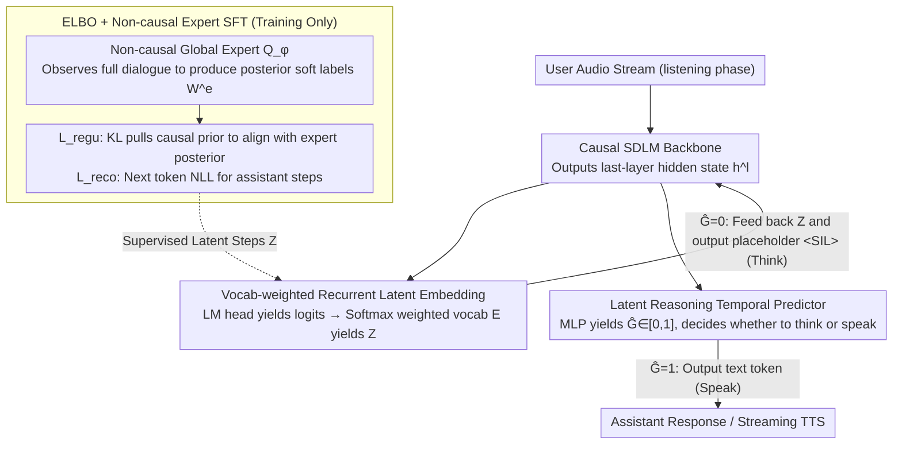

# The Silent Thought: Modeling Internal Cognition in Full-Duplex Spoken Dialogue Models via Latent Reasoning

**Conference**: ICML 2026  
**arXiv**: [2603.17837](https://arxiv.org/abs/2603.17837)  
**Code**: To be confirmed  
**Area**: Spoken Dialogue / Full-duplex SDLM / Latent Reasoning  
**Keywords**: Full-duplex SDLM, Latent Thinking, ELBO, Thinking while Listening, Variational Inference

## TL;DR
This paper proposes FLAIR: a framework that allows Full-Duplex Spoken Dialogue Models (SDLM) to replace the steps typically used for filling `<SIL>` placeholders while "listening to the user" with continuous latent reasoning. By employing an ELBO training objective and a non-causal "global expert" to provide the posterior, the causal LLM learns to "think while listening" through a sequence of embedding vectors, significantly improving QA quality without introducing any inference latency.

## Background & Motivation
**Background**: Full-duplex SDLMs (e.g., Moshi, SALMONN-omni) process "listening" and "speaking" as two concurrent streams. The model must output a text token at each timestep. During the user's speech, the standard practice is to repeatedly output `<SIL>` tokens to keep the text stream synchronized with the audio stream length.

**Limitations of Prior Work**: Outputting only sentinel tokens during the listening phase completely wastes the computational power available in the listening window. A direct alternative is to port CoT (Chain-of-Thought) from NLP—generating explicit text thinking chains synchronously while listening. however, speech streams are **causal**: thinking cannot precede words that have not yet been spoken. Furthermore, a user might finish speaking at any time; if the model is locked into a predetermined text reasoning chain, interrupting it to switch to a response introduces significant state management latency.

**Key Challenge**: High-quality reasoning requires "steps to think," but the real-time nature of full-duplex systems demands **causality + zero additional latency + no explicit CoT labeling**—three constraints that render explicit thinking schemes unfeasible.

**Goal**: To enable the model to continuously perform "thinking" during the listening phase and translate this cognition into improved response quality without breaking causality, increasing latency, or requiring additional reasoning datasets.

**Key Insight**: The authors abandon the premise that "thinking must be explicitly presented as discrete tokens." Instead, they model "internal cognition" as a **continuous latent variable trajectory** that evolves alongside user input. Since no ground-truth labels exist, they utilize variational inference (ELBO) with a non-causal "global expert" as the posterior provider.

**Core Idea**: Use ELBO to formalize "thinking while listening" as a latent variable modeling problem. This allows the causal SDLM to internalize global reasoning capabilities as an implicit prior during the streaming listening phase by aligning with the posterior distribution of a non-causal expert who has seen the full dialogue via KL divergence.

## Method

### Overall Architecture
FLAIR only modifies the input of the full-duplex SDLM during the listening phase. While conventional methods repeatedly write `<SIL>` to the text stream during user speech, FLAIR replaces these with **latent reasoning embeddings** $Z$ that evolve with user input, making the idling token slots truly "think." During training, an additional non-causal "global expert" $Q_\phi$ is employed. This expert observes the complete dialogue (user audio $X$ + assistant text embeddings $H^{txt}$) to provide ideal latent embeddings per step as soft labels. The causal LLM $P_\theta$ internalizes this global posterior via KL divergence. During inference, the expert is discarded, leaving only the causal LLM and a temporal head to autonomously switch between "thinking" and "speaking." The entire mechanism is aligned step-by-step, involves no chunks, and adds no extra computation during inference.

### Key Designs

**1. Vocab-weighted Recurrent Latent Embedding: Keeping "Soft Thoughts" on the Vocab Semantic Manifold**

The choice of vector fed back for the next LLM step is a common pitfall. Methods like Coconut feed back the previous hidden state $h^l_{t-1}$ directly, but the hidden state space and the input embedding space distributions are inconsistent, introducing train/test mismatch. FLAIR instead passes the hidden state through the LM head to obtain text logits $y^{txt}_{t-1}$, then computes a softmax-weighted average over the vocabulary embedding matrix $E \in \mathbb{R}^{|V|\times d}$ as $Z_{t-1} = \text{Softmax}(y^{txt}_{t-1}) E$. Consequently, "latent thoughts" remain "soft words" within the semantic space spanned by vocabulary embeddings. This avoids mismatch by constraining the search within the learned semantic space and provides interpretability—at any moment, one can perform an argmax on $Z_{t-1}$ to see what "soft words" the model is thinking.

**2. ELBO + Non-causal Expert SFT: Generating Supervision for Latent Steps Without Ground Truth**

Since latent steps lack CoT ground-truth labels, teacher forcing cannot be used directly. FLAIR reformulates the objective as a conditional ELBO:

$$\log P_\theta(Y^{txt}|X) \geq \mathbb{E}_{q_\phi(Z|X,Y^{txt})}[\log P_\theta(Y^{txt}|Z,X)] - \text{KL}[q_\phi(Z|X,Y^{txt}) \,\|\, P_\theta(Z|X)]$$

The first term is implemented as a **conditional reconstruction loss** $\mathcal{L}_{reco}$, which uses teacher forcing to calculate the NLL of the next text token only during assistant speaking steps. The second term is a **variational regularization** $\mathcal{L}_{regu}$, which pulls the causal LLM's predicted vocab distribution toward the stop-gradient distribution $W^e_t$ provided by the expert during user speaking steps. Here, the expert $Q_\phi$ is a non-causal encoder that uses future information to estimate the posterior accurately, modeling "ideal latent labels." This bypasses the need for CoT datasets and avoids RL instability while maintaining teacher forcing efficiency.

**3. Latent Reasoning Temporal Predictor: Making "When to Speak" an Endogenous Behavior**

Full-duplex systems must autonomously decide when to start or stop speaking (turn-taking/barge-in). Rather than using external VAD or rules, FLAIR binds this decision to the latent steps. The last hidden state $h^l$ is passed through an MLP to obtain $\hat{G}_t \in [0,1]$, supervised by a BCE loss $\mathcal{L}_{time} = -\sum_t [G_t \log \hat{G}_t + (1-G_t)\log(1-\hat{G}_t)]$, where $G_t$ signifies whether the current step is the assistant or user speaking. During inference, if $\hat{G}_t=1$, the model outputs text tokens; if $\hat{G}_t=0$, it performs vocab-weighted embedding feedback and outputs `<SLL>` on the audio side. This makes the transition from thinking to speaking a learned behavior, ensuring latency is not locked by a fixed CoT chain.

### Loss & Training
The total loss is $\mathcal{L}_{elbo} = \mathcal{L}_{reco} + \alpha \cdot \mathcal{L}_{regu} + \beta \cdot \mathcal{L}_{time}$. Training consists of three phases: (i) Pre-training: standard full-duplex speech continuation (still using `<SIL>`); (ii) Latent Reasoning SFT: First, train the expert using only $\mathcal{L}_{reco}$ to produce reasonable latent labels, then joint training of the causal LLM and expert using the full $\mathcal{L}_{elbo}$; (iii) Speech Synthesizing SFT: freeze the backbone and train the streaming TTS module (CosyVoice 2 flow-matching). Data includes 530k hours of synthetic speech continuation, 70k hours of instruction QA, and 20k hours of ASR-QA.

## Key Experimental Results

### Main Results (QA benchmarks from Table 1)

| Dataset | Metric | FLAIR w/o thk | FLAIR w/ thk | Gain | Remarks |
|--------|------|---------------|--------------|------|------|
| LlamaQ | Acc % | 73.0 | **78.0** | +5.0 | Best Full-Duplex |
| TriviaQA | Acc % | 54.4 | 56.2 | +1.8 | — |
| SDQA | Acc % | 3.80 | 3.85 | +0.05 | GPT-Score |
| AlpacaEval | GPT | 3.80 | 3.85 | +0.05 | Open QA |
| CommonEval | GPT | 3.54 | 3.65 | +0.11 | Human Recordings |
| OpenbookQA | Acc % | 72.9 | 74.2 | +1.3 | Multiple Choice |
| **MMSU** | Acc % | 50.2 | **56.2** | **+6.0** | Largest Gain in Reasoning |

Compared to full-duplex baselines like Moshi (54.5 LlamaQ) and SALMONN-omni (73.6 LlamaQ), FLAIR w/ thk achieves SOTA in most tasks; it is comparable to or exceeds half-duplex models like Kimi-Audio and Baichuan-Audio.

### Dialogue Dynamics (Table 2 Impatient Dataset + Table 3 Full-Duplex-Bench)

| Configuration | E2E? | Turn-taking lat. ↓ | Barge-in lat. ↓ | Barge-in succ. ↑ | MOS ↑ |
|------|------|--------------------|------------------|-------------------|-------|
| Moshi | ✓ | — | 0.81 | 55.1 | 3.9 |
| ORISE | ✓ | 0.43 | 0.61 | 96.8 | 4.2 |
| FLAIR w/o thk | ✓ | 0.33 | 0.49 | 100 | 4.3 |
| FLAIR w/ thk | ✓ | 0.39 | 0.46 | **100** | 4.3 |

Adding latent reasoning slightly increases turn-taking latency from 0.33s to 0.39s, but barge-in latency actually decreases (0.46s), with success rates maintaining 100%. On Full-Duplex-Bench, TOR and GPT-4o scores did not degrade.

### Key Findings
- **Reasoning-heavy tasks benefit most**: MMSU +6.0, LlamaQ +5.0. Fact extraction tasks like WebQ showed minimal gains (+1.3) or slight decreases, verifying that latent steps perform "reasoning" rather than just adding noise.
- **No increase in inference latency**: The listening phase inherently waits for the user; converting these unused token slots into latent steps is a "zero-overhead" reclamation of compute.
- **t-SNE Visualization (Fig. 3)**: When user audio, target text, and latent reasoning embeddings are projected to 2D, latent embeddings extend from audio clusters to text clusters along a "feasible manifold," forming a "bridge." This suggests that latent steps perform cross-modal alignment and planning.
- **Expert blindness leads to collapse**: Ablations show the non-causal expert is the signal source for ELBO. If the expert is reduced to a causal one, $\mathcal{L}_{regu}$ loses its pulling force, and latent steps degrade into fitting silence tokens.

## Highlights & Insights
- **ELBO as an "Implicit CoT Label Generator"**: Previous latent reasoning methods (e.g., Coconut, CODI) relied on expensive resampling or RL. FLAIR uses a non-causal expert with KL alignment to achieve teacher-forcing level efficiency. This can be transferred to any "future-informed training, past-informed inference" scenarios like simultaneous translation.
- **Vocab-weighted Embedding Feedback**: Compared to raw hidden state feedback, this detail ensures interpretability and avoids embedding space mismatch, a critical but often overlooked engineering detail.
- **Temporal Predictor Head**: By making "when to speak" a learnable endogenous signal, the model absorbs VAD and turn-taking decisions into a single LLM forward pass, creating a unified "listen-think-speak" architecture.
- **Transferable Philosophy**: The abstraction of "internal cognition as a latent variable" can be applied to any streaming task with wasted waiting time—such as robot policy "observation idle frames" or video generation intervals.

## Limitations & Future Work
- **Reliance on Expert Convergence**: The two-stage SFT depends heavily on the expert learning a proper latent distribution first. If the expert capacity or data is insufficient, the KL divergence in the second stage may pull the model in the wrong direction.
- **Interpretability Limits**: While latent embeddings can be visualized as "soft words" via argmax, the human readability of long sequences during the listening phase remains to be qualitatively analyzed.
- **Synthetic Training Data**: Most of the 530k+70k+20k hours are synthetic TTS English data. Generalization across languages, accents, and noisy environments hasn't been deeply tested.
- **Variable Returns**: Minimal benefits for fact-extraction suggest latent steps aren't universally beneficial; a task router to gate the "think" mechanism based on query type could be valuable.

## Related Work & Insights
- **vs Coconut / CODI**: Also uses "hidden state feedback," but FLAIR introduces vocab-weighted soft embeddings and ELBO supervision for more stable signals in streaming scenarios.
- **vs STITCH ("think-while-talking")**: STITCH inserts explicit CoT chunks during the speaking phase; FLAIR hides thinking entirely within the listening phase to maintain zero latency. These could be complementary.
- **vs SHANKS / Arora et al.**: These use explicit CoT, requiring either custom datasets or breaking causality. FLAIR's use of ELBO to bypass CoT labeling is a core methodological difference.
- **vs Moshi / Freeze-Omni**: These share the "Encoder + LLM + TTS" architecture. FLAIR only modifies the input semantics of the listening phase, making it a plug-and-play enhancement for these models.

## Rating
- Novelty: ⭐⭐⭐⭐⭐ First to introduce latent reasoning into speech LLMs; the ELBO + global expert formulation is a clean, original combination.
- Experimental Thoroughness: ⭐⭐⭐⭐ Covers 9 QA benchmarks and 2 dialogue dynamic evaluations with t-SNE, though some ablation details are relegated to the Appendix.
- Writing Quality: ⭐⭐⭐⭐⭐ Logical flow from motivation to formulas to architecture is clear, with ELBO derivations directly mapping to loss terms.
- Value: ⭐⭐⭐⭐⭐ Provides a zero-latency solution to the wasted compute in full-duplex listening phases, representing a paradigm shift for real-time voice agents.

<!-- RELATED:START -->

## Related Papers

- [\[ICML 2026\] MoshiRAG: Asynchronous Knowledge Retrieval for Full-Duplex Speech Language Models](moshirag_asynchronous_knowledge_retrieval_for_full-duplex_speech_language_models.md)
- [\[ACL 2026\] Full-Duplex-Bench-v2: A Multi-Turn Evaluation Framework for Duplex Dialogue Systems with an Automated Examiner](../../ACL2026/audio_speech/full-duplex-bench-v2_a_multi-turn_evaluation_framework_for_duplex_dialogue_syste.md)
- [\[ACL 2026\] SDiaReward: Modeling and Benchmarking Spoken Dialogue Rewards with Modality and Colloquialness](../../ACL2026/audio_speech/sdiareward_modeling_and_benchmarking_spoken_dialogue_rewards_with_modality_and_c.md)
- [\[ACL 2026\] MTR-DuplexBench: Towards a Comprehensive Evaluation of Multi-Round Conversations for Full-Duplex Speech Language Models](../../ACL2026/audio_speech/mtr-duplexbench_towards_a_comprehensive_evaluation_of_multi-round_conversations_.md)
- [\[ICML 2025\] Aligning Spoken Dialogue Models from User Interactions](../../ICML2025/audio_speech/aligning_spoken_dialogue_models_from_user_interactions.md)

<!-- RELATED:END -->
