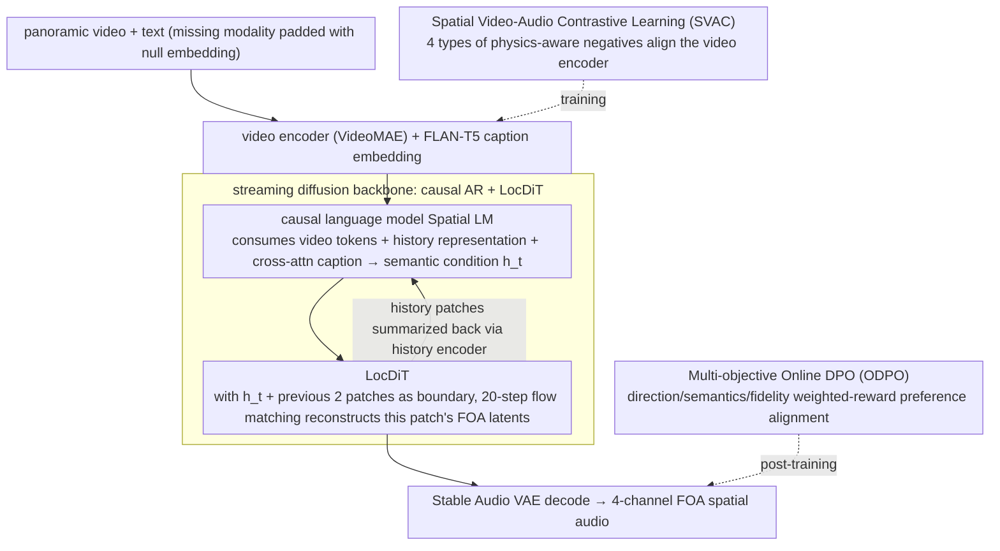

# Towards Streaming Synchronized Spatial Audio Generation via Autoregressive Diffusion Transformer

**Conference**: ICML 2026  
**arXiv**: [2605.30940](https://arxiv.org/abs/2605.30940)  
**Code**: None (demo page only: https://swanaigc.github.io/#swansphere)  
**Area**: Audio & Speech  
**Keywords**: Spatial Audio Generation, First-Order Ambisonics, Streaming Generation, Autoregressive Diffusion, Contrastive Learning

## TL;DR
SwanSphere proposes a two-stage streaming architecture — a causal AR language model plus a local DiT (LocDiT) — that generates four-channel First-Order Ambisonics (FOA) spatial audio from panoramic video or text. Combined with SVAC physics-aware contrastive learning and a three-objective ODPO, it cuts first-chunk latency to 0.21s while comprehensively beating cascaded and end-to-end baselines on FD/KL/angular error.

## Background & Motivation

**Background**: VR/AR and panoramic video place ever-stronger immersion demands on "audio-visual directional consistency", so the research focus has shifted from mono and stereo V2A toward directly generating FOA (4 channels: the omnidirectional $W$ plus three directional velocity components $X,Y,Z$). The mainstream routes are a large-scale DiT that produces the whole sequence in one shot (e.g. OmniAudio), or a discrete-codebook AR (e.g. ViSAGe).

**Limitations of Prior Work**: Both routes have hard flaws. DiT uses global self-attention plus multi-step denoising — high quality but **high first-frame latency** (OmniAudio ~0.85s, the DiT baseline 6.47s, ViSAGe at the 20s level), failing real-time VR/AR interaction; discrete-codebook AR suffers **reconstruction error** from quantization loss, and the lost phase information especially hurts FOA's directional components. Almost all methods use **acoustically prior-free** visual encoders like CLIP with global pooling, which smooths away directional cues during pooling.

**Key Challenge**: Quality↔latency is a structural trade-off (global vs. streaming), and directional precision↔semantic alignment is also a structural trade-off (CLIP's semantic strength comes with a directional blind spot). To simultaneously win "high fidelity + low latency + accurate direction", one must attack at both the architecture and the representation level.

**Goal**: Within a unified framework, solve three things — (1) low-first-chunk-latency streaming FOA generation; (2) genuinely extracting direction-aware visual representations from panoramic video; (3) making the output close to the real distribution along all three of semantics, direction, and perceptual quality.

**Key Insight**: Decouple "long-range temporal structure" from "local high-fidelity rendering" — the former naturally fits AR causal modeling and can be streamed out patch by patch, while the latter naturally fits short-window DiT denoising in a continuous latent space; meanwhile, use **physics-aware contrastive learning** instead of CLIP, turning FOA-specific physical symmetries like rotation and time shift into hard negatives fed to the encoder.

**Core Idea**: A divide-and-conquer of "AR does semantic planning + LocDiT does intra-patch continuous synthesis", stacked with SVAC physical negatives and multi-objective ODPO preference alignment, sidestepping both discrete quantization and global-DiT latency.

## Method

### Overall Architecture
SwanSphere targets the structurally conflicting task of "generating 4-channel FOA spatial audio from panoramic video and/or text while jointly achieving high fidelity, low first-chunk latency, and accurate direction." Its core decomposition decouples "long-range semantic planning" from "local high-frequency rendering": the former is handled by a causal language model that predicts semantic conditions at patch granularity, while the latter is handled by a short-window LocDiT doing flow-matching denoising in a continuous latent space — sidestepping the quantization loss of pure discrete-codebook AR and avoiding the second-level latency of global DiT. Around this backbone, training stacks two more things: SVAC physics-aware contrastive learning pulls the visual encoder into the acoustic domain to learn directional sensitivity; after supervised training, multi-objective ODPO preference alignment pushes the three objectives of direction, semantics, and perceptual quality back into the generation distribution. Text input passes through FLAN-T5 and is injected into the language model via cross-attention, missing modalities are padded with a learnable null embedding, enabling a single model to consume video, text, or both.

### Key Designs

**1. Streaming diffusion backbone of causal AR + LocDiT: decouple long-range semantics from local rendering to cut first-chunk latency**

Targeting the latency Achilles' heel of global DiT ("multi-step denoising + global self-attention means the first frame must wait for the whole segment to be computed"), SwanSphere splits generation into two layers. On the audio side, a fine-tuned Stable Audio VAE first compresses FOA into **continuous** latents $\mathbf{z}\in\mathbb{R}^{d\times l}$ at 21.5 FPS and 128 dimensions (the continuous latent space precisely avoids the quantization damage that discrete codebooks like DAC inflict on FOA phase). At generation, for each time step $t$, the causal language model consumes three conditioning streams — video tokens $C_v$ aligned to the audio timeline, a compact history representation summarized from past patches via a history encoder, and the FLAN-T5 caption embedding injected by cross-attention — and outputs the high-dimensional semantic condition $h_t$ for the current patch; LocDiT then, conditioned on $h_t$ and using the previous 2 patches as boundary context, runs 20-step flow matching to reconstruct that patch's 4-channel FOA latents from Gaussian noise. Video features are aligned to audio resolution by nearest-neighbor copy (no interpolation), and the stop condition is tied directly to video end rather than learning a stop token, guaranteeing strictly equal-length audio and video. This way each patch is denoised only over a very short latent sequence, and first-chunk latency decomposes cleanly: spatial LM 0.03s + LocDiT 0.14s + video encoding and audio decoding 0.04s = 0.21s. Patch size and history window thus become a tunable knob of "context vs. response speed"; empirically, patch size = 4 latent frames and history = 2 patches is the current sweet spot — anything larger pushes up first-chunk latency.

**2. Spatial Video-Audio Contrastive Learning (SVAC): use physical negatives to drag the visual encoder out of its directional blind spot**

Encoders like CLIP obtain semantics through frame-level global pooling, but pooling is exactly what smooths away local directional cues like "where in the frame the sound source is" — and directional precision is precisely the crux of FOA generation. SVAC keeps VideoMAE's spatiotemporal structure (no global pooling), pairs it with AudioMAE as the audio-side encoder, and runs symmetric InfoNCE: $\mathcal{L}_{total}=\frac{1}{2N}\sum_i \big(\mathcal{L}_{NCE}(v_i,a_i,\mathcal{N}_i^a)+\mathcal{L}_{NCE}(a_i,v_i,\mathcal{N}_i^v)\big)$. The real key is 4 types of **physics-aware negatives**: instance swap (other in-batch samples as semantic negatives), time shift (randomly cyclically shifting the corresponding audio to make temporal negatives, forcing the model to learn event-onset synchronization), audio rotation (3D rotation of FOA producing "direction changed, semantics unchanged" hard negatives, forcing the video encoder to be direction-sensitive), and video rotation (horizontal rotation of the panoramic video as negatives, forcing direction to be consistent with geometric structure). Together they form the negative set $\mathcal{N}_i^a=\{a_j\}_{j\neq i}\cup\{\tilde a_i^{time}\}\cup\{\tilde a_i^{spat}\}$, with temporal similarity using aligned cosine. In essence this writes FOA's inherent physical symmetries — "rotation invariance + temporal synchronization" — directly into the contrastive learning negatives, injecting inductive bias at the representation level rather than the network-structure level, which is more thorough than swapping the backbone. The ablation (Table 3) confirms its effect: reverting to CLIP degrades FD to 140.28 and angular error to 1.34; keeping only semantic negatives and dropping the physical negatives raises angular error from 1.03 to 1.12.

**3. Multi-objective Online DPO (ODPO): push direction, semantics, and perceptual quality back into the generation distribution**

Supervised training can only make the model fit the training distribution, but the three objectives — directional physical accuracy, cross-modal semantic consistency, and perceptual fidelity — are fragmented in the supervised loss. ODPO adds a round of preference fine-tuning after supervised training to unify them: for each input, 8 candidate audios are sampled in parallel and ranked by a weighted reward $R=\lambda_{spatial}\cdot R_{spatial}+\lambda_{semantic}\cdot R_{semantic}+\lambda_{fidelity}\cdot R_{fidelity}$ (defaults $\lambda_{spatial}=\lambda_{semantic}=0.4,\lambda_{fidelity}=0.2$), automatically constructing preference pairs $(y_w,y_l)$ and running a DPO loss. Each reward has its own source: $R_{spatial}$ takes the azimuth/elevation/spatial angular error against GT, $R_{semantic}$ takes the ImageBind cross-modal similarity, $R_{fidelity}$ takes the Audiobox Aesthetics distance to a real reference in perceptual feature space; to avoid coupling reward with evaluation metrics, a pretrained SELD network PSELDNets computes wCS as an independent spatial evaluator. The authors note that one could in theory swap in online RL like GRPO, but the sample-and-rank pipeline naturally yields preference pairs, so DPO is more stable and lighter. In the ablation (Table 4), ODPO takes FD from 133.91 → 120.28 and angular error 1.22 → 1.03 — the single highest gain among all modules — showing that injecting the directional physical constraint via a three-objective weighted reward is more effective than simply adding a supervised loss.

### Loss & Training
The whole pipeline follows three-stage curriculum learning: (1) LocDiT is first pretrained on ~1M non-spatial audio clips (pseudo-FOA: set $W$ to the sum of left and right channels, randomly place the difference signal into one of $X/Y/Z$, zero the rest) to learn the general audio distribution; (2) the whole model is supervised with teacher forcing on 165k panoramic audio-video pairs (458 hours total), padding missing modalities with null embeddings; (3) multi-objective ODPO is run on a 3.1k finely-annotated subset with spatial captions. The VAE uses a continuous latent space to avoid quantization loss; patch size = 4 latent frames, temporal stride = 4, causal context = 2 patches, and LocDiT inference uses 20 denoising steps.

## Key Experimental Results

### Main Results

**Video-to-Spatial Audio (Table 1, mixed test set; "+AS" denotes a cascaded baseline with external audio spatialization)**

| Model | Params | Inference Time ↓ | FD ↓ | KL ↓ | Δangular ↓ | MOS-SQ ↑ | MOS-AF ↑ |
|------|--------|-----------|------|------|------------|----------|----------|
| MMAudio+AS | 1.03B | 2.76s | 261.65 | 2.43 | — | 3.91 | 3.60 |
| Diff-Foley+AS | 0.94B | 2.03s | 304.03 | 3.12 | — | 3.68 | 3.26 |
| ViSAGe | 0.36B | 20.19s | 232.17 | 2.67 | 1.59 | 3.82 | 3.78 |
| OmniAudio | 1.22B | 0.85s | 157.67 | 1.93 | 1.27 | 4.12 | 4.27 |
| **SwanSphere (Ours)** | **1.09B** | **0.21s / 9.13s** | **120.28** | **1.36** | **1.03** | **4.32** | **4.44** |

First-chunk latency 0.21s = LM 0.03s + LocDiT 0.14s + codec 0.04s, ~4× faster than OmniAudio's full-sequence 0.85s and ~30× faster than a same-size DiT (6.47s). Text-to-Spatial Audio (Table 2) also leads: FD 174.13→142.80, KL 1.83→1.43. Joint video+text conditioning improves another notch over video-only: FD 120.28→118.31, angular error 1.03→0.96.

### Ablation Study

**SVAC and generation paradigm (merged key rows from Tables 3/4)**

| Config | FD ↓ | KL ↓ | Δangular ↓ | Note |
|------|------|------|------------|------|
| Full (SwanSphere-L) | 120.28 | 1.36 | 1.03 | full model |
| SVAC → semantic negatives only | 127.12 | 1.41 | 1.12 | drop time/rotation physical negatives, angular error degrades notably |
| SVAC → CLIP backbone | 140.28 | 1.44 | 1.34 | revert to CLIP, FD/angular error degrade across the board |
| w/o ODPO | 133.91 | 1.44 | 1.22 | drop preference alignment, single largest drop |
| w/o history (history encoding zeroed) | 128.15 | 1.42 | — | streaming context is indeed useful |
| Global DiT (1.11B) | 123.08 | 1.36 | 1.14 | FD close but latency 6.47s, worse angular error |
| SwanSphere-M (0.62B) | 132.52 | 1.43 | 1.16 | medium capacity |
| SwanSphere-S (0.43B) | 139.81 | 1.58 | 1.33 | small model, directional precision degrades clearly |

### Key Findings
- **ODPO contributes the most**: in one step it lowers FD by 13.6 points and angular error from 1.22→1.03, the single highest gain among all modules — meaning only post-supervision three-objective preference alignment can truly fit physics and perception.
- **Physical negatives are not optional**: dropping the rotation/time-shift negatives degrades angular error by 9%, showing SVAC's gain comes mainly from "physics awareness" rather than "a bigger backbone".
- **Latency-quality beats pure DiT**: a same-size DiT ties or even slightly loses to SwanSphere on FD/KL, but with latency 6.47s vs. 0.21s — showing the streaming architecture does not trade quality for speed; divide-and-conquer even gains slightly because "short-window DiT learns local detail more easily".
- **Model capacity matters**: from 1.09B → 0.43B angular error degrades from 1.03 to 1.33; the panoramic-video-to-spatial-audio cross-modal mapping is sensitive to parameter count.

## Highlights & Insights
- **Architecture-level trade-off decoupling**: handing "long-range semantics" to causal AR and "local high-frequency detail" to a short-window DiT turns the two mutually exclusive routes in V2A (AR discrete low-latency vs. DiT high-quality high-latency) into complements; patch size and history window become tunable knobs, and the methodology transfers directly to any continuous-generation task requiring streaming output (video streams, long speech, long motion).
- **Physical symmetry → contrastive negatives**: FOA's 3D rotation, the panoramic video's horizontal rotation, and audio's temporal cyclic shift are all task-inherent physical symmetries; turning them directly into hard negatives rather than data augmentation is a very clean paradigm of "injecting domain physical priors into the representation", far more general than swapping the backbone.
- **A viable path for MLLM-based spatial annotation**: feeding raw FOA to an MLLM is wasteful because MLLMs don't understand FOA decoding; but **first running sound-field analysis to extract azimuth/elevation/distance trajectories, then feeding the structured trajectories + panoramic video + audio together to Gemini 2.5 Pro** yields spatiotemporally consistent captions — this "traditional signal processing up front + MLLM for verbalization" annotation pipeline is broadly applicable in supervision-scarce multimodal tasks.
- **Engineering value of latency decomposition**: breaking 0.21s into LM/DiT/codec segments is a rare honest number and very instructive for deployment-side tuning.

## Limitations & Future Work
- **Multi-source scenes under-modeled**: the authors admit the spatial captions mainly describe the dominant sound source, and fine-grained directional separation in complex reverberant scenes with many simultaneous instruments is weak.
- **Reward weights set by hand**: $\lambda_{spatial},\lambda_{semantic},\lambda_{fidelity}=(0.4,0.4,0.2)$ are not systematically searched, no three-objective trade-off curve is given, and a different dataset may require re-tuning.
- **Generalization and recording equipment**: FOA recording methods (A-format mic-array differences, HRTF calibration) affect the true spatial distribution, and the paper does not run OOD recording environments.
- **Streaming but still not truly causal real-time**: after the first chunk's 0.21s, the total length of 9.13s is still long, and a 10-second clip cannot yet guarantee keeping up with 21.5 FPS real-time generation throughout (LocDiT would need to produce results in shorter windows or fewer steps).
- **Improvement ideas**: use SELD models like PSELDNets directly as reward rather than only as evaluator, swap ODPO for GRPO to see whether angular error drops further, and introduce HRTF/room-impulse-response physical constraints as additional negatives.

## Related Work & Insights
- **vs OmniAudio**: same end-to-end, same parameter scale; OmniAudio uses full-sequence DiT for quality, while this paper uses streaming AR-DiT to cut first-chunk latency from 0.85s to 0.21s, with better FD/KL/angular error on all three — showing that on a task like FOA where "directional precision is scarcer than absolute audio quality", architectural decoupling + preference alignment is more cost-effective than piling on parameters.
- **vs ViSAGe**: ViSAGe uses FoV video + camera parameters + AR discrete codebook; this paper uses panoramic video + continuous VAE + AR-DiT, with FD 232.17→120.28 and latency 20s→0.21s. The fundamental gap is "discrete quantization hurts FOA phase" + "FoV loses panoramic directional cues".
- **vs MMAudio+AS / Tango2+AS**: cascaded "generate mono first, then spatialize" is almost entirely dominated by end-to-end methods, reconfirming the ceiling of the cascaded paradigm in V2A.
- **vs SoundReactor**: also a low-latency direction of causal AR + diffusion head, but SoundReactor only does stereo, not FOA; this paper extends that route into the spatial-audio domain. SoundReactor's frame-level causal modeling could in turn be borrowed here to further lower intra-patch latency.
- **vs CLIP-style visual encoders**: this is a rare work systematically demonstrating "CLIP's failure mode on FOA tasks" (FD +20, angular error +0.31), a cautionary signal for all spatial-audio/3D-sound-field tasks relying on visual conditioning.

## Rating
- Novelty: ⭐⭐⭐⭐ The "AR + LocDiT" decoupling itself has precedents in V2A (e.g. SoundReactor), but the combination that simultaneously wins streaming FOA + physics-aware contrast + multi-objective ODPO is new.
- Experimental Thoroughness: ⭐⭐⭐⭐ Main experiments, ablations, capacity, latency decomposition, text/video/joint conditioning, and an independent SELD evaluator are all provided; lacks quantitative analysis of OOD recording environments and multi-source scenes.
- Writing Quality: ⭐⭐⭐⭐ The motivation builds layer by layer, formulas and negative-sample construction are clearly written, and the latency decomposition is extremely honest.
- Value: ⭐⭐⭐⭐ Pushing "first-chunk latency" to 0.21s moves real-time VR/AR spatial audio from paper to engineering-usable, and SVAC's physical-negative paradigm has significant transfer value.

<!-- RELATED:START -->

## Related Papers

- [\[ACL 2026\] ZipVoice-Dialog: Non-Autoregressive Spoken Dialogue Generation with Flow Matching](../../ACL2026/audio_speech/zipvoice-dialog_non-autoregressive_spoken_dialogue_generation_with_flow_matching.md)
- [\[ACL 2026\] ImmersiveTTS: Environment-Aware Text-to-Speech with Multimodal Diffusion Transformer and Domain-Specific Representation Alignment](../../ACL2026/audio_speech/immersivetts_environment-aware_text-to-speech_with_multimodal_diffusion_transfor.md)
- [\[ACL 2026\] ControlAudio: Tackling Text-Guided, Timing-Indicated and Intelligible Audio Generation via Progressive Diffusion Modeling](../../ACL2026/audio_speech/controlaudio_tackling_text-guided_timing-indicated_and_intelligible_audio_genera.md)
- [\[NeurIPS 2025\] From Generation to Attribution: Music AI Agent Architectures for the Post-Streaming Era](../../NeurIPS2025/audio_speech/from_generation_to_attribution_music_ai_agent_architectures_for_the_post-streami.md)
- [\[ICLR 2026\] Query-Guided Spatial-Temporal-Frequency Interaction for Music Audio-Visual Question Answering](../../ICLR2026/audio_speech/query-guided_spatial-temporal-frequency_interaction_for_music_audio-visual_quest.md)

<!-- RELATED:END -->
