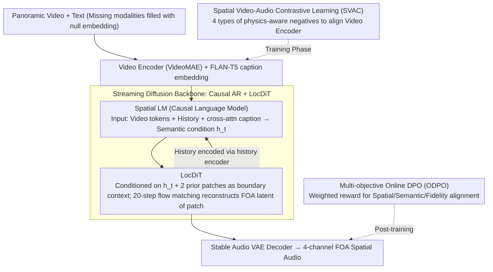

# Towards Streaming Synchronized Spatial Audio Generation via Autoregressive Diffusion Transformer

**Conference**: ICML 2026  
**arXiv**: [2605.30940](https://arxiv.org/abs/2605.30940)  
**Code**: None (Demo page only: https://swanaigc.github.io/#swansphere)  
**Area**: Multimodal Generation / Spatial Audio / Autoregressive Diffusion  
**Keywords**: Spatial Audio Generation, First-Order Ambisonics, Streaming Generation, Autoregressive Diffusion, Contrastive Learning

## TL;DR
SwanSphere proposes a two-stage streaming architecture consisting of a "Causal AR Language Model + Local DiT (LocDiT)." It generates four-channel First-Order Ambisonics (FOA) spatial audio from panoramic videos or text. Combined with SVAC physics-aware contrastive learning and multi-objective ODPO, it reduces first-chunk latency to 0.21s while outperforming cascade and end-to-end baselines in FD, KL, and angular error.

## Background & Motivation

**Background**: VR/AR and panoramic videos demand high immersive consistency between visual and audio directions. Research focus has shifted from mono or stereo V2A to direct FOA generation (4 channels: omnidirectional $W$ and three directional velocity components $X, Y, Z$). Prevailing approaches include large-scale DiT for full-sequence generation (e.g., OmniAudio) or discrete-codebook-based AR (e.g., ViSAGe).

**Limitations of Prior Work**: Both approaches have significant drawbacks. DiT utilizes global self-attention and multi-step denoising, ensuring high quality but causing **high first-chunk latency** (OmniAudio ~0.85s, DiT baseline 6.47s, ViSAGe ~20s), failing real-time VR/AR requirements. AR models based on discrete codebooks suffer from **reconstruction errors** due to quantization loss, where phase information loss severely degrades FOA directional components. Furthermore, most methods use visual encoders like CLIP, which lack **acoustic priors**, drowning out spatial cues during global pooling.

**Key Challenge**: There is a structural trade-off between quality and latency (Global vs. Streaming), and between directional accuracy and semantic alignment (semantic advantages of CLIP come with directional blind spots). Achieving "high fidelity + low latency + accurate directionality" simultaneously requires intervention at both the architecture and representation levels.

**Goal**: Solve three issues within a unified framework: (1) streaming FOA generation with low first-chunk latency; (2) extraction of spatial-aware visual representations from panoramic videos; (3) aligning generation with real distributions across semantic, spatial, and perceptual dimensions.

**Key Insight**: Decouple "long-range temporal structure" from "local high-fidelity rendering." The former is suited for causal AR modeling to emit patches in a streaming fashion, while the latter is suited for short-window DiT denoising in a continuous latent space. Replace CLIP with **physics-aware contrastive learning** to feed hard negative samples (e.g., rotation, time shifts—physical symmetries unique to FOA) into the encoder.

**Core Idea**: A "divide-and-conquer" approach where "AR performs semantic planning + LocDiT performs local continuous synthesis," augmented by SVAC physical negatives and multi-objective ODPO preference alignment. This bypasses discrete quantization and avoids the latency of global DiT.

## Method

### Overall Architecture
SwanSphere addresses the structural conflict of generating 4-channel FOA spatial audio from panoramic videos/text while ensuring high fidelity, low first-chunk latency, and directional accuracy. The core strategy decouples "long-range semantic planning" from "local high-frequency rendering." A causal language model predicts semantic conditions at the patch level, while a short-window LocDiT performs flow matching denoising in a continuous latent space, avoiding quantization loss and global DiT latency. Training involves SVAC physics-aware contrastive learning to align the visual encoder with the acoustic domain and multi-objective ODPO for preference alignment across spatial, semantic, and perceptual dimensions. Text inputs via FLAN-T5 are injected through cross-attention, with learnable null embeddings handling missing modalities.

### Key Designs

**1. Causal AR + LocDiT Streaming Backbone: Decoupling for Low Latency**

To address the latency inherent in global DiT, SwanSphere splits generation. On the audio side, a fine-tuned Stable Audio VAE compresses FOA into a 21.5 FPS, 128-dimensional **continuous** latent variable $\mathbf{z}\in\mathbb{R}^{d\times l}$ to avoid quantization damage to FOA phase. At each timestep $t$, the Causal Spatial LM takes video tokens $C_v$ aligned to the audio timeline, a compact history representation from a history encoder, and FLAN-T5 caption embeddings via cross-attention to output a semantic condition $h_t$. LocDiT then uses $h_t$ and the boundary context of the previous two patches to reconstruct the FOA latent for the current patch via 20-step flow matching. Video features are aligned via nearest-neighbor replication. First-chunk latency is decomposed into: Spatial LM 0.03s + LocDiT 0.14s + encoding/decoding 0.04s = 0.21s. A patch size of 4 latent frames and a history of 2 patches currently provides the optimal context-to-speed balance.

**2. Spatial Video-Audio Contrastive Learning (SVAC): Eliminating Directional Blind Spots**

Standard encoders like CLIP lose local directional cues (e.g., source location) due to global pooling. SVAC maintains the spatio-temporal structure of VideoMAE and uses AudioMAE to perform symmetric InfoNCE: $\mathcal{L}_{total}=\frac{1}{2N}\sum_i \big(\mathcal{L}_{NCE}(v_i,a_i,\mathcal{N}_i^a)+\mathcal{L}_{NCE}(a_i,v_i,\mathcal{N}_i^v)\big)$. Crucially, it introduces 4 types of **physics-aware negative samples**: instance swapping (semantic negatives), time shift (temporal synchronization), audio rotation (3D rotation of FOA creating "different direction, same semantics"), and video rotation (horizontal rotation of panoramic video). The negative sample set $\mathcal{N}_i^a=\{a_j\}_{j\neq i}\cup\{\tilde a_i^{time}\}\cup\{\tilde a_i^{spat}\}$ embeds FOA physical symmetries directly into the representation layer rather than just the network architecture.

**3. Multi-objective Online DPO (ODPO): Distribution Alignment**

Supervised training alone often fails to unify spatial accuracy, semantic consistency, and fidelity. ODPO fine-tunes the distribution using a weighted reward $R = \lambda_{spatial}R_{spatial} + \lambda_{semantic}R_{semantic} + \lambda_{fidelity}R_{fidelity}$ (default weights: 0.4, 0.4, 0.2). $R_{spatial}$ measures angular error against ground truth, $R_{semantic}$ uses ImageBind cross-modal similarity, and $R_{fidelity}$ utilizes Audiobox Aesthetics features. For independent evaluation, a pre-trained SELD network (PSELDNets) calculates wCS. Ablation shows ODPO is the most effective single-point improvement, reducing FD from 133.91 to 120.28 and angular error from 1.22 to 1.03.

### Loss & Training
The framework follows a three-stage curriculum: (1) Pre-training LocDiT on ~1M non-spatial audio samples (pseudo-FOA) to learn universal distributions; (2) Supervised training with teacher forcing on 165k panoramic video-audio pairs (458 hours); (3) Multi-objective ODPO on a high-quality 3.1k subset with spatial captions. The VAE uses continuous latent space; patch size is 4 frames with a causal context of 2 patches. LocDiT uses 20 steps for inference.

## Key Experimental Results

### Main Results

**Video-to-Spatial Audio (Table 1, Mixed Test Set, "+AS" denotes cascaded audio spatialization)**

| Model | Params | Latency ↓ | FD ↓ | KL ↓ | Δangular ↓ | MOS-SQ ↑ | MOS-AF ↑ |
|------|--------|-----------|------|------|------------|----------|----------|
| MMAudio+AS | 1.03B | 2.76s | 261.65 | 2.43 | — | 3.91 | 3.60 |
| Diff-Foley+AS | 0.94B | 2.03s | 304.03 | 3.12 | — | 3.68 | 3.26 |
| ViSAGe | 0.36B | 20.19s | 232.17 | 2.67 | 1.59 | 3.82 | 3.78 |
| OmniAudio | 1.22B | 0.85s | 157.67 | 1.93 | 1.27 | 4.12 | 4.27 |
| **Ours (SwanSphere)** | **1.09B** | **0.21s / 9.13s** | **120.28** | **1.36** | **1.03** | **4.32** | **4.44** |

First-chunk latency of 0.21s is ~4× faster than OmniAudio (0.85s) and ~30× faster than a same-sized global DiT (6.47s). For Text-to-Spatial Audio (Table 2), Ours leads with FD 142.80 and KL 1.43.

### Ablation Study

**SVAC and Generation Paradigms (Combined Table 3/4 Key Rows)**

| Configuration | FD ↓ | KL ↓ | Δangular ↓ | Notes |
|------|------|------|------------|------|
| Full (SwanSphere-L) | 120.28 | 1.36 | 1.03 | Complete Model |
| SVAC → Sem-only | 127.12 | 1.41 | 1.12 | Without physical negatives; angular error spikes |
| SVAC → CLIP backbone | 140.28 | 1.44 | 1.34 | CLIP causes significant degradation |
| w/o ODPO | 133.91 | 1.44 | 1.22 | Largest single-point drop |
| w/o history | 128.15 | 1.42 | — | Streaming context is vital |
| Global DiT (1.11B) | 123.08 | 1.36 | 1.14 | Comparable FD but 6.47s latency |

### Key Findings
- **ODPO is the most significant contributor**: It single-handedly reduces FD by 13.6 and angular error from 1.22 to 1.03.
- **Physical negatives are essential**: Removing rotation/time-shift negatives increases angular error by 9%, proving SVAC's gains stem from "physics-awareness."
- **Latency-Quality Efficiency**: Ours matches or exceeds global DiT in FD/KL while operating at 0.21s latency vs 6.47s.
- **Parameter Sensitivity**: Performance drops significantly when model size is reduced below 1B, indicating that cross-modal spatial mapping is parameter-heavy.

## Highlights & Insights
- **Decoupling Architecture**: Assigning long-range semantics to Causal AR and local high-frequency details to short-window DiT effectively combines the speed of AR with the quality of DiT. This methodology is transferable to other continuous streaming tasks like video or long speech generation.
- **Physical Symmetry as Negatives**: Directly encoding 3D rotation and temporal shifts into contrastive learning negatives is a clean way to inject domain-specific physical priors into the representation layer.
- **MLLM Spatial Annotation Pipeline**: The authors develop a pipeline using traditional signal processing for field analysis (azimuth/elevation trajectories) combined with Gemini 2.5 Pro to generate spatio-temporally consistent captions.
- **Engineering Transparency**: The honest breakdown of the 0.21s latency (LM/DiT/Codec) provides significant value for deployment optimization.

## Limitations & Future Work
- **Multi-source Modeling**: Captions currently focus on dominant sources; fine-grained separation in complex reverberant scenes (e.g., multiple instruments) remains weak.
- **Heuristic Reward Weights**: Weights for spatial, semantic, and fidelity rewards were not systematically searched.
- **Generalization to Recording Devices**: FOA distribution depends on microphone array configurations; performance in OOD recording environments was not tested.
- **Real-time Bottleneck**: While the first chunk is fast, total sequence generation (9.13s for 10s audio) is not yet guaranteed to keep up with 21.5 FPS real-time streams in all environments.

## Related Work & Insights
- **vs OmniAudio**: While OmniAudio achieves high quality via global DiT, SwanSphere reduces first-chunk latency from 0.85s to 0.21s with better metrics. Architecture decoupling is more efficient for FOA tasks.
- **vs ViSAGe**: SwanSphere replaces discrete codebooks with continuous VAE and uses panoramic video instead of FoV, resulting in a massive FD improvement (232.17 to 120.28).
- **vs SoundReactor**: Extends the causal AR + diffusion head paradigm from stereo to FOA.
- **vs CLIP-based Encoders**: This study systematically demonstrates CLIP's failure mode in spatial tasks (FD +20, angular error +0.31).

## Rating
- Novelty: ⭐⭐⭐⭐ (Combination of streaming AR-DiT, SVAC, and multi-objective ODPO is novel).
- Experimental Thoroughness: ⭐⭐⭐⭐ (Extensive ablations and independent SELD evaluators; lacks OOD testing).
- Writing Quality: ⭐⭐⭐⭐ (Motivations are clear; technical details on negative samples are well-explained).
- Value: ⭐⭐⭐⭐ (Makes real-time spatial audio engineering-ready; SVAC paradigm is highly transferable).

<!-- RELATED:START -->

## Related Papers

- [\[ICLR 2026\] TVTSyn: Content-Synchronized Time-Varying Timbre for Streaming Voice Conversion and Anonymization](../../ICLR2026/audio_speech/tvtsyn_content-synchronous_time-varying_timbre_for_streaming_voice_conversion_an.md)
- [\[CVPR 2026\] Hear What You See: Video-to-Audio Generation with Diffusion Transformer and Semantic-Temporal Alignment-Ranked Direct Preference Optimization](../../CVPR2026/audio_speech/hear_what_you_see_video-to-audio_generation_with_diffusion_transformer_and_seman.md)
- [\[ICML 2025\] OmniAudio: Generating Spatial Audio from 360-Degree Video](../../ICML2025/audio_speech/omniaudio_generating_spatial_audio_from_360-degree_video.md)
- [\[ICLR 2026\] Steering Autoregressive Music Generation with Recursive Feature Machines](../../ICLR2026/audio_speech/steering_autoregressive_music_generation_with_recursive_feature_machines.md)
- [\[CVPR 2025\] Synchronized Video-to-Audio Generation via Mel Quantization-Continuum Decomposition](../../CVPR2025/audio_speech/synchronized_video-to-audio_generation_via_mel_quantization-continuum_decomposit.md)

<!-- RELATED:END -->
