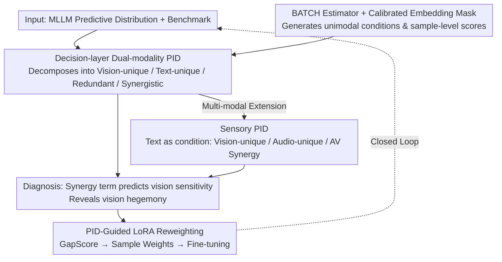

# Towards Understanding Modality Interaction in Multimodal Language Models via Partial Information Decomposition

**Conference**: ICML 2026  
**arXiv**: [2606.00959](https://arxiv.org/abs/2606.00959)  
**Code**: TBD  
**Area**: Multimodal VLM / Interpretability / Information-theoretic analysis  
**Keywords**: PID, Modality Synergy, Omni-modal models, Vision dominance, LoRA reweighting

## TL;DR
This paper treats the decision-making of Multimodal Large Language Models (MLLMs) as an information decomposition from input to output. Using Partial Information Decomposition (PID), the mutual information of VL/omni-modal model predictions is decomposed into four components: "Vision-unique / Text-unique / Redundant / Synergistic." The study finds that the synergy term is the best indicator of predictive vision sensitivity and that omni-modal models suffer from a "vision hegemony" synergy bottleneck. Furthermore, sample-level PID scores are used to guide LoRA reweighted fine-tuning, yielding consistent 1–2 percentage point improvements on MMStar, MMBench, and POPE.

## Background & Motivation

**Background**: MLLMs have evolved from perception systems to decision-making agents (scientific analysis, medical, embodied interaction). However, current evaluations almost exclusively focus on "prediction accuracy," using accuracy combined with modality ablation to judge if a model truly utilizes vision or audio.

**Limitations of Prior Work**: Existing analyses such as representation alignment, attention visualization, and modality ablation can identify "which modality is encoded" and "the performance drop when a modality is removed." However, they fail to answer **decision-layer** questions: Is the information used by the model unique to one modality, shared (redundancy), or only obtainable by simultaneously processing both modalities (synergy)? These nuances are conflated in accuracy metrics, and different multimodal fusion patterns are mixed together.

**Key Challenge**: Accuracy and ablation metrics are **scalars**, while modality usage is **multidimensionally structured** (unique vs. redundant vs. synergistic). Compressing this structure into a scalar inevitably loses critical signals such as whether the model is truly fusing inputs or simply taking shortcuts via language priors.

**Goal**: To achieve three objectives: (a) Establish a decision-layer "modality usage profile" for each model-benchmark pair; (b) Verify if this profile predicts intervention sensitivity (performance drop after removing vision/audio); (c) Use the profile to guide training and enhance true cross-modal fusion.

**Key Insight**: The authors adopt the Partial Information Decomposition (PID) framework, which decomposes $I(Y;X_v,X_t)$ into four non-negative terms: $U_{\text{vis}} + U_{\text{txt}} + R_{\text{vl}} + S_{\text{vl}}$. A crucial observation is that **PID should be constructed on the model-induced predictive distribution $p_\theta(y|x_v,x_t)$ rather than latent representations**. This characterizes "how the model uses modalities" rather than "intrinsic dataset properties."

**Core Idea**: Use decision-layer PID for VL model diagnostics, extend it to video-audio-text omni-modal models via Sensory PID (using text as a conditional control variable), and finally construct a LoRA reweighting strategy that "up-weights synergy-deficient samples and down-weights language-shortcut samples" based on sample-level PID scores.

## Method

### Overall Architecture

The paper addresses the question of "how models use modalities for decision-making" which accuracy metrics fail to answer. The approach treats the MLLM predictive distribution $p_\theta(y|x_v,x_t)$ as the object of decomposition. It uses PID to split predictive mutual information into vision-unique, text-unique, redundant, and synergistic terms. The pipeline follows three stages: profiling VL models with dual-modality PID, extending to video-audio-text models via Sensory PID, and utilizing sample-level scores from the estimator as weights for LoRA fine-tuning, creating a "diagnosis → prediction → intervention" loop.

### Key Designs

**1. Decision-layer Dual-modality PID: Decomposing Predictive Mutual Information into Comparative Atoms**

For a VL model's performance on a benchmark, the authors decompose the joint mutual information between prediction $Y$ (distribution over candidate set $\mathcal{C}$) and sources $X_v, X_t$ into $I(Y;X_v,X_t) = U_{\text{vis}} + U_{\text{txt}} + R_{\text{vl}} + S_{\text{vl}}$. The significance is that the decomposition is built on the **model-induced predictive distribution rather than latent representations**, capturing how the model uses modalities to reach an answer. While scalar metrics conflate true fusion with language shortcuts, these four atoms explicitly separate modality usage structures, allowing for questions such as "can the synergy term $S_{\text{vl}}$ predict vision sensitivity?"

**2. Sensory PID: Treating Language as a Condition Rather than a Third Source**

Decomposing omni-modal video/audio/text as three separate sources in a standard PID presents two problems: the number of atoms grows exponentially with the number of sources, and language typically acts as a "task instruction" whose instructional role would be conflated with $U_{\text{txt}}$. The solution is to fix text $T$ as a conditional variable and perform dual-source decomposition on sensory sources: $I(Y;V,A|T) = U_{\text{vis}} + U_{\text{aud}} + R_{\text{sens}} + S_{\text{av}}$. This mathematically separates "what the task requires" from "what evidence the senses provide," giving "audio-unique" $U_{\text{aud}}$ and "AV synergy" $S_{\text{av}}$ comparable meanings and enabling quantitative observation of "vision hegemony" ($S_{\text{av}} \ll U_{\text{vis}}$).

**3. BATCH + Calibrated Embedding Masking: Estimating Unimodal Distributions from Joint Models**

PID estimation requires unimodal conditions like $p_\theta(y|x_v)$, but MLLMs are jointly trained. The authors use a BATCH estimator to learn a Sinkhorn-normalized coupling $\tilde{Q}$ that matches marginals. To obtain unimodal conditions without pushing the backbone out of its training distribution, they use **Calibrated Embedding Masking**: text token embeddings are replaced with Gaussian noise $\mathcal{N}(\mu_{m'}, \mathrm{diag}(\sigma_{m'}^2))$ based on dimension-wise statistics of the modality. This "blurs" the modality's semantic content while maintaining its distributional presence, allowing the backbone to operate within a familiar domain.

**4. PID-Guided LoRA Reweighting: Converting Diagnosis into Training Signals**

The BATCH estimator produces local contributions $s_i, u_{\text{vis},i}, u_{\text{txt},i}, r_i$ per sample $i$. These are used for targeted intervention. Sample information quality $I_i^+$ is defined via non-negative truncation. The Synergistic Ratio $\text{SR}_i = [s_i]_+/(I_i^+ + \epsilon)$, Shortcut Score $\text{SC}_i = [u_{\text{txt},i}]_+/(I_i^+ + \epsilon)$, and Fusion Potential $\text{FP}_i = [\min\{H(p_v^{(i)}), H(p_t^{(i)})\} - H(p_{vt}^{(i)})]_+$ are combined into a $\text{GapScore}_i = (1-\text{SR}_i)(1-\text{SC}_i)\cdot \text{FP}_i$. This score is high only when a sample has low synergy and low shortcutting but high potential for reduction in uncertainty via joint prediction. Samples are reweighted ($w_{\text{gap}}=3.0, w_{\text{shortcut}}=0.5$) for LoRA fine-tuning.

### Loss & Training

The diagnostic phase requires no training. During training, the standard LoRA objective is used, with the loss for each sample multiplied by its weight $w_i$. LoRA adapters are restricted to the final 20% of Transformer layers, as layer-wise analysis indicates that synergy information primarily emerges in these late stages.

## Key Experimental Results

### Main Results

Evaluations covered 20 VL models (Qwen2.5/InternVL3/LLaVA-OneVision/Gemma3, etc.) across 6 benchmarks (MMBench/MMStar/POPE as "synergy-driven", MMMU/PMC-VQA as "prior-driven") and omni-modal models (Qwen2.5-Omni, VITA-1.5) on MUSIC-AVQA.

| Validation Dimension | Key Metric | Result | Meaning |
|:---|:---|:---|:---|
| Correlation of PID terms with vision removal sensitivity $\Delta_{\text{vision}}$ | Spearman $\rho(S_{\text{vl}}, \Delta_{\text{vision}})$ | MMBench 0.840 / MMStar 0.862 / POPE 0.798 | $S_{\text{vl}}$ is the strongest predictor of vision sensitivity |
| Same as above, for $U_{\text{txt}}$ | $\rho(U_{\text{txt}}, \Delta_{\text{vision}})$ | $-0.582 / -0.548 / -0.502$ | Higher language-unique info correlates with lower vision sensitivity |
| Total Mutual Info $I(V,T;Y)$ vs $\Delta_{\text{vision}}$ | $|\rho| \le 0.118$ | Near-zero correlation | Total MI tracks accuracy, not modality dependency |
| Sensory Synergy $S_{\text{av}}$ on AV-Fusion | Numerical value | All models $\le 0.32$, vs $U_{\text{vis}} \approx 1.25\text{–}1.42$ | Models are dominated by vision even when AV fusion is required |
| LoRA-PID vs LoRA-Uniform | MMStar / MMBench / POPE | $64.3$ vs $62.0$ / $90.2$ vs $89.1$ / $88.5$ vs $87.2$ | Consistent +1–2 pp gain |
| PID Profile Shift after Tuning | Post-$S_{\text{vl}}$ / Post-$U_{\text{txt}}$ | $1.20\to 1.36$ / $0.56\to 0.46$ | LoRA-PID shifts models towards more synergy and fewer shortcuts |

### Ablation Study

| Configuration | MMStar | Description |
|:---|:---|:---|
| B: LoRA-Uniform | 62.0 | Uniform weighting baseline |
| C: LoRA-PID | **64.3** | Full PID selection + reweighting |
| D: LoRA-Random | 61.5 | Randomly assigned 0.5/3.0 weights |
| E: LoRA-Acc | 62.5 | Reweighting by difficulty; proves difficulty $\neq$ fusion need |
| F: LoRA-Ablation | 63.0 | Reweighting by ablation sensitivity; weaker than PID by 1.3 pp |

### Key Findings

- **Synergy as a Watershed Signal**: In synergy-driven benchmarks, $S_{\text{vl}}$ achieves both high correlation with vision sensitivity and accuracy. Total MI only predicts accuracy, while synergy reveals decision-layer modality usage.
- **Three-stage Layer Dynamics**: Layer-wise PID shows "Silent Encoding (0–20%) → Unimodal Accumulation (20–80%) → Late Fusion (80–100%)." Synergy emerges almost entirely in the final 20% of layers.
- **Mechanism of Vision Hegemony**: Omni-modal models reach "vision saturation" ($U_{\text{vis}}$ dominance) in middle layers, causing the decision surface to be fixed by vision priors before fusion can occur.
- **Language as a Fusion Gate**: Replacing fusion-heavy instructions with simpler paraphrases causes a dramatic drop in $S_{\text{av}}$ in late layers, while early-to-mid layer unimodal trajectories remain unchanged.

## Highlights & Insights

- **Decision Layer vs. Latent Layer**: While most interpretability research looks at latent tokens (CKA, attention maps), this paper focuses on $p_\theta(y|x)$ to describe functional modality usage.
- **Synergistic Loop**: The sample-level scores from BATCH allow the framework to transition from a "post-hoc diagnostic" to an "active training signal," creating a closed loop of diagnosis, prediction, and intervention.
- **Sensory PID Innovation**: Conditioning on language simplifies the PID complexity while isolating the "instructional" role of text from the evidence provided by sensory inputs.
- **Multi-Conditional Selection**: The $\text{GapScore}$ multiplicative structure elegantly identifies samples that specifically lack fusion capabilities rather than samples that are simply "hard" due to missing knowledge.

## Limitations & Future Work

- **Estimator Precision**: BATCH relies on mean-pooled representations; its robustness for long-context video or multi-image scenarios remains unverified.
- **Masking Approximations**: Calibrated Embedding Masking assumes the backbone treats Gaussian noise similarly to missing modalities, which may not hold for highly structured instruction templates (e.g., code/math).
- **Synergy Ceiling**: The improvement over ablation-based selection is moderate (+1.3 pp), suggesting synergy and ablation sensitivity are highly correlated.
- **Trade-offs on Prior-Driven Tasks**: LoRA-PID intentionally down-weights language shortcuts, leading to minor regressions (0.3–0.5 pp) on knowledge-intensive benchmarks like MMMU.

## Related Work & Insights

- **Comparison to Representation Alignment**: Alignment methods show *how* modalities are encoded; PID shows *how* they are used. A model can encode vision perfectly yet ignore it during decision-making.
- **Comparison to Modality Dropout**: While ablation shows sensitivity, it cannot distinguish between unique and synergistic information. PID explicitly separates these dependencies.
- **Extension of BATCH**: Previous applications of BATCH targeted supervised learning with scalar labels. This work extends it to generative multimodal distributions with token-level masking.

## Rating
- **Novelty**: ⭐⭐⭐⭐ Applying PID to the generative decision layer and introducing Sensory PID is a clean and original framework.
- **Experimental Thoroughness**: ⭐⭐⭐⭐⭐ Extensive testing across 20+ models and multiple benchmarks, including layer dynamics and guided fine-tuning.
- **Writing Quality**: ⭐⭐⭐⭐ Clear findings, though technical details like Sinkhorn optimization and BATCH estimation require significant background knowledge.
- **Value**: ⭐⭐⭐⭐ Provides a robust diagnostic tool and a training methodology that effectively addresses modality shortcuts and fusion bottlenecks.

<!-- RELATED:START -->

## Related Papers

- [\[ACL 2026\] Closing the Modality Reasoning Gap for Speech Large Language Models](../../ACL2026/audio_speech/closing_the_modality_reasoning_gap_for_speech_large_language_models.md)
- [\[AAAI 2026\] Improving Multimodal Sentiment Analysis via Modality Optimization and Dynamic Primary Modality Selection](../../AAAI2026/audio_speech/improving_multimodal_sentiment_analysis_via_modality_optimization_and_dynamic_pr.md)
- [\[CVPR 2026\] Omni-MMSI: Toward Identity-Attributed Social Interaction Understanding](../../CVPR2026/audio_speech/omni-mmsi_toward_identity-attributed_social_interaction_understanding.md)
- [\[CVPR 2026\] Multi-speaker Attention Alignment for Multimodal Social Interaction](../../CVPR2026/audio_speech/multi-speaker_attention_alignment_for_multimodal_social_interaction.md)
- [\[ICML 2026\] Probing Cross-modal Information Hubs in Audio-Visual LLMs](probing_cross-modal_information_hubs_in_audio-visual_llms.md)

<!-- RELATED:END -->
