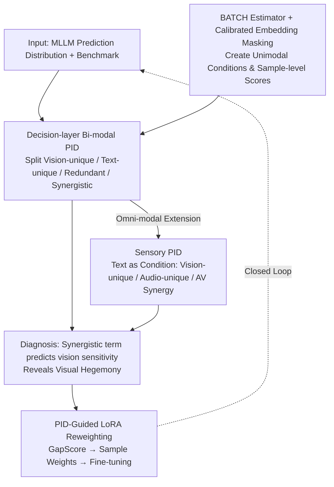

# Towards Understanding Modality Interaction in Multimodal Language Models via Partial Information Decomposition

**Conference**: ICML 2026  
**arXiv**: [2606.00959](https://arxiv.org/abs/2606.00959)  
**Code**: To be confirmed  
**Area**: Multimodal VLM / Interpretability / Information-theoretic Analysis  
**Keywords**: PID, Modality Synergy, Omni-modal Models, Visual Dominance, LoRA Reweighting

## TL;DR
This paper treats the decision-making of multimodal large models as an information decomposition from input to output. Using Partial Information Decomposition (PID), the mutual information of VL/omni-modal model predictions is decomposed into four terms: "Vision-unique / Text-unique / Redundant / Synergistic." It discovers that the synergistic term is the best indicator of predictive vision sensitivity and that omni-modal models suffer from a "visual hegemony" synergy bottleneck. Finally, sample-level scores derived from PID are used to guide LoRA reweighted fine-tuning, achieving consistent improvements of 1–2 percentage points on MMStar, MMBench, and POPE.

## Background & Motivation

**Background**: MLLMs have evolved from perception systems to decision-making agents (scientific analysis, medicine, embodied interaction). However, current evaluations almost exclusively focus on "prediction correctness," using accuracy and modality ablation to judge if the model truly utilizes vision or audio.

**Limitations of Prior Work**: Analysis types such as representation alignment, attention visualization, and modality ablation can identify "which modality is encoded" and "how much performance drops when a modality is removed." However, they cannot answer **decision-layer** questions: Is the information used by the model unique to one modality, shared by both (redundant), or obtainable only when both are viewed simultaneously (synergistic)? These three aspects are conflated in accuracy metrics, and different multimodal fusion modes are mixed together.

**Key Challenge**: Accuracy and ablation metrics are **scalars**, but modality usage is **multidimensional** (Unique vs. Redundant vs. Synergistic). Compressing a multidimensional structure into a scalar inevitably loses critical signals, such as whether the model is truly performing fusion or merely taking shortcuts using language priors.

**Goal**: To accomplish three things: (a) Establish a decision-layer "modality usage profile" for each model-benchmark pair; (b) Verify whether this profile can predict intervention sensitivity (performance drop after removing vision/audio); (c) Use the profile to guide training and enhance genuine cross-modal fusion.

**Key Insight**: The authors leverage the existing PID framework from information theory, which decomposes $I(Y;X_v,X_t)$ into four non-negative terms: $U_{\text{vis}} + U_{\text{txt}} + R_{\text{vl}} + S_{\text{vl}}$. A crucial observation is that **PID should be built on the model-induced prediction distribution $p_\theta(y|x_v,x_t)$ rather than on latent representations**. This captures "how the model uses modalities" rather than "what the dataset itself looks like."

**Core Idea**: Use decision-layer PID for VL model diagnosis, introduce Sensory PID (using text as a conditional control variable) to extend to video-audio-text omni-modal models, and finally construct a LoRA reweighting strategy that "up-weights synergistic-deficient samples and down-weights language-shortcut samples" using sample-level PID scores.

## Method

### Overall Architecture

This paper addresses the question of "how models actually use modalities to make decisions," which accuracy metrics fail to answer. The approach treats the MLLM prediction distribution $p_\theta(y|x_v,x_t)$ as the object of decomposition for "input information to output prediction," utilizing PID to split prediction mutual information into vision-unique, text-unique, redundant, and synergistic terms. The workflow follows three lines: establishing bi-modal PID profiles for VL models, extending analysis to video-audio-text omni-modal models via Sensory PID, and using sample-level scores from the same estimator as weights for LoRA fine-tuning, forming a loop of "Diagnosis → Prediction → Intervention."

### Key Designs

**1. Decision-layer Bi-modal PID: Decomposing Prediction MI into Four Comparable Atoms**

Regarding the performance of a VL model on a benchmark, the authors decompose the joint mutual information between prediction $Y$ (distribution over candidate set $\mathcal{C}$) and sources $X_v, X_t$ into $I(Y;X_v,X_t) = U_{\text{vis}} + U_{\text{txt}} + R_{\text{vl}} + S_{\text{vl}}$. The key is that this decomposition is built on the **model-induced prediction distribution rather than latent representations**. This reveals how the model utilizes modalities to reach an answer. While accuracy and ablation are scalars that conflate "true fusion" with "language shortcuts," these four atoms explicitly separate the multidimensional structure, allowing for decision-layer questions like whether the synergistic term $S_{\text{vl}}$ is the best predictor of vision sensitivity.

**2. Sensory PID: Treating Language as a Condition Rather than a Third Source**

Treating video/audio/text as three sources in a full PID poses two problems: the number of partial information atoms grows exponentially, making them uninterpretable and hard to estimate; furthermore, language in instructional scenarios is essentially a "task manual," and forcing it as a source mixes its instructional role into $U_{\text{txt}}$. The authors fix text $T$ as a conditional control variable, performing bi-source decomposition on sensory sources: $I(Y;V,A|T) = U_{\text{vis}} + U_{\text{aud}} + R_{\text{sens}} + S_{\text{av}}$. This conditional decomposition ensures the sum equals $I(Y;V,A|T)$ while reducing the parameter dimension to 4 atoms. This mathematically separates "what the task requires" from "what evidence the senses provide," giving "Audio-unique" $U_{\text{aud}}$, "Vision-unique" $U_{\text{vis}}$, and "AV Synergy" $S_{\text{av}}$ comparable physical meanings—facilitating the quantitative observation of "visual hegemony" ($S_{\text{av}} \ll U_{\text{vis}}$).

**3. BATCH + Calibrated Embedding Masking: Creating Unimodal Conditions from Joint Models**

PID estimation requires unimodal conditions like $p_\theta(y|x_v)$ and $p_\theta(y|x_t)$, but MLLMs are jointly trained without independent heads. The authors use a BATCH estimator to learn a Sinkhorn-normalized coupling $\tilde{Q}$ that matches the marginals of $X_v\text{–}Y$ and $X_t\text{–}Y$. The difficulty lies in obtaining unimodal conditions—empty strings or zero masks push the backbone out-of-distribution. The solution is **Calibrated Embedding Masking**: to calculate $p_\theta(y|x_v)$, the text token embeddings are replaced by Gaussian noise $\mathcal{N}(\mu_{m'}, \mathrm{diag}(\sigma_{m'}^2))$, where $\mu_{m'}, \sigma_{m'}$ are dimension-wise statistics from the profiling set. This "blurs" the modality without destroying its positional or distributional shape, removing specific semantics while keeping the backbone within its familiar distribution. All estimates are averaged over $K=50$ random batches to reduce variance.

**4. PID-Guided LoRA Reweighting: Transforming Diagnostic Scores into Training Signals**

The BATCH estimator yields local contributions $s_i, u_{\text{vis},i}, u_{\text{txt},i}, r_i$ for each sample $i$. These are used for directed sample intervention. After non-negative truncation $[\cdot]_+$, the authors calculate the Synergistic Ratio $\text{SR}_i = [s_i]_+/(I_i^+ + \epsilon)$ and the Shortcut Score $\text{SC}_i = [u_{\text{txt},i}]_+/(I_i^+ + \epsilon)$. Fusion Potential is defined as $\text{FP}_i = [\min\{H(p_v^{(i)}), H(p_t^{(i)})\} - H(p_{vt}^{(i)})]_+$. These are synthesized into $\text{GapScore}_i = (1-\text{SR}_i)(1-\text{SC}_i)\cdot \text{FP}_i$. This multiplicative structure is high only when "synergy is not yet used," "language shortcut is not relied upon," and "joint prediction is more certain." TopK "shortcut" and "gap" samples are selected and assigned weights $w_i = 0.5$ and $w_i = 3.0$ respectively for weighted LoRA fine-tuning. Unlike selection by accuracy or ablation, PID separates "hard due to lack of knowledge" from "hard due to lack of fusion."

### Loss & Training

The diagnostic phase requires no training, only BATCH for PID estimation. The training phase uses standard LoRA objectives, with each sample loss multiplied by the calculated $w_i$. LoRA adapters are only applied to the final 20% of transformer layers, as layer-wise analysis (§4.3) shows that synergistic information primarily emerges in these layers. Hyperparameters include confidence threshold $\tau=0.3$, up-weighting factor $3.0$, and down-weighting factor $0.5$.

## Key Experimental Results

### Main Results

Evaluation covers 20 VL models (Qwen2.5/2/3-VL, InternVL3, LLaVA-OneVision, Cambrian-1, Gemma3, 2B–78B) across 6 VL benchmarks (Synergy-driven: MMBench/MMStar/POPE; Prior-driven: MMMU/PMC-VQA/Reefknot). Omni-modal models (Qwen2.5-Omni, VITA-1.5) are tested on MUSIC-AVQA.

| Validation Dimension | Key Metric | Result | Meaning |
|:---|:---|:---|:---|
| Correlation of PID terms with vision removal sensitivity $\Delta_{\text{vision}}$ | Spearman $\rho(S_{\text{vl}}, \Delta_{\text{vision}})$ | MMBench 0.840 / MMStar 0.862 / POPE 0.798 | $S_{\text{vl}}$ is the strongest predictor of vision sensitivity |
| Same as above, for $U_{\text{txt}}$ | $\rho(U_{\text{txt}}, \Delta_{\text{vision}})$ | $-0.582 / -0.548 / -0.502$ | Higher text-unique info leads to lower vision sensitivity |
| Total Mutual Information $I(V,T;Y)$ vs. $\Delta_{\text{vision}}$ | $|\rho| \le 0.118$ | Almost no correlation | **Total MI follows accuracy, not modality dependency** |
| Sensory Synergy $S_{\text{av}}$ on AV-Fusion subset | Value | All models $\le 0.32$, far below $U_{\text{vis}} \approx 1.25\text{–}1.42$ | Models are dominated by vision-unique info even in AV tasks → "Visual Hegemony" |
| LoRA-PID vs. LoRA-Uniform (Qwen2.5-VL-7B) | MMStar / MMBench / POPE | $64.3$ vs $62.0$ / $90.2$ vs $89.1$ / $88.5$ vs $87.2$ | +2.3 / +1.1 / +1.3 pp, stable across 3 seeds |
| PID Profile Shift after fine-tuning | Post-$S_{\text{vl}}$ / Post-$U_{\text{txt}}$ | $1.20\to 1.36$ / $0.56\to 0.46$ | LoRA-PID shifts models toward more synergy and fewer shortcuts |

### Ablation Study

| Configuration | MMStar | Note |
|:---|:---|:---|
| B: LoRA-Uniform | 62.0 | Uniform weighting baseline |
| C: LoRA-PID | **64.3** | Full PID selection + reweighting |
| D: LoRA-Random | 61.5 | Weights are not the key; **which samples receive them is** |
| E: LoRA-Acc | 62.5 | Difficulty $\neq$ Fusion need; PID outperforms by +1.8 |
| F: LoRA-Ablation | 63.0 | Ablation sensitivity captures some fusion need, but remains 1.3 pp weaker |

### Key Findings

- **Synergy $S_{\text{vl}}$ as a Watershed Signal**: In all synergy-driven benchmarks, it achieves $\rho(\cdot, \Delta_{\text{vision}}) \ge 0.798$ and $\rho(\cdot, \text{Acc}) \ge 0.718$, making it the strongest predictor of whether the model uses vision.
- **Three-stage Hierarchical Dynamics**: Layer-wise PID reveals a "Silent Encoding (0–20%) → Unimodal Accumulation (20–80%) → Late Fusion (80–100%)" pattern. Synergistic info emerges almost entirely in the final 20% of layers.
- **Mechanism of Visual Hegemony**: Omni-modal models reach "visual saturation" in middle layers ($U_{\text{vis}}$ rises rapidly), causing the decision space to be fixed by visual priors before fusion occurs.
- **Language as Fusion Gating**: Replacing instructions requiring fusion with paraphrases that do not significantly decays $S_{\text{av}}$ in later layers while unimodal trajectories remain unchanged, suggesting text acts as a "fusion switch."
- **POPE vs. Reefknot**: Both are "hallucination benchmarks," but PID classifies POPE as synergy-driven and Reefknot as prior-driven, suggesting that literal labels of benchmarks can hide actual modality usage differences.

## Highlights & Insights

- **Decision Layer vs. Representation Layer**: While most MLLM interpretability focuses on latents (CKA, attention, probing), this paper focuses on $p_\theta(y|x)$. PID describes how the model *uses* modalities to answer, not just how they are encoded.
- **PID as both Diagnosis and Training Signal**: Sample-level scores from BATCH allow the same tool to transition from "post-hoc analysis" to "pre-hoc selection," creating a closed loop of "Diagnosis → Prediction → Intervention."
- **Sensory PID as an Underrated Innovation**: Reducing full 3-source PID to "Language-conditioned + Sensory-dual-source" solves exponential complexity and instructional confounding, providing a reusable framing for omni-modal analysis.
- **Multiplicative Structure of GapScore**: Requiring the intersection of "low synergy," "low shortcut," and "high fusion potential" ensures the selection of truly improvable samples.

## Limitations & Future Work

- **Dependence on BATCH Estimation**: BATCH uses Sinkhorn optimization and mean pooling; its robustness for long videos or multi-image scenarios with many tokens is uncertain.
- **Masking Approximation Boundaries**: The assumption that the backbone responds to "statistically matched Gaussian noise" the same way as "missing modalities" may falter for highly structured instruction templates (e.g., code, math).
- **Ceiling of PID Reweighting**: The +1.3 pp margin over LoRA-Ablation suggests synergy and modality sensitivity overlap significantly; PID is a refinement rather than a replacement.
- **Lack of Audio-side Dual Experiments**: While "Visual Hegemony" is noted, there are no experiments specifically strengthening audio-unique samples to see if the "synergy bottleneck" can be broken from the other side.

## Related Work & Insights

- **vs. Representation Alignment / CKA**: Alignment describes encoding; Ours describes usage. A model can encode vision perfectly but ignore it during decision-making.
- **vs. Modality Ablation**: Ablation gives $\Delta_{\text{vision}}$, but cannot distinguish unique from synergistic information.
- **vs. Liang et al. 2023 (BATCH)**: This work extends BATCH from supervised scalar labels to generative MLLM prediction distributions with masking-based unimodal conditions.
- **vs. Williams & Beer (Original PID)**: By using conditional Sensory PID, the authors avoid the exponential atom growth of 3-source PID, making it feasible for omni-modal engineering.

## Rating
- Novelty: ⭐⭐⭐⭐ Applying PID to MLLM decision layers and proposing Sensory PID is a clean and original framing.
- Experimental Thoroughness: ⭐⭐⭐⭐⭐ Extensive testing across 20+ models and multiple benchmarks, plus hierarchical and instruction analysis.
- Writing Quality: ⭐⭐⭐⭐ Highly structured Findings, though technical details like Sinkhorn optimization require prior background.
- Value: ⭐⭐⭐⭐ The diagnosis-to-training loop is a valuable paradigm for the MLLM evaluation and fine-tuning community.

<!-- RELATED:START -->

## Related Papers

- [\[ACL 2026\] Closing the Modality Reasoning Gap for Speech Large Language Models](../../ACL2026/audio_speech/closing_the_modality_reasoning_gap_for_speech_large_language_models.md)
- [\[AAAI 2026\] Improving Multimodal Sentiment Analysis via Modality Optimization and Dynamic Primary Modality Selection](../../AAAI2026/audio_speech/improving_multimodal_sentiment_analysis_via_modality_optimization_and_dynamic_pr.md)
- [\[CVPR 2026\] Omni-MMSI: Toward Identity-Attributed Social Interaction Understanding](../../CVPR2026/audio_speech/omni-mmsi_toward_identity-attributed_social_interaction_understanding.md)
- [\[ICLR 2026\] Music Flamingo: Scaling Music Understanding in Audio Language Models](../../ICLR2026/audio_speech/music_flamingo_scaling_music_understanding_in_audio_language_models.md)
- [\[ICLR 2026\] ParaS2S: Benchmarking and Aligning Spoken Language Models for Paralinguistic-Aware Speech-to-Speech Interaction](../../ICLR2026/audio_speech/paras2s_benchmarking_and_aligning_spoken_language_models_for_paralinguistic-awar.md)

<!-- RELATED:END -->
