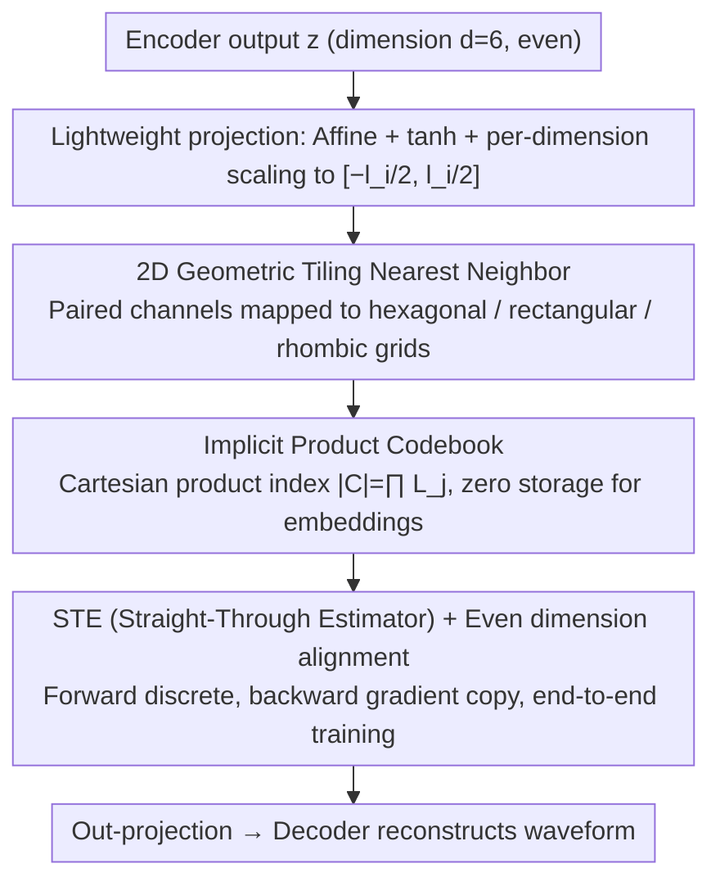

# Two-Dimensional Quantization for Geometry-Aware Audio Coding

**Conference**: ICML 2026  
**arXiv**: [2512.01537](https://arxiv.org/abs/2512.01537)  
**Code**: https://github.com/tashQ/Q2D2 (Available)  
**Area**: Neural Audio Coding / Quantization Methods / Speech Representation  
**Keywords**: Two-dimensional quantization, Geometry-aware, Neural audio codec, FSQ, Implicit codebook  

## TL;DR
The authors replace the scalar quantizer in neural audio codecs with Q2D2, a geometry-aware quantizer that utilizes "paired channels + structured 2D grids." By substituting learnable codebooks with fixed hexagonal, rectangular, or rhombic lattice points, it matches or exceeds the speech reconstruction quality of RVQ, VQ, and FSQ using a single quantizer and an extremely low token rate.

## Background & Motivation
**Background**: Current mainstream neural audio codecs (e.g., Encodec, DAC, WavTokenizer) typically follow a three-stage "Encoder → Quantizer → Decoder" structure. Quantizers generally choose between VQ-VAE, Residual VQ (RVQ), or Finite Scalar Quantization (FSQ), outputting discrete tokens for downstream audio LLMs.

**Limitations of Prior Work**: VQ and RVQ suffer from training instability, and codebook utilization drops sharply as the codebook size increases, necessitating various tricks like commitment loss, codebook reboots, and random restarts. FSQ addresses codebook collapse by defining an implicit product codebook via "per-channel independent scalar quantization." However, quantizing each channel individually completely ignores the correlations between channels, compressing the expressive capacity onto a 1D grid.

**Key Challenge**: Achieving "high codebook utilization" and "modeling channel correlation" appears to be mutually exclusive; FSQ chooses the former at the expense of the latter, while VQ does the opposite.

**Goal**: (i) Retain the simplicity and high utilization of FSQ; (ii) Reintroduce geometric structures between channels in discrete space; (iii) Match or exceed SOTA speech reconstruction quality at low token rates.

**Key Insight**: The authors observe that the "1D scalar grid" of FSQ can naturally generalize to "2D geometric grids." By pairing channels and mapping each pair to a fixed 2D tiling, one obtains both (a) the stability of implicit product codebooks and (b) the ability to model channel correlations through 2D grids.

**Core Idea**: Replace "per-channel independent scalar quantization" with "pair-wise channel nearest neighbor quantization on 2D structured grids." This upgrades the quantizer from a 1D scalar grid to a 2D geometric tiling. The codebook remains implicit and requires no embedding learning.

## Method

### Overall Architecture
Q2D2 preserves the overall framework of the codec, specifically replacing the scalar quantizer in the "encoder → single quantizer → decoder" pipeline (similar to WavTokenizer) with a geometric quantizer that pairs channels and maps them to fixed 2D grids. The core problem it addresses is how to recover the inter-channel correlations discarded by FSQ while maintaining FSQ's stability as an implicit product codebook without learned embeddings. The answer lies in upgrading from a "1D scalar grid" to a "2D geometric tiling."

### Key Designs

**1. 2D Geometrical Tiling: Embedding Correlation into Discrete Grids**

FSQ compresses each channel onto a 1D scalar line, assuming channels are independent. Q2D2 instead reshapes dimension $d$ (enforced as even, optimally $d=6$) into $P=d/2$ two-dimensional pairs. Each pair $z''_j=(z'_{2j-1}, z'_{2j})$ is mapped to a predefined 2D grid $\mathcal{G}_j$ via nearest neighbor quantization: $\hat z''_j=\arg\min_{g\in\mathcal{G}_j}\lVert z''_j-g\rVert_2$. Three grid shapes are explored: rectangular (orthogonal lattice), hexagonal (optimal circle packing in 2D with equidistant neighbors), and rhombic (an additional layer of points in the center of rectangular cells, doubling the density). Each tiling is controlled by a spread factor $e_i=(l_i-1)/2$ and computed offline before training.

The "shape" matters because a more uniform coverage of the space $[-e,e]^2$ for a fixed number of points leads to higher codebook utilization and lower quantization error. Hexagonal tiling is the most efficient packing theoretically. In experiments, rhombic tiling often matches hexagonal quality with slightly fewer levels. Rectangular tiling performs worst as it ignores diagonal filling. This is the leverage point: generalizing 1D scalar quantization to geometry-aware quantization with minimal modification.

**2. Implicit Product Codebook + Lightweight Projection: Large Codebooks with Zero Parameters**

Q2D2 does not explicitly store embeddings. Instead, the codebook is defined as the Cartesian product of the 2D grids of all pairs. Given $L_j=l_{2j-1}\cdot l_{2j}$ points for the $j$-th pair, the total codebook size is $|\mathcal{C}|=\prod_{j=1}^P L_j$. During inference, discrete indices are derived by finding the nearest grid point for each pair. To allow the encoder and decoder to operate in continuous space, linear projections are added before and after quantization. The encoder output is projected to $\mathbb{R}^d$, passed through $\tanh$ to $[-1,1]^d$, and scaled per dimension to bound the $i$-th dimension to $[-l_i/2, l_i/2]$ (where $l_i$ is the number of quantization levels, typically $5\le l_i\le 11$).

This design eliminates the memory overhead of learned codebooks in VQ (which scales with $|\mathcal{C}|\cdot d$). Q2D2 achieves codebook sizes comparable to VQ with learnable parameters limited only to the projection matrices. Crucially, because the codebook is a "fixed geometric structure" rather than "learned high-dimensional vectors," codebook collapse is mathematically impossible. This removes the need for stabilization tricks like commitment loss, entropy loss, EMA, or codebook reboots.

**3. STE + Even Dimension Alignment: End-to-End Training for Discrete Quantization**

Since the $\arg\min$ operation in 2D nearest neighbor search is non-differentiable, Q2D2 employs the Straight-Through Estimator (STE). In the forward pass, discrete nearest neighbors are selected; in the backward pass, gradients for $\hat z''_j$ are copied directly to $z''_j$. The dimension $d$ must be even to facilitate pair-wise reshaping. Experiments show that $d=6$ (3 pairs) is optimal and significantly smaller than the hundreds of dimensions typically used in VQ. This reduction not only makes the quantizer parameter-free but also slims down the projection layers, maintaining a real-time factor (RTF) comparable to WavTokenizer (0.0039 vs 0.0032) and low memory usage (~820 MB).

### Mechanism
Consider a pair of channels: Let $d=6$ and take the first pair with quantization levels $l_1=l_2=9$, resulting in a spread factor $e=(9-1)/2=4$. The encoder output for this pair is transformed via $\tanh$ and scaled to continuous coordinates, e.g., $z''_1=(2.7, -1.3)$. Using rectangular tiling, the nearest lattice point is $(3, -1)$. With rhombic tiling, which includes an offset layer of points, the nearest neighbor might be $(2.5, -1.5)$, reducing quantization error. The codebook for this pair contains $9\times 9=81$ points. With 3 such pairs, the total implicit codebook $|\mathcal{C}|=81^3\approx 5.3\times 10^5$. Coordinates like $(3, -1)$ are encoded as discrete indices and passed to the decoder.

### Loss & Training
The reconstruction loss follows WavTokenizer (adversarial + multi-scale spectral reconstruction loss). The quantizer **requires no commitment, entropy, or auxiliary losses**. Training uses AdamW with an initial learning rate of $8\text{e}{-5}$ and cosine decay over ~40 epochs on 24 kHz audio. Hardware: 2× RTX 6000 48G or 2× L40S 48G.

## Key Experimental Results

### Main Results
Testing was performed on an 8K-hour WavTokenizer dataset and a 150K-hour multilingual Emilia+MLS dataset. Metrics include UTMOS, PESQ, STOI, V/UV F1, MUSHRA, and CMOS.

| Dataset | Model | Nq | token/s | UTMOS ↑ | PESQ ↑ | STOI ↑ |
|--------|------|----|---------|---------|--------|--------|
| LibriSpeech test-clean | GT | – | – | 4.09 | – | – |
| LibriSpeech test-clean | DAC | 12 | 600 | 4.00 | 4.15 | 0.95 |
| LibriSpeech test-clean | Encodec | 8 | 600 | 3.09 | 3.18 | 0.94 |
| LibriSpeech test-clean | **Q2D2 (rhombic)** | **1** | **333** | **4.07** | **3.79** | **0.96** |
| LibriSpeech test-clean | X-codec | 2 | 100 | 4.21 | 2.88 | 0.86 |
| LibriSpeech test-clean | Mimi | 8 | 100 | 3.56 | 2.80 | 0.91 |
| LibriSpeech test-clean | **Q2D2** | **1** | **166** | **4.07** | **3.36** | **0.95** |
| LibriSpeech test-clean | BigCodec | 1 | 80 | 4.11 | 3.27 | 0.93 |
| LibriSpeech test-clean | WavTokenizer | 1 | 75 | 3.79 | 2.63 | 0.90 |

Key Observation: Q2D2 with a **single quantizer at 333 tokens/s** matches the UTMOS of DAC (12 quantizers at 600 tokens/s) and achieves higher STOI. At 166 tokens/s, it significantly outperforms Mimi, Encodec, and DAC within the same token budget.

### Ablation Study

| Configuration | Key Observation | Description |
|------|---------|------|
| Q2D2 (rhombic) | best PESQ / STOI / F1 | Optimal packing for levels $\le 9$. |
| Q2D2 (hexagonal) | Slightly lower than rhombic | Requires more levels to match rhombic performance. |
| Q2D2 (rectangle) | Worst | Wastes 2D space by ignoring diagonal filling. |
| $d=6$ | Optimal | Smaller values lack expressiveness; larger values hinder training. |
| $5\le l_i\le 11$ | Stable range | Errors increase outside this range. |
| No commitment / reseed | Utilization remains ~100% | Confirms that implicit codebooks are inherently resistant to collapse. |

### Key Findings
- **Geometry Matters**: Rhombic > Hexagonal > Rectangular. The performance gap stems from 2D packing efficiency, validating the intuition that "2D geometry $\neq$ 1D scalar × 2."
- **Drastic Reduction in Token Rate**: Q2D2 at 166 tokens/s with one quantizer matches DAC at 600 tokens/s with 12 quantizers, offering significant sequence length savings for downstream audio LLMs.
- **~100% Codebook Utilization**: Achieved without commitment, entropy, or reseed tricks, relying purely on the implicit product codebook structure.
- **Minimal Parameters**: The only learnable components are the linear projections (proportional to $d$, not $|\mathcal{C}|$), saving over 2M parameters compared to VQ's learned embeddings.

## Highlights & Insights
- **Generalizing FSQ to $n$-dimensional grids** is a natural progression, but the authors are the first to systematically implement it in 2D and prove the importance of geometric shapes. The "pair-wise channel" approach is an elegant, minimal modification.
- **The true power of implicit codebooks**: When a codebook is a "fixed geometric tiling" rather than "learned high-dimensional embeddings," codebook collapse is mathematically impossible. This is a fundamental advantage of FSQ-based methods over VQ, and Q2D2 proves that geometric structure itself can encode correlations.
- **Transferability**: This approach can be applied to image tokenizers (replacing VQ-VAE codebooks), video codecs, or 3D point cloud quantization. Appendix E previews 3D tiling extensions.
- **Reducing quantizer count saves sequence length**: Lowering the number of tokens/quantizers directly reduces training and inference costs for multimodal/audio LLMs.

## Limitations & Future Work
- Currently limited to 2D; while 3D or higher-dimensional structured tilings are theoretically superior, they are left for future work (Appendix E).
- Geometric shapes are selected manually; there is no automated mechanism to search for optimal tilings for different domains (speech vs. music).
- The spread factor $e_i$ and number of levels $l_i$ remain hyperparameters explored within a relatively narrow grid search.
- Validation is primarily speech-focused; comparisons on general audio and music are less extensive.

## Related Work & Insights
- **vs FSQ (Mentzer et al., 2023)**: FSQ uses 1D scalar product codebooks. Q2D2 upgrades to 2D, explicitly modeling correlations within channel pairs. While Q2D2 requires even-numbered dimensions, it provides significantly higher reconstruction quality at equivalent token rates.
- **vs VQ / VQ-VAE**: VQ learns high-dimensional embedding codebooks, whereas Q2D2 avoids learned codebooks entirely. Q2D2 sacrifices the flexibility of "completely free codebooks" for stability, zero codebook parameters, and zero auxiliary losses.
- **vs RVQ (Encodec / DAC)**: RVQ uses multiple residual quantization layers for high fidelity, requiring 8–12 quantizers. Q2D2 matches this quality with a **single quantizer**, which is much more favorable for downstream sequence modeling.
- **vs WavTokenizer (Ji et al., 2025b)**: WavTokenizer reduced RVQ to a single VQ but still faced training instabilities. Q2D2 replaces the learnable VQ codebook with an implicit 2D codebook, achieving superior PESQ, STOI, and F1.

## Rating
- Novelty: ⭐⭐⭐⭐ Beautifully generalizes FSQ to 2D geometric tilings; simple yet effective.
- Experimental Thoroughness: ⭐⭐⭐⭐ Covers various domains and large-scale datasets, though 3D and image transfers are left as future work.
- Writing Quality: ⭐⭐⭐⭐ Clear pseudocode, comprehensive tables, and well-integrated visualizations.
- Value: ⭐⭐⭐⭐ High-quality single-quantizer codecs at 166 tokens/s are highly practical for the audio LLM era.

<!-- RELATED:START -->

## Related Papers

- [\[ICML 2026\] Group Cognition Learning: Making Everything Better Through Governed Two-Stage Agents Collaboration](group_cognition_learning_making_everything_better_through_governed_two-stage_age.md)
- [\[ICLR 2026\] PrismAudio: Decomposed Chain-of-Thoughts and Multi-dimensional Rewards for Video-to-Audio Generation](../../ICLR2026/audio_speech/prismaudio_decomposed_chain-of-thoughts_and_multi-dimensional_rewards_for_video-.md)
- [\[ICML 2026\] Sparse Tokens Suffice: Jailbreaking Audio Language Models via Token-Aware Gradient Optimization](sparse_tokens_suffice_jailbreaking_audio_language_models_via_token-aware_gradien.md)
- [\[CVPR 2025\] Synchronized Video-to-Audio Generation via Mel Quantization-Continuum Decomposition](../../CVPR2025/audio_speech/synchronized_video-to-audio_generation_via_mel_quantization-continuum_decomposit.md)
- [\[CVPR 2026\] PAVAS: Physics-Aware Video-to-Audio Synthesis](../../CVPR2026/audio_speech/pavas_physics-aware_video-to-audio_synthesis.md)

<!-- RELATED:END -->
