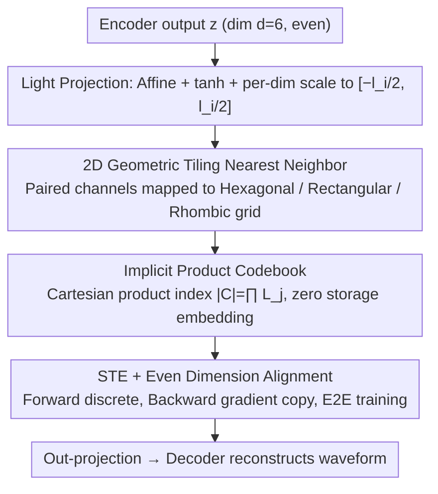

# Two-Dimensional Quantization for Geometry-Aware Audio Coding

**Conference**: ICML 2026  
**arXiv**: [2512.01537](https://arxiv.org/abs/2512.01537)  
**Code**: https://github.com/tashQ/Q2D2 (Available)  
**Area**: Neural Audio Coding / Quantization Methods / Speech Representation  
**Keywords**: 2D Quantization, Geometry-Aware, Neural Audio Codec, FSQ, Implicit Codebook

## TL;DR
The authors replace scalar quantizers in neural audio codecs with Q2D2, a geometric quantizer using "paired channels + structured 2D grids." By replacing learnable codebooks with fixed hexagonal, rectangular, or rhombic lattices, they achieve speech reconstruction quality that matches or surpasses RVQ, VQ, and FSQ using a single quantizer at extremely low token rates.

## Background & Motivation
**Background**: Modern neural audio codecs (e.g., Encodec, DAC, WavTokenizer) follow an "Encoder → Quantizer → Decoder" architecture. Quantizers typically use VQ-VAE, Residual VQ (RVQ), or Finite Scalar Quantization (FSQ) to produce discrete tokens for downstream audio LLMs.

**Limitations of Prior Work**: VQ and RVQ suffer from training instability and sharply decreasing codebook utilization as size increases, requiring tricks like commitment loss, codebook re-initialization, and random perturbations. FSQ defines an implicit product codebook via "per-channel independent scalar quantization," avoiding collapse; however, quantizing each channel separately ignores inter-channel correlations, compressing representation power into a 1D grid.

**Key Challenge**: There appears to be a trade-off between "high codebook utilization" and "modeling channel correlations"—FSQ prioritizes the former at the expense of the latter, while VQ does the opposite.

**Goal**: (i) Inherit the simplicity and high utilization of FSQ; (ii) Reintroduce geometric structure between channels in discrete space; (iii) Match or exceed SOTA speech reconstruction quality at low token rates.

**Key Insight**: The authors observe that the "1D scalar grid" of FSQ can naturally generalize to a "2D geometric grid." By pairing channels and mapping each pair to a fixed 2D tiling, they gain both (a) the stability of implicit product codebooks and (b) the ability to model channel correlations through 2D lattices.

**Core Idea**: Replace "per-channel independent scalar quantization" with "pair-wise channel → nearest neighbor quantization on 2D structured grids." This upgrades the quantizer from a 1D scalar grid to a 2D geometric tiling while maintaining an implicit product codebook without learnable embeddings.

## Method

### Overall Architecture
Q2D2 maintains the overall codec framework, specifically replacing the scalar quantizer in the "encoder → single quantizer → decoder" pipeline of WavTokenizer with a geometric quantizer that pairs channels and applies nearest neighbor mapping on fixed 2D grids. The core problem addressed is how to recover inter-channel correlations lost in FSQ while retaining its "implicit product codebook, no learnable parameters" stability. The solution is upgrading from "1D scalar grids" to "2D geometric tilings."

### Key Designs

**1. 2D Geometric Tiling: Embedding Correlations into Discrete Grids**

FSQ compresses each channel into a 1D scalar line, assuming independence. Q2D2 reshapes dimension $d$ (enforced as even, optimally $d=6$) into $P=d/2$ two-dimensional pairs. Each pair $z''_j=(z'_{2j-1}, z'_{2j})$ is mapped to a predefined 2D grid $\mathcal{G}_j$ using the nearest neighbor: $\hat z''_j=\arg\min_{g\in\mathcal{G}_j}\lVert z''_j-g\rVert_2$. Three lattice shapes are explored: rectangular (standard orthogonal), hexagonal (optimal circle packing in 2D, equidistant neighbors), and rhombic (adding a mid-point layer to the rectangle to double density). Tilings are controlled by a spread factor $e_i=(l_i-1)/2$ and are computed offline (Alg. 1/2/3) and frozen during training.

The "shape" affects performance because more uniform coverage of $[-e,e]^2$ leads to higher codebook utilization and lower quantization error. Hexagonal is the theoretically optimal packing. Experimentally, rhombic tilings often match hexagonal performance with slightly fewer levels, while rectangular grids perform worst due to inefficient diagonal coverage. This "channel pairing + 2D tiling" serves as the lever to generalize scalar quantization to geometry-aware quantization.

**2. Implicit Product Codebook + Light Projection: Scale without Parameters**

Q2D2 does not explicitly store embeddings. The codebook is defined as the Cartesian product of the 2D grids of all pairs. For $P$ pairs where the $j$-th pair has $L_j=l_{2j-1}\cdot l_{2j}$ points, the total codebook size is $|\mathcal{C}|=\prod_{j=1}^P L_j$. Discrete indices are derived mathematically from the nearest coordinates. To keep the encoder/decoder in continuous space, linear projections are used. The encoder output is mapped via an affine transform and $\tanh$ to $[-1,1]^d$, then scaled by $l_i/2$ to bound the $i$-th dimension to $[-l_i/2, l_i/2]$ ($l_i$ typically ranges between 5 and 11).

This design minimizes memory overhead. While learnable codebooks in VQ scale with $|\mathcal{C}|\cdot d$ (e.g., 2M parameters for 4096 entries $\times$ 512 dims), Q2D2 achieves similar codebook sizes with only two projection matrices as learnable parameters. Since the codebook is a fixed geometric structure, collapse is mathematically impossible, allowing for the removal of stabilization tricks like commitment loss, entropy loss, EMA, and re-seeding.

**3. STE + Dimension Alignment: End-to-End Training**

The $\arg\min$ operation is non-differentiable. Q2D2 utilizes a Straight-Through Estimator (STE), passing the gradient of $\hat z''_j$ directly to $z''_j$ during the backward pass. The dimension $d$ must be even to form pairs. The optimal $d=6$ found in experiments is significantly smaller than the hundreds of dimensions used in VQ, which reduces the size of the final encoder projection. Inference RTF stays comparable to WavTokenizer (0.0039 vs 0.0032) with a stable memory footprint of ~820 MB.

### Mechanism
Consider a pair of channels: set $d=6$ and take the 1st pair with quantization levels $l_1=l_2=9$ (spread factor $e=(9-1)/2=4$). The encoder output for this pair is scaled to continuous coordinates, e.g., $z''_1=(2.7, -1.3)$. In a rectangular tiling, the nearest point is $(3,-1)$. In a rhombic tiling, which includes half-offset points, the nearest neighbor might be $(2.5,-1.5)$, resulting in lower error. With 3 pairs, the implicit codebook size $|\mathcal{C}|=81^3\approx 5.3\times 10^5$, all without storing embeddings.

### Loss & Training
The reconstruction side uses adversarial and multi-scale spectral losses from WavTokenizer. The quantizer **requires no commitment, entropy, or auxiliary losses**. Training uses AdamW, initial LR $8\text{e}{-5}$, cosine decay, batch 16, and 24 kHz sampling for ~40 epochs on 2× RTX 6000 or L40S GPUs.

## Key Experimental Results

### Main Results
Evaluation was conducted on an 8K-hour WavTokenizer dataset and 150K-hour Emilia+MLS datasets using UTMOS, PESQ, STOI, V/UV F1, MUSHRA, and CMOS metrics.

| Dataset | Model | Nq | token/s | UTMOS ↑ | PESQ ↑ | STOI ↑ |
|--------|------|----|---------|---------|--------|--------|
| LibriSpeech test-clean | GT | – | – | 4.09 | – | – |
| LibriSpeech test-clean | DAC | 12 | 600 | 4.00 | 4.15 | 0.95 |
| LibriSpeech test-clean | Encodec | 8 | 600 | 3.09 | 3.18 | 0.94 |
| LibriSpeech test-clean | **Ours (rhombic)** | **1** | **333** | **4.07** | **3.79** | **0.96** |
| LibriSpeech test-clean | X-codec | 2 | 100 | 4.21 | 2.88 | 0.86 |
| LibriSpeech test-clean | Mimi | 8 | 100 | 3.56 | 2.80 | 0.91 |
| LibriSpeech test-clean | **Ours** | **1** | **166** | **4.07** | **3.36** | **0.95** |
| LibriSpeech test-clean | BigCodec | 1 | 80 | 4.11 | 3.27 | 0.93 |
| LibriSpeech test-clean | WavTokenizer | 1 | 75 | 3.79 | 2.63 | 0.90 |

Key Observation: **Ours** with **1 quantizer + 333 token/s** matches the UTMOS of DAC's 12 quantizer + 600 token/s configuration with higher STOI. At the 166 token/s tier, it significantly outperforms Mimi, Encodec, and DAC within the same token budget.

### Ablation Study

| Configuration | Key Observation | Description |
|------|---------|------|
| Ours (rhombic) | best PESQ / STOI / F1 | Rhombic offers optimal packing at $\le 9$ levels. |
| Ours (hexagonal) | Slightly lower than rhombic | Hexagonal requires more levels to reach parity. |
| Ours (rectangle) | Worst | Orthogonal grid ignores diagonal packing, wasting 2D space. |
| $d=6$ | Optimal | Too small lacks expression; too large hinders training. |
| $5\le l_i\le 11$ | Stable range | Utilization or quality drops outside this range. |
| No commitment / reseed | ~100% utilization | Confirms the inherent robustness of implicit codebooks. |

### Key Findings
- **Geometric shape matters**: Rhombic > Hexagonal > Rectangle, confirming that 2D geometric structure is more than just "1D scalar $\times$ 2."
- **Token rate reduction**: Q2D2 at 166 token/s with a single quantizer matches DAC at 600 token/s with 12 quantizers, offering massive sequence length savings for audio LLMs.
- **~100% Utilization**: No commitment, entropy, or reseed tricks are required due to the implicit product codebook.
- **Zero codebook parameters**: Only linear projections (proportional to $d$, not $|\mathcal{C}|$) are learnable, saving over 2M parameters compared to VQ.

## Highlights & Insights
- **Natural generalization of FSQ**: Moving from 1D to $n$-D grids is intuitive, but the authors are the first to systematically apply it to 2D and prove the importance of geometric shape.
- **Power of Implicit Codebooks**: When the codebook is a fixed geometric tiling rather than learned high-dimensional embeddings, collapse is mathematically non-existent.
- **Transferability**: The approach is applicable to image tokenizers (replacing VQ-VAE), video codecs, or 3D point cloud quantization. Appendix E discusses 3D tiling extensions.
- **Sequence Efficiency**: Reducing quantizers directly reduces sequence length for multimodal training, offering significant cost savings.

## Limitations & Future Work
- Currently limited to 2D; 3D or higher-order structured tilings are mentioned as future work (Appendix E).
- Lattice geometry is manually selected; there is no automated search mechanism for different audio domains (music, speech, ambient).
- Hyperparameters like spread factor $e_i$ and level $l_i$ were explored within a relatively narrow grid search window.
- Evaluation focuses primarily on speech; comparisons for general audio and music are less exhaustive.

## Related Work & Insights
- **vs FSQ (Mentzer et al., 2023)**: FSQ uses 1D scalar product codebooks. Q2D2 upgrades to 2D grids to model inter-channel correlations.
- **vs VQ / VQ-VAE**: VQ learns high-dimensional embedding codebooks. Q2D2 uses zero-parameter fixed tilings, trading VQ's total flexibility for stability and parameter efficiency.
- **vs RVQ (Encodec / DAC)**: RVQ uses multiple layers for high-fidelity reconstruction. Q2D2 achieves comparable quality with a **single quantizer**.
- **vs WavTokenizer (Ji et al., 2025b)**: While WavTokenizer reduced RVQ to a single VQ, it still experiences VQ instability. Q2D2 replaces the learnable VQ codebook with an implicit 2D codebook, yielding better PESQ, STOI, and F1.

## Rating
- Novelty: ⭐⭐⭐⭐ 
- Experimental Thoroughness: ⭐⭐⭐⭐ 
- Writing Quality: ⭐⭐⭐⭐ 
- Value: ⭐⭐⭐⭐ 

<!-- RELATED:START -->

## Related Papers

- [\[ICML 2026\] Group Cognition Learning: Making Everything Better Through Governed Two-Stage Agents Collaboration](group_cognition_learning_making_everything_better_through_governed_two-stage_age.md)
- [\[ICLR 2026\] PrismAudio: Decomposed Chain-of-Thoughts and Multi-dimensional Rewards for Video-to-Audio Generation](../../ICLR2026/audio_speech/prismaudio_decomposed_chain-of-thoughts_and_multi-dimensional_rewards_for_video-.md)
- [\[ICML 2026\] Sparse Tokens Suffice: Jailbreaking Audio Language Models via Token-Aware Gradient Optimization](sparse_tokens_suffice_jailbreaking_audio_language_models_via_token-aware_gradien.md)
- [\[CVPR 2025\] Synchronized Video-to-Audio Generation via Mel Quantization-Continuum Decomposition](../../CVPR2025/audio_speech/synchronized_video-to-audio_generation_via_mel_quantization-continuum_decomposit.md)
- [\[CVPR 2026\] PAVAS: Physics-Aware Video-to-Audio Synthesis](../../CVPR2026/audio_speech/pavas_physics-aware_video-to-audio_synthesis.md)

<!-- RELATED:END -->
