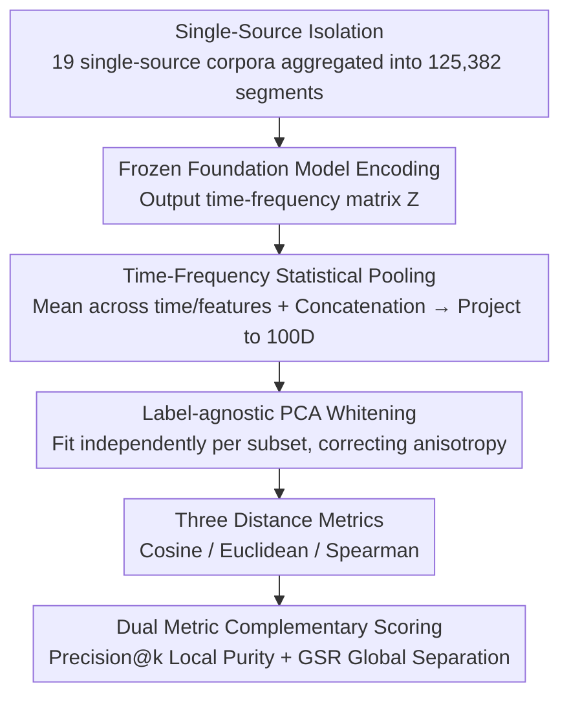

# VocSim: A Training-Free Benchmark for Zero-Shot Content Identity Recognition for Single-Source Audio

**Conference**: ICML 2026  
**arXiv**: [2512.10120](https://arxiv.org/abs/2512.10120)  
**Code**: TBD  
**Area**: Audio/Speech Processing  
**Keywords**: Audio Representation Learning, Zero-shot, Benchmarking, Content Identity, Unsupervised Evaluation

## TL;DR
VocSim is a training-free benchmark covering 125k single-source audio clips that diagnoses the intrinsic geometry of frozen audio foundation models through label-agnostic PCA whitening—revealing severe generalization defects in current models on low-resource cross-lingual speech.

## Background & Motivation

**Background**: The current standard for evaluating general audio representations involves training probes or fine-tuning parameters (e.g., HEAR, SUPERB), focusing on model adaptability rather than intrinsic representation quality.

**Limitations of Prior Work**: Traditional benchmarks cannot distinguish whether high scores stem from the quality of the representation itself or the effectiveness of the optimization strategy; intrinsic geometric evaluation for "plug-and-play" zero-shot retrieval tasks is severely lacking.

**Key Challenge**: Evaluation paradigms based on parameter updates fail to capture the intrinsic organizational capacity of frozen representation spaces; existing single-corpus benchmarks allow models to easily overfit to specific recording conditions.

**Goal**: Design a purely training-free, label-free zero-shot benchmark that can both diagnose the intrinsic geometric alignment quality of frozen audio embeddings and force the model to generalize across irrelevant background variables by aggregating 19 heterogeneous corpora.

**Key Insight**: Following the examples of NLP (GLUE, MTEB) and Vision (VTAB), audio representation evaluation is shifted from parameter adaptation to zero-shot geometric diagnosis, decoupling representation quality from source separation capabilities by strictly isolating single-source content identification.

**Core Idea**: Use label-agnostic PCA whitening to correct the anisotropy of frozen embeddings, combined with two complementary training-free metrics (local neighborhood purity and global separation rate), to diagnose the intrinsic retrieval-readiness of foundation models on single-source audio.

## Method

### Overall Architecture
VocSim aims to answer whether the embedding space of a frozen audio foundation model—without any fine-tuning or exposure to labels—possesses the intrinsic geometric quality to "cluster recordings of the same content together and push different content apart." The entire pipeline is completely training-free: first, 19 single-source corpora are aggregated into 125,382 audio segments; next, each frozen model encodes the audio into embeddings, performs time-frequency pooling, and uses label-agnostic PCA whitening to correct the geometry; finally, the models are scored using two zero-shot retrieval metrics (Precision@k and GSR) under three distance measures (Cosine/Euclidean/Spearman). Without probes or gradient updates, the scores purely reflect the organizational capacity of the representation space itself.

### Key Designs

**1. Single-Source Isolation: Decoupling "Content Geometry" from "Source Separation"**

Traditional benchmarks often use mixed recordings for evaluation, making it indistinguishable whether high scores originate from representation quality or the model's ability to disentangle overlapping signals. VocSim strictly collects mono-channel, single-source recordings, excluding all multi-audio mixtures. This ensures the benchmark purely examines whether "two recordings of the same content are close in the embedding space." This isolation is analogous to ImageNet for object classification versus COCO for scene segmentation—quantifying the geometric quality of the content identification layer first ensures that evaluation conclusions are not contaminated by source separation capabilities.

**2. Label-agnostic PCA Whitening: Correcting Anisotropy under Zero-shot Constraints**

Foundation model embeddings are often highly anisotropic (vectors crowded in a narrow cone), leading to weak discriminative power for direct distance calculations. While supervised fine-tuning is typically used to expand the geometry, it violates the zero-shot, label-free premise. VocSim adopts transductive whitening: fitting PCA **independently** on each evaluation subset (without aggregating statistics across subsets), applying non-parametric normalization to flatten anisotropy, and reporting results with and without PCA. This preserves zero-shot constraints while fairly exposing the true potential of the representations—in main experiments, Whisper's P@1 improved from 61.5% to 66.8% after PCA D100, a direct benefit of anisotropy correction.

**3. Dual Metric Complementarity: Local Neighborhood Purity + Global Boundary Integrity**

Since a single metric can be biased, VocSim uses two complementary perspectives to characterize retrieval-readiness. Precision@k (P@1/P@5) measures how many of the $k$ nearest neighbors for a query belong to the same class, directly simulating the local utility of "using one recording to retrieve samples of the same content," though it is sensitive to dataset structure. GSR (Global Separation Rate) uses an asymmetric design to evaluate whether global boundaries are leaked:

$$\text{GSR} = \frac{\text{NID}_i - \text{Avg\_ID}_i}{\text{NID}_i + \text{Avg\_ID}_i + \epsilon}$$

Where $\text{NID}_i$ is the Nearest Inter-class Distance for sample $i$, and $\text{Avg\_ID}_i$ is the Average Intra-class distance. If the difference in the numerator decreases due to boundary leakage, it is heavily penalized. GSR is far more robust to subset characteristics than P@k (Kendall $\tau=0.60$); together, they diagnose both "retrievability of similar content in the neighborhood" and "overall clarity of class boundaries."

### Loss & Training
No parameter updates are performed; only the geometry of frozen embeddings is evaluated. The time-frequency matrix $Z$ from the encoder is compressed into a single vector $v = \text{Concat}(\mu_{time}(Z), \mu_{feat}(Z))$ via statistical pooling (mean across time and feature axes), after which all embeddings are projected to 100 dimensions for distance calculation.

## Key Experimental Results

### Main Results

| Model | P@1 (Public) | P@1 (Blind) | GSR (Public) | GSR (Blind) | Key Characteristics |
|------|------------|-----------|------------|-----------|---------|
| Whisper-L-v3 + EWMTF D100 | 66.8% | 11.5% | 41.7% | 39.4% | Best Weakly Supervised |
| CLAP | 63.7% | 8.1% | 38.1% | 36.2% | Multimodal Training |
| WavLM-Large | 64.1% | 4.6% | 37.0% | 35.8% | Self-Supervised Rep. |
| BEATs | 64.3% | 11.4% | 31.4% | 34.7% | Spectrogram Transformer |
| Log-Mel Baseline | 57.7% | 3.5% | 34.2% | 33.0% | Simple Feature Baseline |

### Ablation Study

| Configuration | Public P@1 | Blind P@1 | Gain/Gap | Analysis |
|------|-----------|---------|------|------|
| Whisper (Original) | 61.5% | 11.5% | 50% | Before PCA |
| Whisper (PCA D100) | 66.8% | 11.5% | 55.3% | Anisotropy Correction Gain |
| CLAP (Animal Sounds) | 88.4% | — | — | Strong Cross-domain Gen. |
| Animal Vocalization Subset | 84.5% | — | — | No Pre-training Overlap |
| Public Speech Subset | 70.3% | — | — | Pre-training Data Contamination |
| Blind Low-resource Lang. | 9.8% | — | — | **Severe Gen. Collapse** |

### Key Findings
- Whisper encoder dominance—Weakly supervised pre-training (680k hours) learns representations more robust than self-supervision or spectrogram masking.
- Simple pooling (Mean-Time + Mean-Freq) is more efficient than sequence-aware methods with comparable accuracy.
- Pre-training overlap dilemma—Strong results on the animal vocalization subset (no overlap) indicate that the benchmark captures actual representation quality.
- Cross-lingual generalization collapse—All models' P@1 plummeted from 60%+ to 4%-11% on blind low-resource language sets.

## Highlights & Insights
- **Paradigm Innovation**: First to shift audio representation evaluation from parameter adaptation to zero-shot geometric diagnosis.
- **Strength of Cross-domain Aggregation**: Forces generalization across irrelevant background variables via 19 heterogeneous corpora.
- **Robustness of GSR**: Found to be significantly less sensitive to subset characteristics than P@k (Kendall $\tau=0.60$).
- **Insight into Low-resource Cross-lingual Performance**: The contrast of 11.5% vs 66.8% is striking.
- **Reusable Design**: The combination of time-frequency statistical pooling and label-agnostic whitening is simple yet effective.

## Limitations & Future Work
- Constraints of Transductive Whitening: Technically not strictly single-sample inference.
- Pre-training Overlap Issues: Only blind low-resource languages satisfy strict OOD conditions.
- Single-source Limitation: Real-world applications (birdsong ID, broadcast monitoring) often involve multiple sources.
- Limited Model Coverage: Continual updates are required as 8 major models might miss rapidly iterating new architectures.
- Future Work: Expand blind sets; mixed-scene evaluation; dynamic benchmarking; cross-modal bridging.

## Related Work & Insights
- **vs HEAR/SUPERB**: These train linear probes or fine-tune for transfer learning; VocSim focuses on the intrinsic geometric quality of frozen representations.
- **vs Acoustic Word Embeddings (AWE)**: Extends evaluation to the era of zero-shot foundation models across biological and environmental domains.
- **vs MTEB/GeneCIS**: Systematically introduces the zero-shot evaluation paradigm from NLP/Vision into the audio domain for the first time.
- **vs Anisotropy Research**: Uses transductive whitening (non-parametric PCA) instead of late-stage fine-tuning to correct geometry.

## Rating
- Novelty: ⭐⭐⭐⭐⭐ First systematic evaluation of audio representations from a zero-shot geometric diagnosis perspective.
- Experimental Thoroughness: ⭐⭐⭐⭐ Covers 8 mainstream models + 3 distance metrics + Ablations + Domain analysis + Blind set validation.
- Writing Quality: ⭐⭐⭐⭐⭐ Clear logic, sufficient detail, and high-quality visualizations.
- Value: ⭐⭐⭐⭐ Revealed defects in low-resource cross-lingual generalization provide direct guidance for audio retrieval and bioacoustic applications.

<!-- RELATED:START -->

## Related Papers

- [\[ICML 2026\] MusicDET: Zero-Shot AI-Generated Music Detection](musicdet_zero-shot_ai-generated_music_detection.md)
- [\[ICML 2026\] NAACA: Training-Free NeuroAuditory Attentive Cognitive Architecture with Oscillatory Working Memory for Salience-Driven Attention Gating](naaca_training-free_neuroauditory_attentive_cognitive_architecture_with_oscillat.md)
- [\[ICML 2026\] Polyphonia: Zero-Shot Timbre Transfer in Polyphonic Music with Acoustic-Informed Attention Calibration](polyphonia_zero-shot_timbre_transfer_in_polyphonic_music_with_acoustic-informed_.md)
- [\[ACL 2026\] Temporal Contrastive Decoding: A Training-Free Method for Large Audio-Language Models](../../ACL2026/audio_speech/temporal_contrastive_decoding_a_training-free_method_for_large_audio-language_mo.md)
- [\[ICCV 2025\] Zero-AVSR: Zero-Shot Audio-Visual Speech Recognition with LLMs by Learning Language-Agnostic Speech Representations](../../ICCV2025/audio_speech/zero-avsr_zero-shot_audio-visual_speech_recognition_with_llms_by_learning_langua.md)

<!-- RELATED:END -->
