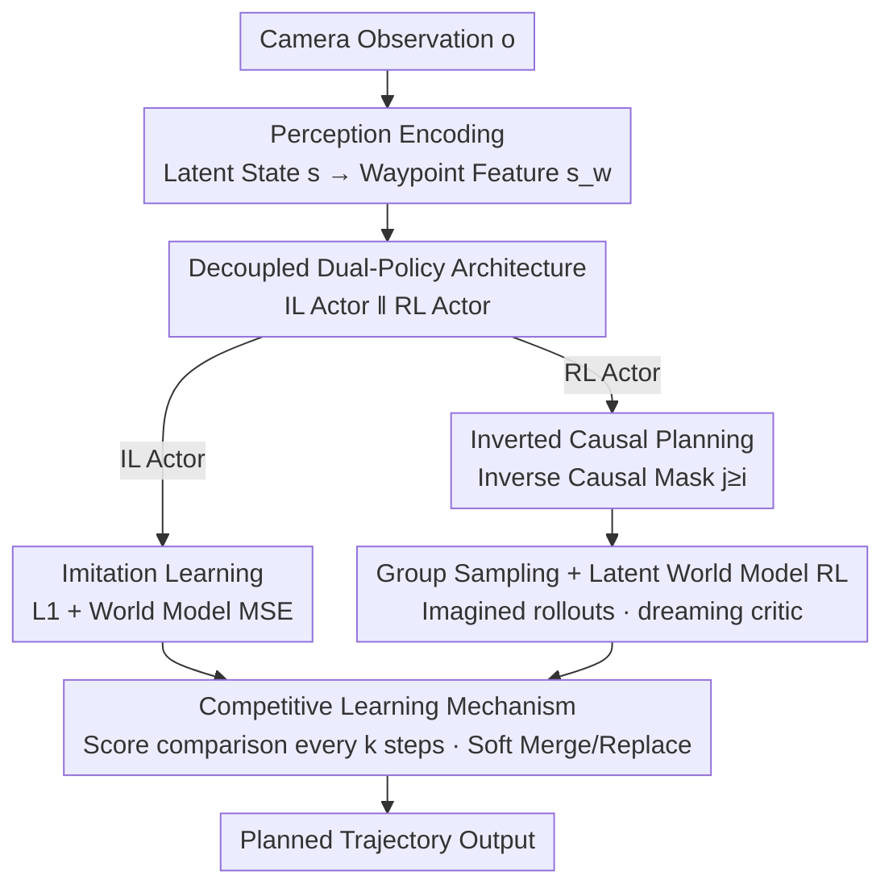

# CoIRL-AD: Collaborative-Competitive Imitation-Reinforcement Learning in Latent World Models for Autonomous Driving

**Conference**: ICML2026  
**arXiv**: [2510.12560](https://arxiv.org/abs/2510.12560)  
**Code**: https://github.com/SEU-zxj/CoIRL-AD  
**Area**: Autonomous Driving / World Models / Reinforcement Learning  
**Keywords**: End-to-End Driving, Offline RL, Imitation Learning, Latent World Model, Dual-Policy Competition  

## TL;DR
CoIRL-AD utilizes two independent actors to handle Imitation Learning (IL) and Reinforcement Learning (RL) respectively, relying on a latent world model to "imagine" future trajectories for calculating long-range rewards for RL. A "leader-follower" competitive mechanism allows both actors to transfer beneficial behaviors to each other. This approach successfully integrates RL into end-to-end driving using **offline real-world driving data without an external simulator**, achieving significant improvements in cross-city generalization and long-tail scenarios.

## Background & Motivation
**Background**: End-to-end (E2E) driving has become the mainstream paradigm, allowing gradients to flow through perception, prediction, and planning. Most E2E methods are trained using Imitation Learning (IL), typically via supervised learning directly supervising the output with expert trajectories.

**Limitations of Prior Work**: IL optimizes on a fixed data distribution, but the agent induces its own state distribution during deployment. Small prediction errors push the vehicle into unseen states, which accumulate over time, leading to poor generalization and failure in long-tail scenarios for IL agents. RL could theoretically remediate this with reward signals, but **real-world driving relies on offline datasets**. Introducing external simulators (like CARLA) transforms the problem from offline RL to online RL and introduces a sim-to-real gap.

**Key Challenge**: Offline real-world driving datasets are dominated by **near-optimal expert demonstrations** with almost no sub-optimal/non-expert behaviors, making it difficult to learn value differences between actions. Furthermore, latent world models trained only on expert data are biased when predicting out-of-distribution (OOD) actions. This bias causes **value overestimation** during RL optimization, reinforcing sub-optimal behaviors and leading to training instability. Additionally, when IL and RL are combined into the **same policy** for joint optimization, the objectives of behavior cloning and reward maximization often lead to **gradient conflicts**.

**Goal**: To answer "how RL can effectively improve performance" in offline real-world driving scenarios without external simulators, specifically by (1) constructing an explorable RL framework on expert-dominated offline data and (2) stably integrating IL and RL without interference.

**Key Insight**: Since joint optimization in a single policy causes gradient conflicts and two-stage IL-then-RL approaches are unstable in this setting, this work **decouples IL and RL into two separate actors**. These actors exchange beneficial behaviors through "competition" rather than "forced fusion."

**Core Idea**: By combining a decoupled dual-policy architecture, a latent world model for "dreaming" long-range rewards, and a competitive mechanism to anchor RL near expert-level driving, the proposed method stably enhances IL with RL in an offline setting.

## Method

### Overall Architecture
Given camera observations $o$, the perception module encodes latent states $s\in\mathbb{R}^{B\times N_t\times D}$. Waypoint queries $Q_w$ extract waypoint features $s_w$ via cross-attention, which the planning head decodes into action sequences $\tau_a=\{a_1,\dots,a_n\}$ (where each $a_i\in\mathbb{R}^2$ represents x/y displacement). On this shared backbone, CoIRL-AD develops **two independent actors**: the IL actor mimics expert trajectories using L1 loss and jointly trains a latent world model; the RL actor performs planning with an inverse causal mask, group-samples multiple candidate trajectories, allows the world model to imagine future states, and receives long-range advantages from a critic. Every $k$ steps, the competitive mechanism compares the cumulative rewards of both actors and transfers the winner's parameters (via soft merging or direct replacement) to the loser. The world model is learned only during the IL phase and is frozen during the RL phase, where only the RL actor and critic are updated. During inference, the architecture is identical to the baseline, introducing no additional latency.

### Key Designs

**1. Decoupled Dual-Policy Architecture: Separating Imitation and Reward Maximization to Eliminate Gradient Conflicts**

When IL and RL share the same policy, the objectives of behavior cloning (staying close to the expert) and reward maximization (encouraging exploration) are often misaligned, resulting in gradient conflicts. The authors **decouple the planning module into an IL actor and an RL actor**, optimized by $L_{IL}$ and $L_{RL}$ respectively, thereby isolating the imitation signal from RL exploration noise. While both actors share low-level modules like perception, they maintain separate planning heads. This ensures the IL actor serves as a stable "expert" anchor, while the RL actor can explore freely without contaminating the imitation signal.

**2. Inverse Causal Planning: Enabling Early Actions to "Foresee the Destination"**

Standard planning heads predict the entire $\tau_a$ in one forward pass, often ignoring step-wise dependencies. A common approach is to use causal masking to introduce temporal causality, i.e., $\pi_i(a_i|s_{w,j\le i})$. However, human driving involves "deciding the destination first and then executing low-level actions." Furthermore, in real-world deployment, frequently only the first action is executed before re-planning, making **earlier actions more critical**. Consequently, the authors use an **inverse causal mask**, where the $i$-th action is conditioned on current and future waypoint features:

$$\pi_i(a_i|s_{w,i},\dots,s_{w,n})=\pi_i(a_i|s_{w,j\ge i}).$$

This provides earlier actions with richer context. Ablations (Tab. 3) show that while inverse causality might harm a pure IL baseline, it significantly benefits CoIRL-AD by reducing both L2 error and collision rates, suggesting it primarily aids the RL actor's exploration objectives.

**3. Group Sampling + Latent World Model RL: Calculating Long-Range Rewards on Expert-Dominated Offline Data via "Imagined Futures"**

Since offline data lacks action diversity, the authors adopt **group sampling** (inspired by GRPO) to sample $G$ trajectories from a stochastic policy. The planning head includes a **stochastic head** outputting standard deviations $\sigma_i$, modeling actions as Gaussians $\pi_i(a_i|s_{w,j\ge i})=\mathcal{N}(\mu_i,\sigma_i^2 I)$. Reward $r_i$ is a product of an imitation reward $r_{imi}^{(i)}=e^{-\|a_i-a_i^e\|_2}$ and a collision reward $r_{col}^{(i)}$. To account for future consequences, the **latent world model** imagines future states $\hat{s'^{(g)}}=\text{LatentWorldModel}(s,\tau_a^{(g)})$ for each sampled trajectory. A critic $V$ then estimates the long-range advantage:

$$A_{long}^{(g)}=\Big(\sum r^{(g)}+\gamma V(\hat{s'^{(g)}})\Big)-V(s).$$

Two stabilization techniques are used: a **step-aware mechanism** where only one action per sequence is randomized to ensure smooth trajectories, and a **dual-critic technique** using an EMA reference critic.

**4. Competitive Learning Mechanism: Anchoring RL to Expert Behavior and Recovering from Collapse**

To exchange beneficial behaviors between the decoupled actors, the authors compare their cumulative reward difference $\Delta r_{acc}$ every $k$ iterations. Using thresholds $\lambda_{min}, \lambda_{max}$ and an interpolation coefficient $p$, the **loser's** parameters are updated: (1) if similar, no change; (2) if the gap is moderate, **soft merge** the winner's knowledge; (3) if the gap is large, **replace** the loser's parameters with the winner's. This prevents one policy from diverging while accelerating convergence when one consistently outperforms the other. It effectively reins in offline RL: if the RL actor degrades due to value overestimation, competition pulls it back toward the expert-level IL anchor.

### Loss & Training
The IL side uses $L_{IL}=L_{imi}+\alpha\cdot L_{wm}$, where $L_{imi}=\|\tau_a-\tau_a^e\|$ and $L_{wm}=\text{MSE}(s',\hat{s'})$. The RL side uses $L_{RL}=L_{act}+L_{cri}+\beta\cdot L_{bc}$, optimizing the actor and critic jointly. The world model is learned during the IL phase and frozen during the RL phase.

## Key Experimental Results

### Main Results
On nuScenes, CoIRL-AD is evaluated on average L2 displacement error and collision rate across 1s/2s/3s horizons. CoIRL-AD significantly outperforms the baseline (LAW).

| Method | L2 Avg ↓ | Col Avg ↓ | L2·Col ↓ |
|------|------|------|------|
| LAW | 0.66 | 0.22 | 0.15 |
| CoIRL-AD (w/o wm) | 0.65 | 0.20 | 0.13 |
| CoIRL-AD | 0.63 | 0.18 | 0.11 |
| CoIRL-AD† (Temporal Aug.) | 0.45 | 0.17 | 0.08 |

The value of RL is even more evident in **cross-city generalization** (trained in Singapore, tested in Boston):

| Method | L2 Avg ↓ | Col Avg ↓ | L2·Col ↓ |
|------|------|------|------|
| LAW | 0.93 | 0.69 | 0.64 |
| CoIRL-AD | 0.70 | 0.22 | 0.15 (↓77%) |

### Ablation Study

| Configuration | L2 Avg ↓ | Col Avg ↓ | L2·Col ↓ | Note |
|------|------|------|------|------|
| LAW (Pure IL) | 0.66 | 0.22 | 0.15 | Baseline |
| Pure RL | 6.55 | 4.93 | 32.29 | Pure offline RL collapses |
| Two-stage (IL then RL) | 4.22 | 4.32 | 18.23 | Highly unstable |
| Loss Merging | 0.76 | 0.23 | 0.17 | Single policy joint opt degrades |
| Decoupled w/o Comp. | 0.72 | 0.29 | 0.21 | RL diverges/overestimates |
| Decoupled w/ Comp. (Full) | 0.63 | 0.18 | 0.11 | Best performance |

### Key Findings
- **Competition is the linchpin**: Only "decoupling + competition" simultaneously improves L2 and collision. Without competition, RL degrades due to value overestimation.
- **Two-stage training fails here**: Unlike other domains, two-stage IL→RL in offline driving is highly unstable due to biased world models on OOD actions.
- **Inverse causality benefits RL**: While it slightly harms pure IL, it is essential for the RL actor's exploration.
- **World models are indispensable**: Removing the latent world model (w/o wm) leads to a rise in 3s collision rates, proving its role as a "reactive simulator."

## Highlights & Insights
- **"Competition" over "Fusion"**: Avoiding the fusion of conflicting objectives by using two actors and an adaptive knowledge transfer mechanism provides a stable expert anchor for offline RL.
- **Dreaming for long-range advantage**: Using the latent world model to imagine future states bypasses the lack of transitions in offline data, making this applicable to any "expert-data, no-simulator" task.
- **Zero additional inference cost**: The complexity is restricted to the training phase; the inference architecture remains lean and deployment-friendly.

## Limitations & Future Work
- **Metric ceiling on nuScenes**: Improvements in average metrics are diluted by the high proportion of simple scenarios; true value is better reflected in long-tail subsets.
- **Simplified Rewards**: Currently uses basic imitation and collision rewards. Future work could incorporate comfort and Time-to-Collision (TTC) metrics.
- **Sensitivity to Hyperparameters**: The competitive mechanism relies on several thresholds ($k$, $\lambda$, etc.), which may require careful tuning across different datasets.

## Related Work & Insights
- **vs. Two-stage IL→RL**: CoIRL-AD proves that simultaneous joint training with competition is more stable than sequential fine-tuning in offline driving.
- **vs. Simulator-based RL**: Unlike methods relying on CARLA, CoIRL-AD learns a world model directly from real data, avoiding the sim-to-real gap.
- **vs. Single-stage Weighting**: Decoupling actors prevents the gradient interference typically found in weight-based loss fusion.

## Rating
- Novelty: ⭐⭐⭐⭐⭐ Decoupled dual-actors + competition effectively addresses gradient conflict and overestimation in offline driving.
- Experimental Thoroughness: ⭐⭐⭐⭐ Strong results on cross-city and long-tail sets, though limited to one primary dataset.
- Writing Quality: ⭐⭐⭐⭐⭐ Clear motivation and insightful analysis of training dynamics.
- Value: ⭐⭐⭐⭐ The 77% improvement in cross-city L2·Col highlights the potential of RL+World Models for real-world deployment.

<!-- RELATED:START -->

## Related Papers

- [\[AAAI 2026\] WorldRFT: Latent World Model Planning with Reinforcement Fine-Tuning for Autonomous Driving](../../AAAI2026/autonomous_driving/worldrft_latent_world_model_planning_with_reinforcement_fine-tuning_for_autonomo.md)
- [\[NeurIPS 2025\] RAW2Drive: Reinforcement Learning with Aligned World Models for End-to-End Autonomous Driving](../../NeurIPS2025/autonomous_driving/raw2drive_reinforcement_learning_with_aligned_world_models_for_end-to-end_autono.md)
- [\[CVPR 2026\] DLWM: Dual Latent World Models enable Holistic Gaussian-centric Pre-training in Autonomous Driving](../../CVPR2026/autonomous_driving/dlwm_dual_latent_world_models_enable_holistic_gaussian-centric_pre-training_in_a.md)
- [\[ICML 2026\] DeepSight: Long-Horizon World Modeling via Latent States Prediction for End-to-End Autonomous Driving](deepsight_long-horizon_world_modeling_via_latent_states_prediction_for_end-to-en.md)
- [\[ICML 2026\] Constrained Multi-Objective Reinforcement Learning with Max-Min Criterion](constrained_multi-objective_reinforcement_learning_with_max-min_criterion.md)

<!-- RELATED:END -->
