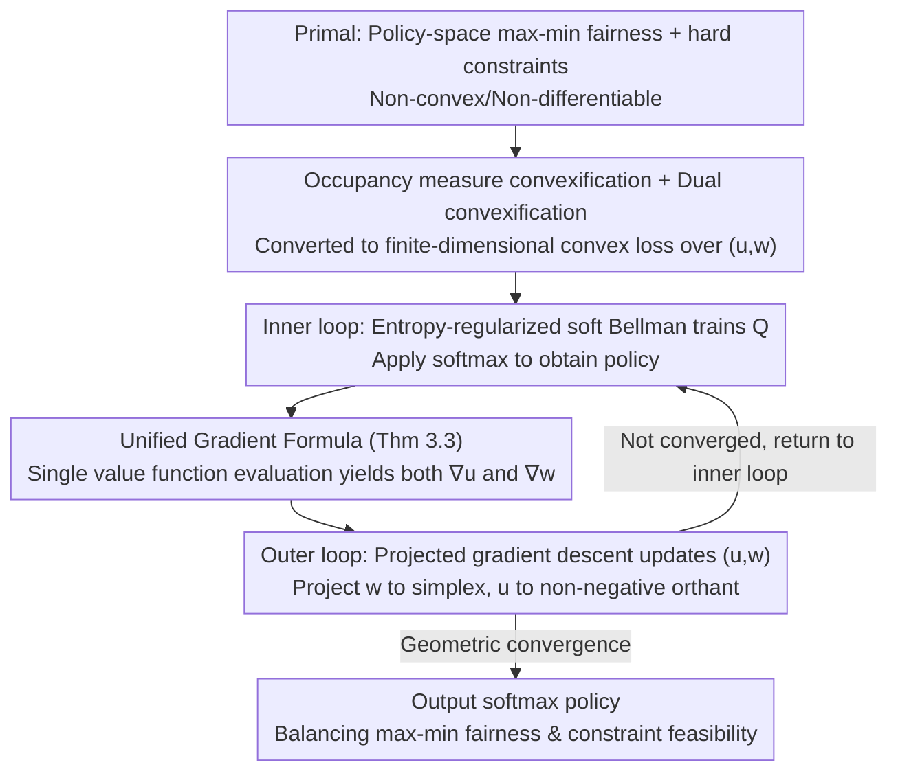

# Constrained Multi-Objective Reinforcement Learning with Max-Min Criterion

**Conference**: ICML 2026  
**arXiv**: [2605.31388](https://arxiv.org/abs/2605.31388)  
**Code**: https://github.com/Giseung-Park/Constrained-Maxmin-MORL  
**Area**: Reinforcement Learning / Multi-Objective RL / Constrained Optimization  
**Keywords**: max-min fairness, constrained MORL, occupancy measure, dual convex optimization, projected gradient descent

## TL;DR
This paper unifies "max-min multi-objective fairness" and "hard constraint satisfaction" into a single MORL framework. By reformulating the problem as a convex program via occupancy measures, the authors derive a dual convex optimization problem over weights $(u,w)$. This allows a projected gradient descent algorithm to simultaneously achieve fairness and constraint feasibility with theoretical guarantees of geometric convergence.

## Background & Motivation

**Background**: The mainstream approach in Multi-Objective Reinforcement Learning (MORL) is to use a scalarization function $f(J_1(\pi),\ldots,J_K(\pi))$ to combine multiple returns into a single scalar for single-objective RL. When $f$ is linear, it becomes a weighted sum $\sum_k w_k J_k(\pi)$, which is simple but fails to capture "fairness." For instance, in traffic signal control, a dispatcher may prioritize "minimizing the maximum waiting time" (max-min fairness, $f=\min$) over minimizing the average waiting time across all directions.

**Limitations of Prior Work**: Existing max-min MORL algorithms typically assume an unconstrained setting. However, real-world systems often involve hard constraints: a scheduler must maximize throughput fairness within a power budget, or traffic lights must minimize the maximum wait time within greenhouse gas emission limits. Integrating constraints into max-min MORL is non-trivial. Existing max-min MORL algorithms either optimize only lower bounds (Fan et al. 2023; Peng et al. 2025), leading to imprecision, or rely on biased gradients via Gaussian smoothing (Park et al. 2024). Conversely, established constrained RL methods (CPO, RCPO, Lagrangian) are designed for scalar rewards ($K=1$) and struggle with the non-differentiability introduced by $f=\min$.

**Key Challenge**: The max-min objective $\min_k J_k(\pi)$ is non-convex and non-differentiable in the policy space, causing standard Lagrangian dual analysis to fail. To incorporate constraints, a mathematical structure is required that can handle both "non-differentiable max-min" and "inequality constraints" simultaneously.

**Goal**: Establish a unified MORL framework capable of optimizing $\min_k J_k(\pi)$ while satisfying $J_{K+l}(\pi)\ge C^{(l)}$, supported by an algorithm with provable convergence.

**Key Insight**: The authors observe that while max-min is non-convex in the policy space, it is **convex in the occupancy measure $\rho(s,a)$ space**, a classic result from Puterman 1994. By rewriting the policy optimization as a convex program over $\rho$, constraints naturally become linear inequalities, and the max-min objective becomes a min-of-linear objective. The entire problem transforms into a standard convex program with a well-defined Lagrangian dual.

**Core Idea**: Convexify the primal problem using occupancy measures → derive the entropy-regularized dual → obtain a convex optimization problem involving only "constraint multipliers $u$ + objective weights $w$" → use projected gradient descent to learn both sets of weights. Max-min fairness and constraint satisfaction are jointly achieved within the same iteration.

## Method

### Overall Architecture

The problem entails an MOMDP $\langle\mathcal{S},\mathcal{A},T,\mu_0,r,\gamma\rangle$, where the first $K$ dimensions of the reward $r:\mathcal{S}\times\mathcal{A}\to\mathbb{R}^{K+L}$ target "worst-case optimal" max-min fairness, and the remaining $L$ dimensions must satisfy hard constraints $J\ge C$. The final output is a softmax policy $\pi(\cdot|s)=\mathrm{softmax}\{Q(s,\cdot)/\beta\}$. The approach convexifies the non-convex, non-differentiable primal problem in the occupancy measure space and takes its entropy-regularized dual, condensing it into a finite-dimensional convex optimization over "constraint multipliers $u\in\mathbb{R}_+^L$ + objective weights $w\in\Delta^K$."

The algorithm employs a nested double-loop iteration. In the inner loop, $(u,w)$ are fixed, and a soft Bellman iteration trains $Q$ to $Q^*_{u,w}$, equivalent to an entropy-regularized single-objective RL sub-problem with a scalar reward $\sum_l u_l c^{(l)}+\sum_k w_k r^{(k)}$. In the outer loop, the inner-loop policy $\pi^*_{u,w}$ is used to estimate gradients for a projected gradient descent step on $(u,w)$. The joint dual loss being solved is:

$$\min_{u\in\mathbb{R}_+^L,\,w\in\Delta^K} \mathcal{L}(u,w) = \sum_s \mu_0(s)\,v^*_{u,w}(s) - \sum_{l=1}^L u_l C^{(l)}$$

where $v^*_{u,w}$ is the fixed point of the entropy-regularized Bellman operator $\mathcal{T}_{u,w}$.

### Key Designs

**1. Occupancy Measure Convexification + Dual Convexification: Converting Non-differentiable Max-min to Finite-dimensional Convex Optimization**

The non-convexity and non-differentiability of the max-min objective $\min_k J_k(\pi)$ with respect to policy parameters prevent standard Lagrangian analysis from integrating constraints cleanly. The key step here is to operate on the occupancy measure $\rho(s,a)$ instead of the policy $\pi$. In this space, the primal problem becomes a convex program: maximizing $\min_k \sum_{s,a} r^{(k)}(s,a)\rho(s,a)$ subject to Bellman flow equations (Eq. 5) and linear return constraints (Eq. 6). Taking the dual of this convex program yields a convex loss $\mathcal{L}(u,w)$ solely in terms of $u$ and $w$. This works because the non-differentiability of $f=\min$ is absorbed into the dual: max-min is equivalent to maximizing over a set of linear functions on the simplex $\Delta^K$, whose dual naturally corresponds to "learning a set of weights $w$." Thus, max-min fairness and inequality constraints are encoded into the same convex loss, enabling unified gradient methods and standard convergence theory.

**2. Unified Gradient Formula (Theorem 3.3): Simultaneous $\nabla_u$ and $\nabla_w$ via Single Value Evaluation**

To optimize the convex loss, gradients must be efficiently calculated. The authors prove that $\nabla_u v^*_{u,w}(s) = v_c^{\pi^*_{u,w}}(s)$ and $\nabla_w v^*_{u,w}(s) = v_r^{\pi^*_{u,w}}(s)$, where $v_c$ and $v_r$ are multi-dimensional value functions evaluating constraint rewards $\{c^{(l)}\}$ and objective rewards $\{r^{(k)}\}$, respectively, under the same entropy-regularized policy $\pi^*_{u,w}$. Consequently, in iteration $m$, the scalar reward $[u^m;w^m]^\top[c;r]$ is used to train $Q$ and derive $\pi^m$ via softmax. Evaluating the value functions for constraints and objectives under $\pi^m$ simultaneously provides gradient directions for both $u$ and $w$. This reduces the update process to a single evaluation, avoiding the need for multiple gradient estimators or network replicas (as seen in Park et al. 2024). These gradients have clear intuitions: objectives with smaller returns have smaller gradients, causing their weights $w$ to increase and prioritize "bottlenecks," while violated constraints push multipliers $u$ higher to enforce feasibility.

**3. Entropy Regularization + Projected Gradient Descent: Achieving Geometric Convergence Rates**

To ensure the dual problem is solvable and stable, the authors add an entropy term $\beta\sum_s\mathcal{H}_\rho(s)\rho(s)$ to the primal. This serves three purposes: theoretically, it ensures $\pi^*_{u,w}(a|s)>0$ is strictly positive, making the Hessian $H[\mathcal{L}]$ positive definite under Slater’s condition, thus rendering the dual strongly convex and $\alpha$-smooth ($\alpha=\frac{1}{\beta(1-\gamma)}\sum_m (r_{\max}^{(m)}/(1-\gamma))^2$, Theorem 3.4), with only $O(\beta\log|\mathcal{A}|/(1-\gamma))$ approximation error (Prop 3.1). Algorithmically, it allows the inner $Q$ update to take a closed-form soft Bellman shape. Using a step size $l_w=1/\alpha$, the outer projected gradient descent achieves geometric convergence: $\|[u^m;w^m]-[u^*;w^*]\|_2 \le (1-\lambda/\alpha)^m \|[u^0;w^0]-[u^*;w^*]\|_2 + O(\epsilon)$ (Theorem 3.6), where $\epsilon$ is the $Q$ estimation error. Simplex projection for $w$ uses an $O(K\log K)$ deterministic algorithm, while $u$ is projected via non-negative truncation.

### Loss & Training

The outer objective is the convex loss $\mathcal{L}(u,w) = \sum_s \mu_0(s) v^*_{u,w}(s) - \sum_l u_l C^{(l)}$. The inner loop uses the entropy-regularized soft Bellman update (Eq. 13): $Q(s,a) \leftarrow [u;w]^\top [c;r] + \gamma \sum_{s'} T(s'|s,a)\beta\log\sum_{a'}\exp(Q(s',a')/\beta)$. For continuous state spaces, a gradient network $g_\theta(s)\in\mathbb{R}^{L+K}$ parameterizes the estimate of $\nabla v^*_{u,w}(s)$, working alongside SAC-style Q-networks. The hyperparameter $\beta$ was swept across $\{0.1, 0.03, 0.01, 0.003, 0.001\}$, with $\beta=0.03$ yielding the lowest error.

## Key Experimental Results

### Main Results

The method was validated in tabular settings and three real-world environments. In tabular settings, the error relative to the optimal value found by LP was measured.

| Setting | Algorithm | Metric | Value | Comparison |
|------|------|------|------|------|
| Tabular MOMDP | **Constrained max-min (ours)** | Opt. Error ↓ | **0.004** | unconstr. max-min: 0.325 / constr. max-avg: 0.657 / unconstr. max-avg: 1.008 |
| Building (Temp Ctrl, $C_{th}=180$) | **Ours** | Power / Worst Comfort ↑ | **178.7 / 639.8** | MA-SAC-L: 171.4 / 620.9 (Safe but unfair); Max-min GS: 202.1 / 653.6 (Unsafe); ARAM: 276.9 / 664.3 (Highly unsafe) |
| MoAnt-v5 ($C_{th}=50$) | **Ours** | Ctrl Cost / Min Return ↑ | **28.3 / 92.2** | MA-SAC-L: 47.8 / 83.0; MA-SAC: 275.3 / 98.8 (Unsafe); ARAM: 620.7 / 101.3 (Highly unsafe) |
| Traffic (16-lane, $C_{th}=70{,}000$) | **Ours** | CO₂ / Worst Lane Return ↑ | **69,147 / −25,229** | MA-CPGO: 67,887 / −27,830; Max-min GS: 73,162 / −21,527 (Unsafe); ARAM: 88,748 / −19,700 (Highly unsafe) |

Only the proposed method and the "max-average + Lagrangian" baseline strictly satisfy the constraints. Among constraint-satisfying methods, the proposed approach achieves significantly higher "worst-case returns" across all scenarios, demonstrating that max-min fairness is effectively realized.

### Ablation Study

| Configuration | Power ($C_{th}=180$) | Worst Return | Explanation |
|------|-------------------|------------|------|
| Full model | 178.7 | 639.8 | Complete algorithm (Joint $(u,w)$ update) |
| w/o $w$ update | 178.1 | 626.7 | No max-min weight learning → Worst return drops by 13 |
| w/o $u$ update | 200.7 | 653.5 | No constraint multiplier learning → Power violation (>180) |
| w/o $(u,w)$ update | 222.0 | 646.9 | Neither learned → Both unsafe and unfair |

### $\beta$ Sensitivity Sweep (Tabular)

| $\beta$ | 0.1 | 0.03 | 0.01 | 0.003 | 0.001 |
|---------|-----|------|------|-------|-------|
| Opt. Error | 0.061 | **0.004** | 0.009 | 0.020 | 0.021 |

### Key Findings

- **$u$ and $w$ are complementary**: Ablations show that removing $w$ updates harms fairness, while removing $u$ updates causes constraint violations. Synchronous updates are necessary, validating the unified gradient approach in Theorem 3.3.
- **$\beta$ Trade-off**: High $\beta$ ($0.1$) deviates too far from the true max-min objective. Low $\beta$ ($<0.01$) blows up the smoothness constant $\alpha$, slowing down outer-loop convergence. The range $[0.01, 0.03]$ is identified as the optimal window.
- **Existing max-min MORL methods fail at safety**: Max-min GS and ARAM violated constraints in all real-world scenarios, suggesting that constraints cannot be simply tacked on to existing max-min frameworks; they must be integrated into the dual structure.
- **Limitation of MA-SAC-L**: While it satisfies constraints, it maximizes average performance and cannot address fairness between objectives, resulting in significantly lower "worst-case returns" compared to the proposed method.

## Highlights & Insights

- **The power of Occupancy Measure Convexification**: Non-convex problems in policy space often become convex in the occupancy measure space. This avoids dealing with difficult sub-gradients of $\min$ and transforms a hard problem into a standard finite-dimensional convex program.
- **Elegant Unified Gradient Formula**: Theorem 3.3 reveals that $\nabla_u \mathcal{L}$ and $\nabla_w \mathcal{L}$ are simply value functions of different reward channels under the same entropy-regularized policy. This allows for a shared critic architecture in implementation.
- **Triple Role of Entropy Regularization**: It (1) softens the hard-min to ensure uniqueness, (2) ensures a strictly positive softmax policy to guarantee Hessian positive definiteness, and (3) provides a closed-form soft Bellman update for the inner loop.
- **Transferable Design**: The framework using a joint simplex $\times$ cone projection for weights is applicable to other fairness-constrained tasks, such as fair federated learning or fair RLHF, which also balance multi-group equity with global budgets.

## Limitations & Future Work

- **Tabular Theory vs. Neural Approximations**: Theorem 3.6 assumes tabular settings and finite state/action spaces. While the method works empirically with neutral networks, the positive definiteness of the Hessian is not theoretically guaranteed in the continuous case.
- **$\beta$ Hyperparameter Coupling**: $\alpha \propto 1/\beta$ directly impacts the convergence rate coefficient. Finding an adaptive $\beta$ that balances approximation error and convergence speed remains an open problem.
- **Scaling to $L \ge 2$ Constraints**: Real-world experiments used $L=1$. While the framework supports $L \ge 2$, system performance and the difficulty of satisfying Slater's condition in high-dimensional constraint spaces were not extensively tested.
- **High $K$ Simplex Projection**: While $O(K\log K)$, the gradient variance might increase for very large $K$ (e.g., $>100$).
- **Comparison with Multi-policy MORL**: This work focuses on a single-policy approach for a fixed $f=\min$ criterion. Direct comparisons with methods that learn the full Pareto front (e.g., CAPQL) were not conducted.

## Related Work & Insights

- **vs. Park et al. 2024 (Gaussian Smoothing)**: Park et al. use biased gradients and require multiple network replicas. This work provides **exact** gradients using the dual structure and Theorem 3.3, requiring only a single network.
- **vs. Byeon et al. 2025 (ARAM)**: ARAM treats max-min as a two-player zero-sum game but **does not support constraints**. Experimental results show ARAM severely violates constraints in safety-critical tasks.
- **vs. CPO / RCPO / Lagrangian Constrained RL**: These assume $K=1$ and differentiable objectives. This work cleanly accommodates both constraint multipliers $u$ and multi-objective weights $w$ in a single dual optimization.
- **vs. Lee et al. 2022 (Offline CRL)**: While using occupancy measures, Lee et al. focus on scalar rewards in offline settings and lack max-min fairness or convergence analysis for multi-objective weights.
- **vs. Huang et al. 2021 (Preference-conditioned MORL)**: These methods learn a policy family conditioned on preferences. This work directly solves for the single max-min optimal policy, avoiding the difficulty of selecting the specific preference that corresponds to max-min optimality.

## Rating
- Novelty: ⭐⭐⭐⭐⭐ Integrating constraints into max-min MORL is a vital real-world problem, solved here via a novel dual convexification approach.
- Experimental Thoroughness: ⭐⭐⭐⭐ Strong results across tabular and real-world scenarios, though multi-constraint ($L\ge 2$) scaling could be further explored.
- Writing Quality: ⭐⭐⭐⭐⭐ Clear progression from theory to algorithm; each mathematical result directly informs a design choice.
- Value: ⭐⭐⭐⭐⭐ Provides the first unified framework for fairness-constrained RL with convergence guarantees, directly applicable to resource allocation and traffic control.

<!-- RELATED:START -->

## Related Papers

- [\[CVPR 2026\] RLFTSim: Realistic and Controllable Multi-Agent Traffic Simulation via Reinforcement Learning Fine-Tuning](../../CVPR2026/autonomous_driving/rlftsim_realistic_and_controllable_multi-agent_traffic_simulation_via_reinforcem.md)
- [\[CVPR 2026\] ReMoT: Reinforcement Learning with Motion Contrast Triplets](../../CVPR2026/autonomous_driving/remot_reinforcement_learning_with_motion_contrast_triplets.md)
- [\[NeurIPS 2025\] BayesG: Bayesian Ego-Graph Inference for Networked Multi-Agent Reinforcement Learning](../../NeurIPS2025/autonomous_driving/bayesian_ego-graph_inference_for_networked_multi-agent_reinforcement_learning.md)
- [\[CVPR 2026\] W2W: Language-Model-Based Trajectory Prediction with Reinforcement Learning](../../CVPR2026/autonomous_driving/w2w_language-model-based_trajectory_prediction_with_reinforcement_learning.md)
- [\[ICML 2025\] R3DM: Enabling Role Discovery and Diversity Through Dynamics Models in Multi-agent Reinforcement Learning](../../ICML2025/autonomous_driving/r3dm_enabling_role_discovery_and_diversity_through_dynamics_models_in_multi-agen.md)

<!-- RELATED:END -->
