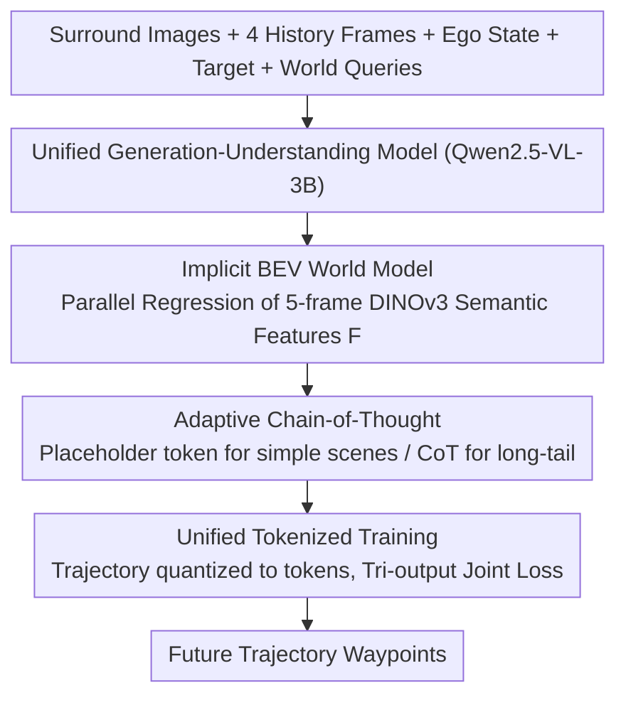

# DeepSight: Long-Horizon World Modeling via Latent States Prediction for End-to-End Autonomous Driving

**Conference**: ICML 2026  
**arXiv**: [2605.10564](https://arxiv.org/abs/2605.10564)  
**Code**: https://github.com/hotdogcheesewhite/DeepSight  
**Area**: Autonomous Driving / VLM / World Models / End-to-End Planning  
**Keywords**: End-to-End Driving, World Models, Implicit Semantic Features, BEV Long-Horizon Prediction, Adaptive CoT  

## TL;DR
DeepSight transforms "future world prediction" from explicit pixel reconstruction (single-frame codebook) to **multi-frame parallel implicit prediction** of DINOv3 semantic features in BEV space, integrated with an on-demand Adaptive Chain-of-Thought (CoT). This enables Qwen2.5-VL-3B to achieve a Driving Score of 86.23 (+7.39) and a Success Rate of 71.36% (+13.63) on the Bench2Drive closed-loop benchmark with only ~4% additional inference latency.

## Background & Motivation
**Background**: End-to-end autonomous driving has recently seen a surge in VLM/MLLM integration—leveraging world knowledge and linguistic reasoning from pre-training to enhance decision-making. One category of methods (EMMA, SimLingo, ORION) follows the "Textual CoT" route, explicitly writing scene descriptions and reasoning processes in natural language. Another category (FSDrive, HERMES, ReasonPlan) adopts "Unified Generation-Understanding," tasking the VLM with directly predicting future frames (pixels or LiDAR) as a world model.

**Limitations of Prior Work**: The authors identify three specific issues: (1) Incorrect visual representation: Using codebook-based autoregressive prediction for future frames emphasizes texture but loses semantics, which is ineffective for driving decisions; (2) Short temporal horizon: Most existing world models predict only 0.5 seconds ahead, insufficient for safe trajectory planning; (3) Narrow perspective: Mainstream models focus on front-view only, failing to model surrounding agents and leading to accidents in complex interaction scenarios.

**Key Challenge**: An ideal driving world model requires **precise semantic understanding + accurate spatial localization + long-horizon motion modeling + fast response**. Existing solutions involve trade-offs: explicit pixel reconstruction is slow and texture-biased, textual CoT is slow and spatially imprecise, and front-view inputs lose surround-view information.

**Goal**: (1) Utilize a "semantic-heavy, texture-light" representation as the ground truth for the future world; (2) Predict multiple future frames in a single forward pass; (3) Unify perception in BEV space and invoke CoT on demand.

**Key Insight**: The authors observe that self-supervised features like DINOv3 are inherently rich in semantics, making them ideal ground truths for a "future BEV world." Furthermore, predicting **implicit features** is significantly more computationally efficient than predicting **pixel tokens**, supporting long-horizon multi-frame parallel prediction. Additionally, CoT should be a scarce resource—triggered only in long-tail scenarios rather than every frame.

**Core Idea**: Use a set of learnable World Queries to perform one-shot parallel prediction of DINOv3 BEV semantic features for the next 5 frames as the world modeling target, coupled with an Adaptive CoT that the model independently decides whether to activate. This decouples but links "world modeling" and "linguistic reasoning."

## Method

### Overall Architecture
DeepSight addresses how a VLM can serve as a fast and accurate driving world model by using Qwen2.5-VL-3B as a base to build a unified generation-understanding model $M_{\text{uni}}$. It shifts the "prediction" of the future world from rendering pixel frames to regressing semantic features on the BEV map. In a single forward pass, the model consumes current $N$-view images $\mathbf{I}_t$, 4 frames of history $\mathbf{I}_{t-\tau}$, ego state $T_{\text{ego}}$, target point $T_{\text{target}}$, and 5 World Queries $\mathbf{Q}_{\text{world}}=[q_0,\dots,q_4]$. It simultaneously outputs three components: future 5-frame BEV implicit features $\mathbf{F}=[f_0,\dots,f_4]$ (frame interval $\Delta t=0.5\text{s}$, covering 2 seconds), Adaptive CoT text $T_{\text{cot}}$, and future trajectory tokens $\mathbf{P}_t$. These are jointly decomposed in a causal sequence of "modeling the world, then thinking, then acting": $p(\mathbf{F}\mid\mathcal{X})\cdot p(T_{\text{cot}}\mid\mathcal{X},\mathbf{F})\cdot p(\mathbf{P}_t\mid\mathcal{X},\mathbf{F},T_{\text{cot}})$. This physically aligns with the human driver's process of "seeing the situation clearly before making a decision."

### Key Designs

**1. Implicit BEV World Model: Shifting from "Predicting Frames" to "Predicting Semantics"**

This step targets two flaws in existing VLM world models: autoregressive reconstruction of future frames via codebook/VAE is slow, texture-biased, and loses semantics; and most only predict a short 0.5s horizon. DeepSight injects 5 BEV-shaped learnable World Queries $q_k\in\mathbb{R}^{h_{\text{bev}}\times w_{\text{bev}}\times d_{\text{bev}}}$, each bound to a future timestamp $t+k\Delta t$. Through transformer self-attention with historical/current multi-view features, it performs **one-shot parallel regression** of 5 implicit feature frames $f_k$, rather than frame-by-frame autoregressive rolling. Supervision comes from DINOv3: $f_i=\phi_{\text{dino}}(I_i^{bev})$ is extracted from BEV rendered maps (or semantic maps) as ground truth, using $L_{\text{world}}=\mathrm{MSE}(\mathbf{F},\mathbf{F}^{\text{gt}})$ for feature-level distillation.

This is effective because self-supervised features like DINOv3 naturally encode objects, shapes, and semantic relationships, matching what driving tasks truly care about (e.g., "should I yield to that car?"), without wasting model capacity on texture details. Moreover, predicting a semantically condensed latent is much cheaper than pixel tokens, making long-horizon multi-frame prediction feasible. Table 3 comparisons are telling: VAE representations achieved only 27.75 DS for a single frame and plummeted to 14.66 when extended to five frames, whereas DINOv3 reached 74.79 for a single frame and rose to 86.57 for five frames—affirming that the "semantics + long-horizon" combination is key.

**2. Adaptive Chain-of-Thought: Letting the Model Decide When to "Think"**

While CoT reasoning is powerful, it is slow; invoking the LLM every frame would compromise real-time performance. DeepSight treats it as a scarce resource triggered on demand. After predicting $\mathbf{F}$, the model autoregressively generates CoT text $T_{\text{cot}}=M_{\text{uni}}(\mathbf{I}_t,\dots,\mathbf{Q}_{\text{world}}\mid\mathbf{F})$. If the current scene is determined to be simple (e.g., standard car-following or straight driving), it outputs a placeholder token $T_{\text{cot}}^{\emptyset}$ to skip reasoning. If it encounters long-tail scenarios (e.g., complex traffic lights, construction zones, emergency vehicle yielding), it unfolds a full structured thinking chain. Training data for CoT was synthesized using Qwen3-VL-235B via a three-step automated labeling pipeline (Scene Complexity Assessment → Complexity-driven Knowledge Retrieval → Behavioral Decision), resulting in 1.3M Bench2Drive annotations.

This meta-capability to "think as needed" preserves social common sense and logical reasoning for long-tail cases while keeping additional latency around 4% (Table 6). Table 5 confirms CoT acts as an enhancement rather than the main course: enabling only CoT (no world model) yields 69.87 DS, significantly lower than the 84.52 from the world model alone; only the combination reaches 86.23.

**3. Unified Tokenized Training: Fitting Trajectories, Text, and Features into One Framework**

The three outputs are heterogeneous (trajectories are coordinates, CoT is text, world states are dense features). Assigning a separate head to each complicates decoupled optimization. DeepSight discretizes the BEV grid into $K$ cells, quantizing each waypoint $p_i=(x_i,y_i)$ into a token index $t_i\in\{1,\dots,K\}$. Consequently, "trajectory prediction" is reduced to token classification, sharing the VLM's token training paradigm and leveraging its pre-trained alignment capabilities. Meanwhile, World Queries follow a separate feature regression path (MSE) to maintain dense representation precision. Finally, a weighted hybrid loss ties the three paths together:

$$L=\lambda_{\text{traj}}L_{\text{traj}}+\lambda_{\text{cot}}L_{\text{cot}}+\lambda_{\text{world}}L_{\text{world}}$$

Where $L_{\text{traj}}$ and $L_{\text{cot}}$ are Cross-Entropy (CE) losses, and $L_{\text{world}}=\mathrm{MSE}(\mathbf{F},\mathbf{F}^{\text{gt}})$. This unified perspective of "trajectory = special text" allows the model to jointly learn world modeling, language reasoning, and trajectory planning in the same token space, avoiding the optimization difficulties of independent heads.

### Loss & Training
Base model: Qwen2.5-VL-3B; 64x H20-96GB GPUs; learning rate $2\times10^{-5}$, batch size 128, trained for 2 epochs on Bench2Drive. Trajectories cover 2 seconds into the future with a waypoint every 0.5s. CoT text is automatically synthesized by a 235B teacher model.

## Key Experimental Results

### Main Results
Comparison with SOTA on Bench2Drive (CARLA V2 closed-loop, 220 routes × 44 scenarios) following the Think2Drive expert protocol:

| Method | Paradigm | DS↑ | SR(%)↑ | Efficiency↑ |
|------|----------|-----|--------|-------------|
| VAD | E2E | 42.35 | 15.00 | 157.94 |
| DriveTrans | E2E | 63.46 | 35.01 | 100.64 |
| ReasonPlan | VLM | 64.01 | 34.55 | 180.64 |
| ORION | VLM | 77.74 | 54.62 | 151.48 |
| AutoVLA (Prev. SOTA) | VLM | 78.84 | 57.73 | 146.93 |
| **DeepSight w/o CoT** | VLM | **84.52 (+5.68)** | **65.91 (+8.81)** | **198.80** |
| **DeepSight (full)** | VLM | **86.23 (+7.39)** | **71.36 (+13.63)** | **201.71** |

On multi-ability sub-tasks (Table 2), DeepSight averages 70.20% (+15.48), with overtaking at 91.11%, emergency braking at 78.33%, and merging at 60.00%, far exceeding ORION's 54.72%.

### Ablation Study

| Setting | DS↑ | SR↑ | Note |
|------|-----|-----|------|
| Base (No WM, No CoT) | 58.16 | 28.18 | Pure trajectory decoding |
| + Adaptive CoT only | 69.87 | 42.27 | CoT provides limited gain |
| + World Model only | 84.52 | 65.91 | WM is the main performance driver |
| **+ WM + CoT (full)** | **86.23** | **71.36** | Complementary stack |

World Model representation and duration (Dev 10 routes):

| Representation | Frames | RC↑ | DS↑ |
|------|------|------|------|
| VAE | 1 | 47.56 | 27.75 |
| VAE | 5 | 27.02 | **14.66** (Long-horizon failure) |
| DINOv3 | 1 | 90.49 | 74.79 |
| DINOv3 | 5 | 95.95 | **86.57** (+11.78) |

Perspective comparison: Front-view DS=77.77 vs BEV DS=86.57, where BEV provides an +8.8 DS gain.

### Key Findings
- **World Model is the primary performance driver**: Removing WM leads to a drop of 26+ DS, whereas removing CoT only drops 1.71 DS—indicating that semantic long-horizon prediction is the foundation of closed-loop driving, while CoT is an enhancement.
- **Implicit features + long-horizon are both indispensable**: VAE codebook representations performed worse with 5 frames than with a single frame (14.66 vs 27.75), exposing the inability of pixel-level representations to handle long-horizon modeling. In contrast, DINOv3 was strong at 1 frame and improved with more frames—the most convincing comparison in the paper.
- **Minimal latency overhead**: Compared to native VLM, DeepSight adds only +3.57% latency, totaling +7.69% with CoT; whereas explicit models like FSDrive add +60.71%. The combination of parallel latent prediction and on-demand CoT significantly improves efficiency by an order of magnitude.

## Highlights & Insights
- **Transition from "predicting pixels" to "predicting semantic features" is a core paradigm shift**: Using DINOv3 as ground truth changes the world model training target from "rendering future frames" to "aligning future semantics." For decision-making tasks, this is a supervision signal closer to an oracle. This idea of "using self-supervised features as distillation targets" can generalize to any downstream task not requiring pixel details but needing semantic state (e.g., robotic manipulation, video QA).
- **World Queries enable one-shot long-horizon prediction**: This avoids the accumulated errors and latency of autoregressive frame-by-frame rolling. It essentially moves the "temporal dimension" out of the decoding loop and into a "parallel query dimension"—a technique with potential in video generation and trajectory planning.
- **Adaptive CoT "on-demand triggering" is a pragmatic engineering design**: Using the model's own placeholder token mechanism to control the CoT switch saves the majority of redundant reasoning. This meta-capability of a model deciding whether or not to "think" may become a standard for future agent systems.
- **Joint Training + Joint Distribution Decomposition**: Factorizing $p(\mathbf{P}_t,T_{\text{cot}},\mathbf{F}\mid\mathcal{X})$ into an interpretable causal sequence (World → Think → Act) aligns physically with human drivers and facilitates the independent ablation of each component.

## Limitations & Future Work
- While real-time performance is good, it still relies on H20 clusters for training; 3B VLM inference remains a challenge for vehicle-end SoCs. The authors explicitly state goals for lighter world models.
- Validation was limited to Bench2Drive closed-loop and nuScenes open-loop; evaluations under extreme conditions like real-world road tests, heavy rain/snow, or night driving were not conducted. DINOv3 feature quality in rare weather remains an open question.
- The trigger logic for Adaptive CoT is self-learned and lacks an interpretable/controllable switch—misjudging a long-tail scenario as "no CoT required" could impact safety. A conservative fallback mechanism could be considered.
- The choice of 5 World Queries covering 2 seconds is empirical; the effects of longer windows (4s, 8s) were not scanned. Longer horizons may no longer benefit due to uncertainty explosion.
- Compared to the PDM-Lite route (e.g., SimLingo DS=85.94), DeepSight matches or exceeds performance using a weaker Think2Drive expert, but cross-expert fair comparisons were not fully detailed.

## Related Work & Insights
- **vs FSDrive**: FSDrive also uses a VLM as a world model but explicitly predicts the next image frame (autoregressive codebook), resulting in +60.71% latency and only looking one step ahead. DeepSight uses implicit features + 5-frame parallel prediction, keeping latency at +3.57% and achieving long-horizon capabilities.
- **vs ORION**: ORION integrates VQA into trajectory planning, relying on the VLM for semantic reasoning without explicit world modeling. DeepSight scores 15.48% higher on Bench2Drive multi-ability metrics, suggesting that reasoning alone—without spatio-temporal prediction—is insufficient for closed-loop scenarios.
- **vs EMMA / SimLingo**: Pure textual CoT routes encode all information into language for LLM reasoning, which is inefficient and spatially imprecise. DeepSight assigns spatial reasoning to BEV feature prediction and common sense reasoning to adaptive CoT.
- **vs HERMES**: HERMES tasks the LLM with predicting LiDAR point clouds and scene understanding, focusing on point cloud generation quality. DeepSight does not rely on LiDAR, uses surround-view images exclusively, and shifts the generation target from raw modalities to compressed semantic latents.

## Rating
- Novelty: ⭐⭐⭐⭐ The combination of "Implicit semantic features + Parallel multi-frame World Query + Adaptive CoT" is a novel paradigm in end-to-end driving. Individual components stem from existing work but are assembled ingeniously.
- Experimental Thoroughness: ⭐⭐⭐⭐⭐ Comprehensive coverage across Bench2Drive 220-route closed-loop, nuScenes open-loop, multi-ability sub-tasks, three types of ablation (representation, perspective, CoT), and latency analysis.
- Writing Quality: ⭐⭐⭐⭐ The chain of Motivation → Method → Experiment is tight; Fig. 1 clearly illustrates paradigm differences. Formulas are sparse but the structure is clear.
- Value: ⭐⭐⭐⭐⭐ Sets new SOTAs for both DS and SR on Bench2Drive scales with minimal latency overhead. Code is open-sourced, providing direct reference value for industrial E2E driving stacks.

<!-- RELATED:START -->

## Related Papers

- [\[ICLR 2026\] ResWorld: Temporal Residual World Model for End-to-End Autonomous Driving](../../ICLR2026/autonomous_driving/resworld_temporal_residual_world_model_for_end-to-end_autonomous_driving.md)
- [\[ICCV 2025\] World4Drive: End-to-End Autonomous Driving via Intention-aware Physical Latent World Model](../../ICCV2025/autonomous_driving/world4drive_end-to-end_autonomous_driving_via_intention-aware_physical_latent_wo.md)
- [\[CVPR 2026\] ResAD: Normalized Residual Trajectory Modeling for End-to-End Autonomous Driving](../../CVPR2026/autonomous_driving/resad_normalized_residual_trajectory_modeling_for_end-to-end_autonomous_driving.md)
- [\[CVPR 2026\] WOD-E2E: Waymo Open Dataset for End-to-End Driving in Challenging Long-tail Scenarios](../../CVPR2026/autonomous_driving/wod-e2e_waymo_open_dataset_for_end-to-end_driving_in_challenging_long-tail_scena.md)
- [\[NeurIPS 2025\] Prioritizing Perception-Guided Self-Supervision: A New Paradigm for Causal Modeling in End-to-End Autonomous Driving](../../NeurIPS2025/autonomous_driving/prioritizing_perception-guided_self-supervision_a_new_paradigm_for_causal_modeli.md)

<!-- RELATED:END -->
