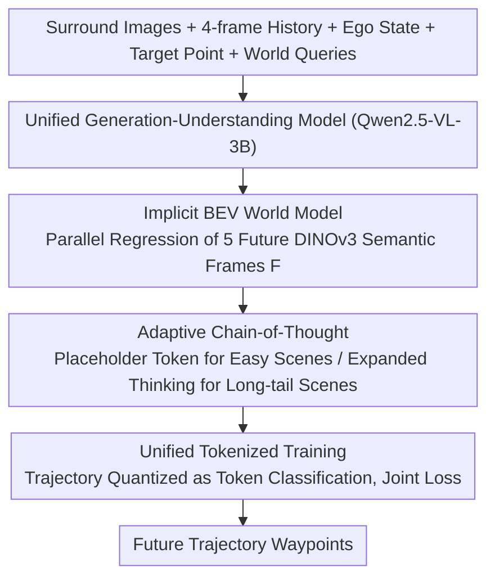

# DeepSight: Long-Horizon World Modeling via Latent States Prediction for End-to-End Autonomous Driving

**Conference**: ICML 2026  
**arXiv**: [2605.10564](https://arxiv.org/abs/2605.10564)  
**Code**: https://github.com/hotdogcheesewhite/DeepSight  
**Area**: Autonomous Driving / VLM / World Model / End-to-End Planning  
**Keywords**: End-to-End Driving, World Model, Implicit Semantic Features, Long-Horizon BEV Prediction, Adaptive CoT  

## TL;DR
DeepSight shifts "future world prediction" from explicit pixel reconstruction (single-frame codebook) to **parallel implicit multi-frame prediction** of DINOv3 semantic features in BEV space. Combined with an on-demand Adaptive Chain-of-Thought, it achieves a Driving Score of 86.23 (+7.39) and a Success Rate of 71.36% (+13.63) on the Bench2Drive closed-loop benchmark while adding only ~4% inference latency.

## Background & Motivation
**Background**: End-to-end autonomous driving has recently seen a massive influx of VLMs/MLLMs, leveraging pre-trained world knowledge and linguistic reasoning to enhance decision-making. One category (EMMA, SimLingo, ORION) follows the "Textual CoT" route, explicitly describing scenes and reasoning in natural language. Another category (FSDrive, HERMES, ReasonPlan) pursues "Unified Generation-Understanding," where VLMs directly predict future frames (pixels or LiDAR) as a world model.

**Limitations of Prior Work**: The authors identify three specific issues: (1) Incorrect visual representation: Using codebook autoregressive prediction for future frames overemphasizes texture while losing semantics, which is ineffective for driving decisions. (2) Short temporal span: Existing world models typically predict only 0.5 seconds into the future, insufficient for safe trajectory planning. (3) Narrow perspective: Most models focus only on the front view, failing to model surrounding agents and leading to accidents in complex interaction scenarios.

**Key Challenge**: An ideal driving world model requires **precise semantic understanding + accurate spatial localization + long-horizon motion modeling + fast response**. Existing solutions involve trade-offs: explicit pixel reconstruction is slow and texture-biased, textual CoT is slow and spatially inaccurate, and front-view inputs lose surround-view information.

**Goal**: (1) Utilize a "semantic-heavy, texture-light" representation as the ground truth for the future world; (2) Predict multiple future frames in a single forward pass; (3) Unify perception in BEV space and invoke CoT on demand.

**Key Insight**: The authors observe that self-supervised features like DINOv3 are inherently rich in semantics, making them ideal as GT for the "future BEV world." Predicting **implicit features** is significantly more computationally efficient than predicting **pixel tokens**, enabling long-horizon parallel prediction. Furthermore, CoT should be a scarce resource triggered only in long-tail scenarios rather than invoked for every frame.

**Core Idea**: Use a set of learnable World Queries to perform parallel prediction of DINOv3 BEV semantic features for the next 5 frames as the world modeling objective. This is paired with an Adaptive CoT, where the model independently decides whether to activate reasoning, decoupling yet linking "world modeling" and "linguistic reasoning."

## Method

### Overall Architecture
DeepSight addresses how a VLM can serve as a fast and accurate driving world model. It uses Qwen2.5-VL-3B as a backbone to build a unified generation-understanding model $M_{\text{uni}}$. It transforms future world "prediction" from rendering pixel frames to regressing semantic features in BEV. In one forward pass, the model processes current $N$-view images $\mathbf{I}_t$, 4 frames of history $\mathbf{I}_{t-\tau}$, ego status $T_{\text{ego}}$, target point $T_{\text{target}}$, and 5 World Queries $\mathbf{Q}_{\text{world}}=[q_0,\dots,q_4]$. It simultaneously outputs three components: 5 frames of future BEV implicit features $\mathbf{F}=[f_0,\dots,f_4]$ (interval $\Delta t=0.5\text{s}$, covering 2 seconds), Adaptive CoT text $T_{\text{cot}}$, and future trajectory tokens $\mathbf{P}_t$. These are jointly decomposed following the causal order of "modeling the world, then thinking, then acting": $p(\mathbf{F}\mid\mathcal{X})\cdot p(T_{\text{cot}}\mid\mathcal{X},\mathbf{F})\cdot p(\mathbf{P}_t\mid\mathcal{X},\mathbf{F},T_{\text{cot}})$. This physically aligns with a human driver's process of "assessing the situation before making a decision."

### Key Designs

**1. Implicit BEV World Model: Replacing "Future Pixel Prediction" with "Future Semantic Prediction"**

This step addresses two flaws in existing VLM world models: autoregressive reconstruction using codebook/VAE is slow, texture-biased, semantic-poor, and often limited to a 0.5s short horizon. DeepSight injects 5 learnable World Queries $q_k\in\mathbb{R}^{h_{\text{bev}}\times w_{\text{bev}}\times d_{\text{bev}}}$ of BEV shape. Each query is bound to a future timestamp $t+k\Delta t$. Through transformer self-attention, they interact with historical and current multi-view features to **regress 5 frames of implicit features $f_k$ in parallel**, rather than via frame-by-frame autoregression. Supervision comes from DINOv3: $f_i=\phi_{\text{dino}}(I_i^{bev})$ extracted from BEV rendered maps (or semantic maps) acts as ground truth, with $L_{\text{world}}=\mathrm{MSE}(\mathbf{F},\mathbf{F}^{\text{gt}})$ used for feature-level distillation.

This is effective because self-supervised features like DINOv3 naturally encode objects, shapes, and semantic relationships, matching the actual priorities of driving (e.g., "should I yield to that car?") without wasting capacity on texture details. Predicting concentrated latent features is much cheaper than pixel tokens, making long-horizon prediction viable. Table 3 shows that VAE representations drop from 27.75 DS (1-frame) to 14.66 (5-frame), whereas DINOv3 starts at 74.79 and rises to 86.57 with 5 frames—proving that only the "semantic + long-horizon" combination works.

**2. Adaptive Chain-of-Thought: Letting the Model Decide Whether to "Think"**

CoT reasoning is powerful but slow. Invoking the LLM every frame consumes real-time performance. DeepSight treats it as an on-demand resource. After predicting $\mathbf{F}$, the model autoregressively generates CoT text $T_{\text{cot}}=M_{\text{uni}}(\mathbf{I}_t,\dots,\mathbf{Q}_{\text{world}}\mid\mathbf{F})$. For simple scenarios (e.g., following a car or going straight), it outputs a placeholder token $T_{\text{cot}}^{\emptyset}$ to skip reasoning. For long-tail scenarios (e.g., complex traffic lights, construction zones, yielding to emergency vehicles), it expands into a full structured thinking chain. The training data was synthesized by Qwen3-VL-235B via a three-step auto-labeling pipeline, totaling 1.3M Bench2Drive annotations.

This "think-on-demand" meta-capability maintains social commonsense and logic in long-tail cases while keeping additional latency at ~4% (Table 6). Table 5 confirms CoT is an enhancement rather than the primary driver: CoT alone (no world model) scores only 69.87 DS, far below the world model's 84.52, reaching 86.23 only when combined.

**3. Unified Tokenized Training: Framing Trajectories, Text, and Features in One Framework**

These three outputs are heterogeneous (coordinates for trajectories, text for CoT, dense features for world state). Using separate heads complicates joint optimization. DeepSight discretizes the BEV grid into $K$ cells, quantizing each waypoint $p_i=(x_i,y_i)$ into a token index $t_i\in\{1,\dots,K\}$. Thus, "trajectory prediction" becomes token classification, sharing the VLM's training paradigm and pre-trained alignment with CoT text. The World Query follows a separate feature regression path (MSE) to maintain dense representation accuracy. A weighted hybrid loss ties them together:

$$L=\lambda_{\text{traj}}L_{\text{traj}}+\lambda_{\text{cot}}L_{\text{cot}}+\lambda_{\text{world}}L_{\text{world}}$$

Where $L_{\text{traj}}$ and $L_{\text{cot}}$ are Cross-Entropy losses, and $L_{\text{world}}=\mathrm{MSE}(\mathbf{F},\mathbf{F}^{\text{gt}})$. This unified "trajectory as special text" perspective allows the model to learn world modeling, reasoning, and planning within the same token space, avoiding the optimization difficulties of decoupled heads.

### Loss & Training
Backbone: Qwen2.5-VL-3B; 64x H20-96GB; lr $2\times10^{-5}$, batch 128, trained for 2 epochs on Bench2Drive. Trajectories cover 2s future with waypoints every 0.5s. CoT text synthesized via 235B teacher.

## Key Experimental Results

### Main Results
Comparison with SOTA on Bench2Drive (CARLA V2 closed-loop, 220 routes across 44 scenarios) following the Think2Drive expert protocol:

| Method | Paradigm | DS↑ | SR(%)↑ | Efficiency↑ |
|------|----------|-----|--------|-------------|
| VAD | E2E | 42.35 | 15.00 | 157.94 |
| DriveTrans | E2E | 63.46 | 35.01 | 100.64 |
| ReasonPlan | VLM | 64.01 | 34.55 | 180.64 |
| ORION | VLM | 77.74 | 54.62 | 151.48 |
| AutoVLA (Prev. SOTA) | VLM | 78.84 | 57.73 | 146.93 |
| **DeepSight w/o CoT** | VLM | **84.52 (+5.68)** | **65.91 (+8.81)** | **198.80** |
| **DeepSight (Ours)** | VLM | **86.23 (+7.39)** | **71.36 (+13.63)** | **201.71** |

On multi-capability sub-tasks (Table 2), DeepSight averages 70.20% (+15.48), with overtaking at 91.11%, emergency braking at 78.33%, and merging at 60.00%, significantly outperforming ORION's 54.72%.

### Ablation Study

| Setting | DS↑ | SR↑ | Note |
|------|-----|-----|------|
| Base (No WM, No CoT) | 58.16 | 28.18 | Pure trajectory decoding |
| + Adaptive CoT only | 69.87 | 42.27 | CoT gain is limited |
| + World Model only | 84.52 | 65.91 | WM is the primary performance driver |
| **+ WM + CoT (Full)** | **86.23** | **71.36** | Complementary stacking |

World model representation and horizon (Dev 10 routes):

| Representation | Frames | RC↑ | DS↑ |
|------|------|------|------|
| VAE | 1 | 47.56 | 27.75 |
| VAE | 5 | 27.02 | **14.66** (Long-horizon degrades) |
| DINOv3 | 1 | 90.49 | 74.79 |
| DINOv3 | 5 | 95.95 | **86.57** (+11.78 Gain) |

View Comparison: Front-view DS=77.77 vs BEV DS=86.57 (Gain of 8.8 DS).

### Key Findings
- **World Model is the Core**: Removing WM causes a drop of over 26 DS, whereas removing CoT only drops 1.71 DS—proving semantic long-horizon prediction is the foundation of closed-loop driving, while CoT is an enhancement.
- **Implicit + Long-Horizon is Crucial**: VAE codebook representations perform worse at 5 frames than 1 frame (14.66 vs 27.75), exposing the inability of pixel-level representations to handle long-horizon modeling. DINOv3, conversely, is strong at 1 frame and improves with more frames—the paper's most compelling evidence.
- **Minimal Latency Overhead**: Compared to vanilla VLM, DeepSight adds only +3.57% latency, and +7.69% total with CoT; whereas explicit models like FSDrive add +60.71%. The combination of parallel latent prediction and on-demand CoT improves efficiency by an order of magnitude.

## Highlights & Insights
- **Paradigm shift from "predicting pixels" to "predicting semantic features"**: Using DINOv3 as GT shifts the training target from "rendering future frames" to "aligning future semantics," which is a supervisor signal closer to an oracle for decision tasks. This idea of using self-supervised features as distillation targets can be generalized to any downstream task (robot manipulation, Video-QA) that requires semantic states rather than pixel details.
- **World Queries enable single-shot long-horizon prediction**: This avoids the accumulated errors and latency of autoregressive frame rolling. Essentially, the "temporal dimension" is moved from the decoding loop into the "parallel query dimension"—a technique with potential for video generation and state prediction.
- **Adaptive CoT is a pragmatic engineering design**: By using the model's own placeholder token mechanism to control the CoT switch, the vast majority of meaningless reasoning is eliminated. This meta-capability of "model deciding whether to think" could become standard for future agent systems.
- **Joint Output Training + Joint Distribution Decomposition**: Factorizing $p(\mathbf{P}_t,T_{\text{cot}},\mathbf{F}\mid\mathcal{X})$ into an interpretable causal sequence (World → Thinking → Action) aligns with human decision-making and allows for clean ablation of components.

## Limitations & Future Work
- Real-time performance is good but training still relies on H20 clusters; deploying 3B VLMs on automotive SoCs remains a challenge. The authors plan to investigate more lightweight world models.
- Validated only on Bench2Drive closed-loop and nuScenes open-loop benchmarks; evaluations under extreme conditions like snow, rain, or night are missing. DINOv3 feature quality in rare weather is an open question.
- The trigger logic for Adaptive CoT is self-learned and lacks an interpretable/controllable switch—misjudging a long-tail scenario as "no CoT needed" could impact safety. A conservative fallback mechanism may be needed.
- The choice of 5 frames (2 seconds) is empirical; the effects of longer horizons (4-8 seconds) were not explored. Long-horizon uncertainty explosion might negate benefits beyond a certain point.
- While outperforming Think2Drive protocols, comparison with PDM-Lite routes (like SimLingo DS=85.94) was not fully expanded for cross-expert fairness.

## Related Work & Insights
- **vs FSDrive**: FSDrive also uses VLM as a world model but explicitly predicts the next image frame (autoregressively via codebook), causing +60.71% latency and only looking one step ahead. DeepSight uses implicit features and 5-frame parallel prediction, capping latency at +3.57% for long horizons.
- **vs ORION**: ORION integrates VQA into trajectory planning, relying on VLMs for semantic reasoning without explicit world modeling. DeepSight scores 15.48% higher on Bench2Drive sub-tasks, suggesting reasoning alone is insufficient for closed-loop scenarios without spatial-temporal prediction.
- **vs EMMA / SimLingo**: Pure textual CoT routes encode all information into language for LLM reasoning, which is inefficient and spatially imprecise. DeepSight assigns spatial reasoning to BEV feature prediction and commonsense reasoning to adaptive CoT.
- **vs HERMES**: HERMES predicts LiDAR point clouds and scene understanding, focusing on point cloud generation quality. DeepSight is vision-only (surround view) and replaces raw modality generation with compressed semantic latents.

## Rating
- Novelty: ⭐⭐⭐⭐ The combination of "Implicit semantic features + Parallel multi-frame World Queries + Adaptive CoT" is a novel paradigm in E2E driving; individual components are derived from prior work but ingeniously assembled.
- Experimental Thoroughness: ⭐⭐⭐⭐⭐ Comprehensive coverage across Bench2Drive closed-loop (220 routes), nuScenes open-loop, multi-capability sub-tasks, three types of ablation (representation, view, CoT), and latency analysis.
- Writing Quality: ⭐⭐⭐⭐ The logic chain from motivation to method to experiment is tight; Fig. 1 illustrates paradigm differences clearly. Math is sparse but the structure is clear.
- Value: ⭐⭐⭐⭐⭐ Refreshes SOTA on Bench2Drive DS/SR with minimal latency overhead. Open-sourced code makes it highly relevant for industrial E2E driving stacks.

<!-- RELATED:START -->

## Related Papers

- [\[ICLR 2026\] ResWorld: Temporal Residual World Model for End-to-End Autonomous Driving](../../ICLR2026/autonomous_driving/resworld_temporal_residual_world_model_for_end-to-end_autonomous_driving.md)
- [\[ICCV 2025\] World4Drive: End-to-End Autonomous Driving via Intention-aware Physical Latent World Model](../../ICCV2025/autonomous_driving/world4drive_end-to-end_autonomous_driving_via_intention-aware_physical_latent_wo.md)
- [\[CVPR 2026\] ResAD: Normalized Residual Trajectory Modeling for End-to-End Autonomous Driving](../../CVPR2026/autonomous_driving/resad_normalized_residual_trajectory_modeling_for_end-to-end_autonomous_driving.md)
- [\[CVPR 2026\] WOD-E2E: Waymo Open Dataset for End-to-End Driving in Challenging Long-tail Scenarios](../../CVPR2026/autonomous_driving/wod-e2e_waymo_open_dataset_for_end-to-end_driving_in_challenging_long-tail_scena.md)
- [\[CVPR 2026\] Perceiving the Near, Reasoning the Distant: Coherent Long-Horizon Trajectory Prediction for Autonomous Driving](../../CVPR2026/autonomous_driving/perceiving_the_near_reasoning_the_distant_coherent_long-horizon_trajectory_predi.md)

<!-- RELATED:END -->
