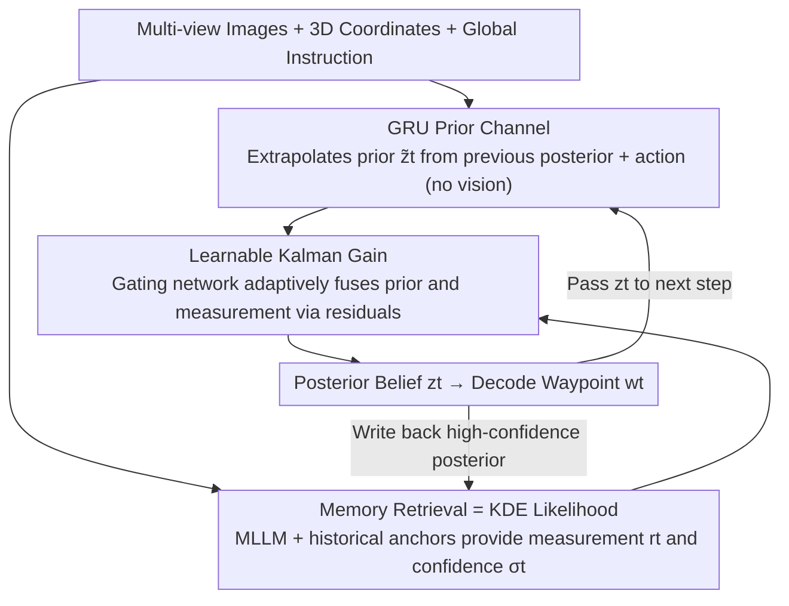

# Mitigating Error Accumulation in Continuous Navigation via Memory-Augmented Kalman Filtering

**Conference**: ICML 2026  
**arXiv**: [2602.11183](https://arxiv.org/abs/2602.11183)  
**Code**: https://github.com/yinntag/Neuro-Kalman (Available)  
**Area**: Embodied AI / UAV Vision-Language Navigation / State Estimation  
**Keywords**: Kalman Filter, Memory Retrieval, State Drift, VLN, Bayesian Estimation

## TL;DR
This work reformulates step-by-step prediction in continuous UAV VLN as a closed-loop "recursive Bayesian estimation = GRU prior + memory likelihood + learnable Kalman gain." By fine-tuning on only 10% of the data in TravelUAV, the Success Rate (SR) of L1-Full is improved from 17.6% to 25.9%, while the positional drift—which typically accumulates continuously after 100 steps—is flattened to 30–40 meters.

## Background & Motivation
**Background**: Current continuous UAV VLN systems (e.g., TravelUAV, OpenVLN, NavFoM) primarily follow a dead-reckoning paradigm—predicting the next waypoint directly from the current frame's multi-view images and global instructions, and then plugging the new position back to roll out the complete trajectory.

**Limitations of Prior Work**: The major issue with this open-loop rollout is that **errors accumulate at a compound interest rate over time**. Any deviation in a single step contaminates the "internal belief" of the next step. Since global language instructions are planned from the starting position, once the internal belief drifts from the true coordinates, subsequent waypoint grounding with language instructions becomes misaligned. The paper terms this "state drift" and observes that the L2 positional error diverges linearly after 100 steps until the agent crashes.

**Key Challenge**: Existing methods concentrate on "how to make prior estimation more accurate" (e.g., larger MLLMs, more pre-training data) but **lack any explicit error-correction mechanism**. Once a prediction is output, it is implicitly trusted. There is no update step that uses observations to back-correct the prior. This corresponds to the degenerate case in Bayesian filtering where "there is only prediction, no update."

**Goal**: (1) Explicitly model navigation as a Bayes filter: $P(\mathbf{z}_t|o_{1:t}, w_{1:t-1}) \propto P(o_t|\mathbf{z}_t) P(\mathbf{z}_t|\mathbf{z}_{t-1}, w_{t-1})$; (2) Correct current beliefs online using historical observations without updating model weights; (3) Outperform baselines trained on 100% data using only 10% of the training data.

**Key Insight**: The authors identify a commonly overlooked mathematical equivalence: **attention-based memory retrieval is essentially a Kernel Density Estimation (KDE) of the likelihood $P(o_t|\mathbf{z}_t)$ using Nadaraya-Watson kernel regression.** This implies that by connecting a memory bank to softmax attention, one obtains a likelihood estimator for free, without needing to learn an explicit probabilistic model.

**Core Idea**: By using a three-stage architecture—"GRU prior + retrieved historical anchor likelihood + learnable Kalman gain"—the prediction-update cycle of the Kalman filter is moved directly into the latent space of VLN. This allows the model to pull the current belief back to the true manifold using historical observations at every step.

## Method

### Overall Architecture
NeuroKalman addresses the problem of belief state drift over time in continuous VLN. It reformulates waypoint prediction from "one-time open-loop extrapolation" into a recursive Bayesian filtering loop consisting of "prior extrapolation + historical observation correction." The inputs are multi-view images $v_t$, current 3D coordinates $p_t$, and global instructions $l$. The model operates on a $d$-dimensional latent belief state $\mathbf{z}_t$: first, a GRU extrapolates a prior $\tilde{\mathbf{z}}_t$ without looking at the image; then, an MLLM provides a measurement $\mathbf{r}_t$ and confidence $\sigma_t$ by combining current vision with historical anchors retrieved from a memory bank; finally, a learnable Kalman gain fuses both into a posterior $\mathbf{z}_t$, which decodes the waypoint $w_t$ and is passed to the next step, forming a prediction-update loop.

### Key Designs

**1. GRU Prior Channel: Isolating Dead-Reckoning as Pure Kinematic Evidence**

The source of error accumulation is the entanglement of prior and measurement, making independent correction impossible. Thus, this channel is intentionally "blind"—it only consumes the previous posterior and the previous action, completely ignoring current vision: $\mathbf{h}_t = \mathrm{GRU}([\mathbf{z}_{t-1}, \mathbf{w}_{t-1}], \mathbf{h}_{t-1})$, $\tilde{\mathbf{z}}_t = \mathrm{MLP}_{prior}(\mathbf{h}_t)$. This ensures the prior is a pure kinematic extrapolation, leaving visual information entirely to the update channel as independent evidence. This separation is crucial because if vision leaks into the prior, "prediction" and "measurement" are no longer independent, breaking the optimality premise of Kalman fusion. Additionally, the temporal recursion of the GRU naturally provides smoothness, helping the subsequent fusion filter out high-frequency noise from measurements.

**2. Memory Retrieval = KDE Likelihood: Explaining Attention as Non-parametric Bayesian Estimation**

The likelihood $P(o_t|\mathbf{z}_t)$ is almost impossible to write as an explicit probability model in high-dimensional visual space. This work bypasses this challenge by using samples for Kernel Density Estimation. Following Nadaraya-Watson kernel regression, the retrieval from a memory bank $\mathcal{M} = \{(\mathbf{k}_i, \mathbf{v}_i)\}_{i=1}^{N}$ is written as $\hat{\mathbf{z}}_{evi} = \sum_i \mathcal{K}(\mathbf{f}_t, \mathbf{f}_i) \mathbf{f}_i / \sum_j \mathcal{K}(\mathbf{f}_t, \mathbf{f}_j)$. By choosing the kernel function $\mathcal{K}(\mathbf{x}, \mathbf{y}) = \exp(\mathbf{x}^\top \mathbf{y}/\sqrt{d})$, this formula **exactly reduces to softmax attention**. This means attention is not just an engineering trick but a discrete implementation of KDE for the likelihood. The benefit of this equivalence is that the likelihood estimator is integrated into the MLLM pipeline for free, and since the memory bank contains evaluated fixed anchors requiring no gradient updates, it is naturally suited for online test-time correction. Writing to memory follows a post-correction strategy: only visual features corresponding to posteriors with $\sigma_t > 0.5$ are stored, ensuring the evidence bank only collects samples that have been "Kalman-corrected and self-reported as high confidence," avoiding contamination by noisy anchors.

**3. Learnable Kalman Gain: Replacing Explicit Covariance Noise Models with Gating Networks**

Classic Kalman filters require explicit estimation of process noise $\mathbf{Q}$ and measurement noise $\mathbf{R}$ to calculate the gain. In deep latent space, these covariances are difficult to define or calibrate. This work learns the gain directly. The "innovation" (residual) $\mathbf{r}_t - \tilde{\mathbf{z}}_t$ and the MLP projection of confidence $\phi(\sigma_t)$ are concatenated and passed through a gating network to obtain a dimension-wise gain $\mathbf{K}_t = \mathrm{Sigmoid}(\mathbf{W}_g [(\mathbf{r}_t - \tilde{\mathbf{z}}_t); \phi(\sigma_t)] + \mathbf{b}_g)$. The update follows $\mathbf{z}_t = \tilde{\mathbf{z}}_t + \mathbf{K}_t \odot (\mathbf{r}_t - \tilde{\mathbf{z}}_t)$, which is algebraically equivalent to the classic Kalman $\mathbf{z}_{post} = \mathbf{z}_{prior} + \mathbf{K}_t(\mathbf{y}_t - \mathbf{H}\mathbf{z}_{prior})$ when $\mathbf{H} = \mathbf{I}$. The value of learnable gain is evident in ablation studies: fixed gains fail across the board; $\mathbf{K}_t = 0.1$ (relying on prior) results in catastrophic drift (SR=0%), while $\mathbf{K}_t = 0.9$ (relying on measurement) loses temporal smoothness (SR=18%). By letting the gain adapt to the innovation magnitude, the model dynamically switches between "prioritizing smoothness" and "prioritizing correction" across noise regimes.

### Loss & Training
The EVA-CLIP visual backbone and Vicuna-7B language backbone are frozen; gradients are only calculated for the visual projector, waypoint predictor, and LoRA layers. Besides the main waypoint loss, an additional $L_1$ supervision is applied to both the prior $\tilde{\mathbf{z}}_t$ and measurement $\mathbf{r}_t$ (coefficient 0.2), forcing both channels to independently predict waypoints and preventing one from "free-riding" on the other. Optimization uses Adam, lr=$5\mathrm{e}{-5}$, batch=16, 4×A6000. All experiments are pre-trained with 100% data and then fine-tuned on a fixed 10% subset of training trajectories.

## Key Experimental Results

### Main Results

Evaluated on the UAV-Need-Help benchmark in TravelUAV: 12,149 human-operated trajectories, 20 training scenes + 2 Unseen-Map scenes, 89 object categories; Metrics: NE↓ (meters), SR↑, OSR↑, SPL↑; Difficulty split into Easy/Hard based on distance (<250 m / ≥250 m), and instruction levels L1/L2/L3.

| Split | Method | NE↓ | SR↑ | OSR↑ | SPL↑ |
|---|---|---|---|---|---|
| L1 Test-Seen Full | TravelUAV (100% Data) | 106.28 | 16.10 | 44.26 | 14.30 |
| L1 Test-Seen Full | TravelUAV-FT (10% Data) | 99.79 | 17.56 | 41.89 | 14.71 |
| L1 Test-Seen Full | OpenVLN | 125.97 | 14.39 | 28.03 | 12.94 |
| L1 Test-Seen Full | **NeuroKalman (10% Data)**| **71.56** | **25.86** | **58.73** | **22.43** |
| L1 Test-Seen Hard | TravelUAV-FT | 143.85 | 13.70 | 36.85 | 12.15 |
| L1 Test-Seen Hard | **NeuroKalman** | **105.07** | **20.11** | **53.90** | **18.21** |
| L1 Unseen-Object | NavFoM | 108.04 | 29.83 | 47.99 | 27.20 |
| L1 Unseen-Object | **NeuroKalman** | **71.01** | **32.48** | **60.82** | **28.50** |
| L1 Unseen-Map | TravelUAV-FT | 117.84 | 4.68 | 19.03 | 3.17 |
| L1 Unseen-Map | **NeuroKalman** | **100.32** | **8.34** | **34.15** | **7.12** |

The most significant comparison is on Test-Seen-Hard: Under 10% data fine-tuning, NeuroKalman's SR (20.1%) exceeds the TravelUAV trained on 100% data (12.8%), with NE reduced from 152 to 105.

### Ablation Study

| Configuration | NE↓ | SR↑ | Description |
|---|---|---|---|
| $\mathbf{K}_t = 0.1$ (Trust Prior) | 217.09 | 0.00 | No correction, constant drift, navigation fail |
| $\mathbf{K}_t = 0.5$ (Fixed Average) | 83.14 | 24.12 | Better than baseline, but worse than adaptive gain |
| $\mathbf{K}_t = 0.9$ (Trust Measurement) | 100.96 | 18.05 | Loss of temporal smoothness, retrieval noise harmful |
| **Learnable $\mathbf{K}_t$** | **71.56** | **25.86** | Adaptive weight adjustment |
| Memory length $M = 5$ | 84.39 | 21.23 | Insufficient historical anchors |
| **$M = 10$** | **71.56** | **25.86** | Sweet spot |
| $M = 15$ | 77.17 | 23.77 | Introduction of outdated anchors as noise |
| Write threshold $\sigma_t = 0.3$ | 82.45 | 20.50 | Low bar, noisy anchors contaminate memory |
| **$\sigma_t = 0.5$** | **71.56** | **25.86** | Optimal |
| TravelUAV + Post-hoc Classic KF| 96.67 | 18.17 | Geometric smoothing helps minorly, must be in latent |

### Key Findings
- **The performance gap between learnable and fixed gain is as high as 25 SR points.** A fixed $\mathbf{K}_t = 0.1$ leads to zero success, confirming that open-loop dead-reckoning without correction is disastrous. Conversely, blind trust in measurements fails too; per-step, per-dimension uncertainty awareness is critical.
- **Memory length follows a clear U-shaped curve**, with $M=10$ being optimal. This suggests that for UAV trajectories spanning 100–200 steps, approximately 10 high-quality historical anchors are sufficient to cover the local manifold; more anchors may introduce visual information from several steps prior that is already obsolete, interfering with attention.
- **Applying a post-hoc classic Kalman Filter (constant velocity model) in output space only pushes SR from 16.1% to 18.2%**, far below NeuroKalman’s 25.9%. This is a strong control experiment—proving that error correction must occur in latent semantic space rather than performing geometric smoothing on $(x, y, z)$ coordinates.
- **Drift Curves**: The L2 positional error of TravelUAV diverges linearly after 100 steps until failure. NeuroKalman's error rises to ~30–40 meters initially and then **stops growing**, visually demonstrating the effect of the Kalman closed loop.

## Highlights & Insights
- **The mathematical equivalence of "attention = KDE likelihood"** is a genuine unifying insight. While many treated retrieval augmentation as an engineering trick, this paper explicitly identifies it as a discretization of non-parametric Bayesian likelihood estimation. This perspective can be transferred to any "prediction + retrieval" architecture (RAG-LLMs, World Models, TTA).
- **The post-correction writing strategy** is clever: memory only accepts samples that have been Kalman-corrected and self-reported as high-confidence. This ensures the memory bank only stores "verified anchors," avoiding the vicious cycle in traditional retrieval caches where "dirty data gets retrieved and makes results dirtier."
- **Ours (10% data) outperforming the 100% data baseline** is explained by the inductive bias. Dead-reckoning models rely on "memorizing all possible transitions" which leads to overfitting with less data. NeuroKalman bakes "long-term consistency" into the architecture as an inductive bias, removing the need for massive data to emerge this capability. This is a clean case of structured priors defeating brute-force scaling.

## Limitations & Future Work
- The authors admit that using a GRU as a prior may lead to information decay over ultra-long horizons. However, the contribution lies in the Bayesian correction framework itself, and the GRU could be replaced by Transformer/Mamba architectures.
- Self-identified limitations: (1) The memory length $M=10$ is hard-coded; different scenes/tasks might require different optimal values, yet there is no adaptive $M$ mechanism. (2) Post-correction writing uses a fixed $\sigma_t > 0.5$ threshold; if model confidence is universally low in early trajectories, no anchors may be stored. (3) Experiments were conduct solely in AirSim; whether visual noise and kinematic mismatches on real UAVs would hold remains unverified. (4) While the KDE equivalence is a theoretical highlight, the actual architecture is standard attention, potentially overstating the "incremental" engineering vs. theoretical contribution.
- Future directions: Make the memory write threshold $\sigma_t$ learnable; use contrastive loss to explicitly disentangle "prior-only" and "measurement-only" channels to further guarantee independence—the prerequisite for optimal Kalman fusion.

## Related Work & Insights
- **vs TravelUAV / OpenVLN**: These provide step-by-step waypoint regression without explicit error-correction channels, leading to inevitable drift over long horizons. This work wraps a Bayesian correction loop around their backbones.
- **vs MapNet / SkyVLN / OpenFly topological memory**: These treat memory as a "passive buffer" for feature concatenation. This work treats memory as "probabilistic evidence" for Bayesian fusion, shifting the paradigm from "passive aggregation" to "active correction."
- **vs FEEDTTA / FSTTA (Test-Time Adaptation)**: These rely on online gradient updates of model weights to combat distribution shift. In VLN, the lack of reliable supervision makes this prone to reinforcing existing errors. NeuroKalman corrects only the belief state without touching weights, making it safer.
- **vs KalmanNet / Backprop-KF**: While these can learn transitions well, likelihoods are hard to define in high-dim vision. This work uses KDE-attention to solve likelihood via retrieval, providing a high-dimensional visual version of deep Bayesian filtering.

## Rating
- Novelty: ⭐⭐⭐⭐ The recognition of "attention = KDE likelihood" and moving the full Kalman prediction-update into the VLN latent space is a clean, theoretically supported perspective.
- Experimental Thoroughness: ⭐⭐⭐⭐ Includes Seen/Unseen-Map/Unseen-Object and L1/L2/L3 splits, drift visualization, and multiple ablations. However, being tested on only the TravelUAV benchmark is somewhat limited.
- Writing Quality: ⭐⭐⭐⭐ The derivation chain from Bayesian framework $\rightarrow$ KDE equivalence $\rightarrow$ architecture implementation is very clear and cohesive.
- Value: ⭐⭐⭐⭐ Provides significant gains for the real pain points of long horizons and low data in VLN. The method can be seamlessly migrated to other sequential decision tasks involving "prior + retrieval."

<!-- RELATED:START -->

## Related Papers

- [\[ICLR 2026\] MARC: Memory-Augmented RL Token Compression for Efficient Video Understanding](../../ICLR2026/autonomous_driving/marc_memory-augmented_rl_token_compression_for_efficient_video_un.md)
- [\[ICML 2026\] Plug-and-Play Label Map Diffusion for Universal Goal-Oriented Navigation](plug-and-play_label_map_diffusion_for_universal_goal-oriented_navigation.md)
- [\[CVPR 2026\] Spatial Retrieval Augmented Autonomous Driving](../../CVPR2026/autonomous_driving/spatial_retrieval_augmented_autonomous_driving.md)
- [\[NeurIPS 2025\] Continuous Simplicial Neural Networks](../../NeurIPS2025/autonomous_driving/continuous_simplicial_neural_networks.md)
- [\[ICLR 2026\] SceneStreamer: Continuous Scenario Generation as Next Token Group Prediction](../../ICLR2026/autonomous_driving/scenestreamer_continuous_scenario_generation_as_next_token_group_prediction.md)

<!-- RELATED:END -->
