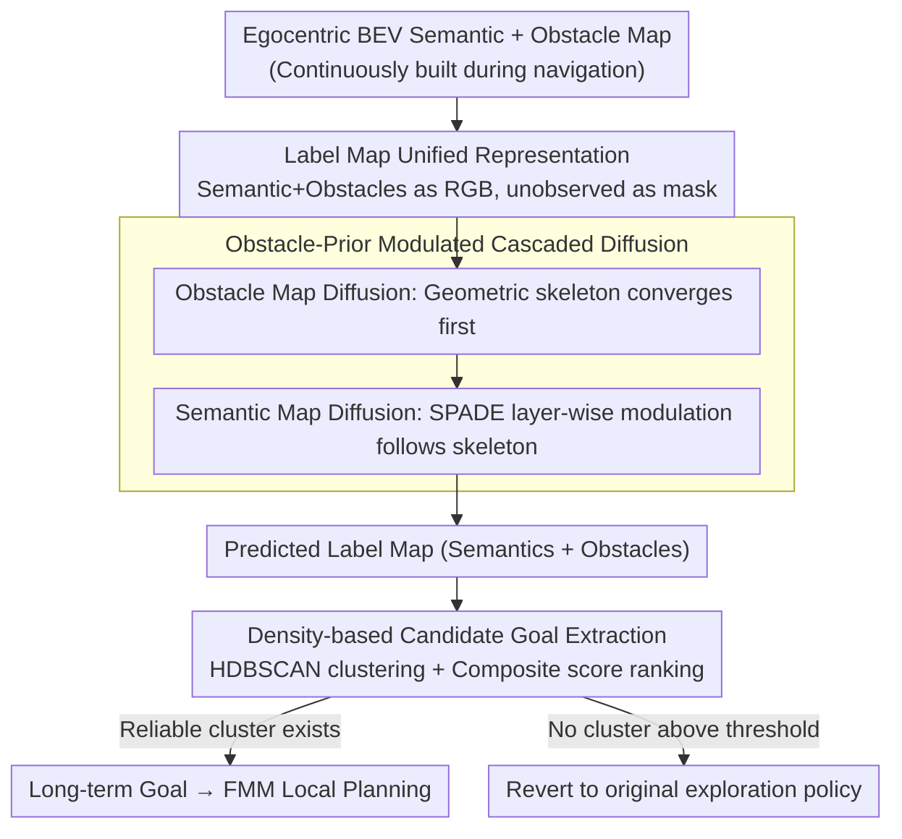

# Plug-and-Play Label Map Diffusion for Universal Goal-Oriented Navigation

**Conference**: ICML 2026  
**arXiv**: [2605.05960](https://arxiv.org/abs/2605.05960)  
**Code**: Not disclosed  
**Area**: Embodied Navigation / BEV Map Completion / Diffusion Models  
**Keywords**: Goal-Oriented Navigation, Label Map, DDPM, SPADE Modulation, HM3D, MP3D

## TL;DR
This paper proposes PLMD: a framework that merges BEV semantic and obstacle maps into a unified Label Map. It utilizes DDPM, modulated by obstacle priors, to complete semantic and obstacle labels in unexplored regions. As a plug-and-play module, it can be integrated with any GON policy and consistently achieves new SOTA results on HM3D/MP3D across three tasks: ON, IIN, and MRON.

## Background & Motivation
**Background**: Goal-Oriented Navigation (GON) comprises three sub-tasks: Object Goal Navigation (ObjectNav), Instance Image Navigation (IIN), and Multi-Robot ObjectNav (MRON). Contemporary modular approaches construct egocentric semantic BEV maps and use RL/LLM to plan long-term goals on these maps (e.g., SemExp, IEVE, 3D-Mem, Co-NavGPT).

**Limitations of Prior Work**: The Achilles' heel of modular methods is that "semantics only exist in observed areas"—robots must traverse most of a room to locate a target, which is highly inefficient. Previous works (Ji et al. 2024, Li et al. 2025) attempted to complete unknown regions on semantic BEVs using diffusion models, but they only learned "statistical correlations between semantics" (e.g., tables and chairs co-occurring), ignoring the rigid structural prior of "obstacle layout." This results in semantic hallucinations like drifting room boundaries, wall clipping, or objects growing out of walls in unobserved areas.

**Key Challenge**: BEV differs from natural images—large portions are free space, and object pixels are sparse. Pure semantic diffusion lacks a stable geometric skeleton. However, the "geometric structure of obstacles/walls" follows strong learnable statistical patterns within houses (walls must be enclosed, doorways connected). Completing obstacles first and then using them to modulate semantics can prevent "imaging objects through walls."

**Goal**: (1) Provide reasonable semantic and obstacle predictions for unobserved regions without retraining any GON policies; (2) Explicitly utilize obstacle priors to resolve semantic hallucinations; (3) Maintain compatibility with RL, SSL, and LLM navigation paradigms.

**Key Insight**: Merge semantic and obstacle maps into a Label Map visualized with a unified palette. Two serial diffusion networks are employed—first stabilizing the obstacle map prior, then modulating semantic map diffusion via SPADE residual blocks, ensuring semantic generation is constrained by the geometric skeleton at each denoising step.

**Core Idea**: A cascaded diffusion completion of "obstacles first + semantics follow," coupled with HDBSCAN clustering to extract candidate goals from the predicted Label Map. The entire module is strictly plug-and-play.

## Method

### Overall Architecture
PLMD addresses the bottleneck in modular navigation where "semantics only appear after traversal." Without altering the navigation policy, it merges the observed BEV semantic and obstacle maps into a unified Label Map. Cascaded diffusion then completes both semantics and obstacles in unobserved regions, allowing the policy to "foresee" potential target locations. During navigation, the robot continuously builds an egocentric semantic + obstacle BEV $M_t\in\mathbb R^{(n+4)\times H\times W}$ ($n$ semantic channels + occupancy/free space/position), renders it as a Label Map with masks for unobserved areas. The diffusion module completes the obstacle map first, followed by the semantic map, yielding a predicted Label Map $L_t^P=[S_t^P,C_t^P]$. Finally, density-based clustering identifies reliable target class locations on the completed map to serve as long-term goals for FMM local planning. If no reliable cluster is found, the system reverts to the original exploration policy. This process refreshes every 50 steps starting from step 100.

### Key Designs

**1. Label Map Unified Representation: Utilizing Image Inpainting Toolchains**
Applying diffusion directly to $n+4$ channels would require designing backbones from scratch, incurring high engineering costs. PLMD uses a single three-channel color image to represent both semantics and obstacles: a fixed palette maps $n+2$ labels to different RGB values, with unobserved areas filled with white to serve as an inpainting mask. This allows mature DDPM/U-Net image completion techniques to be applied directly. The output is then back-referenced to the palette to retrieve the predicted semantic vector $S_t^P\in\mathbb R^{n\times H\times W}$ and obstacle vector $C_t^P\in\mathbb R^{2\times H\times W}$, concatenated as $L_t^P=[S_t^P,C_t^P]$. This discretization also reduces confusion between adjacent categories.

**2. Obstacle-Modulated Cascaded Diffusion: Solving Semantic Drifting and Hallucination**
The primary issue in BEVs is sparse semantic pixels and vast free spaces. Pure semantic diffusion lacks a geometric skeleton in early denoising stages, leading to erratic generation. This work splits generation into two stages: "draw structure, then fill objects." The obstacle map $c_\tau$ evolves along the SDE $\mathrm{dc}=\theta_\tau(\mu_c-c)\mathrm{d}\tau+\delta_\tau\mathrm{dw}$, with a conditional network $\mathcal{G}_\phi(c_\tau,\mu_c,\tau)$ performing reverse denoising to minimize $\mathcal{L}_\alpha=\sum_\tau\alpha_\tau\mathbb{E}[\|c_\tau-(\mathrm{dc}_\tau)_{\mathcal{G}_\phi}-c_{\tau-1}^*\|_p]$. Since obstacle structures like walls and doorways are statistically denser and more rigid, the obstacle map converges stably into a geometric skeleton first.

The semantic network $\tilde{\mathcal{G}}_\phi(s_\tau,c_{\tau-1},\tau)$ is then constrained by this skeleton at each denoising step. SPADE residual modulation is applied at the $k$-th layer feature $f_\tau^k$: $\hat f_\tau^k=\mathbf W_\gamma^{(k)}(c_{\tau-1})f_\tau^k+\mathbf b_\beta^{(k)}(c_{\tau-1})$, where the current obstacle state $c_{\tau-1}$ determines the scale and bias. This migrates the "layout-modulated semantics" mechanism from GauGAN. Training involves pre-training $\mathcal{G}_\phi$ independently, then freezing it to train $\tilde{\mathcal{G}}_\phi$, ensuring semantics always follow a correctly rendered room layout.

**3. Density-based Candidate Goal Extraction: Converting Noisy Completion to Reliable Goals**
Diffusion completion inevitably scatters isolated noise points. Selecting the single pixel with the highest target probability as a goal is error-prone. PLMD collects all coordinates $X=\{x_1,\dots,x_n\}$ of target color pixels and uses HDBSCAN to extract clusters $Z=\text{HDBSCAN}(X,N)$ ($N=5$). HDBSCAN naturally filters noise and does not require a predefined number of clusters. Clusters are ranked based on a composite score of "50% density + 40% cluster size + 10% distance to start." The core of the highest-scoring cluster is selected as the long-term goal for FMM planning; if no cluster exceeds the threshold, the original policy continues.

### Loss & Training
Two-stage training: (1) The obstacle network $\mathcal{G}_\phi$ is trained independently with $\mathcal{L}_\alpha$; (2) With $\mathcal{G}_\phi$ frozen, the semantic network $\tilde{\mathcal{G}}_\phi$ is trained using $\mathcal{L}_\zeta(\phi)=\sum_\tau\zeta_\tau\mathbb{E}[\|s_\tau-(\mathrm{ds}_\tau)_{\tilde{\mathcal{G}}_\phi}s_{\tau-1}-s_{\tau-1}^*\|_p]$. Data is collected using an FBE policy across $\mathcal{N}=2000$ episodes from HM3D_v0.1 and MP3D, saving mask pairs every 25 steps with the final complete map as Ground Truth. Semantic segmentation utilizes RedNet ($n=40$ classes), with images downsampled from $480\times 480$ to $256\times 256$. The Adam optimizer ($\beta_1=0.9, \beta_2=0.99$) is used with $T=100$ denoising steps.

## Key Experimental Results

### Main Results
Evaluated on three tasks across multiple datasets (HM3D_v0.1/v0.2, MP3D). PLMD was integrated with OpenFMNav (ON), FBE/IEVE (IIN), and MCoCoNav (MRON):

| Task | Dataset | Prev. SOTA | PLMD (Ours) | Gain |
|------|--------|---------|-------------|------|
| ON | HM3D_v0.1 | SGM 0.602 / 0.308 | **0.656 / 0.333** | +5.4% / +2.5% SR/SPL |
| ON | MP3D | UniGoal 0.410 / 0.164 | **0.426 / 0.164** | +1.6% SR |
| IIN | HM3D_v0.2 | IEVE 0.702 / 0.252 | **0.776 / 0.283** | +7.4% / +3.1% |
| MRON | HM3D_v0.2 | MCoCoNav 0.716 / 0.387 | **0.762 / 0.406** | +4.6% / +1.9% |
| MRON | MP3D | MCoCoNav 0.568 / 0.334 | **0.591 / 0.382** | +2.3% / +4.8% |

IIN yields the highest gains (+7.4% SR), as it relies heavily on complete semantic maps for instance matching.

### Ablation Study
**Comparison with other diffusion completion methods (MRON HM3D_v0.2):**

| Method | SR | SPL | PSNR |
|------|------|------|------|
| IR-SDE | 0.698 | 0.370 | 29.895 |
| StrDiffusion | 0.729 | 0.374 | 31.486 |
| **PLMD** | **0.762** | **0.406** | **34.284** |

**Ablation of key components (HM3D_v0.2):**

| Configuration | ON SR | IIN SR | MRON SR | PSNR |
|------|-------|--------|---------|------|
| Full | 0.665 | 0.776 | 0.762 | 34.284 |
| w/o $\mathcal{G}_\phi$ (No obstacle prior) | 0.636 | 0.730 | 0.714 | 30.437 |
| w/o Obstacle Map | 0.626 | 0.727 | 0.717 | 34.284 |
| w/o HDBSCAN Clustering | 0.657 | 0.757 | 0.748 | 34.284 |
| Replace observed with predicted (Extreme) | 0.640 | – | 0.731 | 34.284 |

Removing the obstacle prior $\mathcal{G}_\phi$ results in a 3.85 drop in PSNR and a 4.6% drop in IIN SR. Clustering is most critical for IIN (−1.9%), where long-term goals require single reliable coordinates.

### Key Findings
- **Obstacle prior is the quality ceiling**: PSNR values confirm that the geometric skeleton is decisive for diffusion quality; this holds for all BEV/layout generation tasks.
- **Refresh frequency**: "Every 50 steps starting from step 100" is a universal setting. Starting too early provides insufficient map information (high input noise), while higher frequencies slow down inference.
- **Open-vocabulary generalization**: Using Grounded SAM for segmentation (PLMD†) on unseen categories (lamp, toy car, microwave) yields SR=0.354, outperforming MCoCoNav's 0.327, proving PLMD learns category-agnostic geometric-semantic associations.
- **Gap with Ground Truth**: Feeding the GT Label Map into OpenFMNav achieves an SR of 0.742 vs PLMD's 0.665—an 8% gap remains for future work.

## Highlights & Insights
- **"Structure First, Semantics Follow" Cascade**: Modulating semantic diffusion with the obstacle map via SPADE at every layer is a successful transfer of SPADE GauGAN logic to BEV inpainting, applicable to autonomous driving OccNet/HD-Map completion.
- **True Plug-and-Play**: Achieving consistent improvements without modifying RL/LLM navigation policies demonstrates the high deployment value of orthogonal utility modules.
- **HDBSCAN + Composite Scoring**: This effectively bridges the gap between noisy diffusion outputs and practical robotic goal selection.
- **Unified Label Map Representation**: Compressing multi-channel data into RGB allows the direct reuse of DDPM backbones and the entire state-of-the-art image inpainting toolchain.

## Limitations & Future Work
- Training data collected via the FBE policy may introduce exploration bias (unreached area distributions might differ from real deployment).
- Obstacle prediction errors propagate to semantic errors (SPADE modulation is unidirectional).
- 100-step DDPM triggered every 50 steps introduces significant latency; latent or consistency models could accelerate this.
- Three-channel colorization with a fixed palette may lead to category confusion as the number of classes $n$ increases; learned token embeddings could be investigated.
- Multi-robot map fusion currently relies on independent predictions rather than shared latent consistency.

## Related Work & Insights
- **vs SGM (Zhang 2024) / T-Diff (Yu 2024)**: These use pure semantic correlation. PLMD adds the obstacle skeleton, resulting in a +5.4% SR gain on ON HM3D_v0.1.
- **vs StrDiffusion (Liu 2024)**: Uses structural sparsity but remains at the semantic level; PLMD explicitly models obstacles, yielding a 2.8 higher PSNR.
- **vs IEVE (Lei 2024)**: PLMD improves upon this IIN SOTA by +7.4% SR, showing orthogonality with strong current policies.
- **vs Autonomous Driving Occupancy Prediction**: Both complete unobserved occupancy, but PLMD treats free/occupied/semantic data jointly for embodied navigation.

## Rating
- Novelty: ⭐⭐⭐⭐ (Obstacle-prior modulated diffusion is a clear increment, though SPADE is a known concept)
- Experimental Thoroughness: ⭐⭐⭐⭐⭐ (3 tasks, multiple datasets, multiple backbones, frequency sweeps, open-vocabulary, and full ablation)
- Writing Quality: ⭐⭐⭐⭐ (Clear narrative, rigorous formulas, and comprehensive appendix)
- Value: ⭐⭐⭐⭐ (High industrial value as a plug-and-play module with implications for autonomous driving BEV tasks)

<!-- RELATED:START -->

## Related Papers

- [\[AAAI 2026\] FastDriveVLA: Efficient End-to-End Driving via Plug-and-Play Reconstruction-based Token Pruning](../../AAAI2026/autonomous_driving/fastdrivevla_efficient_end-to-end_driving_via_plug-and-play_.md)
- [\[ICCV 2025\] IGL-Nav: Incremental 3D Gaussian Localization for Image-goal Navigation](../../ICCV2025/autonomous_driving/igl-nav_incremental_3d_gaussian_localization_for_image-goal_navigation.md)
- [\[ICML 2026\] Mitigating Error Accumulation in Continuous Navigation via Memory-Augmented Kalman Filtering](mitigating_error_accumulation_in_continuous_navigation_via_memory-augmented_kalm.md)
- [\[ICLR 2026\] SPACeR: Self-Play Anchoring with Centralized Reference Models](../../ICLR2026/autonomous_driving/spacer_self-play_anchoring_with_centralized_reference_models.md)
- [\[NeurIPS 2025\] SDTagNet: Leveraging Text-Annotated Navigation Maps for Online HD Map Construction](../../NeurIPS2025/autonomous_driving/sdtagnet_leveraging_text-annotated_navigation_maps_for_online_hd_map_constructio.md)

<!-- RELATED:END -->
