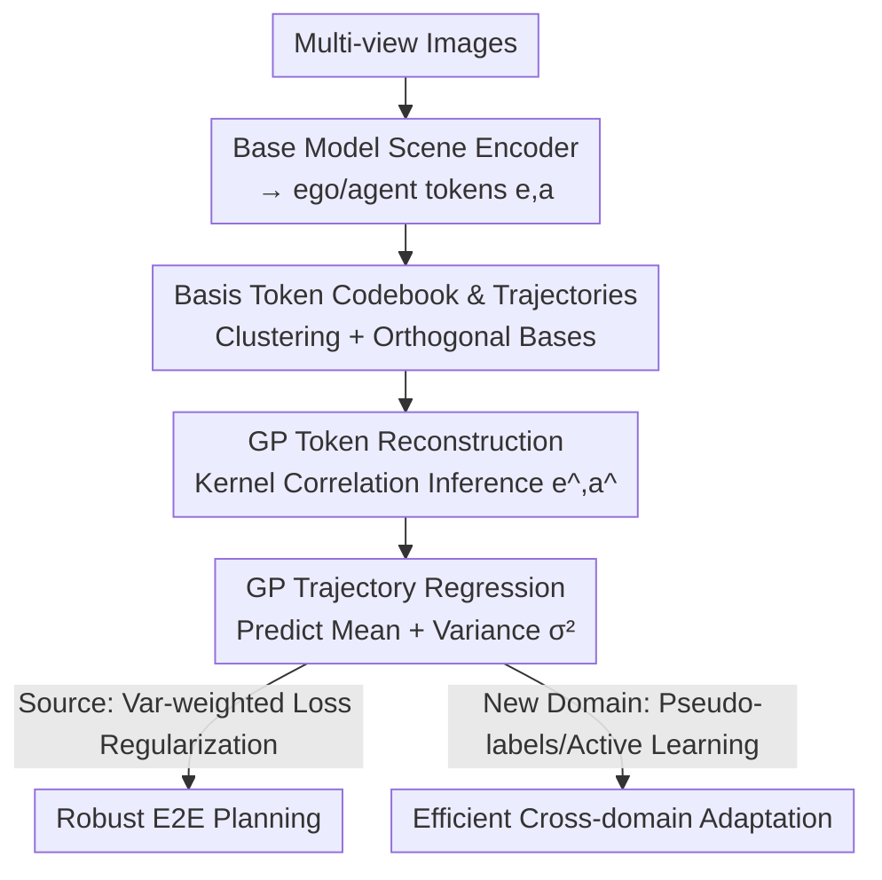

# RoCA: Robust Cross-Domain End-to-End Autonomous Driving

**Conference**: ICML 2026  
**arXiv**: [2506.10145](https://arxiv.org/abs/2506.10145)  
**Code**: To be confirmed  
**Area**: Autonomous Driving / End-to-End Planning / Domain Generalization  
**Keywords**: End-to-end autonomous driving, Gaussian Process, Cross-domain adaptation, Uncertainty, Long-tail robustness

## TL;DR
RoCA attaches a plug-and-play module based on Gaussian Processes (GP) to end-to-end autonomous driving models. By learning a set of basis tokens and corresponding trajectories that cover diverse scenarios, it probabilistically infers future trajectories based on similarity for new scenarios. This approach uses GP uncertainty for regularization to enhance generalization during source domain training and enables efficient adaptation via pseudo-labels and active learning in new domains, without requiring LLMs or increasing inference overhead.

## Background & Motivation

**Background**: Autonomous driving is shifting from modular "perception-prediction-planning" pipelines to end-to-end (E2E) joint optimization (e.g., UniAD, VAD, SparseDrive), which offers better overall performance. Recent works have integrated LLMs/MLLMs to leverage open-world knowledge for improving long-tail robustness.

**Limitations of Prior Work**: ① E2E models exhibit poor robustness in rare scenarios because large-scale datasets like nuScenes are inherently long-tailed—simple events dominate while safety-critical extreme cases are sparse. Standard training protocols bias towards high-frequency scenarios, further marginalizing long-tail weights. ② Integrating LLMs may seem to help generalization but introduces new issues: LLMs do not guarantee driving performance across domains (different cities, lighting, cameras, weather); retraining these massive models for new domains is costly and requires extensive instruction data; and fundamental data imbalance remains if not explicitly addressed during training.

**Key Challenge**: Cross-domain deployment requires "reliable generalization to new scenarios + low-cost adaptation + explicit resistance to long-tail distribution." LLM-based routes are suboptimal across these three points—they are expensive, lack cross-domain guarantees, and do not directly solve data imbalance.

**Goal**: Achieve three objectives—more robust source domain training, stronger cross-domain generalization, and more efficient new domain adaptation—while using **only multi-view images, without relying on LLMs, and without increasing inference computation**.

**Key Insight**: Instead of stacking world knowledge, the authors explicitly encode "driving scenario diversity" into a learnable trajectory codebook and utilize Gaussian Processes (GP) to transform the "similarity between the current scenario and known scenarios" into probabilistic inference of future trajectories. GP naturally provides predictive variance, which serves as both an uncertainty measure and a basis for long-tail re-weighting.

**Core Idea**: Establish a joint probability distribution for "tokens encoding ego/agent information" using GP. By learning a set of basis tokens and their corresponding representative trajectories, a "similarity lookup" on any new scenario allows for probabilistic inference of future trajectories. GP is then used as a teacher to regularize the base model and as an uncertainty guide for adaptation.

## Method

### Overall Architecture

The entire E2E pipeline consists of a **base model + RoCA module**. The base model (e.g., VAD, SparseDrive) includes a scene encoder $st(\cdot;\theta_{st})$, which converts multi-view images into ego tokens $\mathrm{e}$ and agent tokens $\mathrm{a}$, and a motion planner $h(\cdot;\theta_h)$ that predicts ego and agent trajectories using these tokens. The RoCA module $g(\cdot;\theta_g,\kappa)$ applies a Gaussian Process over the token space: it maintains a learnable **basis token codebook** and corresponding **representative trajectories**. It calculates the correlation between new scenario tokens and basis tokens via a kernel function $\kappa$ to perform conditional inference of future trajectories and their variances.

Training is implemented in two stages: In the source domain, the base model is trained normally, followed by RoCA training using "token reconstruction loss $\mathcal{L}_{rec}$ + trajectory supervision loss $\mathcal{L}_{sup}$." Finally, the trained RoCA acts as a teacher to finetune the base model with regularization $\mathcal{L}_{gp}$. During new domain adaptation: if ground truth is available, supervision + GP regularization are used; otherwise, the base model is updated purely using pseudo-labels ($\mathcal{L}_{gp}$) generated by RoCA, supporting both offline large-scale log adaptation and online streaming unsupervised adaptation. Trajectory prediction follows an anchor-based approach: trajectories are grouped into predefined sets ($N_{ego}$ for ego, $N_{agent}$ for agents), residuals are predicted, and final trajectory = anchor + residual.

### Key Designs

**1. Basis Token Codebook and Trajectories: Explicitly encoding driving scenario diversity into a lookup dictionary**

To address the issue where models fail to remember rare scenarios due to data long-tails, RoCA constructs a learnable codebook $\mathcal{B}=\{\mathbf{B}_k=\{\mathrm{b}_{j,k}\}_{j=1}^{C}\}_{k=1}^{N_{code}}$: $N_{code}$ basis groups, each with $C$ tokens of $D$ dimensions. Each group represents a trajectory pattern (left turn, right turn, straight, etc.). These basis tokens learn to span the ego/agent token space across scenarios. They share a **bijective** correspondence with a set of safe trajectories $\{\mathbf{W}_k\}$: $N_{code}\cdot C$ representative trajectories are sampled from the training ground truth and clustered into $N_{code}$ groups. Each group $\mathbf{W}_k$ contains $C$ similar trajectories, and each trajectory $\mathrm{w}_{j,k}$ is paired with a learnable basis $\mathrm{b}_{j,k}$. Thus, the "token ↔ trajectory" mapping is explicitly carved into the dictionary.

**2. GP-based Token Reconstruction: Forcing basis tokens to span the real activation manifold**

RoCA uses GP reconstruction to train the bases: given $\mathrm{e}$ from the base model, it is first assigned to a group $\mathrm{c}_\mathrm{e}$ using kernel distance and an MLP (which outputs classification logits from $\text{MLP}(\kappa(\mathrm{e},\mathbf{B}))$). A joint Gaussian distribution is then formed between $\mathrm{e}$ and the basis group $\mathbf{B}_{\mathrm{c}_\mathrm{e}}$ to obtain the predictive mean (reconstruction):

$$\hat{\mathrm{e}}=\mathbf{b}_{anchor,c_e}+\kappa(\mathrm{e},\mathbf{B}_{\mathrm{c}_\mathrm{e}})\kappa(\mathbf{B}_{\mathrm{c}_\mathrm{e}})^{-1}\bar{\mathbf{B}}_{\mathrm{c}_\mathrm{e}}$$

and variance $\sigma_\mathrm{e}^2=\kappa(\mathrm{e})-\kappa(\mathrm{e},\mathbf{B}_{\mathrm{c}_\mathrm{e}})\kappa(\mathbf{B}_{\mathrm{c}_\mathrm{e}})^{-1}\kappa(\mathrm{e},\mathbf{B}_{\mathrm{c}_\mathrm{e}})^\top+\sigma_{noise}^2\mathbb{I}$. The reconstruction loss is defined as:

$$\mathcal{L}_{rec}=\tfrac{1}{\sigma^2_\mathrm{e}}|\hat{\mathrm{e}}-\mathrm{e}|^2+\log(\sigma_\mathrm{e})+\tfrac{1}{\sigma^2_\mathrm{a}}|\hat{\mathrm{a}}-\mathrm{a}|^2+\log(\sigma_\mathrm{a})+\mathrm{ortho\_reg},$$

where the first four terms are Maximum Likelihood Estimation under Gaussian assumptions (variance automatically weights difficult samples), and orthogonality constraints are applied to basis tokens to prevent redundant collapse. Original $\mathrm{e},\mathrm{a}$ are treated as fixed targets to ensure base representations are not distorted.

**3. GP-based Trajectory Prediction: Probabilistic future trajectory inference via similarity lookup**

This is the output phase of the module, using a mechanism isomorphic to reconstruction: tokens for a new scenario are grouped, then GP regression infers the ego trajectory mean:

$$\hat{\mathrm{p}}_\mathrm{w}=\mathbf{w}_{anchor,\mathrm{c}_\mathrm{e}}+\kappa(\mathrm{e},\mathbf{B}_{\mathrm{c}_\mathrm{e}})\kappa(\mathbf{B}_{\mathrm{c}_\mathrm{e}})^{-1}\bar{\mathbf{W}}_{\mathrm{c}_\mathrm{e}}$$

and variance $\sigma_w^2$. Note that the kernel correlation here is multiplied by the **trajectory** codebook $\bar{\mathbf{W}}$ instead of the token codebook—meaning if the current token is similar to certain bases, it borrows their trajectories weighted by correlation. This probabilistic form naturally supports generalization: predictions for new scenarios are determined by similarity to known bases, and GP variance provides a principled uncertainty measure. Agent trajectories $\hat{\mathrm{p}}_{w,a},\sigma_{w,a}^2$ are obtained similarly.

**4. Variance-weighted Supervision + GP-teacher Regularization + Uncertainty-driven Adaptation: Using variance as leverage against long-tail and domain shift**

The GP variance is a core lever throughout training and adaptation. The source domain supervision loss $\mathcal{L}_{sup}$ uses $1/\sigma_\mathrm{w}^2$ to weight planning/motion losses, effectively **automatically giving higher weight to uncertain/difficult long-tail predictions**. A triplet loss $\mathcal{L}_{tpt}$ is also used to pull similar driving modes together and push dissimilar ones apart. After training RoCA, $\mathcal{L}_{gp}$ aligns base model predictions with GP probabilistic predictions (including a KL divergence term $D_{KL}$), acting as regularization against training noise. During adaptation: $\mathcal{L}=\mathcal{L}_{sup}+\mathcal{L}_{gp}$ is used if ground truth exists; otherwise, only $\mathcal{L}_{gp}$ is used for unsupervised updates. In active learning, GP variance selects the "most uncertain/informative" data for prioritized annotation and finetuning.

### Loss & Training
Source domain involves three steps: ① Standard base model training; ② Training RoCA (basis tokens, MLP, kernel parameters) using $\mathcal{L}_{rec}+\mathcal{L}_{sup}$; ③ Finetuning the base model using $\mathcal{L}_{gp}$ with RoCA as a teacher. $\mathcal{L}_{sup}$ includes variance-weighted planning/motion losses, ego/agent classification losses, and triplet losses. The adaptation stage switches between "Ground Truth + GP Regularization" and "Pure GP Pseudo-labels" based on label availability, supporting online streaming and active learning.

## Key Experimental Results

Evaluations were conducted across closed-loop (Bench2Drive), open-loop, and cross-domain settings (Bench2Drive→nuScenes simulation-to-real, cross-city, and image degradation such as bad weather/low light/motion blur). RoCA is evaluated as a universal framework pluggable into different E2E models.

### Main Results

Closed-loop evaluation on 220 challenging Bench2Drive routes (abridged):

| Method | DS↑ | SR↑ | Efficiency↑ | Ability Mean↑ |
|------|-----|-----|-------------|------|
| VAD | 42.35 | 15.0 | 157.94 | 18.07 |
| SparseDrive-S | 51.01 | 27.8 | 103.1 | 36.28 |
| ORION | 77.74 | 54.6 | 151.48 | 54.72 |
| **RoCA (VAD)** | 56.90 | 34.3 | 175.42 | 40.45 |
| **RoCA (SSR)** | 59.81 | 41.0 | 110.61 | 48.98 |
| **RoCA (ORION)** | **80.38** | **58.2** | 181.06 | **61.11** |

Adding RoCA consistently improves Driving Score (DS) and Success Rate (SR) for every base model: VAD's DS increased from 42.35 to 56.90, and SR from 15.0 to 34.3. Even on the strongest ORION model, DS reached 80.38 and SR 58.2, confirming orthogonal gains.

### Cross-domain Adaptation Results

Bench2Drive→nuScenes Simulation-to-Real transfer (L2/Collision, lower is better; values in parentheses represent domain adaptation **without labels**):

| Method | Zero-shot L2↓ | Zero-shot Col.↓ | Fine-tuned L2↓ | Fine-tuned Col.↓ |
|------|------|------|------|------|
| SparseDrive-S | 1.17 | 0.34 | 0.65 | 0.14 |
| DiMA | 0.94 | 0.26 | 0.61 | 0.19 |
| **RoCA (VAD-Tiny)** | **0.85** | **0.24** | 0.63 (0.73) | 0.12 (0.17) |

RoCA(VAD-Tiny) zero-shot L2 of 0.85 and collision of 0.24 outperform baselines (including the LLM-based DiMA). After fine-tuning **without any target domain labels** (0.73/0.17), it approaches the performance of supervised methods, validating the feasibility of unsupervised cross-domain adaptation.

### Key Findings
- **GP regularization provides dual gains**: In the source domain, GP uncertainty weighting and teacher regularization improve both local planning and cross-domain robustness.
- **Uncertainty is key to label efficiency**: Using GP variance for active learning allows for more accurate and cost-effective adaptation.
- **Strong generalization without LLMs**: Compared to LLM routes like DiMA/ORION, RoCA uses only multi-view images with zero extra inference overhead, yet excels in long-tail and degraded scenarios.
- **Plug-and-play**: Consistent improvements across VAD/SSR/SparseDrive/ORION prove it is a general module decoupled from specific base architectures.

## Highlights & Insights
- **Applying GP in token space rather than pixel/trajectory space**: Performing similarity inference on semantic tokens extracted by the base model maintains probabilistic benefits without the inference burden of raw-space GPs.
- **Bijective mapping + Orthogonality constraints**: Ensures the codebook covers diverse scenarios without redundancy, making the lookup-based trajectory inference both generalized and stable.
- **Multi-purpose variance**: The same GP variance serves as a weight for hard examples, a measure of teacher uncertainty, and a criterion for active learning—a minimalist design that links the entire pipeline.
- **Label-free adaptation**: Using RoCA as a teacher to generate pseudo-labels for updating the base model fits real-world constraints like unlabeled logs or online streaming.

## Limitations & Future Work
- **Dependency on codebook and clustering quality**: Since basis trajectories come from source domain clustering, lookup may fail if the target domain contains entirely new patterns not covered by the source codebook.
- **GP computation and hyperparameters**: Hyperparameters like the number of codes ($N_{code}$) and kernel types (RBF) require tuning; the paper provides limited disclosure on codebook scale sensitivity.
- **Misgrouping risk**: Since tokens are grouped before GP inference, grouping errors can pollute trajectory predictions.
- **Future directions**: Online incremental expansion of the codebook in the target domain and introducing sparse GP approximations to reduce overhead for larger codebooks.

## Related Work & Insights
- **vs LLM-driven E2E (DiMA, ORION, etc.)**: These rely on MLLM world knowledge for long-tails but are expensive and hard to retrain; RoCA avoids LLMs and extra inference costs, using GP probabilistic inference to explicitly model diversity.
- **vs Pure Visual E2E (UniAD, VAD, SparseDrive, SSR)**: These are efficient but struggle with domain shift; RoCA acts as a plug-in to provide consistent DS/SR gains and new cross-domain adaptation capabilities.
- **vs Traditional Domain Adaptation**: Traditional methods often struggle with safety-critical edge cases; RoCA unifies long-tail re-weighting and data selection into a single probabilistic framework.

## Rating
- Novelty: ⭐⭐⭐⭐ Uses GP + learnable trajectory codebook for E2E cross-domain driving; avoids LLMs.
- Experimental Thoroughness: ⭐⭐⭐⭐⭐ Includes closed-loop, sim2real, cross-city, and active learning across multiple base models.
- Writing Quality: ⭐⭐⭐⭐ Clear framework and complete formulas.
- Value: ⭐⭐⭐⭐⭐ No added inference overhead; supports label-free adaptation; deployment-friendly.

<!-- RELATED:START -->

## Related Papers

- [\[CVPR 2026\] Percept-WAM: Perception-Enhanced World-Awareness-Action Model for Robust End-to-End Autonomous Driving](../../CVPR2026/autonomous_driving/percept-wam_perception-enhanced_world-awareness-action_model_for_robust_end-to-e.md)
- [\[ICML 2026\] DeepSight: Long-Horizon World Modeling via Latent States Prediction for End-to-End Autonomous Driving](deepsight_long-horizon_world_modeling_via_latent_states_prediction_for_end-to-en.md)
- [\[CVPR 2026\] ActiveAD: Planning-Oriented Active Learning for End-to-End Autonomous Driving](../../CVPR2026/autonomous_driving/activead_planning-oriented_active_learning_for_end-to-end_autonomous_driving.md)
- [\[CVPR 2026\] Scaling-Aware Data Selection for End-to-End Autonomous Driving Systems](../../CVPR2026/autonomous_driving/scaling-aware_data_selection_for_end-to-end_autonomous_driving_systems.md)
- [\[CVPR 2026\] ResAD: Normalized Residual Trajectory Modeling for End-to-End Autonomous Driving](../../CVPR2026/autonomous_driving/resad_normalized_residual_trajectory_modeling_for_end-to-end_autonomous_driving.md)

<!-- RELATED:END -->
