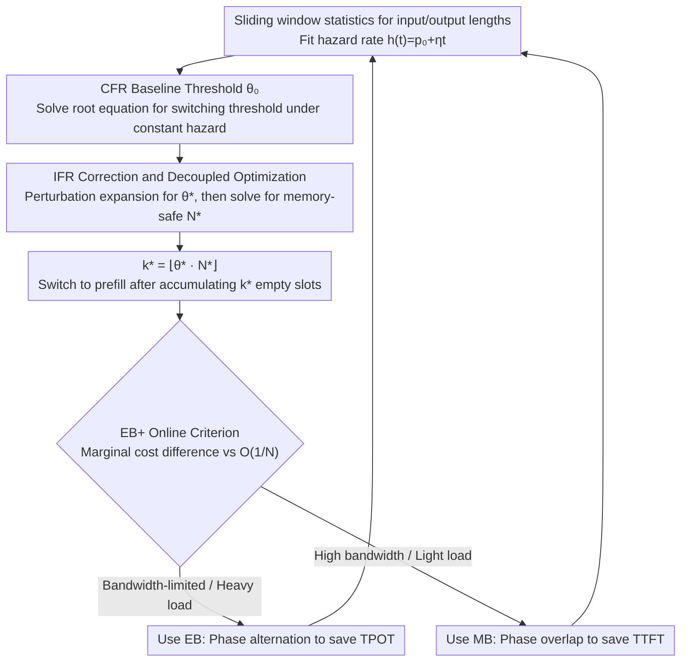

# Threshold-Based Exclusive Batching for LLM Inference

**Conference**: ICML 2026  
**arXiv**: [2606.00516](https://arxiv.org/abs/2606.00516)  
**Code**: https://github.com/weifang231/eb-vllm  
**Area**: LLM Efficiency / Inference Scheduling  
**Keywords**: LLM Inference, batching scheduling, exclusive batching, mixed batching, memory bandwidth

## TL;DR
This paper systematically characterizes the performance crossover conditions between mixed batching (MB) and exclusive batching (EB) in LLM inference. It proves that on bandwidth-constrained GPUs, co-batching prefill and decode stages slows down Attention due to bandwidth contention. Consequently, the authors derive an optimal phase-switching threshold $\theta^*$ and a memory-safe batch size based on the hazard rate, designing an online adaptive scheduler EB+. This scheduler improves throughput by up to 41.9% on bandwidth-constrained hardware and up to 36.4% under non-stationary traffic compared to MB.

## Background & Motivation
**Background**: LLM inference consists of two distinct phases: prefill (compute-bound) and decode (memory-bandwidth-bound). Mainstream inference engines (vLLM v1, SGLang, TGI, TensorRT-LLM) use mixed batching by default, combining prefill and decode tokens into the same forward pass to utilize both compute power and bandwidth. However, some production systems still prefer exclusive batching, where prefill and decode are executed in alternating batches.

**Limitations of Prior Work**: The rationality of defaulting to MB has never been strictly questioned. Through controlled experiments, the authors found that on high-bandwidth hardware like the H200 (4.8 TB/s), the marginal cost of MB exceeds pure decoding only when the decode token ratio $r$ exceeds 80%. On bandwidth-constrained hardware like the RTX PRO 6000 (1.792 TB/s), this threshold drops to 20%. This implies that MB is not universally optimal, yet prior works have provided neither analytical criteria nor adaptive scheduling strategies.

**Key Challenge**: Decode Attention requires streaming the entire KV-cache token-by-token, which is inherently limited by memory bandwidth. Folding prefill into the same batch competes for bandwidth with decode, significantly inflating decode Attention latency. While high-bandwidth GPUs absorbed this interference, it is amplified on low-bandwidth GPUs. Current FlashAttention kernels are not specialized for mixed batching in bandwidth-constrained scenarios, making the "universal MB" paradigm suboptimal for many hardware configurations.

**Goal**: (1) Provide closed-form criteria for the EB vs. MB performance crossover; (2) Derivate the optimal phase-switching threshold $k^*$ and memory-safe batch size $N^*$ under EB mode; (3) Design a hybrid scheduler capable of online adaptation to workloads and hardware.

**Key Insight**: The authors model the single-step iteration time as a linear form $T_{\text{iter}} = \alpha + \beta \cdot n_{\text{tok}}$ and characterize the batch using the decode ratio $r = n_{\text{decode}} / n_{\text{tok}}$. Both $\alpha$ and $\beta$ depend on hardware (bandwidth) and batch composition ($r$). By leveraging saturated assumptions and fluid approximation, the throughput optimization is transformed into a scalar optimization dependent on a few easily measurable parameters.

**Core Idea**: Use the *hazard rate of the output length distribution* to determine when to switch between prefill and decode phases, and use the marginal cost difference $\beta_{\mathrm{MB}}^e - \beta_{\mathrm{EB}}^w$ to decide online between EB and MB modes.

## Method

### Overall Architecture
The problem addressed is: in exclusive batching where prefill and decode alternate, how many empty slots should be accumulated before switching to prefill, how large should the total batch size be, and when should the system revert to mixed batching to maximize throughput on bandwidth-constrained GPUs. The authors model the iteration time linearly as $T_{\text{iter}} = \alpha + \beta\, n_{\text{tok}}$. Using saturated assumptions and fluid approximation, these three engineering decisions are reduced to scalar equations relying on measurable parameters. The system estimates these parameters online using sliding window statistics to automatically determine the execution mode.

The system maintains $N$ slots (maximum concurrency): one slot is freed for each request completed in the decode phase. When idle slots reach threshold $k$, the system switches to the prefill phase, filling the $k$ slots with new requests. Upon completing prefill, it reverts to decode. The following three designs provide closed-form answers and online implementations for $k, N$, and the EB/MB choice.

### Key Designs

**1. CFR Baseline Threshold $\theta_0$: Determining "when to switch" under constant hazard rate**

In engineering, the phase-switching threshold $k$ is often set heuristically (e.g., vLLM v0 uses $k=1$, switching as soon as a slot is free). However, when $\alpha_p$ is large, this greedy approach fails to amortize prefill overhead. Assuming output lengths follow a geometric distribution with a constant hazard rate $h(t)=p_0$, the authors derive the average duration of the decode phase as $\mathbb{E}[T_d(k;N)] = [\beta_d N\theta - \alpha_d \ln(1-\theta)]/p_0$. Substituting this into the saturated throughput $\mathrm{TP}_{\mathrm{EB}}$ and differentiating with respect to $k$ yields the normalized threshold $\theta_0 = \lim_{N\to\infty} k^*/N$ satisfying:

$$\frac{\theta_0}{1-\theta_0} + \ln(1-\theta_0) = p_0\,\frac{\alpha_p}{\alpha_d}.$$

Crucially, this root equation depends only on the ratio $p_0\alpha_p/\alpha_d$ and is independent of $N$, $\mu_L$, or per-token costs $\beta_p, \beta_d$. This allows the threshold to be solved by measuring $(\alpha_p, \alpha_d, p_0)$ offline, replacing exhaustive searches with an interpretable scalar equation.

**2. IFR Correction and Decoupled Optimization: Generalizing to real workloads and solving for batch size**

Real LLM workloads typically exhibit an increasing-failure-rate (IFR) (EOS becomes more likely as generation progresses), meaning a constant hazard rate is inaccurate. Since joint optimization of $(k, N)$ lacks an analytical solution, the authors use perturbation expansion on $\eta$ for a hazard rate $h(t)=p_0+\eta t$, obtaining $\theta^* = \theta_0 + \Delta\theta + O(\eta^2)$, where:

$$\Delta\theta = \frac{\eta(1-\theta_0)^2}{p_0^2 \theta_0}\Big[\zeta\big(\tfrac{\theta_0}{1-\theta_0} - \tfrac{\zeta}{2}\big) + \tfrac{\beta_d N}{\alpha_d}(\zeta - \theta_0)\Big],\quad \zeta = -\ln(1-\theta_0).$$

The correction $\Delta\theta$ is always positive, indicating that IFR allows the system to "wait a bit longer" before switching phases as completions become denser. After determining the threshold, the maximum feasible batch size $N^*$ is derived under the constraint that OOM probability $\le\epsilon$:

$$N^* = \Big\lfloor \big(C - \tfrac{\ln(1/\epsilon)}{p_0^2\mu_L}\big)\big/\big(\mu_L + \tfrac{1-\theta_0}{\theta_0 p_0}\ln\tfrac{1}{1-\theta_0}\big)\Big\rfloor.$$

This decoupling—solving $\theta$ in the $N\to\infty$ limit and then solving for $N^*$—bypasses the unsolvable joint optimization while maintaining an analytical form with errors limited to $O(1/N)$.

**3. EB+ Online Criterion: A single inequality for switching phases and modes**

Tuning thresholds within EB is insufficient; MB may be superior under high bandwidth or light loads. The authors derive the steady-state throughput of MB as $\mathrm{TP}_{\mathrm{MB}}(N) = [\alpha_{\mathrm{MB}}(1+\mu_O)N^{-1} + \beta_{\mathrm{MB}}^e(\mu_L + \mu_O)]^{-1}$. Comparing this to EB throughput leads to Proposition 3.4: MB is superior when:

$$\beta_{\mathrm{MB}}^e - \beta_{\mathrm{EB}}^w < \frac{1}{\mu_L + \mu_O}\Big[\frac{\alpha_p + \alpha_d \zeta \mu_O}{k_0^*} - \frac{\alpha_{\mathrm{MB}}(1+\mu_O)}{N}\Big]$$

The left side represents the "marginal cost difference introduced by co-batching prefill and decode," determined by hardware bandwidth. The right side represents the "fixed cost advantage of MB due to fewer kernel launches," which is $O(1/N)$ and vanishes at saturation. Online, $N$ is replaced by the EMA of active occupancy $N_{\text{obs}}$, and $\beta_{\mathrm{MB}}^e(\hat r)$ is looked up from a kernel profile based on the decode ratio $\hat r$. An adjustable priority margin $\delta$ allows favoring TTFT or throughput.

### Loss & Training
This work involves no training; all optimizations occur at the scheduling layer. The online controller maintains two sliding windows: output lengths $\mathcal{W}_O$ and input lengths $\mathcal{W}_L$. The empirical hazard rate $\hat h(t)$ is estimated from $\mathcal{W}_O$, and a weighted least squares fit is used for $\hat h(t) = \hat p_0 + \hat\eta t$ for $t \in [1, t_{95}]$. Each scheduling cycle solves for $\hat\theta_0$, determines $\hat\theta^*$ (clipped to $[\theta_{\min}, \theta_{\max}]$), and calculates $\hat N^*$.

## Key Experimental Results

### Main Results
Evaluations were conducted on four GPUs (B300 8.0 TB/s, H200 4.8 TB/s, RTX PRO 6000 1.792 TB/s, L40S 0.864 TB/s) using Qwen3-8B and Qwen3-30B-A3B (MoE). Baselines include v0 (EB $k=1$), v1 (MB), and EB($\hat k^*$). Workloads included synthetic and real datasets (ShareGPT, LongBench, WildChat, NuminaMath).

| GPU / Model | Workload | v1 (MB) | EB($\hat k^*$) | Gain vs v1 |
|---|---|---|---|---|
| RTX 6000 / Qwen3-8B | ShareGPT | 17.07 RPS | 19.68 RPS | **+15.3%** |
| RTX 6000 / Qwen3-8B | WildChat | 12.75 RPS | 14.19 RPS | **+11.3%** |
| RTX 6000 / Qwen3-8B | LongBench | 8.35 RPS | 8.66 RPS | +3.7% |
| RTX 6000 / Qwen3-8B | NuminaMath | 0.73 RPS | 0.74 RPS | +1.4% |
| RTX 6000 / Qwen3-8B | **Average** | — | — | **+7.9%** |
| RTX 6000 / Qwen3-30B | **Average** | — | — | +1.4% |
| H200 / Qwen3-8B | **Average** | — | — | +1.5% |
| H200 / Qwen3-30B | **Average** | — | — | −2.9% |

On bandwidth-constrained GPUs, EB($\hat k^*$) achieved up to 41.9% throughput gain over v1. On H200, v1 outperformed EB in large model scenarios, consistent with theoretical predictions.

### Ablation Study

| Config (RTX 6000, $c=2048$, $\mu_L=512, \mu_O=256$) | Throughput (tok/s) | TTFT (s) | TPOT (ms) |
|---|---|---|---|
| v1 (MB) | 8,830 | 83.8 | 207.3 |
| EB($\hat k^*$) | 13,179 | 70.8 | 82.7 |
| **EB+ (Ours)** | **13,214** | 68.2 | 101.6 |
| EB+ $c=32$ | 4,930 | 0.061 | 19.5 (Same as v1) |
| EB+ Dist. Drift | 9,582 (+36.4% vs v1) | — | — |
| EB+ Concurrency Drift | 10,350 (+22.6% vs v1) | — | — |

EB+ automatically reverts to MB at low concurrency to maintain low TTFT (0.061 s) and switches to EB at high concurrency for throughput.

### Key Findings
- **Bandwidth is Decisive**: The critical $r$ where MB marginal costs exceed pure decoding is 80% for H200 but drops to 20% for RTX PRO 6000. Profiling indicates the bottleneck is Attention, matching the roofline explanation of streaming KV-cache bandwidth limits.
- **$\theta_0$ is Sufficiently Robust**: Exhaustive searches for $k$ on H200 show EB($\hat k^*$) outperforms the best fixed $k$ by 0.6%–8.0%, proving that the decoupled approximation loses negligible performance.
- **Larger Models Reduce EB Gains**: Moving from Qwen3-8B to Qwen3-30B-A3B reduces gains on RTX 6000 and favors MB on H200, as fixed costs $\alpha$ scale with model size, making MB more competitive.
- **Sweet Spot for Decode Ratio**: Gains for EB are highest at moderate $r \approx 0.5\text{-}0.7$ (ShareGPT/WildChat) and diminish at extremes ($r \to 0$ or $r > 0.85$).
- **TTFT vs TPOT Trade-off**: MB optimizes TTFT via phase overlap, while EB optimizes TPOT by avoiding bandwidth contention (reducing TPOT by up to 65% on ShareGPT).

## Highlights & Insights
- **First Analytical Criterion for EB vs MB**: Unlike past engineering heuristics, this work compresses the comparison into a measurable scalar inequality. Separating hardware (LHS) from workload (RHS) allows operators to make informed SKU-specific decisions.
- **Hazard Rate as a Scheduling Signal**: Treating LLM output length as a survival distribution to predict phase switching is a superior concept transfer from queuing theory to LLM serving, potentially applicable to speculative decoding and KV eviction.
- **Value of Decoupled Approximation**: Recognizing that joint $(k, N)$ optimization is intractable and solving for $\theta$ in the limit provides an actionable analytical solution that maintains high accuracy for online deployment.

## Limitations & Future Work
- **Fluid Approximation Dependency**: The analytical model assumes saturated batches; under light or bursty loads, throughput estimates may deviate, requiring heuristics like KV-aware gating.
- **Linear Iteration Time Simplification**: The $T_{\text{iter}} = \alpha + \beta n_{\text{tok}}$ model may not capture real-world non-linearities in MoE routing or extreme long-context scenarios.
- **Single GPU Pool Focus**: The work does not yet account for multi-GPU disaggregated serving topologies where KV transfer costs might dilute EB+ advantages.
- **Profile Sensitivity**: The $\beta_{\mathrm{MB}}^e(\hat r)$ parameters are measured offline and are sensitive to driver/kernel updates.

## Related Work & Insights
- **vs vLLM v0**: v0 is a degenerate case of EB with $k=1$. This work generalizes the strategy by deriving $k = \lfloor \theta_0 N \rfloor$ to account for prefill overhead.
- **vs vLLM v1 / Sarathi**: While MB + chunked prefill is often optimal on high-bandwidth GPUs, this work proves it is not universal. EB+ matches v1 on H200 and exceeds it on bandwidth-constrained platforms.
- **vs DistServe / Splitwise**: Disaggregated serving separates P/D pools at the cost of doubled GPU count and KV transfer overhead. EB+ achieves competitive throughput within a single pool at lower cost.

## Rating
- Novelty: ⭐⭐⭐⭐ (Translates EB vs MB to an analytical criterion; novel application of hazard rate).
- Experimental Thoroughness: ⭐⭐⭐⭐ (Extensive GPU and workload coverage with theoretical validation).
- Writing Quality: ⭐⭐⭐⭐ (Clear propositions and consistent narrative).
- Value: ⭐⭐⭐⭐⭐ (Practical improvements of ~40% for bandwidth-limited GPUs; open-source and ready for integration).

<!-- RELATED:START -->

## Related Papers

- [\[AAAI 2026\] TimeBill: Time-Budgeted Inference for Large Language Models](../../AAAI2026/autonomous_driving/timebill_time-budgeted_inference_for_large_language_models.md)
- [\[ICML 2025\] SPHINX: Structural Prediction using Hypergraph Inference Network](../../ICML2025/autonomous_driving/sphinx_structural_prediction_using_hypergraph_inference_network.md)
- [\[ICCV 2025\] CoLMDriver: LLM-based Negotiation Benefits Cooperative Autonomous Driving](../../ICCV2025/autonomous_driving/colmdriver_llm-based_negotiation_benefits_cooperative_autonomous_driving.md)
- [\[CVPR 2026\] Open-Ended Instruction Realization with LLM-Enabled Multi-Planner Scheduling in Autonomous Vehicles](../../CVPR2026/autonomous_driving/open-ended_instruction_realization_with_llm-enabled_multi-planner_scheduling_in_.md)
- [\[NeurIPS 2025\] BayesG: Bayesian Ego-Graph Inference for Networked Multi-Agent Reinforcement Learning](../../NeurIPS2025/autonomous_driving/bayesian_ego-graph_inference_for_networked_multi-agent_reinforcement_learning.md)

<!-- RELATED:END -->
