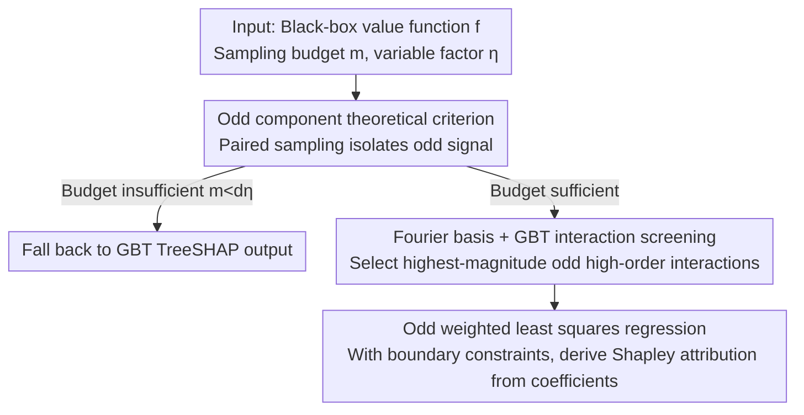

# An Odd Estimator for Shapley Values

**Conference**: ICML2026  
**arXiv**: [2602.01399](https://arxiv.org/abs/2602.01399)  
**Code**: https://github.com/FFmgll/oddshap  
**Area**: Interpretability  
**Keywords**: Shapley values, feature attribution, OddSHAP, paired sampling, Fourier regression  

## TL;DR
This paper demonstrates that the Shapley value depends solely on the odd component of a set function. Based on this, it proposes OddSHAP: a method that isolates odd signals via paired sampling, screens high-order odd Fourier interactions using GBT, and performs sparse odd regression. It significantly outperforms flexible-budget Shapley estimators on mid-to-high dimensional explanation tasks.

## Background & Motivation
**Background**: The Shapley value is one of the most widely used feature attribution frameworks in machine learning interpretability. It treats model predictions as set functions $f:2^{[d]}\to\mathbb{R}$ and assigns the average marginal contribution to each feature. Since exact computation requires traversing an exponential number of coalitions, practical methods typically use sampling or surrogate regression approximations, such as KernelSHAP, LeverageSHAP, Permutation Sampling, SVARM, MSR, PolySHAP, and various proxy-based estimators.

**Limitations of Prior Work**: Many advanced estimators employ paired sampling, where for every sampled coalition $S$, its complement $S^c$ is also sampled. While this technique is empirically effective, the theoretical reason for its success remains unclear. Furthermore, while high-order polynomial or surrogate estimators offer greater expressivity, they face combinatorial explosion: the number of candidate interaction terms grows rapidly with the order, making it difficult to maintain both accuracy and stability under a limited budget.

**Key Challenge**: The Shapley value only concerns function components that affect marginal contributions, yet traditional regression estimators often fit components of the function that are irrelevant to the Shapley value. If an estimator wastes its sampling budget on irrelevant even components or a large number of low-impact interactions, variance and computational costs increase.

**Goal**: The authors seek to provide a rigorous theoretical explanation for paired sampling and design a budget-flexible Shapley estimator based on this explanation. This estimator should leverage high-order interactions to improve accuracy without needing to fit all high-order terms.

**Key Insight**: The paper starts from the odd/even decomposition of set functions. If one defines $f_{odd}(S)=\frac12(f(S)-f(S^c))$, then the Shapley value satisfies $\phi_i(f)=\phi_i(f_{odd})$. Consequently, an estimator can focus solely on fitting the odd component and discard the even component entirely.

**Core Idea**: Shift Shapley estimation from "fitting the entire value function" to "only fitting sparse interactions within the odd Fourier subspace that contribute to the Shapley value."

## Method

### Overall Architecture
OddSHAP addresses the problem of accurately and stably estimating high-dimensional Shapley values under a limited sampling budget. Its key transformation is to stop fitting the entire value function. Instead, it proves theoretically that the Shapley value only relies on the odd part of the set function, then switches to a Fourier basis to select only those sparse odd interactions that truly contribute to the Shapley value for regression. The process involves paired sampling of coalitions, followed by a gradient boosted tree (GBT) proxy model to filter out the highest-magnitude high-order odd interactions, and finally solving a weighted least squares problem with boundary constraints on the reduced support set to derive attributions directly from Fourier coefficients.

The inputs are a black-box value function $f$, a sampling budget $m$, and a regression variable factor $\eta$. If the budget is too low to stably regress even linear terms (i.e., $m<d\eta$), the algorithm falls back to the TreeSHAP output of the GBT; otherwise, it sets the number of candidate high-order odd interactions to $|T_{odd}|=\lceil m/\eta\rceil-d$. This allows the number of regression variables to grow linearly with the budget rather than exploding combinationally. The paper formalizes the algorithm in three steps: paired sampling, interaction screening, and odd regression.

### Key Designs

**1. Odd component theoretical criterion: Explaining why paired sampling works**

Traditional regression estimators simultaneously fit components irrelevant to the Shapley value, wasting budget on useless signals. The authors decompose any set function as $f=f_{odd}+f_{even}$, where the odd part satisfies $f_{odd}(S)=-f_{odd}(S^c)$ and the even part satisfies $f_{even}(S)=f_{even}(S^c)$. They prove that $\phi_i(f)=\phi_i(f_{odd})$, meaning the even component contributes zero to the Shapley value of all features. This criterion elevates paired sampling (sampling $S$ and $S^c$ together), an empirical variance-reduction trick, into a rigorous conclusion: paired sampling essentially achieves an orthogonal decomposition of odd and even parts within the weighted least squares objective, allowing the estimator to cleanly discard the irrelevant even component.

**2. Fourier basis + GBT interaction screening: Selecting sparse high-order interactions in the odd Fourier subspace**

Theoretical criteria alone are insufficient; a basis that accurately isolates odd signals is required. The unanimity basis used by KernelSHAP/LeverageSHAP cannot achieve clean odd-even separation. The authors switch to the Fourier basis: the oddity of a basis function $\chi_T(S)=(-1)^{|S\cap T|}$ is determined solely by the parity of $|T|$; odd $|T|$ corresponds to an odd term, while even $|T|$ corresponds to an even term. Thus, discarding the even subspace becomes straightforward at the basis level. However, high-order odd terms still face combinatorial explosion. Since ML value functions often contain only a few important interactions, OddSHAP uses a GBT proxy fitted on the paired samples to extract the highest-magnitude odd Fourier coefficients (via a ProxySPEX-style method) to form the regression support set $T_{odd}$. The size of this set is controlled by $|T_{odd}|=\lceil m/\eta\rceil-d$, ensuring that regression variables scale linearly with the budget $m$.

**3. Odd weighted least squares regression: Directly deriving attributions from Fourier coefficients**

Once the support set is obtained, OddSHAP solves a weighted least squares problem on $T_{\le 1}\cup T_{odd}$ with Shapley kernel weights. Strict boundary constraints are applied to ensure the estimates satisfy efficiency (sum of attributions equals $f([d])-f(\emptyset)$). The final formula for calculating attributions from coefficients is $\phi_i(\hat f_{odd})=-2\sum_{T\ni i,\,|T|\ \text{odd}}\beta_T/|T|$, allowing individual feature Shapley values to be read directly from the odd Fourier subspace.

### Loss & Training
The core optimization is a weighted least squares regression using the Shapley kernel, solved only on the odd Fourier support. By pre-calculating $f_{odd}(S)=\frac12(f(S)-f(S^c))$ using paired samples, complement rows can be discarded, and $m/2$ representative samples can be used to fit the odd target, effectively compressing the information from $m$ queries into half the regression rows. Boundary constraints are handled explicitly in the regression rather than being approximated with pseudo-infinite weights.

## Key Experimental Results

### Main Results
The experiments evaluate Shapley approximations for 30 random instances across 8 value functions, covering language, image, tabular, and synthetic domains. Metric: Median and IQR of MSE relative to ground-truth Shapley values.

| Dataset / Function | Dim | Area | Ours | Prev. SOTA / Baseline | Gain |
|---------------|------|------|------|-----------------|------|
| DistilBERT | 14 | language | Comparable to best flexible-budget methods e.g. RegressionMSR | RegressionMSR / LeverageSHAP | No disadvantage in low dimensions |
| ViT16 | 16 | image | Comparable to best flexible-budget methods; outperforms FFD corrected settings | RegressionMSR / FFD variants | More active high-order interactions in deep models |
| Cancer | 30 | tabular | Outperforms all flexible-budget baselines at mid-to-high budgets | LeverageSHAP / MSR / SVARM / FourierSHAP | Up to 62x MSE reduction via interaction modeling |
| CG60 / IL60 | 60 | synthetic | Clearly leads flexible-budget baselines when budget is sufficient | MSR / FourierSHAP / RegressionMSR | More pronounced advantage in high-dimensional interaction functions |
| NHANES | 79 | tabular | Outperforms flexible-budget baselines at mid-to-high budgets | TreeSHAP ground truth comparison | Remains viable as dimensionality increases |
| Crime | 101 | tabular | Competitive on runtime-MSE curve | LeverageSHAP / FFD-RD / Proxy | More scalable than fixed $O(d^2)$ designs |

### Ablation Study
The ablation study validates the three core choices of OddSHAP: the number of interactions, paired sampling, and the retention of only odd interactions.

| Configuration | Key Metric | Description |
|------|---------|------|
| $\eta=10$, approx. 1000 interactions, 10000 samples | At least 6x MSE reduction; 62x on Cancer | Moderate odd high-order interactions significantly outperform interaction-free LeverageSHAP |
| $\eta\in\{2,5,10,50\}$ | MSE rebounds with too many interactions | Increased expressivity leads to overfitting; support set should not expand infinitely |
| Paired + Odd interactions | Normalized best configuration | Directly isolates odd component; budget is focused on terms contributing to Shapley |
| Paired + All interactions | Slightly worse MSE and slower | Even terms mathematically cancel out but consume interaction budget and compute |
| Non-paired sampling | Overall weaker than paired sampling | Without paired structure, odd/even separation is messy, leading to instability |
| FFD-RD fixed-budget | Strong on trees, degrades on deep models | Relies on high-order truncation assumptions; $O(d^2)$ sample requirement is inflexible in high-dim |

### Key Findings
- The value of paired sampling is rigorously explained as even-odd separation rather than simple empirical variance reduction.
- OddSHAP does not sacrifice performance in low-dimensional tasks and significantly outperforms flexible-budget baselines in mid-to-high dimensions by modeling sparse odd interactions.
- Even interactions do not contribute to the Shapley value; fitting even terms under paired sampling only dilutes the budget and increases runtime.

## Highlights & Insights
- The paper elevates a common engineering trick to a clear theory: paired sampling is precisely estimating the odd component. This explanation is elegant and guides the design of new estimators.
- The choice of the Fourier basis is effective. It is not just for mathematical aesthetics but because the odd/even property can be determined directly by interaction order, allowing the algorithm to precisely discard the irrelevant subspace.
- The GBT proxy's role is well-positioned: it is not used as the final explainer but acts as a screener for sparse, high-impact interactions, while the constrained regression ensures Shapley consistency.
- A key takeaway for interpretation methods: estimating the value function itself is not equivalent to estimating all information needed for attribution. Fitting only the attribution-relevant subspace is more efficient than fitting the full function.

## Limitations & Future Work
- The regression phase of OddSHAP scales quadratically with the number of selected interactions; if interaction counts grow with the sampling budget, overall cost may grow cubically with $m$. The authors suggest capping interactions at very large budgets.
- Paired sampling reduces the number of independent rows to $m/2$, which might decrease subset coverage and increase mutual coherence; it is not guaranteed to outperform non-paired sampling on all function types.
- Interaction screening relies on a GBT proxy. If the proxy fails to capture important Fourier interactions of the true value function, OddSHAP may miss critical high-order terms.
- While $\eta=10$ is robust in experiments, adaptive selection of $\eta$ based on domain, dimensionality, and evaluation cost warrants further research.

## Related Work & Insights
- **vs KernelSHAP / LeverageSHAP**: These essentially perform low-order/linear surrogate regression; OddSHAP includes selected high-order odd interactions while maintaining consistency, reducing bias in complex value functions.
- **vs PolySHAP**: PolySHAP extends to polynomial regression but suffers from combinatorial explosion; OddSHAP controls the support set size using the Fourier odd subspace and GBT screening.
- **vs RegressionMSR / ProxySPEX**: Proxy methods use learners to approximate the value function; OddSHAP uses proxies as interaction screeners while relying on rigorous regression for final attributions.
- **vs FFD-RD**: FFD uses fixed combinatorial designs and high-order truncation; it is strong on tree models, while OddSHAP is more flexible for deep models or functions with active high-order interactions.

## Rating
- Novelty: ⭐⭐⭐⭐⭐ The odd component criterion and OddSHAP design are highly insightful, tightly integrating theory and algorithm.
- Experimental Thoroughness: ⭐⭐⭐⭐⭐ Covers 8 value functions, multiple baselines, runtime, interaction sparsity, and paired sampling ablations with strong support.
- Writing Quality: ⭐⭐⭐⭐☆ Structure is clear, though the Fourier/Shapley theory density is high, requiring some background knowledge.
- Value: ⭐⭐⭐⭐⭐ Provides direct value to Shapley estimation, sampling design, and high-order interaction attribution.

<!-- RELATED:START -->

## Related Papers

- [\[NeurIPS 2025\] Practical do-Shapley Explanations with Estimand-Agnostic Causal Inference](../../NeurIPS2025/causal_inference/practical_do-shapley_explanations_with_estimand-agnostic_causal_inference.md)
- [\[ICML 2026\] Toward Scalable and Valid Conditional Independence Testing with Spectral Representations](toward_scalable_and_valid_conditional_independence_testing_with_spectral_represe.md)
- [\[ICML 2026\] Causal-JEPA: Learning World Models through Object-Level Latent Masking](causal-jepa_learning_world_models_through_object-level_latent_masking.md)
- [\[ICML 2026\] Causal Modeling of Selection in Evolution](causal_modeling_of_selection_in_evolution.md)
- [\[ICML 2026\] From Observation to Intervention: A Causal Audit of Expert Importance in Mixture-of-Experts Models](from_observation_to_intervention_a_causal_audit_of_expert_importance_in_mixture-.md)

<!-- RELATED:END -->
