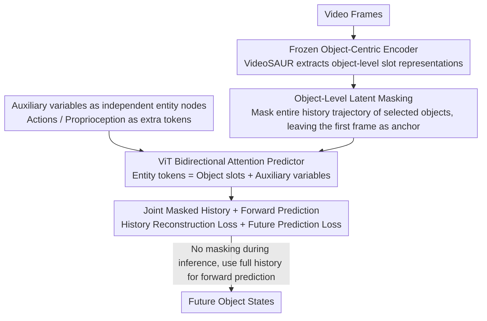

# Causal-JEPA: Learning World Models through Object-Level Latent Masking

**Conference**: ICML2026  
**arXiv**: [2602.11389](https://arxiv.org/abs/2602.11389)  
**Code**: https://github.com/galilai-group/cjepa  
**Area**: Causal Inference / World Models  
**Keywords**: World Models, Object-Level Masking, JEPA, Causal Inductive Bias, Object-Centric Representations  

## TL;DR

This paper proposes C-JEPA, which extends the masked prediction of JEPA from image patch level to object-level latent representations. By using object-level masking as a latent intervention, the model is forced to learn interaction-dependent dynamics. It achieves an improvement of approximately 20% in counterfactual reasoning compared to non-masked baselines and reaches comparable performance in control tasks using only 1% of the tokens, with planning accelerated by more than 8 times.

## Background & Motivation

**Background**: World models provide a unified framework for scalable planning and control by learning, predicting, and reasoning about environmental dynamics within a latent space. Object-centric representations (e.g., Slot Attention) serve as a useful abstraction widely used for learning visual dynamics and building world models.

**Limitations of Prior Work**: Merely using object-centric representations is insufficient to capture interaction-dependent dynamics. Existing studies show that without an explicit mechanism to guide interaction learning, models tend to degenerate into relying on an object's own dynamics or exploiting coincidental correlations. Current methods enforce interactions by separating temporal dynamics from object interactions, regularizing attention sparsity, utilizing graph structures, or relying on downstream task-specific methods, but these either introduce additional architectural constraints or depend on reconstruction loss.

**Key Challenge**: Existing patch-level masked prediction methods (e.g., I-JEPA, V-JEPA) optimize for local patch correlations and fail to enforce object-level interaction reasoning. How interaction structures can become functionally necessary through the learning objective itself remains an open problem.

**Goal**: Design a simple and flexible object-centric world model where interaction reasoning becomes a necessary condition for minimizing the prediction objective, rather than being forced through architectural constraints or reconstruction loss.

**Key Insight**: If the historical latent trajectory of an object is masked during training, the model must infer the masked object's state from the state evolution of other objects—this essentially constitutes a counterfactual prediction query, preventing shortcuts like trivial temporal interpolation.

**Core Idea**: Elevate JEPA's masked prediction from the patch level to the object level. By using object-level latent masking as an observational intervention, the predictor is forced to rely on interaction-relevant variables, thereby introducing a causal inductive bias.

## Method

### Overall Architecture

C-JEPA aims to solve the problem where object-centric world models take shortcuts by only observing an individual object's motion instead of learning interactions. It transforms "learning interactions" into an unavoidable requirement of the prediction task. During training, the latent trajectory of a selected object throughout the history is removed, forcing the model to reconstruct it by inferring from how other objects evolve. The pipeline is: a frozen object-centric encoder (e.g., VideoSAUR) first decomposes video frames into object-level slot representations $S_t = \{s_t^1, \dots, s_t^N\}$; then, selected objects are masked within the historical window, leaving only the earliest frame as an identity anchor; finally, a ViT-style bidirectional attention predictor simultaneously reconstructs the masked history slots and predicts future slots. During inference, no masking is applied, and the full history is used for forward prediction.

### Key Designs

**1. Object-Level Latent Masking: Forcing Interaction-based Inference**

Patch-level masking (I-JEPA, V-JEPA) optimizes for local patch correlations, allowing models to cheat via temporal interpolation without understanding interactions. C-JEPA raises the masking granularity to the object level: given a mask index set $\mathcal{M} \subset \{1,\dots,N\}$, the slots of masked objects across the entire history window are replaced with mask tokens $\tilde{z}_\tau^i = \phi(z_{t_0}^i) + e_\tau$, where $\phi$ is a linear projection, $z_{t_0}^i$ is the identity anchor from the earliest timestep, and $e_\tau$ is a learnable embedding with temporal positional encoding. The identity anchor is a crucial detail—slot representations are permutation equivariant; without the first frame, the Transformer would not know which entity is masked. By masking the entire trajectory, the model cannot rely on the object's own history and must observe how other objects move or collide, essentially creating a counterfactual query that blocks the "auto-dynamic interpolation" shortcut.

**2. Joint Masked History + Forward Prediction: Forcing Interaction Reasoning**

Masking history alone is insufficient; the prediction objective must ensure the model performs while partially observed and models forward dynamics correctly. The total loss is defined as $\mathcal{L}_{\text{mask}} = \mathcal{L}_{\text{history}} + \mathcal{L}_{\text{future}}$: the predictor takes the masked sequence $\bar{Z}_\mathcal{T}$ and outputs $\hat{Z}_\mathcal{T} = f(\bar{Z}_\mathcal{T})$. $\mathcal{L}_{\text{history}}$ computes the L2 reconstruction error only for masked object tokens in the history window, while $\mathcal{L}_{\text{future}}$ computes the L2 prediction error for all future tokens. The history term suppresses the tendency to rely on individual dynamics when information is missing, and the future term ensures the model functions as a standard forward world model. Together, interaction reasoning shifts from being optional to a necessary condition for minimizing the objective.

**3. Auxiliary Variables as Independent Entity Nodes: Action/Proprioception beyond Slots**

Feeding action and proprioception signals into the model can be tricky—concatenating them into object slots contaminates object representations. C-JEPA treats them as independent tokens: the entity set is defined as $Z_t = \{S_t, U_t\}$, where $U_t = \{a_t, p_t\}$ contains actions $a_t$ and proprioception $p_t$. These auxiliary variables enter the attention calculation as additional conditional tokens rather than being mixed with object slots. This preserves the purity of object representations and allows the model to explicitly model "how actions affect objects." Experiments show this independent entity treatment significantly outperforms concatenation.

## Key Experimental Results

### Main Results — CLEVRER Visual Question Answering

| Model | Encoder | Mask Count $\|\mathcal{M}\|$ | Overall Acc (%) | Counterfactual per-opt (%) | Counterfactual per-que (%) |
|------|--------|------|---------|---------|---------|
| OC-JEPA | VideoSAUR | 0 | 82.79 | 79.53 | 47.68 |
| C-JEPA | VideoSAUR | 4 | **89.40** | **88.67** | **68.81** |
| SlotFormer | SAVi | — | 79.44 | 79.28 | 47.29 |
| SlotFormer (w/o Recon) | SAVi | — | 44.94 | 55.62 | 11.10 |
| OCVP-Seq | SAVi | — | 83.11 | 83.21 | 56.06 |
| C-JEPA | SAVi | 2 | **83.88** | **85.16** | **60.19** |

### Push-T Robot Manipulation Task

| Model | Tokens × Dim | Success Rate (%) | Planning Time |
|------|-----------------|-----------|---------|
| DINO-WM | 196 × 384 | 91.33 | 5763s |
| DINO-WM-Reg. | 196 × 384 | 88.00 | — |
| OC-DINO-WM | 6 × 128 | 60.67 | — |
| OC-JEPA | 6 × 128 | 76.00 | — |
| C-JEPA | 6 × 128 | **88.67** | **673s (8x speedup)** |

### Key Findings
- The gain from object-level masking is most significant in counterfactual reasoning: counterfactual per-question accuracy improved from 47.68% to 68.81% (+21.13%), which is much larger than the overall accuracy gain (+6.61%), indicating that masking indeed enhances counterfactual reasoning rather than just prediction precision.
- Excessive masking can remove meaningful dependencies: when using the SAVi encoder, masking 4 objects resulted in a 4% drop, suggesting the optimal masking ratio depends on the representation quality of the encoder.
- C-JEPA achieves control performance comparable to patch-level world models using only 1.02% of the token space (6×128 vs 196×384), while increasing planning speed by over 8 times.
- SlotFormer performance plummeted by 34.5% when reconstruction loss was removed, showing its heavy reliance on pixel-level supervision; C-JEPA requires no reconstruction loss at all.

## Highlights & Insights
- **Object-level Masking as Latent Intervention**: The masking operation is reinterpreted as an intervention on the predictor’s observability, essentially creating counterfactual queries during training. This perspective cleverly links self-supervised masked learning with causal inference without requiring a ground-truth causal graph or multi-environment data.
- **Efficiency-Performance Trade-off**: Object-centric representations reduce token counts from 196 to 6. Combined with object-level masking, C-JEPA recovers performance lost due to representation compression and achieves 8x planning acceleration. This paradigm has direct value for real-time robotic control.
- **Neighborhood of Influence Theory**: The paper formalizes the concept of a "minimal sufficient set of context variables," proving that object-level masking makes interaction reasoning a necessary condition for optimal prediction, providing a theoretical foundation for masking strategies.

## Limitations & Future Work
- Performance is limited by the quality of the object-centric encoder: excessive masking on the SAVi encoder leads to performance degradation, indicating that encoder representation capability is a system bottleneck.
- The "Neighborhood of Influence" was not validated on datasets with explicit temporal causal graphs.
- Experimental scenarios are relatively simple (CLEVRER synthetic video, Push-T 2D manipulation); more complex 3D scenes and multi-agent interactions remain to be verified.
- Future directions: Jointly fine-tuning object-centric encoders to avoid representation collapse; expanding to more complex interactive environments.

## Related Work & Insights
- **JEPA Series**: I-JEPA → V-JEPA → V-JEPA2; this paper is the first to combine JEPA with object-centric world models.
- **DINO-WM**: A patch-level world model baseline that performs well but has high token overhead; C-JEPA achieves equivalent performance with object-level representations.
- **SlotFormer / OCVP-Seq**: Previous object-centric world models that rely on reconstruction loss or architectural separation to guide interaction learning.
- **Insights**: The idea of using object-level masking as an inductive bias can be transferred to other domains requiring interaction reasoning, such as multi-agent reinforcement learning, social behavior prediction, or molecular dynamics simulation.

<!-- RELATED:START -->

## Related Papers

- [\[ICLR 2026\] Distributional Equivalence in Linear Non-Gaussian Latent-Variable Cyclic Causal Models](../../ICLR2026/causal_inference/distributional_equivalence_in_linear_non-gaussian_latent-variable_cyclic_causal_.md)
- [\[NeurIPS 2025\] Bi-Level Decision-Focused Causal Learning for Large-Scale Marketing Optimization](../../NeurIPS2025/causal_inference/bi-level_decision-focused_causal_learning_for_large-scale_marketing_optimization.md)
- [\[ICML 2025\] Latent Variable Causal Discovery under Selection Bias](../../ICML2025/causal_inference/latent_variable_causal_discovery_under_selection_bias.md)
- [\[ECCV 2024\] Understanding Physical Dynamics with Counterfactual World Modeling](../../ECCV2024/causal_inference/understanding_physical_dynamics_with_counterfactual_world_modeling.md)
- [\[AAAI 2026\] From Theory of Mind to Theory of Environment: Counterfactual Simulation of Latent Environmental Dynamics](../../AAAI2026/causal_inference/from_theory_of_mind_to_theory_of_environment_counterfactual_simulation_of_latent.md)

<!-- RELATED:END -->
