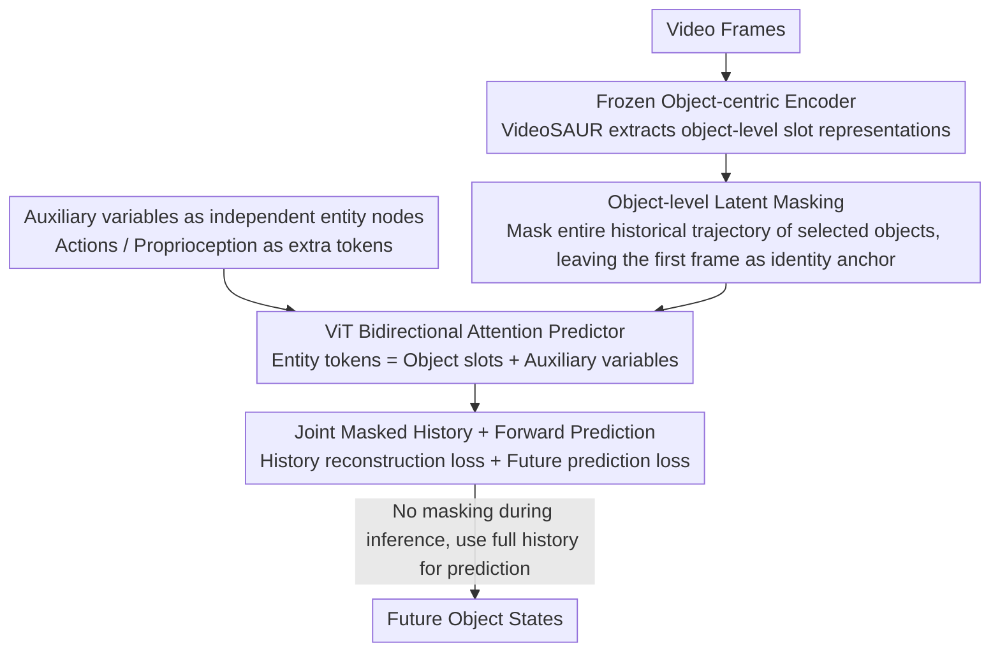

# Causal-JEPA: Learning World Models through Object-Level Latent Masking

**Conference**: ICML2026  
**arXiv**: [2602.11389](https://arxiv.org/abs/2602.11389)  
**Code**: https://github.com/galilai-group/cjepa  
**Area**: Causal Inference/World Models  
**Keywords**: World Models, Object-level Masking, JEPA, Causal Inductive Bias, Object-centric Representations  

## TL;DR

Ours proposes C-JEPA, which extends JEPA's mask prediction from image patch-level to object-level latent representations. By using object-level masking as latent interventions, the model is forced to learn interaction-dependent dynamics. It achieves approximately a 20% gain in counterfactual reasoning over non-masked baselines and reaches comparable performance in control tasks using only 1% of tokens with over 8x planning acceleration.

## Background & Motivation

**Background**: World models provide a unified framework for scalable planning and control by learning, predicting, and reasoning about environment dynamics in latent space. Object-centric representations (e.g., Slot Attention) serve as useful abstractions widely used for learning visual dynamics and building world models.

**Limitations of Prior Work**: Merely using object-centric representations is insufficient to capture interaction-dependent dynamics. Existing research suggests that without explicit mechanisms to guide interaction learning, models tend to degenerate into relying on an object's own dynamics or exploiting coincidental correlations. Current methods enforce interactions by decoupling temporal dynamics and object interactions, regularizing attention sparsity, utilizing graph structures, or relying on downstream task-specific methods, but these either introduce additional architectural constraints or depend on reconstruction loss.

**Key Challenge**: Existing patch-level mask prediction methods (e.g., I-JEPA, V-JEPA) optimize local patch correlations and cannot enforce object-level interaction reasoning. How interaction structures become functionally necessary through the learning objective itself remains an open problem.

**Goal**: Design a simple and flexible object-centric world model where interaction reasoning becomes a requirement for minimizing the prediction objective, rather than being forced through architectural constraints or reconstruction loss.

**Key Insight**: If the historical latent trajectory of an object is masked during training, the model must infer the masked object's state from the evolution of other objects—this essentially constitutes a counterfactual prediction query, preventing shortcuts like trivial temporal interpolation.

**Core Idea**: Elevate JEPA's mask prediction from the patch level to the object level. By using object-level latent masking as observational interventions, the predictor is forced to depend on interaction-relevant variables, thereby introducing a causal inductive bias.

## Method

### Overall Architecture

C-JEPA aims to solve the problem where object-centric world models take shortcuts by only observing individual object self-motion without learning interactions. The approach makes "learning interactions" an unavoidable task: during training, the historical latent trajectory of a selected object is entirely masked, forcing the model to reconstruct it by inferring from the evolution of other objects. The pipeline is: a frozen object-centric encoder (e.g., VideoSAUR) first decomposes video frames into object-level slot representations $S_t = \{s_t^1, \dots, s_t^N\}$; then, selected objects are masked within the history window, leaving only the earliest frame as an identity anchor; finally, a ViT-style bidirectional attention predictor simultaneously reconstructs the masked history slots and predicts future slots. During inference, masking is removed, and the full history is used for forward prediction.

### Key Designs

**1. Object-level Latent Masking: Forcing interaction inference**

Patch-level masking (I-JEPA, V-JEPA) optimizes local patch correlations, allowing models to bypass understanding interactions via temporal interpolation. C-JEPA raises the masking granularity to the object level: given a mask index set $\mathcal{M} \subset \{1,\dots,N\}$, the slots of masked objects across the entire history window are replaced by mask tokens $\tilde{z}_\tau^i = \phi(z_{t_0}^i) + e_\tau$, where $\phi$ is a linear projection, $z_{t_0}^i$ is the identity anchor from the earliest timestep, and $e_\tau$ is a learnable embedding with temporal positional encoding. The identity anchor is a crucial detail—slot representations are permutation equivariant; without the first frame, the Transformer would not know which entity is being masked. By masking the entire trajectory, the model has no self-history to rely on and must observe how other objects move or collide, effectively creating a counterfactual query during training that blocks the "auto-dynamic interpolation" shortcut.

**2. Joint Masked History + Forward Prediction: Making interaction reasoning necessary via dual losses**

Masking history alone is insufficient; the prediction target must handle both "minimizing laziness under partial observability" and "normal forward modeling." The total loss is defined as $\mathcal{L}_{\text{mask}} = \mathcal{L}_{\text{history}} + \mathcal{L}_{\text{future}}$: the predictor takes the masked sequence $\bar{Z}_\mathcal{T}$ and outputs $\hat{Z}_\mathcal{T} = f(\bar{Z}_\mathcal{T})$. $\mathcal{L}_{\text{history}}$ calculates the L2 reconstruction error only for masked object tokens in the history window, while $\mathcal{L}_{\text{future}}$ calculates the L2 prediction error for all future tokens. The history term specifically suppresses the tendency to degenerate into self-dynamics when information is missing, and the future term ensures the model remains a functional forward world model. Together, interaction reasoning shifts from being optional to a necessary condition for objective minimization.

**3. Auxiliary Variables as Independent Entity Nodes: Actions/Proprioception separate from slots**

How to feed action and proprioception signals is a common pitfall—concatenating them into object slots can contaminate object representations. C-JEPA treats them as independent tokens: the entity set is defined as $Z_t = \{S_t, U_t\}$, where $U_t = \{a_t, p_t\}$ contains actions $a_t$ and proprioception $p_t$. These auxiliary variables enter the attention calculation as additional conditioning tokens rather than being mixed with object slots. This preserves the purity of object representations and allows the model to explicitly model "how actions act on objects." Experiments show this independent entity approach significantly outperforms concatenation.

## Key Experimental Results

### Main Results—CLEVRER Visual Question Answering

| Model | Encoder | Mask Count $\|\mathcal{M}\|$ | Overall Acc (%) | Counterfactual per-opt (%) | Counterfactual per-que (%) |
|------|--------|------|---------|---------|---------|
| OC-JEPA | VideoSAUR | 0 | 82.79 | 79.53 | 47.68 |
| C-JEPA | VideoSAUR | 4 | **89.40** | **88.67** | **68.81** |
| SlotFormer | SAVi | — | 79.44 | 79.28 | 47.29 |
| SlotFormer (w/o Recon) | SAVi | — | 44.94 | 55.62 | 11.10 |
| OCVP-Seq | SAVi | — | 83.11 | 83.21 | 56.06 |
| C-JEPA | SAVi | 2 | **83.88** | **85.16** | **60.19** |

### Push-T Robotic Manipulation Task

| Model | Token Count × Dim | Success Rate (%) | Planning Time |
|------|-----------------|-----------|---------|
| DINO-WM | 196 × 384 | 91.33 | 5763 s |
| DINO-WM-Reg. | 196 × 384 | 88.00 | — |
| OC-DINO-WM | 6 × 128 | 60.67 | — |
| OC-JEPA | 6 × 128 | 76.00 | — |
| C-JEPA | 6 × 128 | **88.67** | **673 s (8× speedup)** |

### Key Findings
- The Gain from object-level masking is most significant in counterfactual reasoning: counterfactual per-question accuracy increased from 47.68% to 68.81% (+21.13%), which is much larger than the overall accuracy increase (+6.61%), indicating that masking indeed enhances counterfactual reasoning rather than just prediction precision.
- Excessive masking can remove meaningful dependencies: using the SAVi encoder with 4 masked objects actually caused a 4% drop, suggesting the optimal masking ratio depends on the encoder's representation quality.
- C-JEPA achieves control performance comparable to patch-level world models using only 1.02% of the token space (6×128 vs 196×384), resulting in over 8x planning acceleration. This paradigm is directly valuable for real-time robot control.
- SlotFormer's performance plummeted by 34.5% when the reconstruction loss was removed, indicating a heavy reliance on pixel-level supervision; C-JEPA requires no reconstruction loss at all.

## Highlights & Insights
- **Object-level Masking as Latent Intervention**: Interpreting the masking operation as an intervention on the predictor's observability essentially creates counterfactual queries during training. This perspective cleverly links self-supervised masked learning with causal inference without requiring explicit causal graphs or multi-environment data.
- **Efficiency-Performance Synergy**: Object-centric representations reduce the token count from 196 to 6, and object-level masking recovers the performance lost due to representation compression, achieving 8x planning speedup.
- **Neighborhood of Influence Theory**: Formalized the concept of the "minimal sufficient set of contextual variables," proving that object-level masking makes interaction reasoning a necessity for optimal prediction, providing a theoretical foundation for masking strategies.

## Limitations & Future Work
- Performance is bottlenecked by the quality of the object-centric encoder: performance degradation under excessive masking on the SAVi encoder indicates the encoder's capability is a system limit.
- Influence neighborhood correctness has not been verified on datasets with explicit temporal causal graphs.
- Experimental scenarios are relatively simple (CLEVRER synthetic videos, Push-T 2D manipulation); more complex 3D scenes and multi-agent interactions remain to be validated.
- Future directions: Jointly fine-tuning the object-centric encoder to avoid representation collapse; extending to more complex interaction environments.

## Related Work & Insights
- **JEPA Series**: I-JEPA → V-JEPA → V-JEPA2; Ours combines JEPA with object-centric world models for the first time.
- **DINO-WM**: A patch-level world model baseline; performs well but with high token overhead. C-JEPA achieves equivalent performance using object-level representations.
- **SlotFormer / OCVP-Seq**: Prior object-centric world models that rely on reconstruction loss or architectural separation to guide interaction learning.
- **Insights**: The idea of object-level masking as an inductive bias is transferable to other fields requiring interaction reasoning, such as multi-agent reinforcement learning, social behavior prediction, and molecular dynamics simulation.

<!-- RELATED:START -->

## Related Papers

- [\[ICLR 2026\] Distributional Equivalence in Linear Non-Gaussian Latent-Variable Cyclic Causal Models](../../ICLR2026/causal_inference/distributional_equivalence_in_linear_non-gaussian_latent-variable_cyclic_causal_.md)
- [\[ICLR 2026\] Beyond DAGs: A Latent Partial Causal Model for Multimodal Learning](../../ICLR2026/causal_inference/beyond_dags_a_latent_partial_causal_model_for_multimodal_learning.md)
- [\[ICLR 2026\] Causal Structure Learning in Hawkes Processes with Complex Latent Confounder Networks](../../ICLR2026/causal_inference/causal_structure_learning_in_hawkes_processes_with_complex_latent_confounder_net.md)
- [\[NeurIPS 2025\] Bi-Level Decision-Focused Causal Learning for Large-Scale Marketing Optimization](../../NeurIPS2025/causal_inference/bi-level_decision-focused_causal_learning_for_large-scale_marketing_optimization.md)
- [\[ICLR 2026\] Adjusting Prediction Model Through Wasserstein Geodesic for Causal Inference](../../ICLR2026/causal_inference/adjusting_prediction_model_through_wasserstein_geodesic_for_causal_inference.md)

<!-- RELATED:END -->
