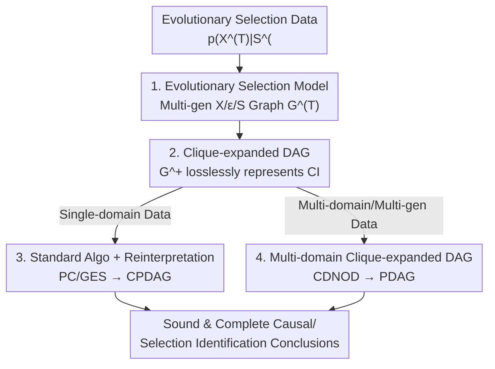

# Causal Modeling of Selection in Evolution

**Conference**: ICML2026  
**arXiv**: [2606.05689](https://arxiv.org/abs/2606.05689)  
**Code**: TBC  
**Area**: Causal Inference / Causal Discovery  
**Keywords**: Selection bias, Evolutionary selection, Causal discovery, Graphical models, Conditional independence

## TL;DR
The paper argues that "selection" consists of two types: **static selection** (one-time filtering) and **evolutionary selection** (accumulation of differential reproduction over multiple generations). Existing graphical models conflate the two, leading to erroneous causal discoveries on evolutionary data. The authors define a causal graphical model that explicitly characterizes evolution and prove that its conditional independence (CI) constraints can be losslessly represented by a "clique-expanded DAG." This allows for the direct application of standard PC/GES/CDNOD algorithms, requiring only a reinterpretation of the output semantics.

## Background & Motivation

**Background**: Causal discovery aims to identify causal relationships from observational data. However, observed dependencies do not always imply causation—one critical source of interference is **selection**: data is only observed after being "picked" by some systematic, often unobservable mechanism. The mainstream approach (FCI and its extensions) models this by adding a binary indicator variable $S$ to the original causal graph, treating selection as conditioning on $S=1$, and performing discovery based on the conditioned graph constraints.

**Limitations of Prior Work**: This paradigm treats all selection as **one-time filtering**. The authors argue that in reality, the selection narrative takes two forms:

- **Static Selection**: A subpopulation is drawn once from a global population, such as volunteer bias in political surveys where "mail-in/phone recruitment favors certain education/income groups." Standard graphical models correctly characterize this type.
- **Evolutionary Selection**: This acts through **multiple rounds of differential reproductive fitness**. The observed data is the "latest generation" shaped by a historical trajectory. Examples include immune adaptation, antibiotic resistance, the increase of dark-colored moths in Manchester during the Industrial Revolution, and the emergence of social norms.

**Key Challenge**: Under evolutionary selection, the observed data **is not a subset of a global population at any fixed time**; rather, it is a generation that survived through multiple rounds of "selection–reproduction–inheritance." The coupling of reproduction and selection leaves **additional conditional dependencies** in contemporary data through inheritance, which static one-time filtering models cannot capture. Directly applying static models misinterprets these dependencies as direct causal relationships or direct selection—resulting in **false positive discoveries** (Lemma 1).

**Goal**: (1) Formally define a causal graphical model representing the data-generating process of evolutionary selection; (2) Characterize the CI constraints it entails in the data; (3) Provide a sound and complete identification pipeline and generalize from single-domain to multi-generational/multi-environmental heterogeneous data.

**Core Idea**: Describe evolution using an explicit multi-generational graph $\mathcal{G}^{(T)}$, then prove that all CI constraints on observed variables are **equivalent** to d-separation on a "clique-expanded DAG" $\mathcal{G}^+$, which is devoid of latent and selection variables. Consequently, identification algorithms reduce to standard forms, with only the interpretation of the output requiring a new set of semantics.

## Method

### Overall Architecture

The paper addresses how to correctly model causal graphs and identify them when data is a product of evolutionary selection. The logical chain is: **Define the evolutionary selection model $\mathcal{G}^{(T)}$ (specifying how data is generated) $\rightarrow$ Prove its CI constraints can be losslessly represented by a standard DAG (clique-expanded DAG $\mathcal{G}^+$) $\rightarrow$ Directly run standard causal discovery algorithms and reinterpret the output with new semantics $\rightarrow$ Generalize to multi-domain cases to enhance identifiability**.

### Key Designs

**1. Evolutionary Selection Model: Explicitly mapping "selection–reproduction–inheritance" via multi-generational graphs**

To address the fundamental flaw that static models cannot capture evolution, the authors define the evolutionary selection model $\mathcal{G}^{(T)}$ (Definition 1). It unfolds a static graph $\mathcal{G}$ (vertices $X \cup \{S\}$, acting as an intuitive summary) into a DAG spanning $T$ generations, containing three types of vertices: trait variables $X^{(t)}$, exogenous heritable factors $\epsilon^{(t)}$ (e.g., genes or family resources, typically unobserved, acting as noise terms in structural causal models), and binary reproduction indicators $S^{(t)}$ ($S^{(t)}=1$ denotes that the $t$-th generation individual successfully reproduces, passing $\epsilon^{(t)}$ to the next generation). The four types of edges are: intra-generational trait causation $X^{(t)}_i \to X^{(t)}_j$, traits affecting reproduction $X^{(t)}_i \to S^{(t)}$, exogenous factors driving traits $\epsilon^{(t)}_i \to X^{(t)}_i$, and inheritance/mutation $\epsilon^{(t)}_i \to \epsilon^{(t+1)}_i$. Observed data is defined as $p(X^{(T)} \mid S^{(0)} = \dots = S^{(T-1)} = 1)$, denoted as $p(X^{(T)} \mid S^{(<T)} = 1)$—the latest generation conditioned on the successful reproduction of all ancestral generations.

This modeling involves several clever trade-offs: the number of offspring is abstracted away, as multiple offspring can be viewed as i.i.d. samples from $X^{(t+1)}$ given parental $X^{(t)}$; "offspring count" can be absorbed into $p(S^{(t)}=1 \mid X^{(t)})$ via reweighting; the mechanism is allowed to change across generations (e.g., fitness reversal for Manchester moths during and after the pollution period), but the Markov property still holds; heritable factors are assumed to act independently (a limitation acknowledged for identifiability). The key assertion is Lemma 1: if d-separation $A^{(T)} \perp_d B^{(T)} \mid C^{(T)}, S^{(<T)}$ holds in $\mathcal{G}^{(T)}$, then $A \perp_d B \mid C, S$ must hold in $\mathcal{G}$, but **the converse is not true**—evolution introduces additional dependencies absent in static models, which lead to false discoveries.

**2. Clique-expanded DAG: Compressing CI of infinite generational graphs into a standard DAG**

$\mathcal{G}^{(T)}$ grows with $T$ and contains many latent variables, making direct analysis cumbersome. The authors prove that the CI structure for observed variables can be precisely represented by a DAG $\mathcal{G}^+$ **only over $X$, without latents or selection variables** (Definition 2). Given a topological ordering $\pi$ of $\mathcal{G}$, $X_i \to X_j \in \mathcal{G}^+$ if and only if $X_i \to X_j \in \mathcal{G}$, or $\{X_i, X_j\} \subseteq \mathrm{an}_{\mathcal{G}}(S)$ and $\pi(X_i) < \pi(X_j)$. Intuitively: **connect all variables "involved in selection" (ancestors of $S$) into a directed clique**. These added adjacencies perfectly capture the dependencies introduced by evolution that are missed by static graphs.

Theorem 1: For any $T \ge 1$ and disjoint $A, B, C$, $A^{(T)} \perp_d B^{(T)} \mid C^{(T)}, S^{(<T)}$ in $\mathcal{G}^{(T)}$ if and only if $A \perp_d B \mid C$ in $\mathcal{G}^+$. This yields three corollaries: ① Although the distribution $p(X^{(T)} \mid S^{(<T)} = 1)$ changes and may not converge across $T$, the implied CIs **remain invariant**, thus one need not know the generation count or assume evolutionary equilibrium; ② When reproduction is purely random ($\mathrm{pa}_{\mathcal{G}}(S) = \varnothing$), $\mathcal{G}^+$ collapses back to $\mathcal{G}$; ③ Evolutionary selection can be **falsified but not confirmed**—one can never assert that $X_i$ is involved in selection based on CI alone, but can assert that it is **not**, because any CI can be equivalently represented by a "selection-free" $\mathcal{G}^+$. The authors also note that applying the standard MAG–FCI pipeline here is not only unnecessarily complex but also **incomplete** (certain identifiable structures are treated as ambiguous).

**3. Reusing Standard Algorithms + Semantic Upgrade: Reduced discovery pipeline with enhanced semantics**

Since all CIs are representable by $\mathcal{G}^+$ (without latents/selection), the identification process reduces to a standard form (Algorithm 1): treat the data as if selection and evolution never existed, and run PC, GES, or any non-parametric method sound and complete under causal sufficiency and faithfulness to output a CPDAG. This seems paradoxical—why investigate selection complexity only to ignore it? The authors emphasize: the complexity **lies not in the algorithm construction, but in the interpretation of the output**.

Theorem 2 provides new semantics: Soundness and completeness of adjacency—$X_i, X_j$ are adjacent in the CPDAG if and only if they have **direct causation or are both involved in selection** ($\{X_i, X_j\} \subseteq \mathrm{an}_{\mathcal{G}}(S)$); Soundness of orientation—any oriented $X_i \to X_j$ is a true causal relation, and $X_j$ is **not involved in selection**; Completeness of orientation—any unoriented edge cannot be further identified. Compared to static settings, "spurious dependencies" no longer appear only between directly selected variables; they are **propagated to indirectly involved variables** by evolution. Selection existence is unconfirmable from data (though detecting a clique of variables whose mutual causalities are a priori implausible suggests "joint involvement in selection" as a strong alternative explanation). The paper highlights the cost of misuse: ignoring selection leads to interpreting all adjacencies as causation; treating it as static (FCI) misses the possibility of "joint indirect involvement" and expects PAG edge types that never truly manifest; correctly modeling evolution but defaulting to MAG–FCI yields ambiguous outputs for identifiable structures.

**4. Multi-domain Generalization: Enhancing identifiability through mechanism change**

To address the upper bound of CPDAGs in single-domain identification, the framework is extended to heterogeneous data (multi-generational or multi-environmental, termed multi-domain). "Mechanism change across domains" is defined (Definition 3: selection mechanisms $p(S^{(t)} \mid X^{(t)})$ or causal mechanisms for some $X_i$ vary parametrically across domains; the set of changing variables is $I$). A multi-domain clique-expanded DAG $\mathcal{G}^{+I}$ is constructed (Theorem 3): add an auxiliary domain indicator vertex $\zeta$ to $\mathcal{G}^+$, with $\zeta \to X_i$ for each $X_i \in I$; critically, if selection itself or variables involved in selection change ($\mathrm{an}_{\mathcal{G}}(S) \cap I \ne \varnothing$), $\zeta$ is connected to all $\mathrm{an}_{\mathcal{G}}(S) \setminus \{S\}$. CIs between $\zeta$ and $X$ (distribution invariance across domains) correspond to d-separations in $\mathcal{G}^{+I}$. Identification (Algorithm 2) uses standard multi-domain methods like CDNOD to output a PDAG over $X \cup \{\zeta\}$. Theorem 4 proves Algorithm 2 can orient more edges (all those identifiable). Two insights: Selection existence remains unconfirmable ($S$ does not appear in $\mathcal{G}^{+I}$); when selection varies, variables involved in selection are directly "causally" targeted by $\zeta$ in $\mathcal{G}^{+I}$—this aligns with common sense that environment and evolution impact traits by altering fitness preferences rather than directly modifying the traits.

## Key Experimental Results

### Comparison of Static vs. Evolutionary Selection Models

| Dimension | Static Selection Model (Current Paradigm) | Evolutionary Selection Model (Ours, $\mathcal{G}^{(T)}$) |
| :--- | :--- | :--- |
| Data Semantics | One-time subpopulation of a global population | Latest generation after multi-gen selection–reproduction |
| Selection Structure | One-time filtering $S$ | Cross-generational $S^{(t)}$ + Inheritance $\epsilon^{(t)} \to \epsilon^{(t+1)}$ |
| CI Characterization | Conditioning on $S$ in $\mathcal{G}$ | Equivalent to d-separation in clique-expanded $\mathcal{G}^+$ (Thm 1) |
| On Evolutionary Data | Missing dependencies → False discoveries (Lemma 1) | Sound and complete identification (Thm 2 / 4) |
| Selection Existence | Sometimes confirmable | Falsifiable, but not confirmable |

### Synthetic Data: Conservative interpretation improves causal adjacency precision

Synthetic data were generated according to Definition 1: Random Erdős–Rényi graphs were initialized on $d \in \{10, 15, 20\}$ observed variables (average degree 2), with one selection variable $S$ having $d/5$ parents, instantiated via linear SEMs. For each generation, offspring (0–5 per sample) were produced based on the quantile rank of $S^{(t)}$, inheriting $\epsilon^{(t+1)} = \epsilon^{(t)} +$ Gaussian noise, iterated for $T$ generations. The goal was to verify Theorem 2—that only **oriented** edges in the CPDAG are guaranteed true causalities.

| Configuration ($d=20$, 50 trials) | Causal Adjacency Precision | Note |
| :--- | :--- | :--- |
| PC (Ours, conservative) | Higher, stable across $T$ | Only treats oriented edges as causation |
| PC (Standard) | Lower | Treats all adjacencies as causation (incl. spurious) |
| GES (Ours, conservative) | Higher | Same as above |
| GES (Standard) | Lowest | GES outputs denser graphs with more unoriented edges |

### Key Findings
- **The proposed interpretation (Ours) consistently outperforms the standard interpretation**, and precision remains stable across generations $T$. This validates Theorem 1's claim that CI does not change with $T$, meaning the generation count need not be known.
- Standard GES has the lowest precision largely because it outputs denser graphs with more unoriented edges; however, its **oriented** edges remain reliable, consistent with the theory.
- Real-world application across 7 datasets (Drosophila gene expression DGRP, Cranial, Maize Panzea, Mammal PanTHERIA, Bird AVONET, CSES Election, PUMS Census). Learned subgraphs mostly align with domain knowledge: e.g., cranial shape is an effect (sink), and selection is more likely to act on upstream cliques like climate and diet; bird beak morphology is an effect, while selection acts on locomotive traits like wings/tarsi.
- The authors acknowledge the lack of evolutionary selection datasets with ground-truth causal graphs. Quantitative reference relied on partial e-QTL pairs for DGRP and LLM-generated pseudo-ground truths for others; thus, real-world evaluation is **primarily qualitative**.

## Highlights & Insights
- **Conceptual "Correction" is the primary value**: Splitting "selection" into static and evolutionary types and using a counterexample (d-connection via $\epsilon^{(T)}$ path in $\mathcal{G}^{(T)}$ vs. d-separation in static graphs) to explain why current paradigms fail is highly persuasive.
- **The "Complex Modeling $\rightarrow$ Standard Algorithm" transition is elegant**: Building a heavy multi-generational graph only to prove its CI can be represented by a latent-free $\mathcal{G}^+$ shifts the challenge from "engineering new algorithms" to "reinterpreting semantics." This makes the approach nearly zero-cost to implement.
- **"Selection existence is unconfirmable" is a transferable epistemological takeaway**: It cautions researchers against declaring "variable $X$ was selected" in observational studies, a conservative principle applicable to broader selection bias analysis.
- Encoding "mechanism change" via the $\zeta$ node to leverage standard multi-domain methods is a robust strategy for turning heterogeneity into identifiability gains.

## Limitations & Future Work
- **Independence of heritable factors**: The assumption that $\epsilon_i$ act independently is a simplification for identifiability. In reality, genes involve complex regulation; relaxing this would eliminate most usable CIs, requiring stronger parametric latent variable models.
- **Unconfirmability of selection**: Theoretically, one cannot confirm involvement in selection from data. Interpretation relies on priors (e.g., if a clique's mutual causalities are implausible, it is interpreted as selection), which introduces subjectivity.
- **Lack of Ground Truth**: Quantitative evaluation is constrained by the deficiency of evolutionary selection benchmarks with known causal graphs, relying instead on incomplete e-QTLs or LLM-generated references.
- **Fixed Structure**: The assumption of fixed causal and selection **structures** across domains (allowing only parametric changes) does not yet cover structural evolution (e.g., the emergence of new traits).

## Related Work & Insights
- **vs. FCI and its extensions**: These operate on static selection graphs, treating selection as one-time filtering. This paper proves this leads to false positives in evolutionary data and provides a specialized representation via $\mathcal{G}^+$.
- **vs. MAG–FCI standard pipeline**: Even with correct evolutionary modeling, MAG–FCI remains incomplete (ambiguous outputs for identifiable structures). The clique-expanded DAG $\mathcal{G}^+$ restores completeness while simplifying analysis.
- **vs. Evolutionary Biology Models (Fisher's Fundamental Theorem, Fitness Landscapes)**: Conventional bio-models are typically not causal frameworks. Literature on "evolutionary/reciprocal causation" remains philosophical; this work fills the gap by providing a formalized graphical treatment and an identification method.

## Rating
- Novelty: ⭐⭐⭐⭐⭐ First to formally distinguish static/evolutionary selection and provide the equivalent clique-expanded DAG representation; both conceptually and theoretically novel.
- Experimental Thoroughness: ⭐⭐⭐⭐ Synthetic data rigorously validates the theory across 7 domains, but quantitative real-world evaluation is limited by ground-truth availability.
- Writing Quality: ⭐⭐⭐⭐⭐ Uses counterexamples and self-inquiry to clarify abstract graph theory; the analysis of misuse scenarios is precise.
- Value: ⭐⭐⭐⭐⭐ Corrects a widely overlooked modeling error; significant methodological implications for causal discovery in biological and social sciences involving generational processes.

<!-- RELATED:START -->

## Related Papers

- [\[ICML 2026\] Towards a Holistic Understanding of Selection Bias for Causal Effect Identification](towards_a_holistic_understanding_of_selection_bias_for_causal_effect_identificat.md)
- [\[ICML 2025\] Latent Variable Causal Discovery under Selection Bias](../../ICML2025/causal_inference/latent_variable_causal_discovery_under_selection_bias.md)
- [\[AAAI 2026\] Causal Inference Under Threshold Manipulation: Bayesian Mixture Modeling and Heterogeneous Treatment Effects](../../AAAI2026/causal_inference/causal_inference_under_threshold_manipulation_bayesian_mixtu.md)
- [\[ECCV 2024\] Understanding Physical Dynamics with Counterfactual World Modeling](../../ECCV2024/causal_inference/understanding_physical_dynamics_with_counterfactual_world_modeling.md)
- [\[ICML 2026\] Controllable Generative Sandbox for Causal Inference](controllable_generative_sandbox_for_causal_inference.md)

<!-- RELATED:END -->
