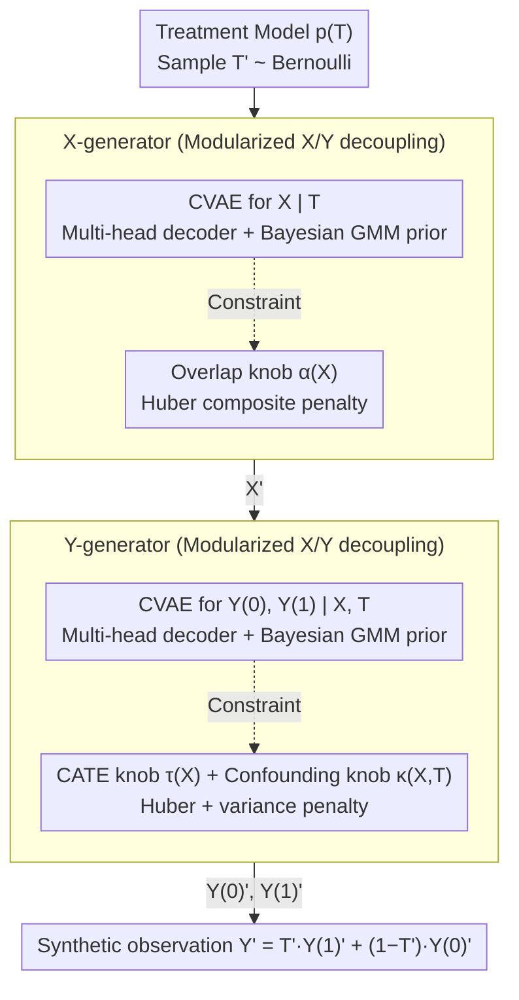

# Controllable Generative Sandbox for Causal Inference

**Conference**: ICML 2026  
**arXiv**: [2603.03587](https://arxiv.org/abs/2603.03587)  
**Code**: https://github.com/zhangqiecho/causalmix  
**Area**: Causal Inference / Medical Statistics; Generative models for methodological validation; synthetic data benchmark  
**Keywords**: CausalMix, conditional VAE, Bayesian GMM prior, overlap regularizer, CATE benchmarking

## TL;DR
This paper proposes CausalMix, a variational generative framework that jointly optimizes a data-type-specific multi-head decoder and a Bayesian Gaussian Mixture Model (GMM) latent prior with three independently adjustable causal "knobs" (overlap $\alpha(X)$, CATE function $\tau(X)$, and unobserved confounding $\kappa(X,T)$). Evaluated on real-world mCRPC (prostate cancer) cases, CausalMix demonstrates high fidelity in replicating mixed-type tabular data while stably injecting overlap, confounding, and heterogeneous effects as needed for controlled stress testing of CATE estimators.

## Background & Motivation

**Background**: Evaluation of causal inference methods (meta-learners, DR-learners, DML, causal forest, BCF) heavily relies on **synthetic data with ground-truth counterfactuals**, as simultaneous observation of $Y(1)$ and $Y(0)$ is impossible in real data. Three common types of simulators exist: purely parametric (controllable but unrealistic), semi-synthetic (using real X to simulate T/Y with limited control), and data-fit generators (e.g., RealCause, WGAN, Credence use neural models to fit the DGP, offering realism but weak causal controllability).

**Limitations of Prior Work**: (i) Existing data-fit generators show poor fidelity on **mixed-type tabular data** (mixed continuous, binary, categorical, and integer), either introducing spurious correlations via forced one-hot encoding or losing multivariate structure using a single likelihood loss. (ii) **Causal knobs are missing or coupled**: RealCause only interpolates between fitted extremes, WGAN lacks effect control interfaces, and Credence lacks support for mixed-type multimodal data. (iii) Even when $\tau(X)$ can be specified, there is no mechanism to **verify whether the generator actually realizes it**, especially when the causal function is low-dimensional or weakly non-linear, often getting submerged by reconstruction loss.

**Key Challenge**: There is a natural trade-off between distributional realism (fitting observed data) and causal controllability (faithfully realizing user-specified $\tau, \kappa, \alpha$). Tighter fitting reduces degrees of freedom, while higher freedom leads to greater deviation from real data. Existing methods sacrifice either the former (parametric simulators) or the latter (neural generators).

**Goal**: (i) Jointly optimize distributional fidelity and causal constraints under a unified objective to avoid the binary trade-off. (ii) Achieve high fidelity on mixed-type tabular data. (iii) Provide three **orthogonal, independently adjustable** causal knobs (overlap, confounding, heterogeneity) with a quantitative validation pipeline. (iv) Demonstrate practical utility in real clinical scenarios (safety comparison in mCRPC).

**Key Insight**: Leveraging a conditional VAE (CVAE) as the generative backbone (proven stable for tabular data with analytical ELBO), the authors formulate causal constraints as differentiable penalties on the decoder output. Mean alignment and variance regularization ensure faithful realization of even low-dimensional causal functions. A Bayesian GMM replaces the isotropic Gaussian prior to recover the multimodal structure of mixed-type data.

**Core Idea**: "Distribution fitting" and "causal regulation" are formulated as two sets of terms in a unified loss, explicitly controlled by rigidness hyperparameters $\lambda_\alpha, \lambda_\tau, \lambda_\kappa$. A mixture prior handles multimodality, a multi-head decoder handles mixed types, and a three-layer penalty handles three causal dimensions, solving fidelity, control, and mixed-type issues simultaneously.

## Method

### Overall Architecture
Given observations $\mathcal{O} = (X, T, Y)$, where $X$ represents mixed-type covariates, $T\in\{0,1\}$, and $Y$ is the outcome, the generator $G_\theta$ is modularized into three parts:

- **Treatment Model** $p(T)$: Bernoulli;
- **Pre-treatment Model** $G_{X,\theta}$: A CVAE modeling $X\mid T$;
- **Post-treatment Model** $G_{Y,\theta}$: A CVAE jointly modeling $(Y(0), Y(1))\mid X, T$, **providing both potential outcomes simultaneously**.

Generation follows the sequence: $T'\to X'\mid T'\to (Y'(0), Y'(1))\mid X', T'\to Y' = T'Y'(1)+(1-T')Y'(0)$. The decoder uses multi-heads: continuous (Gaussian), binary (Bernoulli), and categorical (softmax). After training, a Bayesian GMM (Dirichlet-process prior) replaces the standard Gaussian latent prior.

**Unified Objective**:
$$\mathcal{L}(\theta) = \mathcal{L}_{\text{VAE}} + \lambda_\alpha \mathcal{L}_\alpha + \lambda_\tau \mathcal{L}_\tau^{\text{mean}} + \lambda_\tau^{\text{var}}\mathcal{L}_\tau^{\text{var}} + \lambda_\kappa \mathcal{L}_\kappa^{\text{mean}} + \lambda_\kappa^{\text{var}}\mathcal{L}_\kappa^{\text{var}}$$

### Key Designs

**1. Three Independent Causal "Knobs" + Huber Composite Penalty: Ensuring Adjustability and Realization**

Existing generators either lack effect control or cannot verify realization of specified $\tau(X)$. CausalMix explicitly defines three causal quantities: overlap $\alpha(x) = P(X=x\mid T=0)/P(X=x\mid T=1)$, CATE $\tau(x) = \mathbb{E}[Y(1)-Y(0)\mid X=x]$, and unobserved confounding $\kappa(x,t) = \mathbb{E}[Y(t)\mid X=x,T=1] - \mathbb{E}[Y(t)\mid X=x,T=0]$. The difference between "user-specified values" and "generator-induced values" is written as a differentiable penalty. Overlap uses $\mathcal{L}_\alpha = \mathbb{E}_X[(\log\alpha_\theta(X) - \log\alpha(X))^2]$ for log-density ratio alignment. CATE and confounding use more than just MSE:

$$\mathcal{L}_\tau^{\text{mean}} = \mathbb{E}_X[\lambda_\tau^{\text{mse}}(\Delta\tau_\theta)^2 + \lambda_\tau^{\text{sl1}}\text{SmoothL1}(\Delta\tau_\theta)]$$

This **Huber composite loss** anchors the mean via the quadratic term and improves robustness to outliers via SmoothL1. An additional variance penalty $\mathcal{L}_\tau^{\text{var}} = \text{Var}[\Delta\tau_\theta]$ suppresses spurious unit-level variance. This combination allows causal constraints to be realized stably even in low-signal scenarios where pure MSE fails.

**2. Mixed-type Multi-head Decoder + Bayesian GMM Prior: Faithful Reproduction of Tabular Structures**

Clinical tables combine continuous, binary, categorical, and integer types. CausalMix assigns an independent likelihood head to each variable based on its type. Continuous variables use Gaussian NLL (learning both location and dispersion, superior to MSE) while others use Bernoulli or Softmax. To handle the multimodal nature of patient subpopulations, a BGMM with a Dirichlet-process prior is fitted to the latent space post-VAE training:

$$p_{\text{BGMM}}(z) = \sum_k \pi_k \mathcal{N}(z\mid\mu_k, \Sigma_k)$$

This post-hoc fitting recovers multimodal expressiveness without altering the VAE training objective.

**3. Unified Optimization + Modular Decoupling: Co-training with Structural Independence**

To manage the fidelity-controllability trade-off, CausalMix optimizes all terms in a single mini-batch but decouples the X and Y generators. The pre-treatment $G_{X,\theta}$ focuses on $\mathcal{L}_{\text{VAE}}^X + \lambda_\alpha\mathcal{L}_\alpha$, while the post-treatment $G_{Y,\theta}$ focuses on Y-reconstruction and effect control. This separation prevents penalties from one module from interfering with the other. Critically, $G_{Y,\theta}$ evaluates both potential outcomes $Y(0)$ and $Y(1)$ during training, allowing $\tau_\theta$ and $\kappa_\theta$ to be supervised directly by the penalty.

### Loss & Training
- Optimizer: Adam (lr = $10^{-3}$), 80/20 train/val split, PyTorch Lightning.
- Key Hyperparameters: $\lambda_\tau, \lambda_\kappa$ fixed at $10^3$; $\lambda_\alpha$ between $10^1$ and $10^2$.
- Strategy: For low-dimensional control functions, MSE weight is reduced (0.2–0.4) while SmoothL1 and variance regularization are increased.
- BGMM fitting uses a Dirichlet process prior with max $K = \text{latent dimension}$.

## Key Experimental Results

### Main Results (mCRPC cases: abiraterone vs enzalutamide, 4,098 patients, 18 covariates)

| Scenario | Setting | Key Phenomenon |
| :--- | :--- | :--- |
| Scenario 1 | $\tau\equiv 0.1, \kappa\equiv 0, \log\alpha\equiv 0$ (Constant effect, no confounding, perfect overlap) | Sanity check: Both BGMM and Gaussian priors recover the ground truth. |
| Scenario 2 | Linear $\tau$, $\kappa\equiv 0.02$, $\log\alpha\equiv 1$ | Both priors perform well, BGMM slightly superior. |
| **Scenario 3** | Non-linear tanh $\tau$, complex $\kappa(X,T)$, $\log\alpha = 2(2\cdot\text{Abi\_prev}-1)$ | **BGMM significantly outperforms**: CATE correlation and overlap reconstruction are much better than Gaussian. |

### Ablation Study

| Configuration | Key Effect |
| :--- | :--- |
| Gaussian vs BGMM Prior | BGMM dominates in Scenario 3, necessary for complex distributions. |
| Gaussian NLL vs MSE | NLL is significantly better, especially for heteroscedastic variables. |
| Huber vs Pure MSE | Huber + variance reg is more stable for low-dimensional $\tau$. |
| Privacy Trade-off | BGMM offers slightly less privacy than Gaussian but protection remains $> 0.5$. |

### Key Findings
- **BGMM value scales with causal complexity**: In complex clinical scenarios, BGMM vastly outperforms Gaussian priors in normalized Wasserstein distance, C2ST, and CATE correlation.
- **Privacy-fidelity trade-off is manageable**: While BGMM is more realistic and thus slightly weaker in privacy, the DCR protection fraction remains $>0.5$ with no systematic memorization.
- **Causal knobs are faithfully realized**: Even in complex scenes, MAE and Pearson correlation for CATE, $\kappa$, and overlap remain within acceptable precision ranges.
- **Utility in CATE Benchmarking**: CausalMix allows researchers to compare estimators like X-learner, DML, and BCF across various overlap and confounding regions to identify the most robust methods.

## Highlights & Insights
- **"Realism vs. Controllability" resolved**: The unified loss allows benchmark designers to achieve both high fidelity and precise control simultaneously.
- **NLL over MSE for tabular data**: The transition from MSE to Gaussian NLL for continuous variables is a critical detail that prevents gradient imbalance across heterogeneous variables.
- **Post-hoc BGMM Philosophy**: Fitting the prior after VAE training adds expressiveness without compromising training stability.
- **Dual Potential Outcome Modeling**: Supervising both $Y(0)$ and $Y(1)$ directly ensures that causal control is "actually effective" rather than just "seemingly correct."
- **Complete Evaluation Pipeline**: The paper sets a standard for causal sandboxes by evaluating distribution fidelity, causal fidelity, and privacy.

## Limitations & Future Work
- **Dependency on Analytic Functions**: Users must provide explicit formulas for $\tau, \kappa, \alpha$, making it a tool for benchmarking rather than discovery.
- **Black-box Confounding**: $\kappa(X,T)$ lacks an explicit latent confounder variable, making it difficult to simulate structured mechanisms where a specific confounder affects both T and Y.
- **High-dimensional Scaling**: Using a separate head for each variable may lead to model bloat for tables with hundreds of dimensions.
- **Variance Regularizer Risks**: Excessive variance penalty might suppress legitimate unit-level heterogeneity.
- **Scope Restriction**: Currently restricted to single-point treatment and scalar outcomes; longitudinal data and survival analysis are not yet supported.

## Related Work & Insights
- **vs RealCause**: RealCause's control is limited by interpolation; CausalMix allows arbitrary design via explicit penalties.
- **vs WGAN-based generators**: WGANs lack effect control interfaces, which CausalMix integrates directly into the loss.
- **vs Credence**: Credence lacks support for multimodal/multi-type data; CausalMix uses Huber loss, BGMM, and multi-heads to handle real clinical data more robustly.

## Rating
- **Novelty**: ⭐⭐⭐⭐ The integration of mixed-type VAE, multimodal priors, and three-layer causal penalties is a significant synthesis.
- **Experimental Thoroughness**: ⭐⭐⭐⭐ Excellent evaluation pipeline encompassing fidelity, causality, and privacy across progressive complexity.
- **Writing Quality**: ⭐⭐⭐⭐ Motivations and loss functions are well-explained and clear.
- **Value**: ⭐⭐⭐⭐ High utility for clinical statisticians and RWE teams in pharmaceutical research.

<!-- RELATED:START -->

## Related Papers

- [\[ICML 2026\] Tailoring Strictly Proper Scoring Rules for Downstream Tasks: An Application to Causal Inference](tailoring_strictly_proper_scoring_rules_for_downstream_tasks_an_application_to_c.md)
- [\[ICML 2025\] Causal Abstraction Inference under Lossy Representations](../../ICML2025/causal_inference/causal_abstraction_inference_under_lossy_representations.md)
- [\[CVPR 2026\] CGU-Bayes: Causal Graph Uncertainty-Guided Bayesian Inference for Domain Generalization](../../CVPR2026/causal_inference/cgu-bayes_causal_graph_uncertainty-guided_bayesian_inference_for_domain_generali.md)
- [\[ACL 2026\] Learning Invariant Modality Representation for Robust Multimodal Learning from a Causal Inference Perspective](../../ACL2026/causal_inference/learning_invariant_modality_representation_for_robust_multimodal_learning_from_a.md)
- [\[AAAI 2026\] Causal Inference Under Threshold Manipulation: Bayesian Mixture Modeling and Heterogeneous Treatment Effects](../../AAAI2026/causal_inference/causal_inference_under_threshold_manipulation_bayesian_mixtu.md)

<!-- RELATED:END -->
