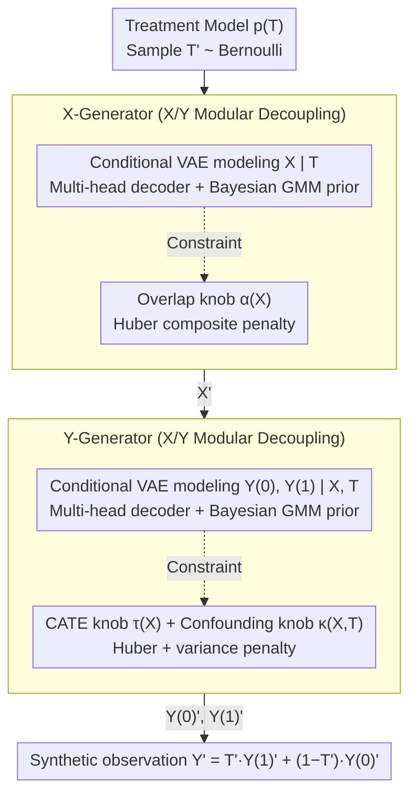

# Controllable Generative Sandbox for Causal Inference

**Conference**: ICML 2026  
**arXiv**: [2603.03587](https://arxiv.org/abs/2603.03587)  
**Code**: https://github.com/zhangqiecho/causalmix  
**Area**: Causal Inference / Medical Statistics; Generative Models for Methodology Validation; Synthetic Data Benchmark  
**Keywords**: CausalMix, conditional VAE, Bayesian GMM prior, overlap regularizer, CATE benchmarking

## TL;DR
This paper proposes CausalMix, a variational generative framework that jointly optimizes a type-specific multi-head decoder and a Bayesian Gaussian Mixture Model (GMM) latent prior with three independently adjustable causal "knobs" (overlap $\alpha(X)$, CATE function $\tau(X)$, and unobserved confounding $\kappa(X,T)$). While maintaining the fidelity of real-world data distributions, CausalMix allows users to design counterfactual benchmarks. Validated on real metastatic castration-resistant prostate cancer (mCRPC) patient records, CausalMix high-fidelity reproduces mixed-type tables and stably injects overlap, confounding, and heterogeneous effects as needed for controllable stress-testing of CATE estimators.

## Background & Motivation

**Background**: Evaluation of causal inference methods (meta-learners, DR-learners, DML, causal forests, BCF) relies heavily on **synthetic data with ground-truth counterfactuals**, as simultaneous observation of $Y(1)$ and $Y(0)$ is impossible in real-world data. Common simulators include purely parametric models (controllable but unrealistic), semi-synthetic models (using real X to simulate T/Y with limited control), and data-fit generators (RealCause, WGAN, Credence, etc., matching Data Generating Processes via neural models; realistic but with weak causal controllability).

**Limitations of Prior Work**: (i) Existing data-fit generators exhibit poor fidelity on **mixed-type tabular data** (continuous, binary, categorical, and integer mixtures), either introducing spurious correlations via forced one-hot encoding or losing multivariate structure through single likelihood losses; (ii) **Causal knobs are missing or coupled**—RealCause only interpolates between fitted extremes, WGAN lacks an effect control interface, and Credence lacks support for multi-modal mixed-type data; (iii) Even when $\tau(X)$ can be specified, there is no mechanism to **verify if the generator successfully realized it**, especially when causal functions are low-dimensional or weakly non-linear and easily overwhelmed by reconstruction loss.

**Key Challenge**: Distributional fidelity (fitting observed data) and causal controllability (faithfully realizing user-specified $\tau, \kappa, \alpha$) are inherently in a trade-off—tighter fitting reduces degrees of freedom, while greater freedom leads to deviation from real data. Existing methods sacrifice either the latter (neural generators) or the former (parametric simulators).

**Goal**: (i) Jointly optimize distribution fidelity and causal constraints under a unified objective to avoid binary trade-offs; (ii) Achieve high fidelity on mixed-type tabular data; (iii) Provide three **orthogonal, independently controllable** causal knobs for overlap, confounding, and heterogeneity, accompanied by a quantitative validation pipeline; (iv) Demonstrate practical value in real clinical scenarios (mCRPC safety comparisons).

**Key Insight**: Utilizing a conditional VAE as the generative backbone (proven stable for tabular data with analytical ELBO), causal constraints are formulated as differentiable penalties on the decoder output. Mean alignment and variance regularization ensure that even low-dimensional causal functions are faithfully realized. Furthermore, Bayesian GMM replaces the isotropic Gaussian prior to recover the multi-modal structure of mixed-type data.

**Core Idea**: "Distribution fitting" and "causal regulation" are treated as two sets of terms in a unified loss function, explicitly controlled by rigidness hyperparameters $\lambda_\alpha, \lambda_\tau, \lambda_\kappa$. A mixture prior handles multi-modality, a multi-head decoder handles mixed types, and three layers of penalties address three causal dimensions—a single tool addressing fidelity, control, and mixed-type data concurrently.

## Method

### Overall Architecture
Given observations $\mathcal{O} = (X, T, Y)$, where $X$ are mixed-type covariates, $T\in\{0,1\}$, and $Y$ is the outcome, a generator $G_\theta$ is learned and modularized into three parts:

- **Treatment Model** $p(T)$: Bernoulli;
- **Pre-treatment Model** $G_{X,\theta}$: Conditional VAE modeling $X\mid T$;
- **Post-treatment Model** $G_{Y,\theta}$: Conditional VAE jointly modeling $(Y(0), Y(1))\mid X, T$, **outputting both potential outcomes simultaneously**.

Generation follows the sequence $T'\to X'\mid T'\to (Y'(0), Y'(1))\mid X', T'\to Y' = T'Y'(1)+(1-T')Y'(0)$. The decoder uses multi-heads: continuous→Gaussian, binary→Bernoulli, categorical→softmax. After training, a Bayesian GMM (Dirichlet-process prior) replaces the standard Gaussian latent prior.

**Unified Objective**:
$$\mathcal{L}(\theta) = \mathcal{L}_{\text{VAE}} + \lambda_\alpha \mathcal{L}_\alpha + \lambda_\tau \mathcal{L}_\tau^{\text{mean}} + \lambda_\tau^{\text{var}}\mathcal{L}_\tau^{\text{var}} + \lambda_\kappa \mathcal{L}_\kappa^{\text{mean}} + \lambda_\kappa^{\text{var}}\mathcal{L}_\kappa^{\text{var}}$$

### Key Designs

**1. Three Independent Causal "Knobs" + Huber Composite Penalty: Ensured Tunability**

Existing generators either lack effect control interfaces or cannot verify if specified $\tau(X)$ values are truly implemented. CausalMix explicitly defines three causal quantities: overlap $\alpha(x) = P(X=x\mid T=0)/P(X=x\mid T=1)$, CATE $\tau(x) = \mathbb{E}[Y(1)-Y(0)\mid X=x]$, and unobserved confounding $\kappa(x,t) = \mathbb{E}[Y(t)\mid X=x,T=1] - \mathbb{E}[Y(t)\mid X=x,T=0]$. The difference between "user-specified" and "generator-induced" values is incorporated as a differentiable penalty in the loss. For overlap, $\mathcal{L}_\alpha = \mathbb{E}_X[(\log\alpha_\theta(X) - \log\alpha(X))^2]$ uses MSE to align the log-density ratio from the decoder. CATE and confounding use more than just MSE:

$$\mathcal{L}_\tau^{\text{mean}} = \mathbb{E}_X[\lambda_\tau^{\text{mse}}(\Delta\tau_\theta)^2 + \lambda_\tau^{\text{sl1}}\text{SmoothL1}(\Delta\tau_\theta)]$$

This **Huber composite loss** anchors the mean with a quadratic term while utilizing SmoothL1 to enhance robustness against outliers and weakly identified regions. Additionally, a variance penalty $\mathcal{L}_\tau^{\text{var}} = \text{Var}[\Delta\tau_\theta]$ suppresses spurious unit-level variance; $\kappa$ follows the same structure. Pure MSE is insufficient because causal signals can be drowned by reconstruction loss when $\tau, \kappa$ are low-dimensional; the combination of Huber mean anchoring and variance dispersion regularizer ensures stable implementation of causal constraints even in low-signal scenarios. The three $\lambda$ parameters are independently tunable, allowing factorial studies of overlap and confounding effects on CATE estimators.

**2. Mixed-type Multi-head Decoder + Bayesian GMM Prior: Faithful Reproduction of Real-world Tables**

Clinical tables combine continuous, binary, categorical, and integer data. CausalMix assigns an independent likelihood head to each variable based on its type: Gaussian NLL for continuous variables (allowing the decoder to learn both location and dispersion, unlike Credence’s MSE), Bernoulli logits for binary, and softmax for categorical. Replacing MSE with Gaussian NLL is a critical detail: MSE does not learn variance, leading to gradient scale imbalances for heteroscedastic or bounded variables. Furthermore, while standard VAEs assume a unimodal latent space, real patients naturally cluster into sub-populations. CausalMix refits the latent means after training using a Bayesian GMM with a Dirichlet-process prior and truncated stick-breaking variational inference:

$$p_{\text{BGMM}}(z) = \sum_k \pi_k \mathcal{N}(z\mid\mu_k, \Sigma_k)$$

The number of clusters $K$ is learned automatically. This **post-hoc fitting** approach restores multi-modal expressiveness without modifying the VAE objective, representing an elegant engineering choice.

**3. Joint Optimization + Modular Decoupling of X/Y: Co-training Fidelity and Control**

Distributional fit and causal control are jointly optimized in mini-batches, yet the X-generator and Y-generator are trained independently. Pre-treatment $G_{X,\theta}$ optimizes $\mathcal{L}_{\text{VAE}}^X + \lambda_\alpha\mathcal{L}_\alpha$, while Post-treatment $G_{Y,\theta}$ optimizes $\mathcal{L}_{\text{VAE}}^Y + \lambda_\tau^{\text{mean}} + \cdots + \lambda_\kappa^{\text{mean}} + \cdots$, with early stopping based on validation loss. Decoupling occurs because overlap on X is a marginal distribution issue, whereas $\tau, \kappa$ on Y are conditional expectation issues; separate training allows individual adjustment of rigidness hyperparameters. Crucially, $G_{Y,\theta}$ evaluates both $Y(0)$ and $Y(1)$ potential outcomes during training even if only one is observed, allowing $\tau_\theta$ and $\kappa_\theta$ to be calculated and supervised by penalties—the root of why causal control actually takes effect.

### Loss & Training
- Optimizer: Adam (lr = $10^{-3}$), 80/20 train/val split, PyTorch Lightning.
- Key Hyperparameters: $\lambda_\tau, \lambda_\kappa$ fixed at $10^3$; $\lambda_\alpha$ between $10^1$ and $10^2$ (overlap is more sensitive to misspecification).
- Low-dimensional/weak non-linear functions: Reduce MSE weight (0.2–0.4) and increase SmoothL1 + variance reg.
- Training concludes with fitting BGMM (DP prior, max K = latent dim) as the generative prior.

## Key Experimental Results

### Main Results (mCRPC cases: abiraterone vs enzalutamide, 4,098 patients, 18 baseline covariates)

| Scenario | Setting | Key Phenomena |
|------|------|---------|
| Scenario 1 | $\tau\equiv 0.1, \kappa\equiv 0, \log\alpha\equiv 0$ (Constant effect, no confounding, perfect overlap) | Sanity check: Both BGMM and Gaussian priors succeed. |
| Scenario 2 | Linear $\tau$ (CVD, age, Charlson), $\kappa\equiv 0.02, \log\alpha\equiv 1$ | Both priors perform well, BGMM slightly superior. |
| **Scenario 3** | Non-linear tanh $\tau$ (CVD, age, Charlson, dementia), $\kappa$ jointly dependent on $X,T$, $\log\alpha = 2(2\cdot\text{Abi\_prev}-1)$ | **BGMM significantly outperforms**: CATE correlation and decoder-level overlap reconstruction are much better than Gaussian. |

### Ablation Study

| Configuration | Key Effect | Description |
|------|---------|------|
| Gaussian vs BGMM Prior | BGMM dominates in Scenario 3 | Multi-modal prior necessary for complex scenarios. |
| Gaussian NLL vs MSE (continuous) | NLL is significantly better | Learning variance is essential for correct modeling. |
| Composite Huber vs Pure MSE | Huber is stable for low-dim $\tau$ | Variance regularizer acts as a critical stabilizer. |
| Privacy Trade-off | Gaussian is stronger; BGMM protection > 0.5 | Controlled trade-off between realism and privacy. |

### Key Findings
- **BGMM value scales with causal complexity**: While both priors perform similarly in simple scenarios, BGMM vastly outperforms Gaussian in Scenario 3 on normalized Wasserstein, C2ST, CATE correlation, and overlap reconstruction.
- **Privacy-fidelity trade-off is manageable**: BGMM is more realistic and thus slightly weaker in privacy, but DCR protection fraction remains $>0.5$ with no systemic memorization.
- **Causal knobs are faithfully realized**: Even in complex scenarios, CATE MAE/Pearson, $\kappa$ MAE, and overlap MSE achieve acceptable precision, validating the unified loss and Huber + variance reg design.
- **CATE estimator benchmarking**: Under the Scenario 3 calibrated DGP, X-learner, DR-learner, DML, Causal Forest, and BCF were compared, revealing which estimators remain robust under specific overlap/confounding conditions.
- **Visualizing Causal Forest sensitivity**: PEHE shows a non-trivial relationship with min leaf size under the Scenario 3 DGP, providing direct answers for clinical hyperparameter tuning that parametric simulators cannot offer.

## Highlights & Insights
- **Reconciliation of Realism and Controllability**: The unified loss grants benchmark designers the ability to achieve both via explicit rigidness hyperparameters.
- **Subtle Importance of Multi-head Decoder + Gaussian NLL**: Shifting from MSE to NLL prevents gradient imbalance in heteroscedastic variables, a core requirement for mixed-type tabular fidelity.
- **Engineering Philosophy of Post-hoc BGMM Fitting**: Increasing expressiveness without destabilizing training by fitting the latent space after VAE optimization.
- **Joint Potential Outcome Modeling**: Unlike methods modeling only $Y\mid X,T$, modeling both $Y(0)$ and $Y(1)$ allows direct calculation and supervision of $\tau_\theta$.
- **Comprehensive Evaluation Pipeline**: A triple-layered assessment of distribution fidelity, causal fidelity, and privacy sets a new standard for causal sandbox literature.

## Limitations & Future Work
- **Reliance on Properly Specified Causal Functions**: Users must provide analytical forms for $\tau(X), \kappa(X,T), \alpha(X)$; CausalMix is a benchmarking tool, not a discovery tool for unknown functions.
- **Black-box Unobserved Confounding**: $\kappa(X,T)$ is implemented via potential outcome differences without an explicit structural latent confounder.
- **High-dimensional Complexity**: The multi-head decoder scales with variable count; experiments were limited to 18 dimensions.
- **Hyperparameter Sensitivity**: Selection of $\lambda$ currently relies on heuristics rather than automated schemes.
- **Variance Regularizer Risks**: In valid high-heterogeneity scenarios, the variance penalty might flatten true unit-level dispersion.
- **Scope**: Currently lacks support for longitudinal data, time-varying confounding, or survival outcomes.

## Related Work & Insights
- **vs RealCause**: CausalMix allows arbitrary design of $\tau, \kappa, \alpha$ with explicit implementation penalties, unlike the interpolation limits of RealCause.
- **vs WGAN**: CausalMix provides effect control interfaces missing in WGAN.
- **vs Credence**: CausalMix introduces Huber losses and BGMM priors to handle multi-modal mixed-type data more robustly than Credence's MSE-based approach.
- **Insight**: The modular design of unified objectives and decoupled penalties is transferable to other domains requiring both data fitting and structural constraints, such as fair generation or constrained physical simulation.

## Rating
- Novelty: ⭐⭐⭐⭐ Integrating mixed-type VAE, multi-modal priors, and triple-layer causal penalties is a significant synthesis.
- Experimental Thoroughness: ⭐⭐⭐⭐ Uses complex scenarios, clinical cases, and a comprehensive evaluation pipeline spanning fidelity, causality, and privacy.
- Writing Quality: ⭐⭐⭐⭐ Clear organization of methods and motivations.
- Value: ⭐⭐⭐⭐ Directly applicable for clinical statisticians and causal ML researchers.

<!-- RELATED:START -->

## Related Papers

- [\[ICLR 2026\] GDR-learners: Orthogonal Learning of Generative Models for Potential Outcomes](../../ICLR2026/causal_inference/gdr-learners_orthogonal_learning_of_generative_models_for_potential_outcomes.md)
- [\[ICLR 2026\] Exploratory Causal Inference in SAEnce](../../ICLR2026/causal_inference/exploratory_causal_inference_in_saence.md)
- [\[ICML 2026\] Tailoring Strictly Proper Scoring Rules for Downstream Tasks: An Application to Causal Inference](tailoring_strictly_proper_scoring_rules_for_downstream_tasks_an_application_to_c.md)
- [\[ICLR 2026\] Stochastic Neural Networks for Causal Inference with Missing Confounders](../../ICLR2026/causal_inference/stochastic_neural_networks_for_causal_inference_with_missing_confounders.md)
- [\[ICLR 2026\] Adjusting Prediction Model Through Wasserstein Geodesic for Causal Inference](../../ICLR2026/causal_inference/adjusting_prediction_model_through_wasserstein_geodesic_for_causal_inference.md)

<!-- RELATED:END -->
