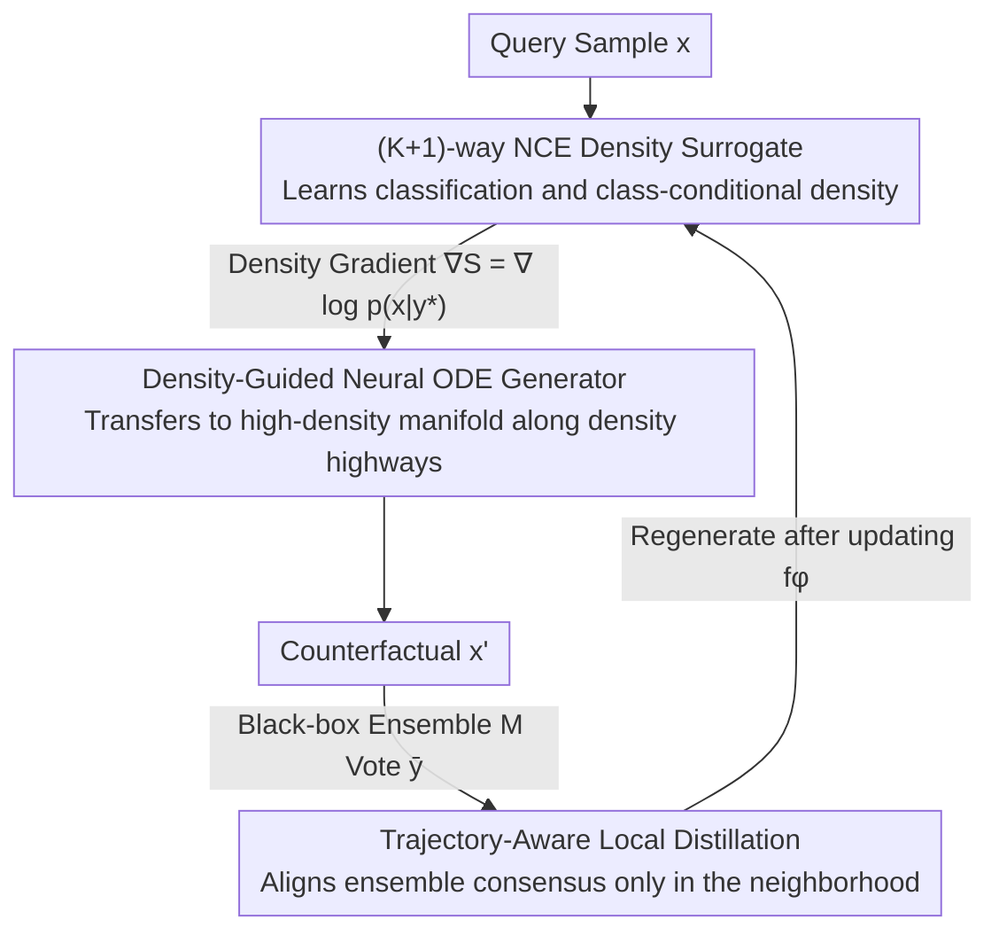

# Density-Guided Robust Counterfactual Explanations on Tabular Data under Model Multiplicity

**Conference**: ICML 2026  
**arXiv**: [2605.30901](https://arxiv.org/abs/2605.30901)  
**Code**: https://github.com/G-AILab/DensityFlow (Yes)  
**Area**: Interpretability / XAI / Counterfactual Explanations / Tabular Data  
**Keywords**: Counterfactual Explanations, Model Multiplicity, Neural ODE, Noise Contrastive Estimation, Density Guidance  

## TL;DR
DensityFlow reformulates the generation of robust counterfactual explanations (RCE) under model multiplicity as an optimal transport problem with density constraints. It uses NCE to train a $(K+1)$-class discriminator to simultaneously learn classification and class-conditional density. It then employs a Neural ODE to transport query samples along density gradients to the high-density manifold of the target class. In black-box scenarios, it performs local distillation alignment only on the generated trajectories, achieving higher cross-model validity with significantly fewer queries than ensemble baselines.

## Background & Motivation

**Background**: Given a query sample and a target class $y^*$, Counterfactual Explanation (CE) aims to find a minimum-cost perturbation $x'$ such that $h(x')=y^*$. It is a core tool for algorithmic recourse and interpretability in high-stakes decision-making. Recent mainstream research has shifted from per-sample optimization to generative paradigms: VAEs, diffusion models, and normalizing flows learn a data manifold prior and then search for or generate CEs in the latent space to ensure feasibility and realism.

**Limitations of Prior Work**: Under the Model Multiplicity (MM) setting, multiple "reasonable" classifiers $\{h_j\}$ with similar performance but different decision boundaries cause the "Rashomon effect," where a CE effective for one model fails for another. Generative methods do not explicitly distinguish between "core high-density regions" and "long-tail low-density regions" within a class. Distance minimization naturally pulls $x'$ toward sparse areas near class boundaries, exactly where divergent models disagree most. Methods that explicitly seek ensemble consensus (e.g., MILP, rule-based, or random retraining) suffer from high query complexity and poor scalability.

**Key Challenge**: Robustness requires $x'$ to land in high-density regions of the target class (where model consistency is strong), while cost minimization pulls $x'$ toward decision boundaries (inevitably entering low-density long tails). These two goals are fundamentally opposed. Furthermore, gradients are unavailable in black-box scenarios, and full-space surrogate alignment is impractical.

**Goal**: (i) Explicitly model and utilize class-conditional density $p(x|y^*)$ within a generative framework to "block" low-density regions; (ii) Perform boundary alignment between a surrogate and target models using as few queries as possible under black-box heterogeneous ensembles.

**Key Insight**: Couple validity and density into the same surrogate. Use $(K+1)$-way NCE to allow a single network to perform both classification and density ratio estimation, avoiding overfitting to sparse outliers common in separate density estimators. Formulate the generation process as a Neural ODE where the density signal acts as a potential function within the flow dynamics. Since ODE trajectories are inherently smooth, applying density constraints at the endpoints is sufficient to guide the entire path.

**Core Idea**: Rewrite robust counterfactuals as a density-constrained optimal transport problem: $\min c(x,x')\ \text{s.t.}\ \mathbb{E}_{\mathcal{M}}[h(x')]=y^*,\ p(x'|y^*)\ge\tau\cdot p_{\text{ref}}$. Use NCE density gradients to guide the Neural ODE along "high-density highways" and perform local distillation only in the trajectory neighborhood for black-box alignment.

## Method

### Overall Architecture
DensityFlow generates a counterfactual $x'$ for a query sample $x$ that remains valid across a black-box ensemble $\mathcal{M}=\{h_j\}_{j=1}^m$. The core insight is that "regions with the highest model disagreement coincide with low data-density regions." Thus, the robustness problem is transformed into "transporting the sample to the high-density manifold of the target class." The system consists of two networks optimized alternately: a surrogate network $f_\phi$ that simultaneously learns classification and class-conditional density to provide differentiable density signals, and a Neural ODE generator $v_\theta$ that continuously transports $x$ to the endpoint $x'$ based on these signals. In black-box settings, an additional local distillation step aligns the surrogate boundary with the ensemble consensus.

### Key Designs

**1. (K+1)-way NCE Density Surrogate: Simultaneous Classification and Density Estimation**

Traditional approaches train a separate density estimator (VAE/KDE/LOF) and "plug" it into CE optimization. However, sparse outliers can distort density, and density signals may decouple from classification signals. DensityFlow integrates both into a single surrogate network $f_\phi:\mathcal{X}\to\mathbb{R}^{K+1}$: it extends the $K$-class classification to a $(K+1)$-way discrimination. The first $K$ classes are fed real data $\mathcal{D}_{\text{src}}$, while the $(K+1)$-th class is fed "noise samples" sampled from a uniform distribution $p_{\text{noise}}$ (standardized within a $[-C,C]^d$ hypercube). They are jointly trained using cross-entropy: $\mathcal{L}_{\text{surrogate}}=-\mathbb{E}_{\mathcal{D}_{\text{src}}}\log\frac{e^{z_y}}{\sum e^{z_j}}-\mathbb{E}_{p_{\text{noise}}}\log\frac{e^{z_{K+1}}}{\sum e^{z_j}}$.

Theoretical assurance is provided by Proposition 4.1: when $p_{\text{noise}}$ is uniform, the optimal solution satisfies $z_k^*(x)-z_{K+1}^*(x)=\log p(x|k)+\text{Const}$. Thus, the logit difference $S(x|y^*)=z_{y^*}(x)-z_{K+1}(x)$ is an unbiased estimate of the class-conditional log-density. Its gradient $\nabla_x S(x|y^*)=\nabla_x\log p(x|y^*)$ serves as the density guidance signal. The trust region threshold $\tau$ is controlled by the noise/data sampling ratio $N_{\text{noise}}/N_{\text{data}}$. Since density naturally incorporates classification confidence, the surrogate is insensitive to long tails and provides a smooth guidance surface.

**2. Density-Guided Neural ODE Generator: Treating Constraints as Potential Functions**

How to end-to-end optimize the three goals: starting from the query, minimizing cost, and ending on the high-density target manifold? DensityFlow formulates the generation as a continuous flow dynamical system rather than performing hard KKT/Lagrangian optimization on static constraints. By incorporating the density gradient $\nabla S$ as a drift term in the flow field, the trajectory "naturally avoids" low-density regions. Specifically, the state is augmented to $\tilde z(t)=[z(t),e(t)]^\top$, with dynamics $d\tilde z/dt=[v_\theta(z,t);\ \|v_\theta(z,t)\|^2]$ and initial value $\tilde z(0)=[x;0]$. A dopri5 adaptive solver integrates this over $t\in[0,1]$. The second dimension $e(T)=\int_0^T\|v_\theta\|^2dt$ corresponds exactly to the transport kinetic energy, used directly as the cost $\mathcal{L}_{\text{cost}}$.

While density constraints could be integrated along the entire path $\mathcal{L}_{\text{den}}=\int_0^T\text{ReLU}(\log\tau-S(z(t)|y^*))dt$, the authors find that ODE trajectories are sufficiently smooth that punishing only the endpoint is enough to pull the whole trajectory into the trust region. The final objective $\mathcal{L}(\theta)=\mathcal{L}_{\text{CE}}(f_\phi(x'),y^*)+\lambda_{\text{cost}}c_{\text{cost}}(T)+\lambda_{\text{den}}\mathbb{E}[\mathcal{L}_{\text{den}}(x')]$ covers validity, proximity, and robustness.

**3. Trajectory-Aware Local Distillation: Minimal Queries for Ensemble Alignment**

While the first two steps work in white-box settings, gradients are unavailable for a heterogeneous black-box ensemble $\mathcal{M}$. The density-guided direction might not be effective for ensemble validity. Global alignment is prohibitively expensive ($O(\text{vol}(\mathcal{X}))$). DensityFlow leverages the fact that trajectories only traverse high-density regions, so alignment is only needed there. It dynamically samples endpoint states $\mathcal{D}_\theta=\{(x,\bar y)\mid x\sim z(T)\}$ (where $\bar y$ is the ensemble vote) and minimizes a local distillation loss $\mathcal{L}_{\text{dis}}(\phi)=\mathbb{E}_{\mathcal{D}_\theta}[\|\sigma(z_{y^*}(x))-\bar y\|^2]$. This "generate-distill-regenerate" cycle reduces queries to $O(|\text{trajectory}|)$.

### Loss & Training
Two-level alternating optimization: the inner loop updates $f_\phi$ using Eq. (3) (joint NCE classification/density), while the outer loop updates $v_\theta$ using Eq. (7) (validity+cost+density). Local distillation Eq. (8) is inserted for black-box environments. AdamW optimizer is used with $\eta_g=10^{-3}$, $\eta_\phi=10^{-4}$ for 800 epochs and batch size 64. Target weights $\lambda_{\text{cost}}\in\{0.2,0.4,0.6\}$ and $\lambda_{\text{den}}\in\{0.0,0.1,0.3\}$ are grid searched. The noise-to-data ratio $\tau=0.2$, and the noise cube side length $C=1.2\cdot\max_{\mathcal{D}_{\text{train}}}\|x\|_\infty$. ODE training uses $(10^{-3}, 10^{-3})$ tolerance, and testing uses $(10^{-4}, 10^{-4})$.

## Key Experimental Results

### Main Results
Evaluated on 8 datasets (4 synthetic: Moons/Circles/Spirals/Chessboard; 4 real tabular: Adult/Compas/HELOC/Blood) with a target ensemble $\mathcal{M}$ containing 7 heterogeneous classifiers (KNN, SVM, RF, MLP, XGBoost, CatBoost, TabNet).

| Dataset | Metric | DensityFlow | Best Baseline | Gain |
|---------|--------|-------------|---------------|------|
| Adult | Validity↑ | 0.901 | 0.752 (BetaRCE) | +0.149 |
| Adult | Cost↓ | 1.597 | 1.916 (Argument) | −0.319 |
| Compas | Validity↑ | 0.729 | 0.610 (Argument) | +0.119 |
| Blood | Validity↑ | 0.662 | 0.509 (Argument) | +0.153 |
| Moons | Validity↑ | 0.997 | 0.991 (CeFlow) | +0.006 |
| Circles | Validity↑ | 0.994 | 0.991 (Argument) | +0.003 |
| Spirals | Validity↑ | 0.972 | 0.943 (Argument) | +0.029 |

Validity leads significantly on real datasets while cost decreases; synthetic datasets are near saturation, but DensityFlow remains the leader.

### Ablation Study
| Configuration | Adult Validity | Blood Validity | Compas Validity | HELOC Validity |
|---------------|---------------|---------------|----------------|---------------|
| Full DensityFlow | 0.901 | 0.662 | 0.729 | 0.757 |
| w/o Density | 0.815 | 0.495 | 0.642 | 0.718 |
| w/o Distill | 0.767 | 0.531 | 0.698 | 0.734 |

### Key Findings
- Removing the density term drops validity by 4–17 points on real datasets, proving NCE density gradients are core to robustness. Small datasets like Blood (748 rows) show the largest drop (0.662→0.495).
- Without local distillation, validity on Adult drops to 0.767, yet still outperforms baselines on most datasets—showing NCE guidance is powerful even without explicit black-box alignment.
- Query Efficiency: On Spirals/Adult, DensityFlow requires over an order of magnitude fewer queries (log scale) than Argument and BetaRCE, with validity quickly saturating.
- Sensitivity to $\tau$: At low $\tau$, sparse noise fails to define boundaries, leading to adversarial-like CEs with lower costs but lower validity. Increasing $\tau$ stabilizes validity.
- Empirical validation: The density score $S(x|y^*)$ shows a clear negative correlation with ensemble uncertainty (Mutual Information), supporting Prop 4.1.

## Highlights & Insights
- **Dual-purpose network is elegant**: Integrating density and classification into one backbone via $(K+1)$-way NCE ensures the density signal and classification confidence are intrinsically coupled, preventing contradictory guidance.
- **Synergy of Density and Distillation**: Density signals restrict the search space to high-density regions, and distillation only needs to query the black-box in those regions. This "cheap signal first, expensive budget later" strategy is transferable to other black-box optimization tasks.
- **Utilizing ODE Smoothness**: Choosing endpoint penalties over path integrals significantly reduces computational overhead while maintaining trajectory constraints due to the inherent regularity of Neural ODEs.
- **Reframing Rashomon Effect as Density**: Instead of expensive ensemble consensus calculations, the authors observe that "low density = high disagreement," reducing model multiplicity robustness to a more tractable density problem.

## Limitations & Future Work
- Density estimation in high-dimensional spaces remains challenging and requires feature selection; however, discarded "non-predictive" features might be physically/causally coupled, leading to OOD CEs.
- Extreme class imbalance or label noise may impair class-conditional density learning.
- The framework focuses on "robust explanations," which may naturally conflict with methods like CFKD that aim to find "rare and interesting" edge cases.
- Synthetic noise cubes for NCE are sensitive to the curse of dimensionality ($d>50$). Performance on tree-based models (non-differentiable/discrete) during local distillation needs further failure case analysis.

## Related Work & Insights
- **vs CeFlow (Duong 2023)**: Both are flow-based; however, CeFlow uses normalizing flows for a general manifold prior without explicitly penalizing low-density regions. DensityFlow uses Neural ODEs in the original space with density as an explicit objective, significantly improving validity on Adult (0.691 to 0.901).
- **vs Argument (Jiang 2024a)**: Argument is a post-hoc selection method that generates CEs for each model and then adjudicates consensus. DensityFlow is generative, embedding consensus into its training objective via density priors, reducing queries by an order of magnitude.
- **vs BetaRCE (Stępka 2025)**: BetaRCE relies on random retraining to define admissible spaces; DensityFlow replaces expensive retraining with NCE and local distillation.
- **Insight**: Treating "distributional support" as a core constraint for RCE, rather than a side regularization, demonstrates that many robustness problems (OOD detection, selective classification) can be reduced to density estimation.

## Rating
- Novelty: ⭐⭐⭐⭐ The combination of NCE density, Neural ODE, and local distillation is new in RCE, though individual components are established.
- Experimental Thoroughness: ⭐⭐⭐ 8 datasets and 7 heterogeneous classifiers with 5 seeds. However, evaluations are limited to low-to-medium dimensional tabular data.
- Writing Quality: ⭐⭐⭐⭐ The logical flow from Rashomon → low density → density guidance is consistent, and theoretical results align well with empirical findings.
- Value: ⭐⭐⭐⭐ Provides a query-efficient, differentiable baseline for RCE under model multiplicity. The density-guided generation idea is broadly applicable.

<!-- RELATED:START -->

## Related Papers

- [\[ICLR 2026\] Counterfactual Explanations on Robust Perceptual Geodesics](../../ICLR2026/causal_inference/counterfactual_explanations_on_robust_perceptual_geodesics.md)
- [\[CVPR 2026\] Back to the Feature: Explaining Video Classifiers with Video Counterfactual Explanations](../../CVPR2026/causal_inference/back_to_the_feature_explaining_video_classifiers_with_video_counterfactual_expla.md)
- [\[ACL 2025\] Counterfactual Explanations for Aspect-Based Sentiment Analysis](../../ACL2025/causal_inference/counterfactual_explanations_for_aspect-based_sentiment_analysis.md)
- [\[ICLR 2026\] Synthesising Counterfactual Explanations via Label-Conditional Gaussian Mixture Variational Autoencoders](../../ICLR2026/causal_inference/synthesising_counterfactual_explanations_via_label-conditional_gaussian_mixture_.md)
- [\[ICLR 2026\] RFEval: Benchmarking Reasoning Faithfulness under Counterfactual Perturbations](../../ICLR2026/causal_inference/rfeval_benchmarking_reasoning_faithfulness_under_counterfactual_perturbations.md)

<!-- RELATED:END -->
